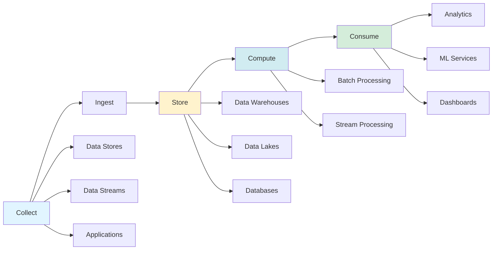

{: .light .w-75 .shadow .rounded-10 w='1212' h='668' }

## Data Pipelines Overview: The 5-Phase Framework

*Curiosity:* How do modern systems efficiently manage and process data? What are the key phases that make data pipelines effective?

**Data pipelines** are fundamental components for managing and processing data efficiently in modern systems. These pipelines typically encompass **5 predominant phases**: Collect, Ingest, Store, Compute, and Consume.

### Data Pipeline Architecture

*Retrieve:* Understanding the 5-phase framework.

### The 5 Phases

*Innovate:* Detailed breakdown of each phase.

| Phase | Description | Key Activities | Output |
|:------|:------------|:---------------|:-------|
| **1. Collect** | Acquire data from sources | Remote devices, applications, business systems | Raw data |
| **2. Ingest** | Load and organize data | Event queues, system loading | Organized data |
| **3. Store** | Persistent storage | Data warehouses, lakes, databases | Stored data |
| **4. Compute** | Process and transform | Aggregation, cleansing, conversion | Processed data |
| **5. Consume** | Make data available | Analytics, ML, dashboards | Insights |

### Phase 1: Collect

*Retrieve:* Data acquisition.

**Sources**:
- Data stores
- Data streams
- Applications
- Remote devices
- Business systems

**Purpose**: Acquire data from various sources for processing.

### Phase 2: Ingest

*Retrieve:* Data loading and organization.

**Process**:
- Load data into systems
- Organize within event queues
- Prepare for storage

**Purpose**: Efficiently bring data into the pipeline.

### Phase 3: Store

*Retrieve:* Persistent storage options.

**Storage Types**:
- Data warehouses
- Data lakes
- Data lakehouses
- Databases

**Purpose**: Ensure post-ingestion persistent storage.

### Phase 4: Compute

*Retrieve:* Data processing and transformation.

**Activities**:
- Aggregation
- Cleansing
- Manipulation
- Format conversion
- Data compression
- Partitioning

**Processing Types**:
- Batch processing
- Stream processing

**Purpose**: Transform data to conform to company standards.

### Phase 5: Consume

*Retrieve:* Data consumption and utilization.

**Consumption Channels**:
- Analytics tools
- Visualization tools
- Operational data stores
- Decision engines
- User-facing applications
- Dashboards
- Data science
- Machine learning services
- Business intelligence
- Self-service analytics

**Purpose**: Make processed data available for business use.

### Key Takeaways

*Retrieve:* Data pipelines consist of 5 phases (Collect, Ingest, Store, Compute, Consume) that efficiently manage data from acquisition to consumption.

*Innovate:* By implementing a well-structured data pipeline with proper phases, you can efficiently collect, process, and consume data, enabling data-driven operations and insights.

*Curiosity → Retrieve → Innovation:* Start with curiosity about data management, retrieve insights from the 5-phase framework, and innovate by building efficient data pipelines that transform raw data into valuable business insights.

**Next Steps**:
- Design your pipeline phases
- Choose appropriate tools
- Implement each phase
- Monitor and optimize

–
Subscribe to our weekly newsletter to get a Free System Design PDF (158 pages): <https://bit.ly/3KCnWXq>

 Translate to Korean 

* * * 

데이터 파이프라인 개요

데이터 파이프라인은 최신 시스템 내에서 데이터를 효율적으로 관리하고 처리하기 위한 기본 구성 요소입니다. 이러한 파이프라인은 일반적으로 수집, 수집, 저장, 컴퓨팅 및 사용의 5가지 주요 단계를 포함합니다.

1. 수집:
   - 데이터는 데이터 저장소, 데이터 스트림 및 응용 프로그램에서 수집되며 장치, 응용 프로그램 또는 비즈니스 시스템에서 원격으로 제공됩니다.

2. 섭취:
   - 수집 프로세스 중에 데이터가 시스템에 로드되고 이벤트 큐 내에서 구성됩니다.

3. 저장:
   - 수집 후 정리된 데이터는 데이터베이스와 같은 다양한 시스템과 함께 데이터 웨어하우스, 데이터 레이크 및 데이터 레이크하우스에 저장되어 수집 후 저장을 보장합니다.

4. 계산:
   - 데이터는 형식 변환, 데이터 압축 및 분할과 같은 작업을 포함하여 회사 표준을 준수하기 위해 집계, 정리 및 조작을 거칩니다. 이 단계에서는 일괄 처리 및 스트림 처리 기술을 모두 사용합니다.

5. 소비:
   - 처리된 데이터는 분석 및 시각화 도구, 운영 데이터 저장소, 의사 결정 엔진, 사용자 대면 애플리케이션, 대시보드, 데이터 과학, 기계 학습 서비스, 비즈니스 인텔리전스 및 셀프 서비스 분석을 통해 사용할 수 있습니다.

각 단계의 효율성과 효과는 조직 내 데이터 기반 운영의 전반적인 성공에 기여합니다.

데이터 기반 파이프라인에 대한 이야기는 무엇인가요? 데이터 관리 게임에 어떤 영향을 미쳤습니까?

