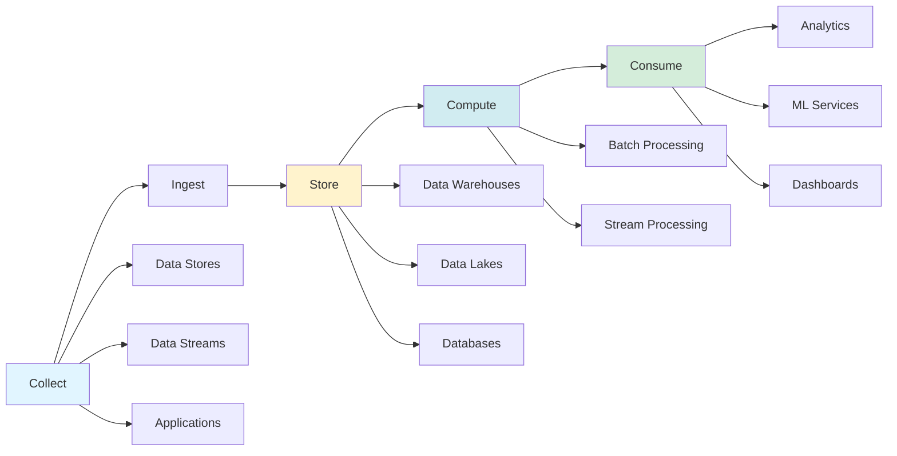

{: .light .w-75 .shadow .rounded-10 w='1212' h='668' }

## Data Pipelines Overview: The 5-Phase Framework

*Curiosity:* How do modern systems efficiently manage and process data? What are the key phases that make data pipelines effective?

**Data pipelines** are fundamental components for managing and processing data efficiently in modern systems. These pipelines typically encompass **5 predominant phases**: Collect, Ingest, Store, Compute, and Consume.

### Data Pipeline Architecture

*Retrieve:* Understanding the 5-phase framework.

```mermaid
graph LR
    A[Collect] --> B[Ingest]
    B --> C[Store]
    C --> D[Compute]
    D --> E[Consume]
    
    A --> A1[Data Stores]
    A --> A2[Data Streams]
    A --> A3[Applications]
    
    C --> C1[Data Warehouses]
    C --> C2[Data Lakes]
    C --> C3[Databases]
    
    D --> D1[Batch Processing]
    D --> D2[Stream Processing]
    
    E --> E1[Analytics]
    E --> E2[ML Services]
    E --> E3[Dashboards]
    
    style A fill:#e1f5ff
    style C fill:#fff3cd
    style D fill:#d1ecf1
    style E fill:#d4edda
```

### The 5 Phases

*Innovate:* Detailed breakdown of each phase.

| Phase | Description | Key Activities | Output |
|:------|:------------|:---------------|:-------|
| **1. Collect** | Acquire data from sources | Remote devices, applications, business systems | Raw data |
| **2. Ingest** | Load and organize data | Event queues, system loading | Organized data |
| **3. Store** | Persistent storage | Data warehouses, lakes, databases | Stored data |
| **4. Compute** | Process and transform | Aggregation, cleansing, conversion | Processed data |
| **5. Consume** | Make data available | Analytics, ML, dashboards | Insights |

### Phase 1: Collect

*Retrieve:* Data acquisition.

**Sources**:
- Data stores
- Data streams
- Applications
- Remote devices
- Business systems

**Purpose**: Acquire data from various sources for processing.

### Phase 2: Ingest

*Retrieve:* Data loading and organization.

**Process**:
- Load data into systems
- Organize within event queues
- Prepare for storage

**Purpose**: Efficiently bring data into the pipeline.

### Phase 3: Store

*Retrieve:* Persistent storage options.

**Storage Types**:
- Data warehouses
- Data lakes
- Data lakehouses
- Databases

**Purpose**: Ensure post-ingestion persistent storage.

### Phase 4: Compute

*Retrieve:* Data processing and transformation.

**Activities**:
- Aggregation
- Cleansing
- Manipulation
- Format conversion
- Data compression
- Partitioning

**Processing Types**:
- Batch processing
- Stream processing

**Purpose**: Transform data to conform to company standards.

### Phase 5: Consume

*Retrieve:* Data consumption and utilization.

**Consumption Channels**:
- Analytics tools
- Visualization tools
- Operational data stores
- Decision engines
- User-facing applications
- Dashboards
- Data science
- Machine learning services
- Business intelligence
- Self-service analytics

**Purpose**: Make processed data available for business use.

### Key Takeaways

*Retrieve:* Data pipelines consist of 5 phases (Collect, Ingest, Store, Compute, Consume) that efficiently manage data from acquisition to consumption.

*Innovate:* By implementing a well-structured data pipeline with proper phases, you can efficiently collect, process, and consume data, enabling data-driven operations and insights.

*Curiosity → Retrieve → Innovation:* Start with curiosity about data management, retrieve insights from the 5-phase framework, and innovate by building efficient data pipelines that transform raw data into valuable business insights.

**Next Steps**:
- Design your pipeline phases
- Choose appropriate tools
- Implement each phase
- Monitor and optimize

–
Subscribe to our weekly newsletter to get a Free System Design PDF (158 pages): <https://bit.ly/3KCnWXq>

 Translate to Korean 

* * * 

Data Pipeline Overview

Data pipelines are fundamental components for efficiently managing and processing data within modern systems. These pipelines typically involve five key stages: collection, ingestion, storage, computation, and consumption.

1. Collection:
   - Data is collected from data stores, data streams, and applications, provided remotely from devices, applications, or business systems.

2. Ingestion:
   - During the ingestion process, data is loaded into the system and organized within event queues.

3. Storage:
   - After ingestion, organized data is stored in data warehouses, data lakes, and data lakehouses along with various systems such as databases to ensure post-ingestion storage.

4. Computation:
   - Data undergoes aggregation, cleaning, and manipulation to comply with company standards, including tasks such as format conversion, data compression, and partitioning. This stage uses both batch processing and stream processing techniques.

5. Consumption:
   - Processed data is consumed through analytics and visualization tools, operational data stores, decision engines, user-facing applications, dashboards, data science, machine learning services, business intelligence, and self-service analytics.

The efficiency and effectiveness of each stage contribute to the overall success of data-driven operations within an organization.

What is your experience with data-driven pipelines? How has it impacted your data management game?

