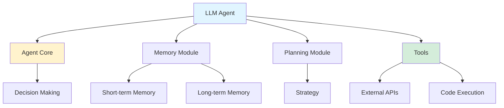

> 에이전트는 툴, 실행 코드, 임베딩, 벡터 저장소의 조합을 통해 대화형 LLM의 개념을 확장한다. 즉, 에이전트는 RAG에 부가적인 단계를 더한 것
{: .prompt-info}

## Beginner-Friendly 101 Guide on LLM Agents

*Curiosity:* What if LLMs could do more than just answer questions? What if they could retrieve information, make decisions, and take actions autonomously?

**LLM agents** are gaining momentum in generative AI. They can process feedback, maintain memory, strategize for future actions, and collaborate with various tools to make informed decisions.

> **Key Insight**: Agents extend conversational LLMs through tools, execution code, embeddings, and vector stores. Agents add additional steps beyond RAG.
{: .prompt-info}

### Why LLM Agents Matter

*Retrieve:* Understanding agent capabilities.

**Capabilities**:
- ✅ Process feedback
- ✅ Maintain memory
- ✅ Strategize for future actions
- ✅ Collaborate with tools
- ✅ Make informed decisions

**Significance**: This functionality resembles rudimentary human-like behavior, marking LLM agents as stepping stones towards **Artificial General Intelligence (AGI)**.

### LLM Agent Framework

*Innovate:* Core components.

### Guide Topics

*Retrieve:* Comprehensive coverage.

> **Guide Topics**:
> - ⛳ Introduction to LLM Agents
> - ⛳ LLM Agent Framework (Memory, Planning, Tools)
> - ⛳ Multi-agent systems (MAS)
> - ⛳ Real World LLM Agents
> - ⛳ Evaluating LLM Agents
> - ⛳ Build Your Own Agent
{: .prompt-info}

### Multi-Agent Systems (MAS)

*Innovate:* Collaboration benefits.

**Advantages**:
- ✅ Diverse agent profiles
- ✅ Agent-to-agent interactions
- ✅ Collective decision-making
- ✅ Specialized agents for tasks
- ✅ Improved efficiency

**Interaction Types**:
- **Collaborative**: Agents work together
- **Adversarial**: Agents compete/argue

### Real-World Applications

*Retrieve:* Practical examples.

**Examples**:
- **BabyAGI**: Task-oriented autonomous agent
- **Virtual Assistants**: Travel planning, scheduling
- **Code Generation**: Autonomous coding agents
- **Research**: Information gathering and synthesis

### Evaluation

*Retrieve:* How to assess agents.

**Benchmarks**:
- AgentBench
- IGLU
- ClemBench
- ToolBench
- GentBench

**Dimensions**:
- Utility
- Sociality
- Value alignment
- Continuous evolution
- Adversarial robustness
- Reliability

### Resources

*Retrieve:* Getting started.

> **Guide**: <https://github.com/aishwaryanr/awesome-generative-ai-guide/blob/main/resources/agents_101_guide.md>
> **Lilys AI Translation**: <https://lilys.ai/digest/674766>
{: .prompt-info}

**Note**: While tailored for beginners, assumes some prior understanding of LLMs and their practical applications.

### Key Takeaways

*Retrieve:* LLM agents extend LLMs beyond question-answering to autonomous decision-making and action-taking, using memory, planning, and tools.

*Innovate:* By building LLM agents with proper frameworks (memory, planning, tools), you can create systems that process feedback, maintain context, and collaborate with external tools to solve complex problems.

*Curiosity → Retrieve → Innovation:* Start with curiosity about autonomous AI, retrieve insights from agent frameworks and multi-agent systems, and innovate by building your own LLM agents that solve real-world problems.

**Next Steps**:
- Read the guide
- Understand the framework
- Explore multi-agent systems
- Build your first agent

 Translate to Korean 

* * * 

### Lilys ai 번역 : https://lilys.ai/digest/674766 
> 원문 : <https://github.com/aishwaryanr/awesome-generative-ai-guide/blob/main/resources/agents_101_guide.md>

#### 1.LLM 에이전트 소개 및 기능
   - LLM 에이전트는 *큰 언어 모델 에이전트*로, 진보된 언어 처리와 기타 중요한 구성 요소인 계획 및 기억을 결합하여 복잡한 작업을 처리하는 지능적인 시스템이며, 가상 어시스턴트를 구축할 때 중요한 역할을 한다.
   - 이들은 예를 들어 여행 계획을 도와주는 가상 어시스턴트를 만드는 과정에서, 여행 주제와 관련된 복잡한 질문에 대답하고 개인 맞춤형 여행 계획을 제안할 수 있다.
   - LLM 에이전트는 기본적인 질문 답변 능력을 넘어 피드백 처리, 기억 유지, 미래 행동에 대한 전략 수립 및 다양한 도구와의 협업을 통해 *사람과 유사한 행동*을 보이며, 인공 일반 지능에 대한 발전을 나타내고 있다.
   - LLM 에이전트는 아예 자동화된 작업을 수행하는데 있어 *인간의 개입이 필요하지 않으며*, 이는 AI 기능의 상당한 발전을 나타낸다.

#### 2.LLM 에이전트 프레임워크와 주요 구성 요소
   - 기존 섹션에서 LLM 에이전트를 이해하기 위한 프레임워크를 논의했는데 에이전트를 뇌, 인식, 실행으로 세 가지 주요 구성 요소로 분해하는 것이었습니다.
   - 이번 섹션에서는 에이전트 구성요소를 구조화하는 더 널리 사용되는 프레임워크를 살펴볼 것입니다.
   - 이 프레임워크는 다음과 같은 핵심 요소로 구성됩니다: 에이전트 코어, 메모리 모듈, 도구, 그리고 계획 모듈.
   - 에이전트 코어는 중심 의사결정 구성 요소로 작용하며 AI 에이전트 내의 핵심 논리와 행동 패턴을 감독합니다. 메모리 모듈은 AI 에이전트의 중요한 구성 요소로 내부 로그 및 사용자 상호 작용을 저장하는 저장소로 작용하며 단기 기억과 장기 기억으로 나뉩니다.
   - 도구는 작업을 효과적으로 실행하기 위해 AI 에이전트가 사용하는 사전 정의된 실행 가능한 워크플로를 나타내며, 계획 모듈은 복잡한 문제 해결을 위해 잘 구조화된 접근 방식이 필요하며 LLM 기반 에이전트는 이를 처리하기 위해 다양한 기법을 활용합니다.

#### 3.다중 에이전트 시스템의 장점 및 Collaboration
   - LLM 기반 에이전트는 탁월한 텍스트 이해 및 생성 능력을 보여주지만, 다른 에이전트와 협력하거나 *소셜 상호작용에서 배우는 능력*이 부재해 일반적으로 고립된 환경에서 작동한다.
   - 이러한 제한이 *다중 턴 피드백* 및 복잡한 시나리오에서의 협력을 통한 성능 향상 가능성을 저해한다.
   - LLM 기반 다중 에이전트 시스템은 *다양한 에이전트 프로필, 에이전트 간 상호작용 및 집단 의사 결정*에 중점을 둔다.
   - LLM-MA 시스템에서의 *다중 자율 에이전트 간 협력*은 *에이전트 간의 독특한 전략, 행동 및 의사소통*을 통해 동적이고 복잡한 작업을 처리할 수 있게 한다.
   - LLM 기반 다중 에이전트 시스템은 *노동 분담* 원리를 기반으로 하여, 전문 지식을 갖춘 특화된 에이전트가 특정 작업을 효율적으로 처리하고, 작업 효율성과 집단 의사 결정을 향상시킬 수 있다.

#### 4.️협력적 및 적대적 상호작용 유형
   - LLM 기반 시스템의 다중 에이전트 상호작용은 협력적 및 적대적 상호작용으로 크게 분류될 수 있다.
   - 협력적 상호작용에서는 에이전트들이 서로의 필요와 능력을 평가하며, 협력적인 행동과 정보 공유를 적극적으로 추구한다.
   - 이미지 출처: <https://arxiv.org/pdf/2309.07864.pdf>

#### 5.협력형 다중 에이전트 애플리케이션의 분류
   - 작업 효율성을 향상시키고 집단 의사결정을 향상시킨다.
   - 기존의 협력형 다중 에이전트 애플리케이션은 무질서한 협력과 순서있는 협력으로 분류될 수 있다.
   - 무질서한 협력은 시스템 안의 여러 에이전트들이 특정 순서나 협업적인 워크플로우를 따르지 않고 각자 의견을 자유롭게 표현한다.
   - 반면에 순서있는 협력은 각 에이전트가 의견 표현이나 토론에 특정 규칙이나 순서를 준수한다.
   - 이러한 두 접근 방식은 각각의 혜택과 도전 과제가 있으며, 다중 에이전트 시스템의 특정 요구사항과 목표에 따라 선택되어야 한다.

#### 6.적대적 상호작용과 다중 에이전트 시스템
   - 협력 방법이 널리 연구되었지만 게임 이론의 개념을 다중 에이전트 시스템에 도입하는 이점이 인정받고 있다.
   - 적대적 상호작용은 에이전트 전략의 동적 조정을 촉진하여 견고하고 효율적인 행동으로 이어진다.
   - 적대적 상호작용이 LLM 기반 다중 에이전트 시스템에서 성공적으로 적용되는 예로는 토론과 논쟁이 있으며, 응답 및 의사 결정의 품질을 향상시킨다.
   - 다중 에이전트 시스템에서는 지속적인 토론 처리 제한, 다중 에이전트 환경에서의 증가된 계산적 비용, 잘못된 합의로 수렴하는 위험 등 여러 가지 도전 과제가 남아 있다.
   - 다중 에이전트 시스템의 발전을 위해서는 이러한 도전 과제를 해결하고 에이전트의 한계를 보상하고 발전시키기 위해 인간 가이드를 통합함으로써 나아가야 한다.
   - MAS는 복잡한 환경에서의 협업, 의사 결정 및 문제 해결 능력을 향상시킬 수 있는 상당한 잠재력을 갖고 있는 동적인 연구 분야이다.
   - 이 분야에서의 지속적인 연구와 개발은 지능적인 에이전트 상호작용 및 협력을 위한 새로운 기회를 열어주며 AGI 분야의 발전에 기여할 것으로 기대된다.

#### 7.BabyAGI: 다양한 작업을 실행하는 자율 에이전트
   - BabyAGI는 다양한 도메인에서 작업을 실행하기 위해 설계된 **인기 있는** 작업 중심 자율 에이전트이다.
   - 주요 구성 요소는 *OpenAI*의 GPT-4 언어 모델, Pinecone 벡터 검색 플랫폼 및 LangChain 프레임워크를 활용한다.
   - 1. GPT-4 (에이전트 코어):
   - GPT-4는 시스템의 핵심으로 작용하며, 작업을 완료하고 완료된 결과를 기반으로 새로운 작업을 생성하며 실시간으로 작업을 우선 순위를 지정한다.
   - 2. Pinecone (메모리 모듈):
   - Pinecone은 작업 설명, 제약 조건 및 결과를 포함한 작업 관련 데이터를 효율적으로 저장하고 검색하는 데 활용된다.
   - 3. LangChain 프레임워크(툴링 모듈):
   - LangChain 프레임워크는 시스템의 능력을 향상시키며, 특히 작업 완료 및 의사 결정 프로세스에서 더 강력해지도록 도와준다.

#### 8.BabyAGI 운영 단계
   - 작업 완료: Task list에서 작업을 처리하며 GPT-4와 LangChain 기능을 사용하여 결과를 생성하고, 이를 Pinecone에 저장한다.
   - 새로운 작업 생성: 완료된 작업 결과를 기반으로 BabyAGI는 GPT-4를 활용하여 새로운 작업을 생성하며, 기존 작업과 중첩되지 않도록 한다.
   - 작업 우선순위: 새로운 작업 생성 및 우선순위를 기준으로 작업 우선순위를 조정하며, GPT-4의 도움을 받아 우선순위 지정 프로세스를 용이하게 한다.

#### 9.LLM 에이전트 평가
   - 다양한 분야에서 높은 성과를 보이지만, LLM 기반 에이전트를 양적, 객관적으로 *평가*하는 것은 여전히 어렵다.
   - LLM 에이전트를 평가하기 위해 여러 *벤치마크*가 설계되었다.
   - 예시로는 'AgentBench', 'IGLU', 'ClemBench', 'ToolBench', 그리고 'GentBench' 등이 있다.
   - 과제 특정 메트릭 외에도, 에이전트를 *평가*하는 몇 가지 차원에는 *유틸리티, 사회성, 가치, 지속적인 진화 능력, 적대적 강건성,* 그리고 *신뢰성*이 포함된다.

#### 10.️ 에이전트를 직접 만들어 보세요 (자료)

