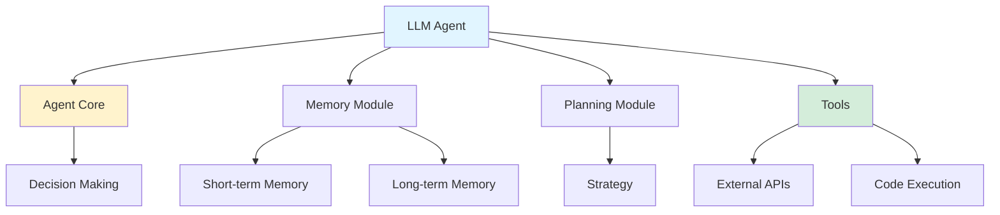

> Agents extend the concept of conversational LLMs through a combination of tools, execution code, embeddings, and vector stores. In other words, agents add additional steps beyond RAG
{: .prompt-info}

## Beginner-Friendly 101 Guide on LLM Agents

*Curiosity:* What if LLMs could do more than just answer questions? What if they could retrieve information, make decisions, and take actions autonomously?

**LLM agents** are gaining momentum in generative AI. They can process feedback, maintain memory, strategize for future actions, and collaborate with various tools to make informed decisions.

> **Key Insight**: Agents extend conversational LLMs through tools, execution code, embeddings, and vector stores. Agents add additional steps beyond RAG.
{: .prompt-info}

### Why LLM Agents Matter

*Retrieve:* Understanding agent capabilities.

**Capabilities**:
- ✅ Process feedback
- ✅ Maintain memory
- ✅ Strategize for future actions
- ✅ Collaborate with tools
- ✅ Make informed decisions

**Significance**: This functionality resembles rudimentary human-like behavior, marking LLM agents as stepping stones towards **Artificial General Intelligence (AGI)**.

### LLM Agent Framework

*Innovate:* Core components.

```mermaid
graph TB
    A[LLM Agent] --> B[Agent Core]
    A --> C[Memory Module]
    A --> D[Planning Module]
    A --> E[Tools]
    
    B --> F[Decision Making]
    C --> G[Short-term Memory]
    C --> H[Long-term Memory]
    D --> I[Strategy]
    E --> J[External APIs]
    E --> K[Code Execution]
    
    style A fill:#e1f5ff
    style B fill:#fff3cd
    style E fill:#d4edda
```

### Guide Topics

*Retrieve:* Comprehensive coverage.

> **Guide Topics**:
> - ⛳ Introduction to LLM Agents
> - ⛳ LLM Agent Framework (Memory, Planning, Tools)
> - ⛳ Multi-agent systems (MAS)
> - ⛳ Real World LLM Agents
> - ⛳ Evaluating LLM Agents
> - ⛳ Build Your Own Agent
{: .prompt-info}

### Multi-Agent Systems (MAS)

*Innovate:* Collaboration benefits.

**Advantages**:
- ✅ Diverse agent profiles
- ✅ Agent-to-agent interactions
- ✅ Collective decision-making
- ✅ Specialized agents for tasks
- ✅ Improved efficiency

**Interaction Types**:
- **Collaborative**: Agents work together
- **Adversarial**: Agents compete/argue

### Real-World Applications

*Retrieve:* Practical examples.

**Examples**:
- **BabyAGI**: Task-oriented autonomous agent
- **Virtual Assistants**: Travel planning, scheduling
- **Code Generation**: Autonomous coding agents
- **Research**: Information gathering and synthesis

### Evaluation

*Retrieve:* How to assess agents.

**Benchmarks**:
- AgentBench
- IGLU
- ClemBench
- ToolBench
- GentBench

**Dimensions**:
- Utility
- Sociality
- Value alignment
- Continuous evolution
- Adversarial robustness
- Reliability

### Resources

*Retrieve:* Getting started.

> **Guide**: <https://github.com/aishwaryanr/awesome-generative-ai-guide/blob/main/resources/agents_101_guide.md>
> **Lilys AI Translation**: <https://lilys.ai/digest/674766>
{: .prompt-info}

**Note**: While tailored for beginners, assumes some prior understanding of LLMs and their practical applications.

### Key Takeaways

*Retrieve:* LLM agents extend LLMs beyond question-answering to autonomous decision-making and action-taking, using memory, planning, and tools.

*Innovate:* By building LLM agents with proper frameworks (memory, planning, tools), you can create systems that process feedback, maintain context, and collaborate with external tools to solve complex problems.

*Curiosity → Retrieve → Innovation:* Start with curiosity about autonomous AI, retrieve insights from agent frameworks and multi-agent systems, and innovate by building your own LLM agents that solve real-world problems.

**Next Steps**:
- Read the guide
- Understand the framework
- Explore multi-agent systems
- Build your first agent

 Translate to Korean 

* * * 

### Lilys AI Translation: https://lilys.ai/digest/674766 
> Original: <https://github.com/aishwaryanr/awesome-generative-ai-guide/blob/main/resources/agents_101_guide.md>

#### 1. Introduction to LLM Agents and Their Capabilities
   - LLM agents are *large language model agents*, intelligent systems that combine advanced language processing with other critical components such as planning and memory to handle complex tasks, playing an important role in building virtual assistants.
   - For example, in the process of building a virtual assistant that helps with travel planning, they can answer complex questions related to travel topics and suggest personalized travel plans.
   - LLM agents go beyond basic question-answering capabilities to exhibit *human-like behavior* through feedback processing, memory retention, strategy formulation for future actions, and collaboration with various tools, representing progress toward artificial general intelligence.
   - LLM agents *do not require human intervention* in performing fully automated tasks, representing a significant advancement in AI capabilities.

#### 2. LLM Agent Framework and Key Components
   - In the previous section, we discussed a framework for understanding LLM agents, which decomposed agents into three main components: brain, perception, and execution.
   - In this section, we will examine a more widely used framework for structuring agent components.
   - This framework consists of the following core elements: agent core, memory module, tools, and planning module.
   - The agent core serves as the central decision-making component, overseeing the core logic and behavior patterns within the AI agent. The memory module is a critical component of AI agents, acting as a repository for storing internal logs and user interactions, divided into short-term memory and long-term memory.
   - Tools represent predefined executable workflows used by AI agents to effectively carry out tasks, while the planning module requires a well-structured approach for complex problem-solving, and LLM-based agents utilize various techniques to handle this.

#### 3. Advantages of Multi-Agent Systems and Collaboration
   - LLM-based agents demonstrate outstanding text understanding and generation capabilities, but they generally operate in isolated environments due to the lack of ability to collaborate with other agents or *learn from social interactions*.
   - These limitations hinder the potential for performance improvement through *multi-turn feedback* and collaboration in complex scenarios.
   - LLM-based multi-agent systems focus on *diverse agent profiles, inter-agent interactions, and collective decision-making*.
   - *Cooperation among multiple autonomous agents* in LLM-MA systems enables handling dynamic and complex tasks through *unique strategies, behaviors, and communication between agents*.
   - LLM-based multi-agent systems are based on the principle of *division of labor*, where specialized agents with domain expertise can efficiently handle specific tasks and improve task efficiency and collective decision-making.

#### 4.️ Types of Cooperative and Adversarial Interactions
   - Multi-agent interactions in LLM-based systems can be broadly classified into cooperative and adversarial interactions.
   - In cooperative interactions, agents evaluate each other's needs and capabilities, actively pursuing collaborative behavior and information sharing.
   - Image source: <https://arxiv.org/pdf/2309.07864.pdf>

#### 5. Classification of Cooperative Multi-Agent Applications
   - They improve task efficiency and enhance collective decision-making.
   - Existing cooperative multi-agent applications can be classified into unordered cooperation and ordered cooperation.
   - In unordered cooperation, multiple agents within the system freely express their opinions without following a specific order or collaborative workflow.
   - In contrast, ordered cooperation requires each agent to follow specific rules or sequences in expressing opinions or engaging in discussion.
   - Both approaches have their respective benefits and challenges, and should be chosen based on the specific requirements and goals of the multi-agent system.

#### 6. Adversarial Interactions and Multi-Agent Systems
   - While cooperative methods have been widely studied, the benefits of introducing game theory concepts into multi-agent systems are being recognized.
   - Adversarial interactions promote dynamic adjustment of agent strategies, leading to robust and efficient behavior.
   - Examples of adversarial interactions successfully applied in LLM-based multi-agent systems include debates and arguments, which improve the quality of responses and decision-making.
   - Several challenges remain in multi-agent systems, including limitations in processing continuous discussions, increased computational costs in multi-agent environments, and the risk of converging on incorrect consensus.
   - To advance multi-agent systems, these challenges must be addressed and human guidance should be integrated to compensate for and improve upon agent limitations.
   - MAS is a dynamic research field with significant potential to enhance collaboration, decision-making, and problem-solving capabilities in complex environments.
   - Continued research and development in this field is expected to open new opportunities for intelligent agent interaction and cooperation, contributing to advances in the AGI field.

#### 7. BabyAGI: An Autonomous Agent for Executing Various Tasks
   - BabyAGI is a **popular** task-oriented autonomous agent designed to execute tasks across various domains.
   - Its key components utilize *OpenAI*'s GPT-4 language model, the Pinecone vector search platform, and the LangChain framework.
   - 1. GPT-4 (Agent Core):
   - GPT-4 serves as the core of the system, completing tasks, generating new tasks based on completed results, and prioritizing tasks in real-time.
   - 2. Pinecone (Memory Module):
   - Pinecone is used to efficiently store and retrieve task-related data, including task descriptions, constraints, and results.
   - 3. LangChain Framework (Tooling Module):
   - The LangChain framework enhances the system's capabilities, particularly helping it become more powerful in task completion and decision-making processes.

#### 8. BabyAGI Operational Stages
   - Task Completion: Processes tasks from the task list, generates results using GPT-4 and LangChain capabilities, and stores them in Pinecone.
   - New Task Generation: Based on completed task results, BabyAGI generates new tasks using GPT-4, ensuring they do not overlap with existing tasks.
   - Task Prioritization: Adjusts task priorities based on new task generation and priority criteria, with GPT-4 facilitating the prioritization process.

#### 9. LLM Agent Evaluation
   - Despite showing high performance across various fields, quantitatively and objectively *evaluating* LLM-based agents remains challenging.
   - Several *benchmarks* have been designed to evaluate LLM agents.
   - Examples include 'AgentBench', 'IGLU', 'ClemBench', 'ToolBench', and 'GentBench'.
   - Beyond task-specific metrics, several dimensions for *evaluating* agents include *utility, sociality, values, continuous evolution capability, adversarial robustness,* and *reliability*.

#### 10.️ Build Your Own Agent (Resources)

