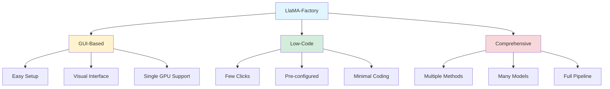
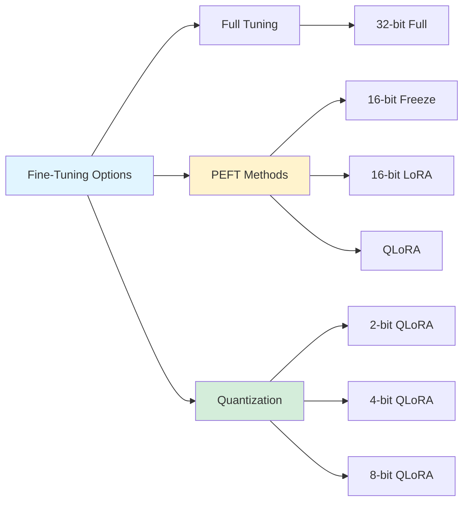
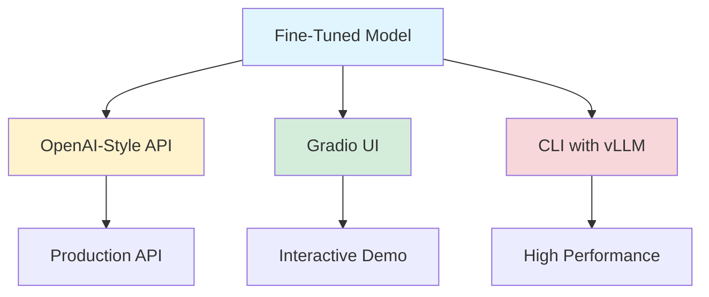

> [LLM Finetuning](https://github.com/lxe/simple-llm-finetuner?tab=readme-ov-file)
{: .prompt-tip}

## LlaMA-Factory: The Best Open-Source LLM Fine-Tuning Tool

*Curiosity:* How can we make LLM fine-tuning accessible to everyone? What tools enable low-code, GUI-based fine-tuning for practitioners at all levels?

**LlaMA-Factory** is one of the best open-source tools for fine-tuning LLMs, especially if you're new to fine-tuning and prefer a GUI-based or low-code approach. With 17k+ GitHub stars, it's become the go-to solution for efficient, user-friendly LLM customization.

### Why LlaMA-Factory?



### Key Features Overview

| Feature Category | Capabilities | Impact |
|:-----------------|:-------------|:-------|
| **Model Support** | LLaMA, Mistral, Qwen, Gemma, etc. | ⭐⭐⭐ Wide compatibility |
| **Tuning Methods** | SFT, RLHF, PPO, DPO, ORPO | ⭐⭐⭐ Comprehensive |
| **PEFT & Quantization** | LoRA, QLoRA, Freeze-tuning | ⭐⭐⭐ Efficient |
| **Advanced Algorithms** | GaLore, DoRA, LongLoRA, etc. | ⭐⭐ Cutting-edge |
| **Monitoring** | TensorBoard, Wandb, MLflow | ⭐⭐ Professional |
| **Deployment** | OpenAI API, Gradio, vLLM | ⭐⭐⭐ Production-ready |

### 🌐 Diverse LLM Support

*Retrieve:* LlaMA-Factory supports a wide range of models, making it versatile for different use cases.

| Model Family | Versions Supported | Use Cases |
|:-------------|:-------------------|:----------|
| **LLaMA** | All versions (1, 2, 3) | General-purpose, research |
| **Mistral** | Mistral, Mixtral-MoE | Efficient, multilingual |
| **Qwen** | Qwen series | Chinese, multilingual |
| **Gemma** | Gemma models | Google's open models |
| **Others** | Various architectures | Specialized tasks |

### 🛠 Comprehensive Tuning Methods

*Innovate:* LlaMA-Factory offers a complete suite of fine-tuning approaches.

| Method | Description | Best For |
|:-------|:------------|:---------|
| **Continuous Pre-training** | Further pre-training on domain data | Domain adaptation |
| **Supervised Fine-Tuning (SFT)** | Task-specific training | Instruction following |
| **Reward Modeling** | Preference learning | Alignment |
| **PPO** | Proximal Policy Optimization | RLHF |
| **DPO** | Direct Preference Optimization | Efficient alignment |
| **ORPO** | Online Reinforcement Policy Optimization | Advanced RLHF |

### 🔎 PEFT Methods & Quantization

*Retrieve:* Efficient fine-tuning options for resource-constrained environments.



| Method | Precision | Memory | Speed | Quality |
|:-------|:----------|:-------|:------|:--------|
| **Full Tuning** | 32-bit | High | Slow | Best |
| **Freeze Tuning** | 16-bit | Medium | Medium | Good |
| **LoRA** | 16-bit | Low | Fast | Good |
| **QLoRA 8-bit** | 8-bit | Very Low | Very Fast | Good |
| **QLoRA 4-bit** | 4-bit | Minimal | Fastest | Acceptable |

### 📈 Advanced Fine-Tuning Approaches

*Innovate:* State-of-the-art algorithms for improved performance and efficiency.

| Algorithm | Purpose | Benefit |
|:----------|:--------|:--------|
| **GaLore** | Gradient Low-Rank Projection | Memory efficiency |
| **BAdam** | Block-wise Adam | Optimized training |
| **DoRA** | Weight-Decomposed Low-Rank Adaptation | Better performance |
| **LongLoRA** | Efficient long context | Extended context |
| **Mixture-of-Depths** | Dynamic computation | Efficiency |
| **LoRA+** | Enhanced LoRA | Better adaptation |
| **LoftQ** | LoRA Fine-Tuning aware Quantization | Quantization-aware |
| **Agent Tuning** | Agent-specific optimization | Agent applications |

### 🧝‍♀️ Practical Optimization Tricks

*Retrieve:* Proven techniques to enhance fine-tuning outcomes.

| Technique | Purpose | Impact |
|:----------|:--------|:-------|
| **FlashAttention-2** | Memory-efficient attention | ⬆️ Speed, ⬇️ Memory |
| **Unsloth** | Faster training | ⬆️ 2-5x speedup |
| **RoPE Scaling** | Extended context | ⬆️ Context length |
| **NEFTune** | Noise-enhanced training | ⬆️ Performance |

### 📊 Experiment Monitoring

*Retrieve:* Professional monitoring tools for tracking training progress.

| Tool | Purpose | Features |
|:-----|:---------|:---------|
| **LlamaBoard** | Built-in dashboard | Real-time metrics |
| **TensorBoard** | TensorFlow visualization | Comprehensive logging |
| **Wandb** | Weights & Biases | Experiment tracking |
| **MLflow** | ML lifecycle management | Model versioning |

### 🚀 Deployment Options

*Innovate:* Multiple deployment strategies for production use.



| Deployment Method | Use Case | Performance |
|:------------------|:---------|:------------|
| **OpenAI-Style API** | Production services | Standard |
| **Gradio UI** | Demos, testing | Interactive |
| **vLLM Worker** | High-throughput | ⚡ Fastest |

### Quick Start Example

```python
# LlaMA-Factory makes fine-tuning simple
# GUI-based approach - no code needed!

# Or programmatically:
from llamafactory import ModelFactory

# Load model
factory = ModelFactory()

# Configure fine-tuning
config = {
    "model_name": "llama-3-8b",
    "method": "lora",
    "rank": 8,
    "target_modules": ["q_proj", "v_proj"]
}

# Fine-tune
factory.fine_tune(
    model_path="llama-3-8b",
    data_path="training_data.json",
    config=config
)
```

### GitHub Repository

**⭐ 17k+ Stars**: <https://github.com/hiyouga/LLaMA-Factory>

**Why It's Popular**:
- User-friendly GUI
- Comprehensive features
- Active community
- Regular updates
- Excellent documentation

### Key Takeaways

*Retrieve:* LlaMA-Factory provides a comprehensive, user-friendly solution for LLM fine-tuning, supporting multiple models, methods, and deployment options.

*Innovate:* By leveraging LlaMA-Factory's GUI and advanced features, you can efficiently fine-tune models for your specific use cases without extensive coding.

*Curiosity → Retrieve → Innovation:* Start with curiosity about fine-tuning, retrieve knowledge through LlaMA-Factory's tools, and innovate by creating specialized models for your applications.

**Next Steps**:
- Explore the GitHub repository
- Try the GUI interface
- Experiment with different methods
- Deploy your fine-tuned models

🚨 I share #genai content daily, follow along for the latest updates! #llms #finetuning ( from [Aishwarya Naresh Reganti](https://www.linkedin.com/in/areganti/recent-activity/all/))

<details markdown="1">
<summary style= "font-size:24px; line-height:24px; font-weight:bold; cursor:pointer;" > Translate to Korean </summary>

* * * 

### 🎊 LLM을 미세 조정하는 것이 처음이고 GUI 기반 또는 로우 코드 접근 방식을 선호하는 경우 LlaMA-Factory는 최고의 오픈 소스 도구 중 하나입니다!

다양한 오픈 소스 미세 조정 도구를 사용해 보았고 LlaMA Factory를 사용하는 것이 정말 즐거웠습니다. 사용자 친화적인 GUI 옵션(단일 GPU 사용 사례에 적합)이 있어 몇 번의 클릭만으로 매우 쉽게 미세 조정할 수 있습니다.

다른 멋진 기능은 다음과 같습니다.

+ 🌐 다양한 LLM 지원 
  + LLaMA, Mistral, Mixtral-MoE, Qwen, Gemma 등의 모든 버전을 포함한 다양한 모델을 지원합니다. 

+ 🛠 튜닝 방법
  + 지속적인 사전 학습, 지도 미세 조정, 보상 모델링, PPO, DPO 및 ORPO(Online Reinforcement Policy Optimization)를 포함하여 미세 조정을 위한 포괄적인 통합 방법 제품군을 제공합니다. 

+ 🔎 PEFT 방법 & 양자화
  + 32비트 풀 튜닝 및 16비트 동결 튜닝, 16비트 LoRA 및 2/4/8비트 QLoRA 등과 같은 널리 사용되는 PEFT 접근 방식을 지원합니다! 

+ 📈 고급 미세 조정 접근 방식
  + GaLore, BAdam, DoRA, LongLoRA Mixture-of-Depths, LoRA+, LoftQ 및 Agent Tuning과 같은 고급 알고리즘을 구현합니다. 이러한 알고리즘은 미세 조정 중에 모델 성능과 효율성을 개선하는 데 기여합니다.

+ 🧝 ♀️ 실용적인 트릭
  + FlashAttention-2, Unsloth, RoPE 스케일링, NEFTune 등을 포함한 미세 조정 결과를 향상시키기 위해 실용적인 트릭과 기술을 통합합니다. 이러한 트릭은 일반적인 문제를 해결하고 다양한 시나리오에서 모델 성능을 최적화하는 데 도움이 됩니다.

+ 📊 실험 모니터
  + LlamaBoard, TensorBoard, Wandb(가중치 및 편향), MLflow 등을 포함한 여러 실험 모니터링 도구를 지원합니다. 

+ 🚀 더 빠른 추론
  + vLLM 작업자를 사용하여 OpenAI 스타일 API, Gradio UI 및 CLI를 통해 더 빠른 추론을 용이하게 합니다. 이를 통해 효율적인 추론 기능을 통해 실제 애플리케이션에서 미세 조정된 모델을 원활하게 배포하고 사용할 수 있습니다.

GitHub 저장소에는 이미 약 17개의 별이 있습니다! 여기에서 확인하십시오 : <https://github.com/hiyouga/LLaMA-Factory?tab=readme-ov-file>

</details>