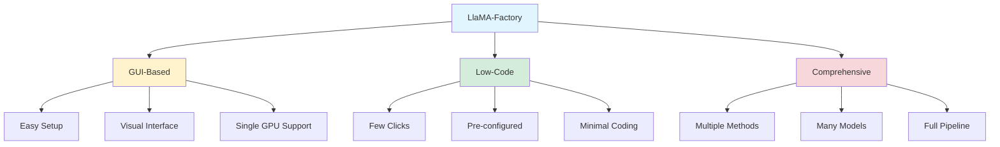
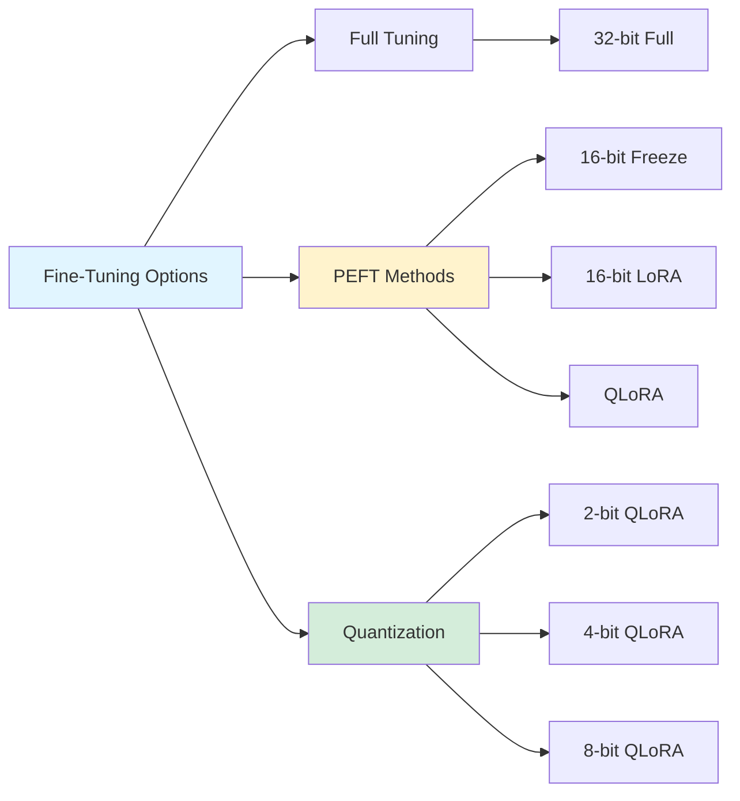
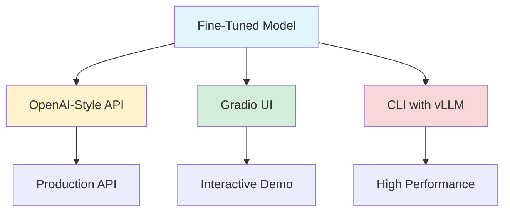

> [LLM Finetuning](https://github.com/lxe/simple-llm-finetuner?tab=readme-ov-file)
{: .prompt-tip}

## LlaMA-Factory: The Best Open-Source LLM Fine-Tuning Tool

*Curiosity:* How can we make LLM fine-tuning accessible to everyone? What tools enable low-code, GUI-based fine-tuning for practitioners at all levels?

**LlaMA-Factory** is one of the best open-source tools for fine-tuning LLMs, especially if you're new to fine-tuning and prefer a GUI-based or low-code approach. With 17k+ GitHub stars, it's become the go-to solution for efficient, user-friendly LLM customization.

### Why LlaMA-Factory?


```mermaid
graph TB
    A[LlaMA-Factory] --> B[GUI-Based]
    A --> C[Low-Code]
    A --> D[Comprehensive]
    
    B --> B1[Easy Setup]
    B --> B2[Visual Interface]
    B --> B3[Single GPU Support]
    
    C --> C1[Few Clicks]
    C --> C2[Pre-configured]
    C --> C3[Minimal Coding]
    
    D --> D1[Multiple Methods]
    D --> D2[Many Models]
    D --> D3[Full Pipeline]
    
    style A fill:#e1f5ff
    style B fill:#fff3cd
    style C fill:#d4edda
    style D fill:#f8d7da
```

### Key Features Overview

| Feature Category | Capabilities | Impact |
|:-----------------|:-------------|:-------|
| **Model Support** | LLaMA, Mistral, Qwen, Gemma, etc. | ⭐⭐⭐ Wide compatibility |
| **Tuning Methods** | SFT, RLHF, PPO, DPO, ORPO | ⭐⭐⭐ Comprehensive |
| **PEFT & Quantization** | LoRA, QLoRA, Freeze-tuning | ⭐⭐⭐ Efficient |
| **Advanced Algorithms** | GaLore, DoRA, LongLoRA, etc. | ⭐⭐ Cutting-edge |
| **Monitoring** | TensorBoard, Wandb, MLflow | ⭐⭐ Professional |
| **Deployment** | OpenAI API, Gradio, vLLM | ⭐⭐⭐ Production-ready |

### 🌐 Diverse LLM Support

*Retrieve:* LlaMA-Factory supports a wide range of models, making it versatile for different use cases.

| Model Family | Versions Supported | Use Cases |
|:-------------|:-------------------|:----------|
| **LLaMA** | All versions (1, 2, 3) | General-purpose, research |
| **Mistral** | Mistral, Mixtral-MoE | Efficient, multilingual |
| **Qwen** | Qwen series | Chinese, multilingual |
| **Gemma** | Gemma models | Google's open models |
| **Others** | Various architectures | Specialized tasks |

### 🛠 Comprehensive Tuning Methods

*Innovate:* LlaMA-Factory offers a complete suite of fine-tuning approaches.

| Method | Description | Best For |
|:-------|:------------|:---------|
| **Continuous Pre-training** | Further pre-training on domain data | Domain adaptation |
| **Supervised Fine-Tuning (SFT)** | Task-specific training | Instruction following |
| **Reward Modeling** | Preference learning | Alignment |
| **PPO** | Proximal Policy Optimization | RLHF |
| **DPO** | Direct Preference Optimization | Efficient alignment |
| **ORPO** | Online Reinforcement Policy Optimization | Advanced RLHF |

### 🔎 PEFT Methods & Quantization

*Retrieve:* Efficient fine-tuning options for resource-constrained environments.


```mermaid
graph LR
    A[Fine-Tuning Options] --> B[Full Tuning]
    A --> C[PEFT Methods]
    A --> D[Quantization]
    
    B --> B1[32-bit Full]
    
    C --> C1[16-bit Freeze]
    C --> C2[16-bit LoRA]
    C --> C3[QLoRA]
    
    D --> D1[2-bit QLoRA]
    D --> D2[4-bit QLoRA]
    D --> D3[8-bit QLoRA]
    
    style A fill:#e1f5ff
    style C fill:#fff3cd
    style D fill:#d4edda
```

| Method | Precision | Memory | Speed | Quality |
|:-------|:----------|:-------|:------|:--------|
| **Full Tuning** | 32-bit | High | Slow | Best |
| **Freeze Tuning** | 16-bit | Medium | Medium | Good |
| **LoRA** | 16-bit | Low | Fast | Good |
| **QLoRA 8-bit** | 8-bit | Very Low | Very Fast | Good |
| **QLoRA 4-bit** | 4-bit | Minimal | Fastest | Acceptable |

### 📈 Advanced Fine-Tuning Approaches

*Innovate:* State-of-the-art algorithms for improved performance and efficiency.

| Algorithm | Purpose | Benefit |
|:----------|:--------|:--------|
| **GaLore** | Gradient Low-Rank Projection | Memory efficiency |
| **BAdam** | Block-wise Adam | Optimized training |
| **DoRA** | Weight-Decomposed Low-Rank Adaptation | Better performance |
| **LongLoRA** | Efficient long context | Extended context |
| **Mixture-of-Depths** | Dynamic computation | Efficiency |
| **LoRA+** | Enhanced LoRA | Better adaptation |
| **LoftQ** | LoRA Fine-Tuning aware Quantization | Quantization-aware |
| **Agent Tuning** | Agent-specific optimization | Agent applications |

### 🧝‍♀️ Practical Optimization Tricks

*Retrieve:* Proven techniques to enhance fine-tuning outcomes.

| Technique | Purpose | Impact |
|:----------|:--------|:-------|
| **FlashAttention-2** | Memory-efficient attention | ⬆️ Speed, ⬇️ Memory |
| **Unsloth** | Faster training | ⬆️ 2-5x speedup |
| **RoPE Scaling** | Extended context | ⬆️ Context length |
| **NEFTune** | Noise-enhanced training | ⬆️ Performance |

### 📊 Experiment Monitoring

*Retrieve:* Professional monitoring tools for tracking training progress.

| Tool | Purpose | Features |
|:-----|:---------|:---------|
| **LlamaBoard** | Built-in dashboard | Real-time metrics |
| **TensorBoard** | TensorFlow visualization | Comprehensive logging |
| **Wandb** | Weights & Biases | Experiment tracking |
| **MLflow** | ML lifecycle management | Model versioning |

### 🚀 Deployment Options

*Innovate:* Multiple deployment strategies for production use.


```mermaid
graph TB
    A[Fine-Tuned Model] --> B[OpenAI-Style API]
    A --> C[Gradio UI]
    A --> D[CLI with vLLM]
    
    B --> B1[Production API]
    C --> C1[Interactive Demo]
    D --> D1[High Performance]
    
    style A fill:#e1f5ff
    style B fill:#fff3cd
    style C fill:#d4edda
    style D fill:#f8d7da
```

| Deployment Method | Use Case | Performance |
|:------------------|:---------|:------------|
| **OpenAI-Style API** | Production services | Standard |
| **Gradio UI** | Demos, testing | Interactive |
| **vLLM Worker** | High-throughput | ⚡ Fastest |

### Quick Start Example

```python
# LlaMA-Factory makes fine-tuning simple
# GUI-based approach - no code needed!

# Or programmatically:
from llamafactory import ModelFactory

# Load model
factory = ModelFactory()

# Configure fine-tuning
config = {
    "model_name": "llama-3-8b",
    "method": "lora",
    "rank": 8,
    "target_modules": ["q_proj", "v_proj"]
}

# Fine-tune
factory.fine_tune(
    model_path="llama-3-8b",
    data_path="training_data.json",
    config=config
)
```

### GitHub Repository

**⭐ 17k+ Stars**: <https://github.com/hiyouga/LLaMA-Factory>

**Why It's Popular**:
- User-friendly GUI
- Comprehensive features
- Active community
- Regular updates
- Excellent documentation

### Key Takeaways

*Retrieve:* LlaMA-Factory provides a comprehensive, user-friendly solution for LLM fine-tuning, supporting multiple models, methods, and deployment options.

*Innovate:* By leveraging LlaMA-Factory's GUI and advanced features, you can efficiently fine-tune models for your specific use cases without extensive coding.

*Curiosity → Retrieve → Innovation:* Start with curiosity about fine-tuning, retrieve knowledge through LlaMA-Factory's tools, and innovate by creating specialized models for your applications.

**Next Steps**:
- Explore the GitHub repository
- Try the GUI interface
- Experiment with different methods
- Deploy your fine-tuned models

🚨 I share #genai content daily, follow along for the latest updates! #llms #finetuning ( from [Aishwarya Naresh Reganti](https://www.linkedin.com/in/areganti/recent-activity/all/))

<details markdown="1">
<summary style= "font-size:24px; line-height:24px; font-weight:bold; cursor:pointer;" > Translate to Korean </summary>

* * * 

### 🎊 If you're new to fine-tuning LLMs and prefer a GUI-based or low-code approach, LlaMA-Factory is one of the best open-source tools available!

I've tried various open-source fine-tuning tools and really enjoyed using LlaMA Factory. It has a user-friendly GUI option (great for single GPU use cases) that makes fine-tuning very easy with just a few clicks.

Other great features include:

+ 🌐 Diverse LLM Support 
  + Supports various models including all versions of LLaMA, Mistral, Mixtral-MoE, Qwen, Gemma, and more. 

+ 🛠 Tuning Methods
  + A comprehensive integrated method for fine-tuning including continued pre-training, supervised fine-tuning, reward modeling, PPO, DPO, and ORPO (Online Reinforcement Policy Optimization). 

+ 🔎 PEFT Methods & Quantization
  + Supports popular PEFT approaches such as 32-bit full tuning and 16-bit frozen tuning, 16-bit LoRA and 2/4/8-bit QLoRA! 

+ 📈 Advanced Fine-Tuning Approaches
  + Implements advanced algorithms such as GaLore, BAdam, DoRA, LongLoRA Mixture-of-Depths, LoRA+, LoftQ, and Agent Tuning. These algorithms help optimize fine-tuning.

+ 🧝‍♀️ Practical Tricks
  + Integrates practical tricks and techniques to improve fine-tuning results, including FlashAttention-2, Unsloth, RoPE scaling, and NEFTune.

+ 📊 Experiment Monitor
  + Supports multiple experiment monitoring tools including LlamaBoard, TensorBoard, Wandb (Weights and Biases), and MLflow. 

+ 🚀 Faster Inference
  + Facilitates faster inference via OpenAI-style API, Gradio UI, and CLI using vLLM workers.

The GitHub repository already has around 17k stars! Check it out here: <https://github.com/hiyouga/LLaMA-Factory?tab=readme-ov-file>

</details>
