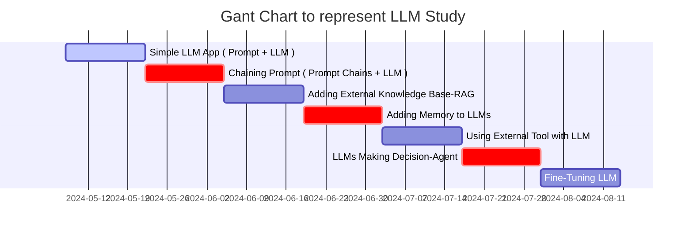

## Step-by-Step Guide to Building LLM Apps Basic to Advanced Components Created




- Step.1
  - Simple LLM App ( Prompt + LLM )
- Step.2
  - Chaining Prompt ( Prompt Chains + LLM )
- Step.3
  - Adding External Knowledge Base : RAG ( Retrieval Augmented Generation)
    - `답변에 필요한 정보를 먼저 찾아서 LLM에게 질문과 함께 넘겨주는 방식`
    - 이를 통해 특정 문서나 서비스의 데이터베이스에 있는 정보에 기반해서 답변을 생성할 수 있다.
{: .light .w-75 .shadow .rounded-10 w='1212' h='668' }
- Step.4
  - Adding Memory to LLMs
- Step.5
  - Using External Tool with LLM
- Step.6
  - LLMs Making Decision : Agent
- Step.7
  - Fine-Tuning LLM

* * *

LLM(Large Language Model) 공부하기 계획부터 실제 코드까지 작성하는 포스트를 작성한다. 
[당근에서 LLM 사용하기](https://medium.com/daangn/%EB%8B%B9%EA%B7%BC%EC%97%90%EC%84%9C-llm-%ED%99%9C%EC%9A%A9%ED%95%98%EA%B8%B0-76131ecebce1) 내용을 통해 LLM의 잘하는 일을 알아보고, LLM을 활용한 사례를 분석해보자.

## LLM이 잘하는 일

LLM은 수많은 텍스트 데이터를 학습해서 세상에 대한 지식, 언어 이해 능력 그리고 뛰어난 추론 능력을 갖추고 있어, 별도의 학습 없이도 주어진 텍스트를 이해하고 지시한 작업을 수행할 수 있다. 
하지만 딥러닝 모델을 학습해서 해결하던 문제들을 모두 대신할 수 있는 것은 아니기 때문에 LLM이 잘할 수 있는 일들은 크게 다음과 같이 생각해 볼 수 있다.

### 자연어 처리: 텍스트 분석, 추출, 분류

간단한 프롬프트 작성만으로 해당 테스크에 학습된 모델과 비슷하거나 더 뛰어난 성능으로 같은 작업을 수행할 수 있게 되었다.
{: .light .w-75 .shadow .rounded-10 w='1212' h='668' }

### 사람의 질문에 대답하기

LLM은 질문과 글을 잘 이해하고 글을 만들어내는 일에 뛰어나기 때문에 질문에 대답하는 일에도 잘 활용할 수 있다. 
이를 활용하면 사람의 질문에 대답하면서 사람의 일을 돕는 Assistant 형태의 서비스나, 사람이 대답하는 역할을 완전히 대신하는 Agent 형태의 서비스도 가능하다. 
기본적으로는 LLM이 학습을 통해 배워서 가지고 있는 지식을 기반으로 대답하게 되지만, 요즘 서비스로 사용되는 방식으로 답변에 필요한 정보를 먼저 찾아서 LLM에게 질문과 함께 넘겨주는 방식 (retrieval-augmented generation = RAG) 을 많이 이용하는 것으로 생각이 된다.

### 창의적인 글짓기

LLM은 새로운 글을 만들어내는 능력이 뛰어나다. 예를들면 주어진 지시에 따라 창의적으로 편지나 소설 같은 글을 만들어내는 작업을 할 수 있다. 
창의적인 글짓기를 활용한다면 광고주를 위해서 광고 소재를 생성해줄 수도 있고, 비즈 소식이나 중고거래 판매글을 대신 작성해 주는 상황을 상상해볼 수 있다.

이처럼 LLM이 정말 잘하는 일들이 있지만 그렇다고 만능은 아닌 것이, 새로운 모델들이 계속 발표되고 빠르게 발전하고 있지만 여전히 잘못된 내용을 생성하거나 불안정한 부분이 많다. 이를 보통 Hallucination 이라고 부른다.
그리고 LLM이 아무리 발전해도 딥러닝 모델 학습이 꼭 필요한 분야가 있다.

* * * 

## 당근에서 활용하는 LLM

> 당근마켓에서 활용한 LLM Use case를 통해, 안정적인 서비스 사용에 대한 접근 방법 및 종류를 확인해보자

### Use case 1 - 중고거래: LLM을 활용한 추천과 광고

사용자 간에 거래가 이루어지는 중고마켓 특성상, 정형화된 형태의 정보가 아닌 비정형적인 형태의 정보를 통해 커뮤니티가 형성되어 있다는 특징이 있다.


이에 따라, 비정형화된 데이터로부터 정형화된 데이터를 얻기 위해 LLM을 사용한 사례의 구조를 활용한다.
{: .light .w-75 .shadow .rounded-10 w='1212' h='668' }


### Use case 2 - 동네생활: LLM을 활용한 장소 연결과 태그 추천

동네생활에서 많은 사용자들이 우리 동네 장소들에 대한 글을 작성할 때 장소명을 언급하지만 장소 태깅은 하지 않는 경우가 많이 있다. 이 경우 동네 가게들에 대한 정보가 장소정보로 연결되지 않기 때문에 잃어버리게 된 정보인데,  LLM이 동네생활 게시글을 읽고 장소 이름으로 보이는 것을 찾아, 해당 장소 이름이 실제로 존재하는 장소인 경우 자동으로 연결을 만들고 “언급된 장소”라는 영역으로 보여줍니다. 동네생활에서 장소정보를 저장하기 위한 기술로 LLM이 사용되는 경우다.

{: .light .w-75 .shadow .rounded-10 w='1212' h='668' }

장소 정보를 찾아주는 기능을 확장해 해쉬태그 정보로 활용 범위를 확장시킬수도 있었다.


{: .light .w-75 .shadow .rounded-10 w='1212' h='668' }

### Use case 3 - 모임: LLM을 활용한 모임 추천

임의 이름과 상세 설명을 보고 그 모임에서 주로 모집하는 나이대와 성별, 그리고 모임의 세부 주제인 토픽(예: 테니스, 골프, 여행, 카페투어 등)을 LLM으로 추출하여 활용하고 있다. 
이 정보를 활용해서 다양한 큐레이션과 추천 지면에서 사용자들이 관심이 있을 만한 모임을 추천하는 데이터로 활용한다.
{: .light .w-75 .shadow .rounded-10 w='1212' h='668' }


### Use case 4 - 부동산: LLM을 활용한 매물정보 자동입력과 대표사진 변경 제안

부동산 매물을 작성할 때 매물의 종류와 가격 뿐만 아니라 층과 평수, 관리비, 내외부 시설 등 다양한 정보를 입력폼에 작성해야 해서 번거로울 수 있는데 이 과정을 LLM으로 자동화해서 간편하게 매물을 등록하는 사용자 경험을 제공하고 있다.  부동산 매물의 경우 미리 정보를 적어두고 복사해서 붙여넣는 방식으로 작성하시는 경우가 많은데, 당근 부동산에도 마찬가지로 붙여넣기만 하면 LLM이 전체 내용을 읽고 필요한 정보를 찾아서 입력폼을 자동으로 채워주는데 활용하고 있다. 

{: .light .w-75 .shadow .rounded-10 w='1212' h='668' }


* * * 

## LLM 활용에 필요한 것

앞서, Use case 로 소개한 서비스에 대해서 가능했던 프로세스 파이프라인의 구조를 확인해보자.
{: .light .w-75 .shadow .rounded-10 w='1212' h='668' }


실시간으로 LLM 예측을 수행하고 결과를 저장하는 파이프라인은 ML데이터플랫폼팀에서 개발한 파이프라인 시스템을 활용하고 있다. 게시글이 작성될 때 Kafka로 이벤트가 흘러들어오게 되는데, 이 이벤트를 받아서 미리 지정한 LLM 예측을 수행하고 결과를 다시 Kafka 토픽과 빅쿼리로 내보낼 수 있도록 구성되어 있다. 구독할 토픽 정보와 사용할 모델 정보 그리고 프롬프트를 포함한 yaml 설정만 추가하면 실시간으로 LLM 예측을 수행하는 파이프라인을 간단히 추가할 수 있도록 설계되어 있다.

### LLM 모델 선택

여러 빅테크들이 경쟁적으로 모델을 출시하고 API를 제공하고 있어서, 우리가 하려는 작업에 어떤 모델을 사용할지 선택할 수 있다. 대표적으로 Google의 Gemini 시리즈, OpenAI의 GPT 시리즈, 그리고 엔트로픽의 최신 모델 Claude 3 시리즈가 있는데, 이 모델들은 크기와 비용에 따라 그룹을 형성하고 있다. 

가장 강력하고 비싼 모델들은 GPT-4, Gemini 1.5 Pro, Claude 3 Opus 등이 있고 준수한 성능에 합리적인 가격을 제공하는 GPT-3.5-turbo, Gemini 1.0 Pro, Claude 3 Haiku 등이 있다. 두 그룹의 API 비용은 약 10~30배 정도 차이가 있어서 하려는 작업의 난이도와 처리량에 따라 적절한 모델 그룹의 선택이 필요합니다. 

각 모델의 성능은 공개된 벤치마크 점수가 있지만 수행하려는 작업에서 직접 테스트 해보고 결정하는 것이 좋다. 비용 면에서는 Gemini Pro 모델이 공격적인 가격 정책을 하고 있고 비용 청구 단위도 토큰이 아닌 글자 단위라서 상대적으로 많은 토큰 수를 사용하게 되는 한국어에서는 유리한 면이 있음을 파악했다. 

현재 당근에서는 Google의 Gemini 1.0 Pro, PaLM2, 그리고 Gemini 1.0 Pro Vision 모델을 가장 많이 사용하고 있다. 하나의 모델을 골라서 모든 사용 사례에 적용하려고 하는 것보다 사례에 따라 적합한 모델을 선택하는 것이 중요하고 하나의 사례에서도 예제의 종류나 길이에 따라 모델을 분기하는 전략도 고려해 볼 수 있을 것이다.


### 대표적인 LLM API의 텍스트 처리 비용

{: .light .w-75 .shadow .rounded-10 w='1212' h='668' }

#### 프롬프트 엔지니어링

간단한 자연어 지시만으로 원하는 작업을 수행할 수 있다는 것이 LLM의 장점이지만, 어떻게 지시하는지에 따라 원하는 만큼의 성능이 나오기도 하고 아니기도 하다. LLM은 빠르게 발전하고 이미 능력이 뛰어나지만 여전히 프롬프트를 잘 작성하는 것이 좋은 결과를 얻는데 중요한 역할을 하고 있으며, 위에서 소개한 사례를 구축하면서 중요하다고 느낀 몇 가지 인사이트를 공유한 내용을 나열합니다.

-  테스트셋을 만들고 반복 개선하기: 좋은 프롬프트를 완성하기 위해서는 반복적인 평가와 개선 작업이 반드시 필요했어요. 한 번에 좋은 결과를 얻기 어렵기 때문에 테스트셋을 정답과 함께 준비해 두고 LLM의 예측 결과를 평가한 후 프롬프트를 개선하고 다시 평가하는 반복 개선이 필요해요. 1~2개의 예시만 테스트 하면서 프롬프트를 개선하다보면 전체적으로는 오히려 나빠지는 경우도 있어요. 최소 수백 개 이상의 테스트 셋을 만들어두고 지속적으로 평가하는 것이 중요했어요.


#### 프롬프트를 반복해서 평가하고 개선하기

{: .light .w-75 .shadow .rounded-10 w='1212' h='668' }

-  출력 형식 제어: LLM이 생성한 결과물을 활용해서 다른 기능을 제공하기 위해서는 결과물을 코드로 쉽게 처리할 수 있어야 해요. LLM에게 지시할 때 주어진 key를 가지는 JSON 형태로 결과를 출력하라는 지시를 주면 출력 형식을 제어할 수 있고 쉽게 후처리가 가능해요. 사용하려는 모델 API에서 `JSON Mode`를 지원한다면 이를 사용해서 출력 결과가 JSON임을 보장받을 수 있어요. 그렇지 않다면 프롬프트에서 JSON으로 출력하라고 지시한 경우에도 종종 올바르지 않은 JSON을 출력하는 경우도 있기 때문에 검증하고 보정하는 후처리가 꼭 필요해요.

-  생각하고 말하게 하기: 사람도 어떤 일을 수행할 때 차근차근 단계적으로 생각하고 최종 답변을 하는 경우에 더 잘 해낼 수 있어요. 마찬가지로 LLM도 한 번에 최종 답변을 생성하는 것 보다 중간 단계를 먼저 생성하고 이후에 최종 답변을 하도록 하면 성능이 좋아지는 경우가 있어요. Chain-of-thought=COT 라고 불리는 이 기법은 매우 널리 사용되고 성능 향상이 검증되었어요. 위에서 소개한 사례에서 동네생활 LLM의 경우도 주어진 글의 핵심을 간단히 요약한 후 필요한 정보를 추출하게 했을 때 더욱 좋은 성능을 볼 수 있었어요.

-  예시 보여주기: 원하는 형식이나 지시 사항에 대해 몇 가지 예시를 보여주는 것이 구구절절 설명하는 것 보다 강력할 때도 있어요. 예를 들어 출력을 “콤마로 구분된 스트링으로 출력해 줘”라고 지시하면 간혹 형식을 틀리는 경우가 있지만 실제로 그렇게 구성된 예시를 보여주게 되면 틀리는 경우가 사라지는 것을 볼 수 있어요. 예시를 줄 때 원하는 입출력 형식에 정확하게 맞추어서 주는 것이 중요하고 예시가 지시 사항과 다르다면 오히려 혼란을 주어서 성능을 떨어트릴 수 있어요. 너무 많은 예시를 주는 것 역시 성능에 안 좋은 영향을 주었어요. 지시 사항을 잘 이해하기 위한 최소한의 예시만을 사용하는 것을 권장해요.

-  간단한 작업으로 쪼개기: 하나의 정보를 추출하고 싶은데 추출하는 조건이 복잡하다면 그런 조건을 구체적으로 복잡하게 지시하는 것 보다 단순화된 각 조건을 하나씩 추출하게 하고 그 이후에 최종 결과를 생성하거나 후처리로 조합하는 것이 좋은 접근일 수 있어요. 예를 들면, “언급된 장소 이름이 있다면 추출해줘. 하지만 그 장소가 단순히 위치를 알려주기 위해서만 언급된 거라면 제외해야해. 그리고 장소에 대한 후기가 아닌 경우도 제외해.” 처럼 복잡한 조건을 주고 처리하게 하면 어려워하지만 “다음 정보를 추출해줘. 1. 언급된 장소 이름 2. 장소에 대한 후기인지 여부 3. 장소 이름이 위치를 알려주기 위해 단순히 언급되었는지 여부” 처럼 단순한 여러개의 작업으로 지시하면 각 작업은 훌륭하게 수행해요. 이후에 후처리를 통해 필요한 조건에 부합하는 경우만 결과를 사용할 수 있어요. 지시 전체가 복잡하고 길어지는 경우 단계별로 여러 번 모델을 호출하는 방법도 고려해볼 수 있어요. 각 단계의 난이도에 따라 서로 다른 모델을 사용해서 최종 결과를 얻을 수도 있어요.


## 앞으로


### 프롬프트 엔지니어링을 진짜 엔지니어링으로

지금의 프롬프트 엔지니어링은 엔지니어링 측면에서 아직 부족한 점이 많아, 앞으로 계속해서 LLM 활용을 도입하고 개선하기 위해서는 다양한 엔지니어링 방법들을 고민하고 있다.

- 변경 관리: 소프트웨어에서 코드의 변경을 추적하고 배포 버전을 관리하는 것과 마찬가지로 프롬프트나 모델의 변경 이력도 쉽게 추적하고 되돌릴 수 있어야 하고 배포 버전의 관리도 필요해요.
- 평가와 배포 자동화: 프롬프트나 모델의 변경이 발생할 때 출력의 형식, 정확도, 안전성 등을 자동으로 평가하고 빠르게 배포할 수 있어야 해요.
- 가시성: 프로덕션으로 배포된 프롬프트가 제대로 동작하고 있는지 알 수 있어야 해요. LLM 호출 성공 여부부터 비용 추적, 그리고 생성 결과의 품질도 모니터링이 필요해요.
- A/B 테스트: 여러 버전의 프롬프트를 실험을 통해 비교하고 더 나은 버전을 선택할 수 있도록 온/오프라인 A/B 테스트를 수행할 수 있어야 해요.
- 확장성: LLM으로 얻은 정보를 하나의 기능에만 사용하기보다 feature-store와 결합 등으로 다양한 서비스와 다른 머신러닝 모델에서 활용할 수 있어야 해요.


<!-- ```liquid

  This product's title contains the word Pack.

  No title
``` -->

