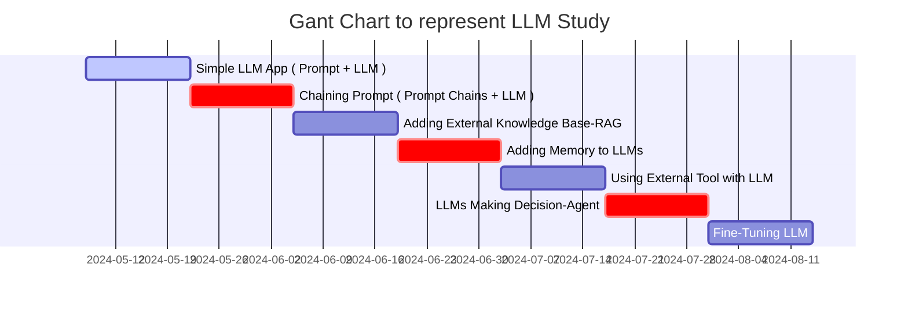

## Step-by-Step Guide to Building LLM Apps Basic to Advanced Components Created




- Step.1
  - Simple LLM App ( Prompt + LLM )
- Step.2
  - Chaining Prompt ( Prompt Chains + LLM )
- Step.3
  - Adding External Knowledge Base : RAG ( Retrieval Augmented Generation)
    - `답변에 필요한 정보를 먼저 찾아서 LLM에게 질문과 함께 넘겨주는 방식`
    - 이를 통해 특정 문서나 서비스의 데이터베이스에 있는 정보에 기반해서 답변을 생성할 수 있다.
{: .light .w-75 .shadow .rounded-10 w='1212' h='668' }
- Step.4
  - Adding Memory to LLMs
- Step.5
  - Using External Tool with LLM
- Step.6
  - LLMs Making Decision : Agent
- Step.7
  - Fine-Tuning LLM

* * *

LLM(Large Language Model) 공부하기 계획부터 실제 코드까지 작성하는 포스트를 작성한다. 
[당근에서 LLM 사용하기](https://medium.com/daangn/%EB%8B%B9%EA%B7%BC%EC%97%90%EC%84%9C-llm-%ED%99%9C%EC%9A%A9%ED%95%98%EA%B8%B0-76131ecebce1) 내용을 통해 LLM의 잘하는 일을 알아보고, LLM을 활용한 사례를 분석해보자.

## LLM이 잘하는 일

LLM은 수많은 텍스트 데이터를 학습해서 세상에 대한 지식, 언어 이해 능력 그리고 뛰어난 추론 능력을 갖추고 있어, 별도의 학습 없이도 주어진 텍스트를 이해하고 지시한 작업을 수행할 수 있다. 
하지만 딥러닝 모델을 학습해서 해결하던 문제들을 모두 대신할 수 있는 것은 아니기 때문에 LLM이 잘할 수 있는 일들은 크게 다음과 같이 생각해 볼 수 있다.

### 자연어 처리: 텍스트 분석, 추출, 분류

간단한 프롬프트 작성만으로 해당 테스크에 학습된 모델과 비슷하거나 더 뛰어난 성능으로 같은 작업을 수행할 수 있게 되었다.
{: .light .w-75 .shadow .rounded-10 w='1212' h='668' }

### 사람의 질문에 대답하기

LLM은 질문과 글을 잘 이해하고 글을 만들어내는 일에 뛰어나기 때문에 질문에 대답하는 일에도 잘 활용할 수 있다. 
이를 활용하면 사람의 질문에 대답하면서 사람의 일을 돕는 Assistant 형태의 서비스나, 사람이 대답하는 역할을 완전히 대신하는 Agent 형태의 서비스도 가능하다. 
기본적으로는 LLM이 학습을 통해 배워서 가지고 있는 지식을 기반으로 대답하게 되지만, 요즘 서비스로 사용되는 방식으로 답변에 필요한 정보를 먼저 찾아서 LLM에게 질문과 함께 넘겨주는 방식 (retrieval-augmented generation = RAG) 을 많이 이용하는 것으로 생각이 된다.

### 창의적인 글짓기

LLM은 새로운 글을 만들어내는 능력이 뛰어나다. 예를들면 주어진 지시에 따라 창의적으로 편지나 소설 같은 글을 만들어내는 작업을 할 수 있다. 
창의적인 글짓기를 활용한다면 광고주를 위해서 광고 소재를 생성해줄 수도 있고, 비즈 소식이나 중고거래 판매글을 대신 작성해 주는 상황을 상상해볼 수 있다.

이처럼 LLM이 정말 잘하는 일들이 있지만 그렇다고 만능은 아닌 것이, 새로운 모델들이 계속 발표되고 빠르게 발전하고 있지만 여전히 잘못된 내용을 생성하거나 불안정한 부분이 많다. 이를 보통 Hallucination 이라고 부른다.
그리고 LLM이 아무리 발전해도 딥러닝 모델 학습이 꼭 필요한 분야가 있다.


<!-- ```liquid

  This product's title contains the word Pack.

  No title
``` -->

