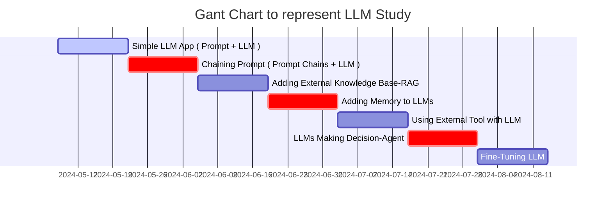

LLM(Large Language Model) 공부하기 계획부터 실제 코드까지 작성하는 포스트를 작성한다. 당근에서 LLM 사용하기 


# Step-by-Step Guide to Building LLM Apps Basic to Advanced Components Created




- Step.1
  - Simple LLM App ( Prompt + LLM )
- Step.2
  - Chaining Prompt ( Prompt Chains + LLM )
- Step.3
  - Adding External Knowledge Base : RAG
- Step.4
  - Adding Memory to LLMs
- Step.5
  - Using External Tool with LLM
- Step.6
  - LLMs Making Decision : Agent
- Step.7
  - Fine-Tuning LLM


<!-- ```liquid

  This product's title contains the word Pack.

  No title
``` -->

