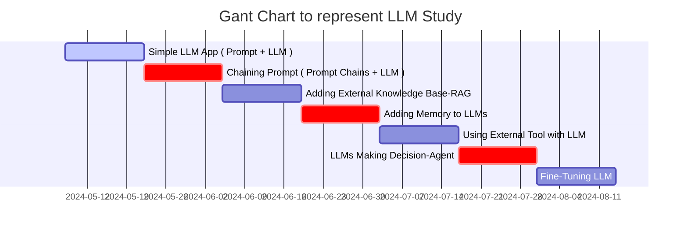

LLM(Large Language Model) 공부하기 계획부터 실제 코드까지 작성하는 포스트를 작성한다. 당근에서 LLM 사용하기 


# Step-by-Step Guide to Building LLM Apps Basic to Advanced Components Created




- Step.1
  - Simple LLM App ( Prompt + LLM )
- Step.2
  - Chaining Prompt ( Prompt Chains + LLM )
- Step.3
  - Adding External Knowledge Base : RAG
- Step.4
  - Adding Memory to LLMs
- Step.5
  - Using External Tool with LLM
- Step.6
  - LLMs Making Decision : Agent
- Step.7
  - Fine-Tuning LLM


<!-- ```liquid

  This product's title contains the word Pack.

  No title
``` -->


* * *

🧐 LLM Quantization - GPTQ | QAT | AWQ | GGUF | GGML | PTQ

🚩 GPTQ

Accurate Post-Training Quantization for Generative Pre-trained Transformers compresses LLMs by reducing weight bit depth, maintaining processing speed : https://lnkd.in/e59teNuZ

🚩 AWQ

Activation-aware Weight Quantization focuses on activation levels for weight quantization, enhancing model performance : https://lnkd.in/esTYJ6MG

🚩 QAT

Quantization-Aware Training quantizes specific operators to INT8 precision, offering flexibility to tailor quantization parameters to different parts of the network : https://lnkd.in/exwyERJQ

🚩 GGML

GGML is a C++ replica of LLM library, supporting multiple LLMs like LLaMA series & Falcon, optimized for CPU performance : https://lnkd.in/ekk6dhB8

🚩 GGUF

GPT-Generated unified Format introduced by llama.cpp team in 2023, replacing GGML. It offers unified file structure, *.safetensors to *.gguf conversion support, cross-platform compatibility inference on CPUs, GPUs, and MPUs : https://lnkd.in/e2YVC8dN

🚩 PTQ

Post-Training Quantization reduces model parameters' precision post-training, offering reduced memory consumption, faster inference times, and improved energy efficiency.

🚩 K-quants 

It adjust bit precision for model weights based on importance, improving efficiency.Examples such as q2_K, q3_K_S, and q3_K_L, each with varying bit widths for different tensors.


* * * 

최근 개인 연구 중 Llama2-13B 모델을 Full Fine-tuning할 기회가 생겼습니다. 현재 7B를 넘어서는 모델들을 A100-80GB 1 대로 학습하기가 점점 더 어려워지고 있습니다. 이에 많은 분들이 저와 같이 분산 학습 환경에 대한 실질적인 이해가 필요할 때 그 장벽을 낮추고자 "How to Train LLM? - From Data Parallel to Fully Sharded Data Parallel"라는 제목으로 노션에 글을 작성했습니다.

해당 글은 Data Parallel, Distributed Data Parallel, 그리고 Fully Sharded Data Parallel에 이르기까지 LLM 학습에서 필요한 여러 단계를 자세히 설명합니다. 다양한 연구와 학술 자료, 그리고 이 분야의 전문가들이 작성한 글들을 바탕으로 NCCL operation이 무엇인지, 그리고 이것이 어떻게 각각의 데이터 병렬 처리 방식에서 작동하는지를 유기적으로 다루고자 했습니다.

아직 부족한 점이 많지만, 저처럼 Fully Sharded Data Parallel에 대한 깊은 이해를 원하시는 분들에게 도움이 될 거라고 생각합니다. (DM으로 많은 피드백 부탁드립니다!)

<https://lnkd.in/dgKJjNCh>

또한 부록으로, HuggingFace의 Accelerate를 사용하여 A100-80GB에서 큰 모델(e.g., Llama2-70B)을 추론하는 방법을 설명한 내용도 노션에 별도로 작성했으니 많은 참고 부탁드립니다!

<https://lnkd.in/dWVSqc-5>


# LLM Lingo: Must-Know Terms

## Foundation Model

LLM designed to generate and understand human-like text across a wide range of use-cases

## Transformer

A popular LLM design known for its attention mechanism and parallel processing abilities

## Prompting

Providing carefully crafted inputs to an LLM to generate desired outputs

## Context-Length

Maximum number of input words/tokens an LLM can consider when generating an output.

## Few-Shot Learning

Providing very few examples to an LLM to assist it in performing a specific task.

## Zero-Shot Learning

Providing only task instructions to the LLM relying solely on its preexisting knowledge

## RAG

Retrieval-Augmented Generation. Appending retrieved information to improve LLM response

## Knowledge Base(KB)

Collection of documents from which relevant information is retrieved in RAG

## Vector Database

Stores vector representations of the KB, aiding the retrieval of relevant information in RAG,

## Fine-Tuning

Adapting an LLM to a specific task or domain by further training it on task-specific data.

## Instruction Tuning

Adjusting an LLM's behavior during fine-tuning by providing specific guidelines/directives

## Hallucination

Tendency of LLMs to sometimes generate incorrect or non-factual information.

