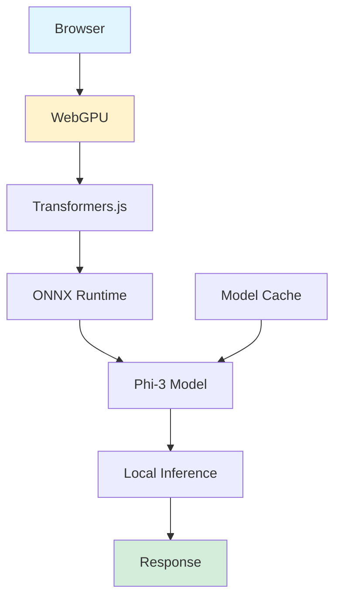

## Phi-3 WebGPU: Private AI Chatbot Running Locally in Your Browser

*Curiosity:* How can we run powerful AI models entirely in the browser? What happens when we combine WebGPU acceleration with on-device inference?

**Phi-3 WebGPU** is a private and powerful AI chatbot that runs 100% locally in your browser, powered by 🤗 Transformers.js and onnxruntime-web. No data is sent to servers—everything runs on your device.

> **Try it**: <https://huggingface.co/spaces/Xenova/experimental-phi3-webgpu>
{: .prompt-info}

**Created by**: [Xenova](https://twitter.com/xenovacom)

### Key Features

*Retrieve:* Phi-3 WebGPU's impressive capabilities.

| Feature | Description | Benefit |
|:--------|:------------|:--------|
| **🔒 Privacy** | On-device inference | ⬆️ No data sent to servers |
| **⚡️ Performance** | WebGPU-accelerated (>20 t/s) | ⬆️ Fast inference |
| **📥 Efficiency** | Model cached after download | ⬆️ One-time download |
| **🚀 Speed** | Up to 42 tokens/second | ⬆️ Real-time responses |

**Performance**: Phi-3 running at **42 tokens per second** 100% locally in your browser!

### Architecture

*Innovate:* How browser-based AI works.

### Technology Stack

*Retrieve:* Components enabling browser-based AI.

**Technologies**:
- **🤗 Transformers.js**: JavaScript port of Transformers
- **onnxruntime-web**: ONNX runtime for web
- **WebGPU**: GPU acceleration in browser
- **Phi-3**: Microsoft's efficient language model

**Benefits**:
- ✅ No server required
- ✅ Complete privacy
- ✅ Fast inference
- ✅ Works offline

### Use Cases

*Innovate:* Applications of browser-based AI.

**Ideal For**:
- Privacy-sensitive applications
- Offline AI capabilities
- Client-side processing
- Educational demos
- Personal AI assistants

**Advantages**:
- ✅ No API costs
- ✅ No data transmission
- ✅ Works offline
- ✅ Low latency

### Key Takeaways

*Retrieve:* Phi-3 WebGPU demonstrates that powerful AI models can run entirely in the browser using WebGPU acceleration, providing privacy and performance without server dependencies.

*Innovate:* By leveraging WebGPU, Transformers.js, and efficient models like Phi-3, you can build private, fast AI applications that run locally in browsers, enabling new use cases for client-side AI.

*Curiosity → Retrieve → Innovation:* Start with curiosity about browser-based AI, retrieve insights from Phi-3 WebGPU's approach, and innovate by building private, on-device AI applications that respect user privacy.

**Next Steps**:
- Try the demo
- Explore Transformers.js
- Learn WebGPU
- Build browser-based AI