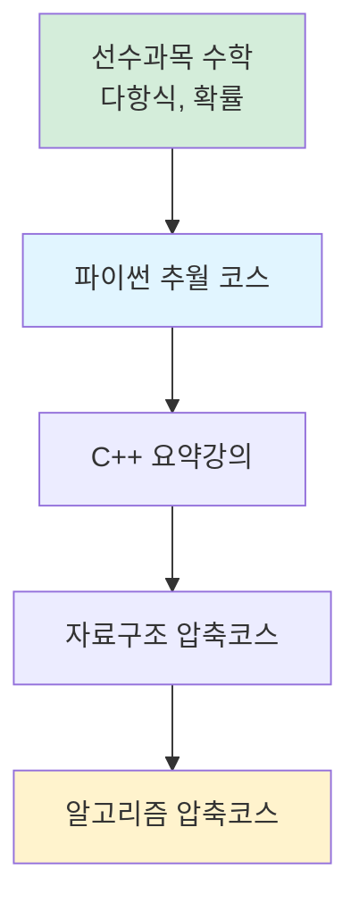

# HongLab 알고리듬 압축코스 - 강의소개

> **Codes :**  <https://github.com/akillness/Algorithm_Honglab>
{: .prompt-info }

알고리듬 배우는 이유?
1. 취업
   - ‘코딩인터뷰 -> 코딩테스트’ 로 변형된 개념, 때문에 사람이 문제를 어떤 방식으로 접근하고 풀어나가는지에 대한 가능성을 보는 ‘인터뷰’
2. 실무
   1. 실력(본인의 역량)을 향상 시켜주는 중요한 개념 ( 코테 + 실력 )
      - 알고리듬 -> 응용분야
   2. 프로그램 = 알고리듬 + 자료구조
   3. 복잡도 필수
   4. 정렬문제
      - 퀵소트에서 피봇을 난수 사용하는 이유
3. 교양
   - 잡스 - 누구나 프로그래밍을 배워야 한다. 왜냐하면, 생각하는 방법을 알려주기 때문이다

- 결론 : 인생의 가치를 높여줄 수 있음

### 알고리즘 어떻게 공부할까요?

*Retrieve:* 학습 방법론.

**1. 고민한 사항**:
- 학습효율
- 이론과 실습의 균형
- 성장 가속
- 재미 (스스로의 성장과 발전을 위한 방향)

**2. 구성**:
- 강의의 흐름: 스탠퍼드 CS161
- 부족한 실습: Sedgewick 교재
- 고급 주제: CLRS + @ (파트 분할)

**3. 목표**:

| 목표 | 설명 | 효과 |
|:-----|:-----|:-----|
| **핵심 습득** | 빠르게 알고리즘 핵심 습득 | ⬆️ 효율적 학습 |
| **능력 향상** | 근본적인 프로그래밍 능력 향상 | ⬆️ 실력 강화 |
| **코테 준비** | 코딩테스트 준비 시작 | ⬆️ 취업 준비 |

**핵심 원칙**: 양적 공부보다 핵심만 잘 습득하면, 나머지는 눈덩이 굴리듯 자연스럽게 늘어난다.

**4. 순서정리**:

*Innovate:* 학습 로드맵.

**순서**:
1. 파이썬 추월 코스
2. C++ 요약강의 (무료): <https://honglab.co.kr/courses/take/cppsummary/texts/47107803>
3. 자료구조 압축코스
4. **알고리즘 압축코스**
5. 선수과목 수학: 다항식, 확률

### Key Takeaways

*Retrieve:* 알고리즘 학습은 취업, 실무, 교양 측면에서 가치가 있으며, 핵심을 빠르게 습득하는 것이 효율적이다.

*Innovate:* 체계적인 학습 순서(파이썬 → C++ → 자료구조 → 알고리즘)와 이론-실습 균형을 통해 근본적인 프로그래밍 능력을 향상시킬 수 있다.

*Curiosity → Retrieve → Innovation:* 알고리즘 학습의 가치에 대한 호기심에서 시작하여, 체계적인 학습 방법을 찾고, 자신만의 학습 경로를 만들어 프로그래밍 능력을 향상시킨다.

**Next Steps**:
- 파이썬 기초 학습
- C++ 요약강의 수강
- 자료구조 학습
- 알고리즘 압축코스 시작

