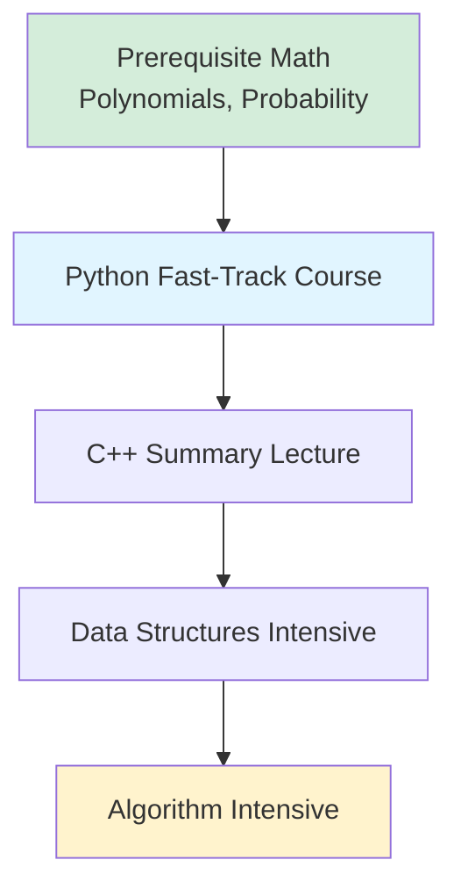

# HongLab Algorithm Intensive Course - Course Introduction

> **Codes :**  <https://github.com/akillness/Algorithm_Honglab>
{: .prompt-info }

Why Learn Algorithms?
1. Employment
   - a concept evolved from 'coding interview -> coding test', an 'interview' that evaluates how a person approaches and solves problems
2. Practical Work
   1. An important concept that improves skills (your capabilities) (coding test + ability)
      - Algorithms -> Application domains
   2. Program = Algorithm + Data Structure
   3. Complexity is essential
   4. Sorting problems
      - Why quicksort uses a random pivot
3. General Knowledge
   - Jobs - Everyone should learn programming, because it teaches you how to think

- Conclusion: It can increase the value of your life

### How Should You Study Algorithms?

*Retrieve:* Learning methodology.

**1. Considerations**:
- Learning efficiency
- Balance between theory and practice
- Accelerated growth
- Fun (direction for personal growth and development)

**2. Structure**:
- Course flow: Stanford CS161
- Supplemental practice: Sedgewick textbook
- Advanced topics: CLRS + extras (divided into parts)

**3. Goals**:

| Goal | Description | Effect |
|:-----|:-----|:-----|
| **Master the Core** | Quickly master algorithm essentials | ⬆️ Efficient learning |
| **Skill Improvement** | Fundamental programming ability improvement | ⬆️ Strengthened skills |
| **Coding Test Prep** | Start preparing for coding tests | ⬆️ Job preparation |

**Core Principle**: If you master just the essentials rather than studying in volume, the rest will naturally snowball from there.

**4. Learning Order**:

*Innovate:* Learning roadmap.

```mermaid
graph TD
    A[Python Fast-Track Course] --> B[C++ Summary Lecture]
    B --> C[Data Structures Intensive]
    C --> D[Algorithm Intensive]
    E[Prerequisite Math<br/>Polynomials, Probability] --> A
    
    style A fill:#e1f5ff
    style D fill:#fff3cd
    style E fill:#d4edda
```

**Order**:
1. Python Fast-Track Course
2. C++ Summary Lecture (Free): <https://honglab.co.kr/courses/take/cppsummary/texts/47107803>
3. Data Structures Intensive Course
4. **Algorithm Intensive Course**
5. Prerequisite Math: Polynomials, Probability

### Key Takeaways

*Retrieve:* Algorithm learning has value in terms of employment, practical work, and general knowledge, and quickly mastering the essentials is the most efficient approach.

*Innovate:* Through a systematic learning order (Python → C++ → Data Structures → Algorithms) and a balance between theory and practice, you can improve your fundamental programming abilities.

*Curiosity → Retrieve → Innovation:* Starting with curiosity about the value of algorithm learning, finding systematic study methods, and creating your own learning path to improve programming abilities.

**Next Steps**:
- Learn Python basics
- Take the C++ summary lecture
- Study data structures
- Start the algorithm intensive course

