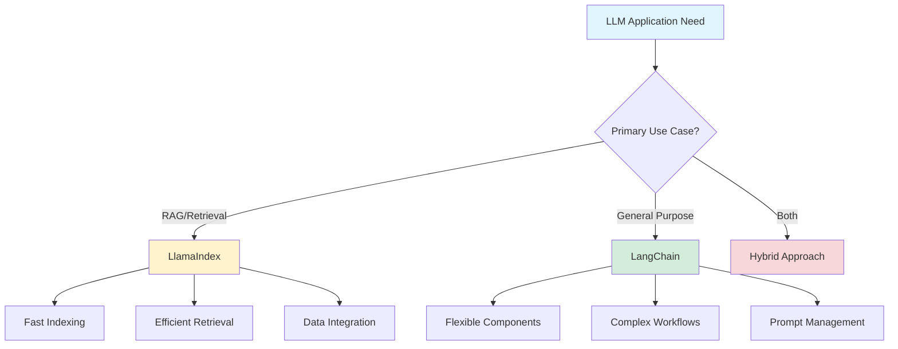
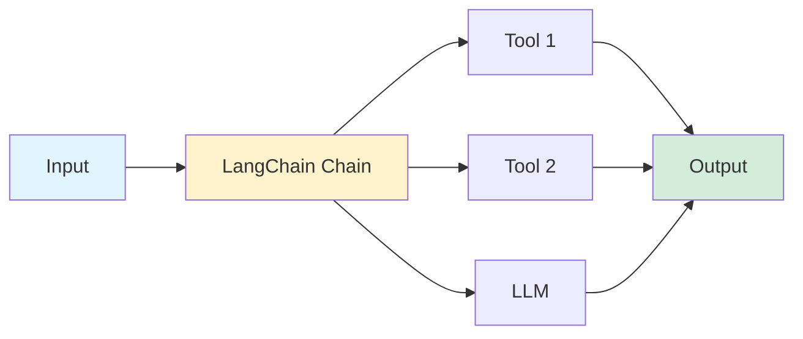
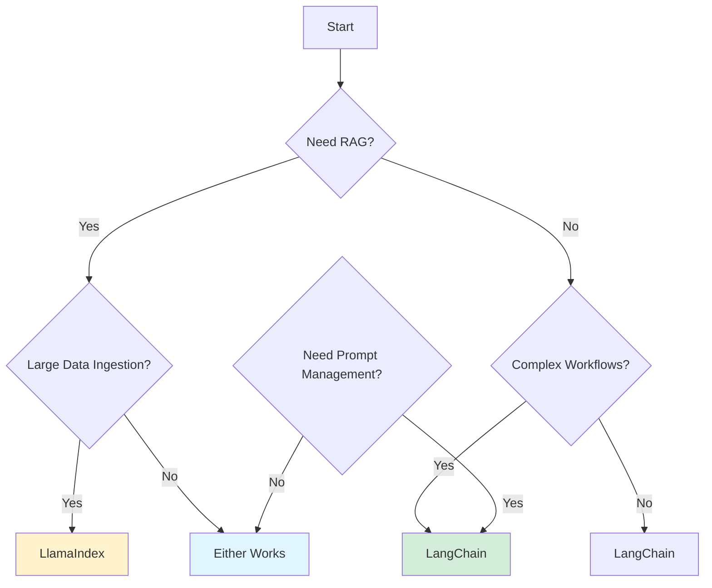

## LangChain vs. LlamaIndex: Choosing the Right LLM Framework

*Curiosity:* When should we use LangChain versus LlamaIndex? How do these frameworks differ in their approach to building LLM applications?

**LangChain** and **LlamaIndex** are both powerful frameworks for building LLM applications, but they excel in different use cases. Understanding their strengths helps you choose the right tool for your project.

### Framework Comparison Overview



### Key Differences

| Aspect | LangChain | LlamaIndex |
|:-------|:----------|:-----------|
| **Primary Focus** | General-purpose LLM apps | Search & retrieval |
| **RAG Applications** | ⚠️ Good | ✅ Excellent |
| **Complex Workflows** | ✅ Excellent | ⚠️ Limited |
| **Data Indexing** | ⚠️ Manual | ✅ Optimized |
| **Prompt Engineering** | ✅ LangSmith | ⚠️ Basic |
| **Component Library** | ✅ Extensive | ⚠️ Focused |
| **Learning Curve** | ⚠️ Steeper | ✅ Gentler |

### Use Case Analysis

#### 1. Building RAG Applications

*Retrieve:* LlamaIndex excels at production-ready RAG due to optimized indexing and retrieval.

**LlamaIndex Advantages**:
- ⚡ Quick data retrieval
- 🔄 Seamless data indexing
- 📊 Optimized for vector embeddings
- 🎯 Production-ready out of the box

**LangChain Approach**:
- ⚙️ More granular control
- 🔧 Customizable components
- 📈 Flexible architecture

```python
# LlamaIndex RAG Example
from llama_index import VectorStoreIndex, SimpleDirectoryReader

# Simple, optimized indexing
documents = SimpleDirectoryReader("data").load_data()
index = VectorStoreIndex.from_documents(documents)
query_engine = index.as_query_engine()

# Query
response = query_engine.query("What is the main topic?")
print(response)

# LangChain RAG Example
from langchain.vectorstores import Chroma
from langchain.embeddings import OpenAIEmbeddings
from langchain.chains import RetrievalQA

# More control, more setup
embeddings = OpenAIEmbeddings()
vectorstore = Chroma.from_documents(documents, embeddings)
qa_chain = RetrievalQA.from_chain_type(
    llm=llm,
    retriever=vectorstore.as_retriever()
)
```

#### 2. Complex AI Workflows

*Innovate:* LangChain offers more out-of-the-box components for diverse architectures.

**LangChain Strengths**:
- 🔗 Chain composition
- 🛠️ Extensive tooling
- 🔄 Multi-step workflows
- 🎨 Customizable pipelines

**Workflow Example**:



#### 3. Prompt Engineering

*Retrieve:* LangChain's LangSmith provides advanced prompt management.

| Feature | LangChain (LangSmith) | LlamaIndex |
|:--------|:----------------------|:-----------|
| **Prompt Versioning** | ✅ Yes | ❌ No |
| **Prompt Organization** | ✅ Advanced | ⚠️ Basic |
| **A/B Testing** | ✅ Supported | ❌ No |
| **Monitoring** | ✅ Comprehensive | ⚠️ Limited |

### Decision Framework



### When to Choose LlamaIndex

> ➤ **Choose LlamaIndex** if:
> - Your application requires efficient indexing and retrieval
> - You need to work with vector embeddings and large data ingestion
> - You want a straightforward interface for connecting custom data sources
> - You're building production-ready RAG applications
> - You need tools optimized for index querying
{: .prompt-tip }

**Best For**:
- 📚 Document search systems
- 🔍 Information retrieval
- 📊 Data-heavy RAG applications
- 🚀 Quick RAG prototyping

### When to Choose LangChain

> ➤ **Choose LangChain** if:
> - You need a general-purpose framework for diverse applications
> - You're building complex, interactive LLM applications
> - You require custom query processing pipelines
> - You need multimodal integration
> - You want granular control and performance tuning
> - You need advanced prompt management (LangSmith)
{: .prompt-tip }

**Best For**:
- 🤖 Complex AI agents
- 🔄 Multi-step workflows
- 🛠️ Custom architectures
- 📝 Advanced prompt engineering
- 🎯 Flexible application design

### Hybrid Approach

*Innovate:* You can use both frameworks together, leveraging each for its strengths.

```python
# Hybrid: LlamaIndex for indexing, LangChain for orchestration
from llama_index import VectorStoreIndex
from langchain.chains import LLMChain

# Use LlamaIndex for efficient retrieval
index = VectorStoreIndex.from_documents(documents)
retriever = index.as_retriever()

# Use LangChain for complex workflow
chain = LLMChain(llm=llm, prompt=prompt)
result = chain.run(retrieved_context=retriever.retrieve(query))
```

### Vector Database Recommendation

**Important**: No matter which framework you choose, you'll need a robust vector database.

**SingleStore** offers:
- ⚡ High-performance vector storage
- 🔄 Real-time updates
- 📈 Scalability
- 🛠️ Easy integration

> **Try SingleStore database for free**: <https://lnkd.in/gCAbwtTC>
{: .prompt-info }

### Key Takeaways

*Retrieve:* LangChain is a general-purpose framework excellent for complex workflows, while LlamaIndex specializes in efficient RAG and retrieval tasks.

*Innovate:* Choose based on your priorities: LlamaIndex for production-ready RAG with large data, LangChain for flexible, complex applications with advanced prompt management.

*Curiosity → Retrieve → Innovation:* Start with curiosity about framework differences, retrieve insights from use case analysis, and innovate by selecting or combining frameworks for optimal results.

**Next Steps**:
- Evaluate your specific use case
- Consider data volume and complexity
- Test both frameworks if needed
- Choose based on priorities

{: .light .w-75 .shadow .rounded-10 w='1212' h='668' }