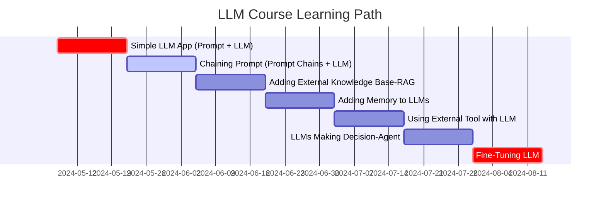

> - 👉 Github : <https://github.com/akillness/LLM_Course>
- 👉 Survey : <https://akillness.github.io/posts/llm-2024-survey/>
<!-- - 👉 History : <https://modulabs.co.kr/blog/llama-3-intro/> -->
{: .prompt-info }

## LLM Course: Step-by-Step Guide to Building LLM Apps

*Curiosity:* How do we progress from simple LLM apps to advanced agent systems? What's the learning path from basic prompts to fine-tuning?

**This course** provides a step-by-step guide to building LLM applications from basic to advanced components, covering everything from simple prompts to fine-tuning.

> **Resources**:
> - **My GitHub**: <https://github.com/akillness/LLM_Course>
> - **Other Course**: <https://github.com/mlabonne/llm-course>
> - **LLM Survey**: <https://akillness.github.io/posts/llm-2024-survey/>
{: .prompt-info}

### Learning Roadmap

*Retrieve:* Complete LLM application development path.

### Course Structure

*Innovate:* Seven-step progression from basics to advanced.

| Step | Topic | Description | Duration |
|:-----|:------|:-------------|:---------|
| **1** | **Simple LLM App** | Prompt + LLM | 2 weeks |
| **2** | **Chaining Prompt** | Prompt Chains + LLM | 2 weeks |
| **3** | **RAG** | External Knowledge Base | 2 weeks |
| **4** | **Memory** | Adding Memory to LLMs | 2 weeks |
| **5** | **Tool Use** | External Tools with LLM | 2 weeks |
| **6** | **Agents** | LLMs Making Decisions | 2 weeks |
| **7** | **Fine-Tuning** | Model Fine-Tuning | 2 weeks |

### Step-by-Step Breakdown

*Retrieve:* Detailed course content.

#### Step 1: Simple LLM App (Prompt + LLM)

**Foundation**: Basic LLM interaction with prompts.

**Learning Goals**:
- Understand LLM basics
- Create simple prompts
- Generate responses

#### Step 2: Chaining Prompt (Prompt Chains + LLM)

**Progression**: Connect multiple prompts for complex workflows.

**Learning Goals**:
- Build prompt chains
- Create multi-step workflows
- Chain LLM calls

#### Step 3: RAG (Retrieval Augmented Generation)

**Enhancement**: Add external knowledge base.

**Key Concept**: `A method that first retrieves the information needed for an answer and passes it to the LLM along with the question`

**Benefits**:
- Answer based on specific documents
- Use service database information
- Ground responses in knowledge

{: .light .w-75 .shadow .rounded-10 w='1212' h='668' }

#### Step 4: Adding Memory to LLMs

**Capability**: Enable conversation context.

**Learning Goals**:
- Implement conversation memory
- Maintain context across turns
- Build conversational systems

#### Step 5: Using External Tool with LLM

**Extension**: Connect LLMs to external tools.

**Learning Goals**:
- Integrate APIs
- Use external services
- Extend LLM capabilities

#### Step 6: LLMs Making Decision (Agent)

**Advanced**: Autonomous decision-making systems.

**Key Concepts**:
- Agents extend conversational LLMs with tools, code, embeddings, vector stores
- Agents add additional steps beyond RAG
- Useful for domain specialization and output customization

**Learning Goals**:
- Build autonomous agents
- Implement decision-making
- Create specialized systems

#### Step 7: Fine-Tuning LLM

**Mastery**: Customize models for specific tasks.

**Learning Goals**:
- Fine-tune models
- Optimize for tasks
- Deploy custom models

### Key Takeaways

*Retrieve:* This course provides a systematic 14-week path from simple LLM apps to fine-tuning, covering prompts, RAG, memory, tools, agents, and model customization.

*Innovate:* By following this structured learning path, you can progress from basic LLM interactions to building sophisticated agent systems and fine-tuned models, mastering the full spectrum of LLM application development.

*Curiosity → Retrieve → Innovation:* Start with curiosity about LLM applications, retrieve insights from this structured course, and innovate by building progressively more advanced LLM systems that solve real-world problems.

**Next Steps**:
- Start with Step 1
- Follow the roadmap
- Build projects at each step
- Progress to advanced topics

* * *

> **Understand the overall structure of the project**
- Verba :: <https://github.com/weaviate/Verba?tab=readme-ov-file>
{: .prompt-warning }

## [Workflow for Concept](https://www.itworld.co.kr/news/337110#csidxd1ed0d605ed5c97bde855d08d70d63d )

 How to consist of LLM 

## Model Selection
- Since LLMs improve almost daily, it is best not to be locked into a model that can quickly fall behind or become outdated. To address this, select at least two models from different vendors.
- Ongoing inference costs must also be considered. Choosing a service-based model means paying per inference, which is cheaper when traffic is low. Choosing a platform-based model incurs a fixed monthly cost for VMs provisioned to handle traffic.
- There are currently only a few strictly open-source generative AI models with good quality, including Meta's Llama models.

## Prompt Engineering
- Prompt engineering is the easiest and fastest way to customize an LLM.
- The same applies to OpenAI's most important recommendation for prompt engineering: "write clear instructions." However, the specific tactics to achieve this may not always be obvious.

### Prompt Engineering Pointers
- You may need to instruct the model repeatedly until it provides an answer of the desired length, and explicitly instruct it to base responses on facts and not add information arbitrarily. 
  - One useful prompt for this (though it doesn't always work) is: "If you don't have enough information to answer, say so."
- Providing prompt/response pairs is almost always helpful.

### System Messages
- System message guide (filter) example 
  - You are a Shakespeare writing assistant who speaks in the style of Shakespeare. 
  - You help people create creative ideas and content such as stories, poems, and songs using the writing style of William Shakespeare, including archaic words.
- Even if abusive language is requested, the built-in filters in the model (or platform) attempt to produce polite language rather than profanity, even within the Shakespearean style.

### Using Documents in Prompts
- Another useful strategy is to provide a document as part of the prompt and ask the model to write its answer based on that document. Some models can retrieve web pages from a document URL, while others require you to provide the text. You must clearly separate the instructions to the model from the text of the document you want the model to use, and for summarization and entity extraction tasks, specify that the response must rely solely on the provided text.
- Providing documents generally works well when documents are short, but when a document is longer than the model's context window, the later portions of the document are not read. 
  - This is why generative AI model developers continuously increase the model's context window. 
- Gemini 1.5 Pro offers a context window of up to 1 million tokens to select users in Google Vertex AI Studio. 
  - However, the context window available to general users is "only" 128,000 tokens. As mentioned later, one way to work around context window limitations is to use RAG.
- When asking an LLM to summarize a long document (not long enough to exceed the context window), the LLM sometimes adds content it considers "factual" from other sources. 
  - Asking the model to compress rather than summarize the document usually results in compliance without added content.

### Using Chain of Density Prompting
- Another way to improve summarization is to use the [Chain-of-Density (CoD) prompting](https://arxiv.org/pdf/2309.04269) technique proposed in 2023 by a Columbia, Salesforce, and MIT team specifically for GPT-4 (paper). 
  - [KDnuggets article](https://www.kdnuggets.com/unlocking-gpt-4-summarization-with-chain-of-density-prompting)
  - *Retrieve:* Exploring this resource for insights — the article reorganizes the prompts from this paper in a more understandable way and adds supplementary explanations. It is recommended to read both the paper and the article.
- In brief, the CoD prompt asks the model to summarize the source document five times iteratively, increasing information density at each step. 
- According to the paper, people generally prefer the third of the five summaries. Note that the prompt from the paper designed for GPT-4 may not work properly or at all with other models.

### Using Chain-of-Thought Prompting
- The Chain-of-Thought prompting technique from 2022 (paper) asks LLMs to use a series of intermediate reasoning steps, "significantly improving the ability of large language models to perform complex reasoning." 
  - For example, Chain-of-Thought prompting excels at arithmetic word problems at an elementary school level that LLMs otherwise struggle to solve correctly.
- In the paper, the authors integrated chain-of-thought sequence examples into few-shot prompts. 
  - The Amazon Bedrock example for chain-of-thought prompting elicits multi-step reasoning from the Llama 2 Chat 13B and 70B models through the system instruction "You are a highly intelligent bot with exceptional critical thinking skills" and the user instruction "Let's think step by step."

### Using Skeleton-of-Thought Prompting
- Skeleton-of-Thought prompting (paper) was introduced in 2023 as a method to reduce LLM latency by "first guiding the LLM to generate a skeleton of the response, then performing parallel API calls or batch decoding to complete the content of each skeleton point in parallel." 
- The code [repository](https://github.com/imagination-research/sot?tab=readme-ov-file) associated with this paper recommends using the variant SoT-R (including a RoBERTa router) and calling LLMs (GPT-4, GPT-3.5, or Claude) from Python.
- Prompt engineering can ultimately be performed by the model itself. Research has already been conducted on this topic. The key is to provide quantitative success metrics that the model can use. 

## Hyperparameter Settings
- Hyperparameter tuning is as important in LLM prompting as it is in machine learning model training. 
- Common types of hyperparameters important in LLM prompting:
  - Temperature, context window, maximum token count, stop sequences (may vary by model)
- Temperature controls the randomness of output. Depending on the model, the temperature range is 0–1 or 0–2. A higher temperature value requests greater randomness. 
  - A value of 0 can mean "set temperature automatically" or "no randomness," depending on the model.
- The context window controls the number of preceding tokens (words or sub-words) the model considers when generating a response. 
- The maximum token count limits the length of the generated response. 
- Stop sequences are used to suppress offensive or inappropriate content in the output.

## Retrieval Augmented Generation
- Retrieval Augmented Generation (RAG) is useful for grounding LLMs to specific sources.
  - The 3 stages of RAG
    - Retrieving from designated sources
    - Augmenting the prompt with context retrieved from sources
    - Generating using the model and the augmented prompt
- The RAG procedure often uses embeddings to limit length and improve the relevance of retrieved context. 
  - Essentially, the embedding function takes a word or phrase and maps it to a vector of floating-point numbers. 
  - This is typically stored in a database that supports vector search indexes.
- The retrieval stage typically uses semantic similarity search — using the cosine of the angle between the embedding of the query and stored vectors — to find "neighboring" information to use in the augmented prompt. 
  - Search engines also typically use this same method to find answers.

## Agents
- Agents (conversational search agents) further extend the concept of conversational LLMs by combining tools, executable code, embeddings, and vector stores. 
- Agents are often useful for specializing LLMs into specific domains and customizing LLM output. 
  - Azure Copilot is generally an agent. 
  - Google and Amazon use the term "agents," and LangChain and LangSmith simplify the construction of RAG pipelines and agents.

## Model Fine-Tuning
- Large language model (LLM) fine-tuning is a supervised learning process that adjusts the model's parameters to suit a specific task. 
  - Fine-tuning trains the model on a smaller, task-specific dataset labeled with examples relevant to the target task.
- LoRA (Low-Rank Adaptation) is a method that decomposes a weight matrix into two smaller weight matrices.
  - It is close to full supervised fine-tuning but with greater parameter efficiency. 
  - Microsoft's first LoRA paper was published in 2021. QLoRA, a quantized variant of LoRA released in 2023, reduced the amount of GPU memory required for the tuning process. 
     - In general, LoRA and QLoRA reduce the number of labeled examples and time required compared to standard fine-tuning.

## Continued Model Pre-Training
- Pre-training is an unsupervised learning process on a vast text dataset that teaches the LLM the fundamentals of language and creates a general base model. 
- Extended or continued pre-training adds unlabeled domain-specific or task-specific datasets to this base model to specialize it — for example, by adding languages, adding terminology for specialized fields such as medicine, or adding code generation capabilities. 
- Continued pre-training (using unsupervised learning) is usually followed by fine-tuning (using supervised learning).

 How to consist of LLM for application 

The emergence of large language models (LLMs) has created a need to chain inference queries to build longer, more complex applications.

This allows resolving more complex user queries through a sequence of events, or managing multiple conversation turns when users want longer interactions.
As a result, various flow engineering applications have been developed to accommodate prompt chaining.

{: .light .w-75 .shadow .rounded-10 w='1212' h='668' }

## Chains

Prompt chaining is a technique used in prompt-based AI systems where one prompt sequentially generates or influences other prompts to achieve a specific outcome or task. It is essentially a method of linking multiple prompts to guide an AI model toward a desired response or behavior.

Some nodes in a chain can request user input at specific points, allowing it to function as an interactive UI.

For example, in the context of language generation, an initial prompt can be used to introduce a topic or scenario. The response generated by the model can then be fed back as the next prompt to further develop the conversation or refine the output.

It should be noted that this process consists of a hardcoded sequence of events with decision points. This approach resembles a state machine.

## Agents

In some ways it may seem overlooked at present, but autonomous AI agents represent an important advancement in technology.

Agents are equipped with artificial intelligence and have the following capabilities:
- Operate independently
- Make decisions
- Act without continuous human intervention
In the future, autonomous AI agents will revolutionize various industries including healthcare, finance, manufacturing, and transportation. However, there are considerations related to accountability, transparency, ethics, and responsibility in decision-making.

Despite these challenges, the future offered by autonomous AI agents holds enormous potential. As technology continues to advance, these agents will become increasingly integrated into our daily lives.

Unlocking GPT-4 Summarization with Chain of Density Prompting - KDnuggets

> Lilys AI : <https://lilys.ai/digest/684251>
{: .prompt-tip }

### 1. Information Density Control with the New CoD Technique for GPT-4 Summarization
   - Chain of Density (CoD) is a new prompt engineering technique for optimizing summarization tasks in large language models such as GPT-4.
   - This technique controls the information density of generated summaries, providing a balanced output that is neither too sparse nor too dense.
   - CoD has practical impact in the field of data science, playing an important role especially in tasks that require high-quality, contextually appropriate summaries.
   - Choosing the "right" amount of information to include in a summary is a challenging task.

### 2. The Importance of Prompting Engines for AI Advancement
   - Existing engines such as Chain-of-Thought and Skeleton-of-Thought have focused on *structured* and *efficient results*.
   - The recent Chain of Density (CoD) technique was developed to optimize the quality of text summarization.
   - This technique addresses the challenge of selecting the "appropriate" amount of information for a summary, ensuring it is neither too sparse nor too dense.

### 3. Understanding the Chain of Density
   - The Chain of Density was designed to enhance the summarization capabilities of large language models like GPT-4.
   - It focuses on controlling the information density of generated summaries.
   - Well-balanced summaries are important for understanding complex content, and the Chain of Density aims to achieve this balance.
   - The Chain of Density uses specialized prompts to guide the AI model to include essential points and avoid unnecessary details.
   - Figure 1: Chain of Density process with examples (Source: [Sparse to Dense: GPT-4 Summarization with Chain of Density Prompting](https://arxiv.org/abs/2309.04269)) (click to enlarge)

### 4. Executing the Chain of Density
   - To execute CoD, a series of linked prompts is used. These prompts are designed to guide the model through the summarization process.
   - These prompts control the model's focus, guiding it to concentrate on important information and steer away from irrelevant details.
   - For example, you can start with a general prompt for summarization, followed by specific prompts to adjust the density of the generated text.

### 5. Steps in the Density Promotion Process
   - Text Identification: Select the document, article, or text you want to summarize.
   - Initial Prompt Writing: Write an *initial summarization prompt* appropriate for the selected text.
   - Initial Summary Analysis: Review the summary generated by the initial prompt and check whether it is too sparse or contains unnecessary details.
   - Chained Prompt Design: Based on the density of the initial summary, write additional prompts to adjust the summary's details. These are the 'chained prompts' and are central to the Chain of Density technique.
   - Chained Prompt Execution: Feed these chained prompts back into the LLM. These prompts are designed to increase density by adding essential details or reduce density by removing non-essential information.
   - Adjusted Summary Review: Review the new summary generated by executing the chained prompts. Verify that it captures all essential points and avoids unnecessary details.
   - Repeat if Necessary: If the summary still does not meet the desired information density criteria, return to step 4 and adjust the chained prompts.
   - Final Summary Completion: When the summary meets the desired information density level, it is considered complete and ready to use.

### 6. Recommendations for the Summary Chain of Density
   - Write a new, denser overview by adding missing entities while keeping the summary the same length.
   - Rewrite the summary by improving on the previous summary and making room for additional entities.
   - Restructure sentences to effectively convey important information and make room for entities from the previous summary.
   - Write a new, dense summary that includes all entities, ensuring sentences are self-contained and concise.
   - Make the summary dense and concise by reducing grandiose language and unnecessary phrases.

### 7. Conclusion
  - Chain of Density (CoD) is a new prompt engineering technique that improves text summarization tasks.
  - CoD allows you to control the information density of summaries, helping to generate high-quality summaries that concisely capture important content.
  - Incorporating this technique into your projects allows you to fully leverage the powerful summarization capabilities of the latest language models.

## Trial & Error

 Streamlit & Code spaces 

* * * 

## Trial : Simple LLM built with Streamlit ( model : gpt-3.5-turbo )

> Testing complete
{: .prompt-info }

* * * 

- github : <https://github.com/streamlit/llm-examples>
  - Once you understand the above, try this too 
    - github : [pathwaycom/llm-app: LLM App templates for RAG, knowledge mining, and stream analytics. Ready to run with Docker,⚡in sync with your data sources.](https://github.com/pathwaycom/llm-app)
- Regarding the OpenAPI API key, GPT-3.5 is free via the web, but to use the API you need to register a credit card or create a new account to use it within the free tier. (The OpenAI API key policy is set up that way from the start!!)
- If you obtain a valid API key the above code should work fine (correct!), and it seems that using the above Chatbot to output unstructured data (input values) in a structured form for use is how Karrot (Daangn) applies it to features like community groups, recommendations, and real estate.
  - Billing: Confirmed chatbot works after $5 payment
{: .light .w-75 .shadow .rounded-10 w='1212' h='668' }

## Error

*Curiosity:* When using VSCode with the debugging system, I encountered the following error. Hmm, what is this? After looking it up, it turns out that the way Streamlit itself was being used was incorrect.

Error resolution: **[\[OpenAI\] Chatgpt error fix - openai.RateLimitError: Error code: 429 - {'error': {'message': 'You exceeded your current quota, please check your plan and billing details.](https://arc-viewpoint.tistory.com/entry/OpenAI-Chatgpt-%EC%97%90%EB%9F%AC-%ED%95%B4%EA%B2%B0-openaiRateLimitError-Error-code-429-error-message-You-exceeded-your-current-quota-please-check-your-plan-and-billing-details)**

### What is Streamlit?

* * * 

> Reference : [Python Streamlit Usage - Creating Prototypes](https://zzsza.github.io/mlops/2021/02/07/python-streamlit-dashboard/)

- - Description
  - Streamlit is an open-source Python framework to create custom web applications. It is specifically designed for machine learning and data science, but it is in no way limited to those use cases. The underlying Python code is executed server-side, and the resulting outputs rendered to the user. 
  - Streamlit is an open-source Python framework used to create custom web applications. It is specifically designed for machine learning and data science, but is not limited to those use cases. The underlying Python code is executed server-side, and the resulting outputs are rendered to the user.
  - Other
    - The fastest way to build a data application
    - A minimal framework for building apps
    - 13K GitHub Stars as of February 2021
- Benefits
  - Build apps simply with Python code
  - Provides interactive functionality (no need to implement backend development or HTTP requests)
  - Provides various examples
  - Community-developed Components also exist
  - Provides a system for deployment via Streamlit (application required)
  - Also provides a Record feature for screen recording
  - After building the app, click the ☰ button on the right to find "Record a screencast"

- Documentation : [Working with Streamlit's execution model](https://docs.streamlit.io/develop/concepts/architecture)

### What are Code Spaces?

* * * 

> Reference : [GitHub Codespaces Overview](https://docs.github.com/en/codespaces/overview)

{: .light .w-75 .shadow .rounded-10 w='1212' h='668' }
### Introduction
  - A codespace is a development environment hosted in the cloud. You can customize your project for GitHub Codespaces by committing a configuration file to the repository (often called Configuration-as-Code) that creates a repeatable codespace configuration for all users of the project. For more information, see "Introduction to dev containers."
  - Each codespace you create is hosted by GitHub in a Docker container running on a virtual machine. You can choose from virtual machine types ranging from 2 cores, 8GB RAM, and 32GB storage, up to 32 cores, 64GB RAM, and 128GB storage.
  - By default, codespace development environments are created from an Ubuntu Linux image with popular languages and tools, but you can use an image based on a Linux distribution of your choice and configure it for specific requirements. Codespaces run in a Linux environment regardless of your local operating system. Windows and macOS are not supported operating systems for remote development containers.
  - You can connect to your codespace from your browser, from Visual Studio Code, from the JetBrains Gateway application, or by using GitHub CLI. When you connect, you are placed within the Docker container. Access to the outer Linux virtual machine host is limited.

### Benefits of GitHub Codespaces

Reasons you might choose to work in a codespace include:

- Use a pre-configured development environment - Work in a development environment specifically configured for your repository. This includes all the tools, languages, and configurations needed to work on that project. Everyone who works on that repository in a codespace gets the same environment, which reduces the likelihood of hard-to-debug environment-related issues. Each repository may have settings that give contributors an immediately usable, purpose-built environment, while the environment on your local machine is not changed.
- Access the resources you need - Your local computer may not have enough processing power or storage space to work on your project. With GitHub Codespaces, you can work remotely on a machine with the appropriate resources.
- Work anywhere - All you need is a web browser. You can work on a codespace from your own computer, a friend's laptop, or a tablet. Open a codespace and resume work where you left off on a different device.
- Choose your editor - Work in the browser using the VS Code web client, or choose your preferred desktop-based application.
- Work on multiple projects - You can use multiple codespaces to work on separate projects or on different branches of the same repository, compartmentalizing your work to avoid accidentally affecting other tasks.
- Pair program with a teammate - If you work on a codespace in VS Code, you can use Live Share to work collaboratively with other members of your team. For more information, see "Collaborating in a codespace."
- Publish a web app from a codespace - Forward a port from your codespace and then share the URL to let teammates try out the changes you have made to the application before you submit them in a pull request.
- Try out a framework - GitHub Codespaces reduces setup time when you want to learn about a new framework. Simply create a codespace from one of the quickstart templates.

