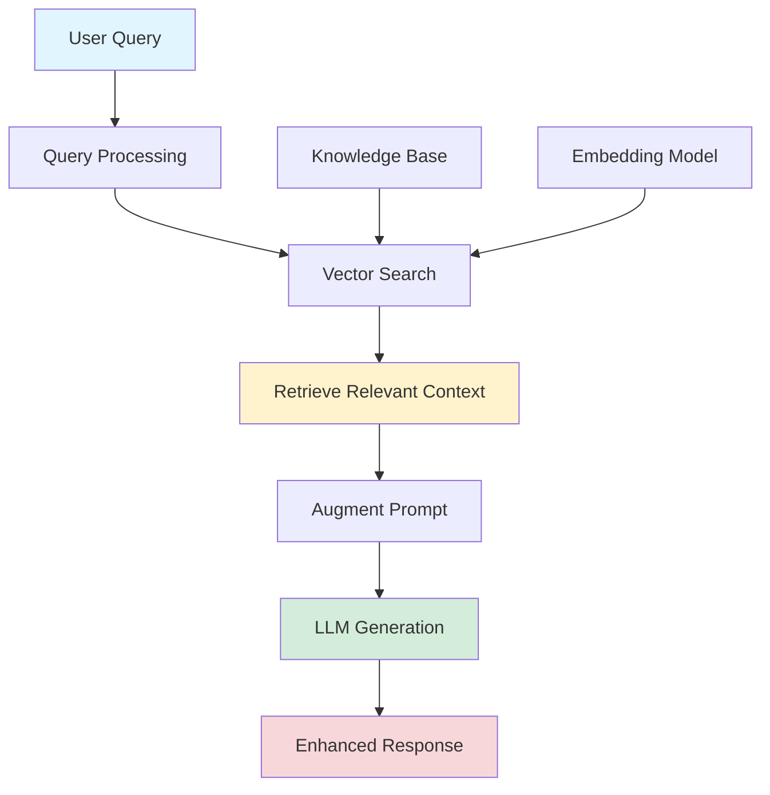

## RAG = Query + Prompt + Context + LLM

*Curiosity:* What is a RAG? How can we retrieve knowledge from external sources and augment LLM responses to create more accurate, context-aware answers?

**Retrieval-Augmented Generation (RAG)** is a powerful technique that combines the best of information retrieval and language generation. This simple equation captures the essence of RAG: **Query + Prompt + Context + LLM = Enhanced Response**.

### Understanding the RAG Equation



### RAG Components Breakdown

| Component | Purpose | Key Technologies |
|:----------|:--------|:-----------------|
| **Query** | User's information need | Natural language processing, query expansion |
| **Prompt** | Instructions for LLM | System prompts, few-shot examples, templates |
| **Context** | Retrieved relevant information | Vector databases, embedding models, similarity search |
| **LLM** | Text generation | GPT-4, Claude, Llama, Mistral |

### Core RAG Workflow

The RAG process consists of several critical steps:

#### 1. **Indexing Phase** (Offline)

```python
from langchain.text_splitter import RecursiveCharacterTextSplitter
from langchain.embeddings import OpenAIEmbeddings
from langchain.vectorstores import Chroma

# Step 1: Load documents
documents = load_documents("knowledge_base/")

# Step 2: Split into chunks
text_splitter = RecursiveCharacterTextSplitter(
    chunk_size=1000,
    chunk_overlap=200
)
chunks = text_splitter.split_documents(documents)

# Step 3: Create embeddings
embeddings = OpenAIEmbeddings()
vectorstore = Chroma.from_documents(
    documents=chunks,
    embedding=embeddings
)
```

#### 2. **Retrieval Phase** (Online)

```python
# Step 4: Retrieve relevant context
query = "What is RAG?"
retriever = vectorstore.as_retriever(search_kwargs={"k": 3})
relevant_docs = retriever.get_relevant_documents(query)
```

#### 3. **Augmentation Phase**

```python
# Step 5: Augment prompt with context
context = "\n\n".join([doc.page_content for doc in relevant_docs])
augmented_prompt = f"""Use the following context to answer the question.

Context:
{context}

Question: {query}

Answer:"""
```

#### 4. **Generation Phase**

```python
# Step 6: Generate response
from langchain.llms import OpenAI

llm = OpenAI(temperature=0)
response = llm(augmented_prompt)
print(response)
```

### Key Concepts in RAG

#### Indexing
- **Purpose**: Prepare knowledge base for efficient retrieval
- **Process**: Document loading → Chunking → Embedding → Storage
- **Tools**: LangChain, LlamaIndex, Haystack

#### Loading
- **Sources**: PDFs, web pages, databases, APIs
- **Formats**: Text, markdown, structured data
- **Considerations**: Data quality, format consistency

#### Splitting
- **Strategies**: Character-based, sentence-based, semantic
- **Chunk Size**: Balance between context and precision (typically 200-1000 tokens)
- **Overlap**: Maintain context continuity (typically 10-20% overlap)

#### Embedding
- **Models**: OpenAI `text-embedding-ada-002`, Sentence Transformers, Cohere
- **Dimensions**: 384, 768, 1536 (model-dependent)
- **Evaluation**: MTEB Leaderboard, domain-specific benchmarks

#### Storing
- **Vector Databases**: Pinecone, Weaviate, Chroma, Qdrant, SingleStore
- **Features**: Similarity search, filtering, metadata storage
- **Scalability**: Horizontal scaling, distributed search

#### Retrieval
- **Methods**: Dense retrieval, sparse retrieval, hybrid search
- **Metrics**: Cosine similarity, dot product, Euclidean distance
- **Optimization**: Re-ranking, query expansion, multi-query

#### Augmentation
- **Techniques**: Context injection, prompt engineering, few-shot examples
- **Best Practices**: Clear separation of context and query, structured prompts

#### Generation
- **Models**: GPT-4, Claude, Llama, Mistral
- **Parameters**: Temperature, max_tokens, top_p
- **Optimization**: Streaming, caching, parallel generation

### Advanced RAG Techniques

#### Multi-Query Retrieval

```python
from langchain.retrievers.multi_query import MultiQueryRetriever

# Generate multiple query variations
retriever = MultiQueryRetriever.from_llm(
    retriever=vectorstore.as_retriever(),
    llm=OpenAI()
)

# Retrieve diverse perspectives
docs = retriever.get_relevant_documents(query)
```

#### Contextual Compression

```python
from langchain.retrievers import ContextualCompressionRetriever
from langchain.retrievers.document_compressors import LLMChainExtractor

# Compress retrieved documents to most relevant parts
compressor = LLMChainExtractor.from_llm(OpenAI())
compression_retriever = ContextualCompressionRetriever(
    base_compressor=compressor,
    base_retriever=vectorstore.as_retriever()
)
```

### RAG vs. Fine-tuning Comparison

| Aspect | RAG | Fine-tuning |
|:-------|:----|:------------|
| **Knowledge Update** | ✅ Real-time | ❌ Requires retraining |
| **Source Attribution** | ✅ Yes | ❌ No |
| **Cost** | 💰 Lower (API calls) | 💰💰 Higher (training) |
| **Domain Adaptation** | ⚠️ Limited | ✅ Strong |
| **Hallucination** | ⚠️ Possible | ⚠️ Possible |
| **Best For** | Dynamic knowledge, citations | Style, format, domain expertise |

### Tools and Resources

| Tool | Purpose | Link |
|:-----|:--------|:-----|
| **SingleStore** | Vector database with SQL interface | [SingleStore](https://www.singlestore.com/) |
| **LlamaIndex** | Data framework for LLM applications | [LlamaIndex](https://www.llamaindex.ai/) |
| **Superlinked** | Vector database API | [Superlinked](https://www.superlinked.com/) |
| **MTEB Leaderboard** | Embedding model benchmarks | [Hugging Face MTEB](https://huggingface.co/spaces/mteb/leaderboard) |
| **LangChain** | LLM application framework | [LangChain](https://www.langchain.com/) |

### Webinar Information

On May 16th, Thursday, I gave a webinar covering these concepts in depth:



**Hosts**: Matt Brown, Akmal Chaudhri, Esq.

The webinar covered:
- Mathematical foundations of RAG
- Practical implementation examples
- Advanced techniques and optimizations
- Real-world use cases and best practices

**RSVP**: <https://by-hand.ai/rag>

### Key Takeaways

*Retrieve:* RAG enables LLMs to access up-to-date, domain-specific information without retraining.

*Innovate:* By combining retrieval and generation, we can build systems that are both knowledgeable and flexible.

*Curiosity → Retrieve → Innovation:* The RAG workflow embodies this cycle—curiosity drives the query, retrieval brings relevant knowledge, and innovation emerges from the augmented generation.

{: .light .w-75 .shadow .rounded-10 w='1212' h='668' }

<details markdown="1">
<summary style= "font-size:24px; line-height:24px; font-weight:bold; cursor:pointer;" > Translate to Korean </summary>

* * * 

RAG = 쿼리 + 프롬프트 + 컨텍스트 + LLM ~ RSVP 👉 <https://by-hand.ai/rag>

RAG란 무엇입니까? 이것은 RAG가 무엇인지에 대한 이해를 개념화하기 위해 생각해 낸 간단한 방정식입니다.

5월 16일 목요일에는 웨비나를 진행합니다.

### RAG 초보자 가이드 ###

제 RAG 방정식에 대한 설명을 듣고 싶으시면 웨비나에 참여하십시오. RSVP 링크는 위에 있습니다.

해시태그#rag 해시태그#vectordatabases 해시태그#aibyhand 

--개념--

RAG 방정식과 관련된 주요 개념을 다루겠습니다.

•인덱싱
•로드
•분할
•포함
•저장
•검색
•확대
•세대

시간이 허락한다면 다음과 같은 고급 기술에 대해 이야기 할 수 있습니다.

• 다중 쿼리
• 상황별 압축

--수학--

항상 그렇듯이 제 웨비나에서 수학을 기대해야 합니다. 그러나 수학은 재미있고, 접근하기 쉬우며, 유용할 것이라고 장담합니다.

--도구--

다음과 같은 다양한 유용한 도구에 대한 예를 포함하겠습니다.
SingleStore 
LlamaIndex 
Superlinked 의 API 
Hugging Face 의 MTEB 리더보드


</details>