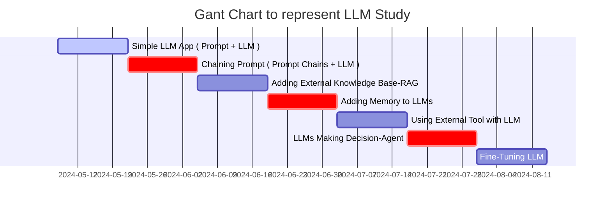

## Step-by-Step Guide to Building LLM Apps Basic to Advanced Components Created

* * * 

- Step.1
  - Simple LLM App ( Prompt + LLM )
    - Github : <https://github.com/lxe/simple-llm-finetuner>
      - 
- Step.2
  - Chaining Prompt ( Prompt Chains + LLM )
- Step.3
  - Adding External Knowledge Base : RAG ( Retrieval Augmented Generation)
    - `답변에 필요한 정보를 먼저 찾아서 LLM에게 질문과 함께 넘겨주는 방식`
    - 이를 통해 특정 문서나 서비스의 데이터베이스에 있는 정보에 기반해서 답변을 생성할 수 있다.
{: .light .w-75 .shadow .rounded-10 w='1212' h='668' }
- Step.4
  - Adding Memory to LLMs
- Step.5
  - Using External Tool with LLM
- Step.6
  - LLMs Making Decision : Agent
    - 에이전트는 툴, 실행 코드, 임베딩, 벡터 저장소의 조합을 통해 대화형 LLM의 개념을 확장한다. 즉, 에이전트는 RAG에 부가적인 단계를 더한 것
    - 에이전트는 LLM을 특정 도메인에 전문화하고 LLM의 출력을 맞춤 설정하는 데 유용한 경우가 많다. LLM과 다른 소프트웨어 및 서비스의 통합을 간소화하는 다양한 플랫폼, 프레임워크, 모델이 있다.
- Step.7
  - Fine-Tuning LLM

* * *

> **전체적으로 구성된 프로젝트 구조 파악 해보기**
- Verba :: <https://github.com/weaviate/Verba?tab=readme-ov-file>
{: .prompt-warning }

## [흐름 정리](https://www.itworld.co.kr/news/337110#csidxd1ed0d605ed5c97bde855d08d70d63d )

 How to concern for LLM 

## 모델 선택
- LLM은 거의 매일 개선되므로 금방 뒤쳐지거나 구식이 될 수 있는 모델에 묶이지 않는 것이 좋다. 이 문제에 대처하려면 서로 다른 벤더에서 두 개 이상의 모델을 선택해야 한다
- 지속적인 추론 비용도 고려해야 한다. 서비스로 제공되는 모델을 선택하면 추론별로 비용을 지불하게 되므로 트래픽이 낮을 경우 비용이 덜 든다. 플랫폼형 모델을 선택하는 경우 트래픽을 처리하기 위해 프로비저닝하는 VM에 대해 월 고정비가 지출된다.
- 현재 엄격한 오픈소스이면서 좋은 생성형 AI 모델은 메타 라마(Llama) 모델을 포함해 소수

## 프롬프트 엔지니어링
- 프롬프트 엔지니어링은 LLM을 맞춤 설정하는 가장 쉽고 빠른 방법이다.
- 오픈AI가 프롬프트 엔지니어링을 위해 가장 중요하게 제안하는 "명확한 지침을 쓸 것"도 마찬가지다. 그러나 세부적인 전술은 이처럼 분명하지 않을 수 있다.

### 프롬프트 엔지니어링 포인터
- 모델이 원하는 길이의 답을 제공할 때까지 반복적으로 지시하고, 사실에 근거하고 멋대로 덧붙이지 말도록 명시적으로 지시해야 할 수 있다. 
  - 이를 위한 유용한 프롬프트 중 하나는(항상 통하지는 않지만) "정보가 부족해서 답할 수 없다면 그렇다고 말 해"라는 것이다.
- 프롬프트/응답 쌍으로 제공하는 경우 거의 항상 도움이 된다.

### 시스템 메시지
- 시스템 메시지 가이드(필터) 예제 
  - 너는 셰익스피어 스타일로 말하는 셰익스피어 작문 도우미다. 
  - 너는 사람들이 옛 단어를 포함한 윌리엄 셰익스피어의 글쓰기 스타일을 사용하여 이야기, 시, 노래와 같은 창의적인 아이디어와 콘텐츠를 제작하는 데 도움을 준다.
- 폭언을 요청한다 해도 모델(또는 플랫폼)에 내장된 필터가 셰익스피어의 스타일 중에서도 거친 욕보다는 좋은 말투를 생산하려 시도하기 때문.

### 프롬프트에 문서 사용하기
- 또 다른 유용한 전략은 문서를 프롬프트의 일부로 제공하고 모델에 그 문서를 근거로 답을 작성하도록 요청하는 것이다. 일부 모델은 문서의 URL에서 웹 페이지를 조회할 수 있고, 일부는 텍스트를 제공할 것을 요구한다. 모델에 대한 지침과 모델이 사용하도록 하려는 문서의 텍스트를 명확하게 구분해야 하며, 요약과 개체 추출 작업의 경우 응답이 제공된 텍스트에만 의존해야 함을 명시해야 한다.
- 문서를 제공하는 방법은 문서가 짧을 때는 대체로 잘 작동하지만 문서가 모델의 컨텍스트 윈도우보다 긴 경우 문서의 뒷부분이 읽히지 않는다. 
  - 생성형 AI 모델 개발자들이 모델의 컨텍스트 윈도우를 계속해서 늘리고 있는 이유다. 
- 제미나이(Gemini) 1.5 프로는 구글 버텍스 AI 스튜디오(Vertex AI Studio)에서 일부 선별된 사용자에게 최대 100만 토큰의 컨텍스트 윈도우를 제공한다. 
  - 다만 일반 사용자에게 제공되는 컨텍스트 윈도우는 12만 8,000 토큰에 "불과"하다. 나중에 다시 언급하겠지만 컨텍스트 윈도우 제한을 우회하는 방법 중 하나는 RAG를 사용하는 것이다.
- LLM에 긴 문서의(컨텍스트 윈도우를 초과할 정도로 길지는 않음) 요약을 요청하면 LLM이 다른 소스에서 가져온, "사실"이라고 생각하는 내용을 추가하는 경우가 간혹 있다. 
  - 요약이 아닌 문서를 압축하도록 요청하면 대부분 내용 추가 없이 요청에 응한다.

### 밀도의 사슬 프롬프트 사용
- 요약을 개선하는 또 다른 방법은 컬럼비아, 세일즈포스, MIT 팀이 2023년에 [GPT-4 전용으로 제안한 밀도의 사슬(CoD: Chain-of-Density) 프롬프트](https://arxiv.org/pdf/2309.04269)를 사용하는 것이다(논문). 
  - [KD너겟(KDnuggets)기사](https://www.kdnuggets.com/unlocking-gpt-4-summarization-with-chain-of-density-prompting)는 이 논문의 프롬프트를 더 알기 쉽게 정리하고 부가적인 설명을 더했다. 논문과 기사 모두 읽어볼 것을 권한다.
- 간단히 요약하면 CoD 프롬프트는 모델에 기본 문서의 요약을 5번 반복하면서 각 단계에서 정보 밀도를 높이도록 요청한다. 
- 논문에 따르면 사람들은 대체로 5번의 요약 중에서 세 번째를 가장 좋아한다. 참고로 논문에서 GPT-4용으로 나온 프롬프트는 다른 모델에서는 제대로 작동하지 않거나 아예 작동하지 않을 수 있다.

### 생각의 사슬 프롬프트 사용
- 2022년에 나온 생각의 사슬(Chain-of-Thought) 프롬프트(논문)는 LLM에 일련의 중간 추론 단계를 사용하도록 요청하는 방식으로 "대규모 언어 모델의 복잡한 추론 수행 능력을 대폭 개선"한다. 
  - 예를 들어 생각의 사슬 프롬프팅는 초등학교 수준의 수학이지만 LLM이 제대로 푸는 데 어려움을 겪는 산술 단어 문제를 잘 푼다.
- 논문에서 저자들은 생각의 사슬 시퀀스 예제를 퓨샷 프롬프트에 통합했다. 
  - 생각의 사슬 프롬프팅을 위한 아마존 베드록 예제는 "너는 탁월한 비판적 사고 능력을 가진 매우 지능적인 봇"이라는 시스템 지침과 "단계별로 생각해 보자"는 사용자 지침을 통해 라마 2 챗 13B와 70B 모델에서 다단계 추론을 이끌어낸다.

### 생각의 뼈대 프롬프트 사용
- 생각의 뼈대(Skeleton-of-thought) 프롬프트(논문)는 2023년에 제시됐으며, "먼저 응답의 뼈대를 생성하도록 LLM을 이끈 다음 병렬 API 호출 또는 일괄 디코딩을 수행해서 각 뼈대 포인트의 콘텐츠를 병렬로 완성"하는 방식으로 LLM의 지연을 줄이는 방법이다. 
- 이 논문과 관련된 코드 [리포지토리](https://github.com/imagination-research/sot?tab=readme-ov-file)에서 권장하는 방법은 변형인 SoT-R을 사용하고(RoBERTa 라우터 포함), 파이썬에서 LLM(GPT4, GPT-3.5 또는 클로드)을 호출하는 것이다.
- 프롬프트 엔지니어링은 궁극적으로는 모델 자체에 의해 수행될 수 있다. 이미 이와 관련된 연구도 진행된 바 있다. 핵심은 모델이 사용할 수 있는 정량적 성공 지표를 제공하는 것이다. 

## 초 매개변수 설정
- 초매개변수 조정은 머신러닝 모델 학습 못지않게 LLM 프롬프트에서도 중요하다. 
- LLM 프롬프트에서 일반적으로 중요한 초매개변수 타입 :
  - 온도, 컨텍스트 윈도우, 최대 토큰 수, 중지 시퀀스 ( 모델마다 다를 수 있음 )
- 온도는 출력의 무작위성을 제어한다. 모델에 따라 온도 범위는 0~1 또는 0~2다. 온도 값이 높을수록 더 높은 무작위성을 요청한다. 
  - 0은 모델에 따라 "온도를 자동으로 설정"하라는 의미인 경우도 있고, "무작위성 없음"을 의미하는 경우도 있다.
- 컨텍스트 윈도우는 모델이 답변을 위해 고려하는 선행 토큰(단어 또는 하위 단어)의 수를 제어한다. 
- 최대 토큰 수는 생성된 답변의 길이를 제한한다. 
- 중지 시퀀스는 출력에서 모욕적이거나 부적절한 콘텐츠를 억제하는 데 사용된다.

## 검색 증강 생성
- 검색 증강 생성(RAG)은 LLM을 특정 소스에 그라운딩하는 데 유용하다.
  - RAG의 3단계
    - 지정된 소스에서 검색하기
    - 소스에서 검색한 컨텍스트로 프롬프트 증강하기
    - 모델과 증강된 프롬프트를 사용하여 생성하기
- RAG 절차는 임베딩을 사용해서 길이를 제한하고 검색된 컨텍스트의 관련성을 개선하는 경우가 많다. 
  - 기본적으로 임베딩 기능은 단어 또는 구를 가져와 이를 부동소수점 숫자의 벡터에 매핑한다. 
  - 이는 일반적으로 벡터 검색 인덱스를 지원하는 데이터베이스에 저장된다.
- 검색 단계에서는 일반적으로 질의의 임베딩과 저장된 벡터 사이 각도의 코사인을 사용하는 의미론적 유사성 검색을 사용해서 증강된 프롬프트에 사용할 "인접한" 정보를 찾는다. 
  - 검색 엔진도 보통 이와 동일한 방법을 사용해 답을 찾는다.

## 에이전트
- 에이전트(대화형 검색 에이전트)는 툴과 실행 코드, 임베딩, 벡터 저장소의 조합으로 대화형 LLM의 개념을 더 확장한다. 
- 에이전트는 특정 도메인으로 LLM을 전문화하고 LLM의 출력을 맞춤 설정하는 데 유용한 경우가 많다. 
  - 애저 코파일럿은 일반적으로 에이전트다. 
  - 구글과 아마존은 "에이전트"라는 용어를 사용하며, 랭체인(LangChain)과 랭스미스(LangSmith)는 RAG 파이프라인과 에이전트 구축을 간소화한다.

## 모델 미세조정
- 대규모 언어 모델(LLM) 미세 조정은 특정 작업에 맞게 모델의 매개변수를 조절하는 지도 학습 프로세스다. 
  - 미세 조정에서는 대상 작업과 관련된 예제로 레이블이 지정된 더 작은 작업별 데이터 집합을 사용해 모델을 학습시킨다.
- LoRA(Low-Rank-Adaptation)는 가중치 행렬을 두 개의 더 작은 가중치 행렬로 분해하는 방법
  -  전체 감독 미세 조정에 가깝지만 매개변수 효율성이 더 높음. 
  -  마이크로소프트의 첫 LoRA 논문은 2021년에 발표됐다. 2023년에 나온 LoRA의 양자화된 변형인 QLoRA는 조정 프로세스에 필요한 GPU 메모리의 양을 줄였다. 
     -  일반적으로 LoRA와 QLoRA는 표준 미세 조정에 비해 태그가 지정된 예제의 수와 필요한 시간을 줄여준다.

## 지속적인 모델 사전 학습
- 사전 학습은 방대한 텍스트 데이터 집합에 대한 비지도 학습 프로세스로, LLM에 언어의 기본 사항을 가르치고 일반적인 기본 모델을 생성한다. 
- 확장 또는 지속적인 사전 학습은 레이블이 지정되지 않은 도메인별 또는 작업별 데이터 집합을 이 기본 모델에 추가해서 예를 들어 언어를 추가하고 의학과 같은 전문 분야를 위한 용어를 추가하거나 코드 생성 기능을 추가하는 등 모델을 전문화한다. 
- 지속적인 사전 학습(비지도 학습 사동) 뒤에는 보통 미세 조정(지도 학습 사용)이 실행된다.

## Streamlit 으로 제작된 Simple LLM ( model : gpt-3.5-turbo ) 테스트

> 테스트완료
{: .prompt-info }

* * * 

- github : <https://github.com/streamlit/llm-examples>
  - ㄴ 요 위에꺼 이해 끝나면 이것도 해보자 
    - github : [pathwaycom/llm-app: LLM App templates for RAG, knowledge mining, and stream analytics. Ready to run with Docker,⚡in sync with your data sources.](https://github.com/pathwaycom/llm-app)
- Openapi api-key에 대해서, gpt-3.5 는 웹으로는 무료인데 api를 사용하려면 신용카드 등록 또는 새로운 계정을 만들어서 무료 이용까지 사용하는 식으로 사용하는 것이 방법이다. ( 애초에 Openaip api-key 정책이 그렇게 되어있다!! )
- API-key를 잘 받으면 위의 코드는 잘 동작할 듯 한데(삐- 정답입니다.), 위의 Chatbot을 이용해 비정형데이터( 입력값 )를 활용하기 위한 데이터 형태로 출력해서 사용하는 방법이 당근에서 사용한 모임,추천,부동산 등등에 활용하는 방법임을 알 것 같다.
  - Billing : 5$ 결제 후 챗봇 동작하는 것 확인
{: .light .w-75 .shadow .rounded-10 w='1212' h='668' }

## Trial & Error

 Streamlit & Code spaces 

* * * 

VSCode를 이용해서, 디버깅시스템으로 진행해보니 아래와깉은 오류가 나온다? 엥? 뭐지 찾아보자. 찾아보니까 이것은 Streamlit 자체를 사용하는 방법이 잘못됐다.

오류해결 내용 : **[\[OpenAI\] Chatgpt 에러 해결 - openai.RateLimitError: Error code: 429 - {'error': {'message': 'You exceeded your current quota, please check your plan and billing details.](https://arc-viewpoint.tistory.com/entry/OpenAI-Chatgpt-%EC%97%90%EB%9F%AC-%ED%95%B4%EA%B2%B0-openaiRateLimitError-Error-code-429-error-message-You-exceeded-your-current-quota-please-check-your-plan-and-billing-details)**

## Streamlit 이 무엇인고?

* * * 

> Reference : [Python Streamlit 사용법 - 프로토타입 만들기](https://zzsza.github.io/mlops/2021/02/07/python-streamlit-dashboard/)

- 설명
  - Streamlit is an open-source Python framework to create custom web applications. It is specifically designed for machine learning and data science, but it is in no way limited to those use cases. The underlying Python code is executed server-side, and the resulting outputs rendered to the user. 
  - Streamlit은 사용자 정의 웹 애플리케이션을 만드는데 사용되는 오픈 소스 파이썬 프레임워크입니다. 머신 러닝과 데이터 과학을 위해 특별히 설계되었지만, 이러한 사용 사례에만 국한되지는 않습니다. 기본 Python 코드는 서버측에서 실행되고 결과 출력은 사용자에게 렌더링됩니다.
  - 기타
    - 가장 빠르게 데이터 어플리케이션을 만들 수 있는 방법
    - 앱을 만드는 미니멀한 프레임워크
    - 21년 2월 기준 Github Star 13K
- 이점
  - 간단하게 파이썬 코드로 앱을 빌드할 수 있음
  - 인터랙티브한 기능 제공(백엔드 개발이나 HTTP 요청 구현할 필요 없음)
  - 다양한 예시 제공
  - 커뮤니티에서 개발한 Component도 존재
  - Streamlit에서 배포할 수 있는 시스템 제공(단, 신청 필요)
  - 화면을 녹화할 수 있는 Record 기능도 제공
  - app을 빌드한 후, 오른쪽 ☰ 버튼을 클릭하면 Record a screencast를 확인할 수 있음

- 도큐먼트 : [Working with Streamlit's execution model](https://docs.streamlit.io/develop/concepts/architecture)

## Code spaces 란?

* * * 

> Reference : [GitHub Codespaces 개요](https://docs.github.com/ko/codespaces/overview)

{: .light .w-75 .shadow .rounded-10 w='1212' h='668' }
### 소개
  - codespace는 클라우드에서 호스트되는 개발 환경입니다. 프로젝트의 모든 사용자에 대해 반복 가능한 codespace 구성을 만드는 리포지토리(종종 Configuration-as-Code라고도 함)에 구성 파일을 커밋하여 GitHub Codespaces에 대한 프로젝트를 사용자 지정할 수 있습니다. 자세한 내용은 "개발 컨테이너 소개"을(를) 참조하세요.
  - 만드는 각 codespace는 가상 머신에서 실행되는 Docker 컨테이너의 GitHub에 의해 호스팅됩니다. 2개 코어, 8GB RAM 및 32GB 스토리지, 최대 32개 코어, 64GB RAM 및 128GB 스토리지의 가상 머신 유형 중에서 선택할 수 있습니다.
  - 기본적으로 codespace 개발 환경은 인기 언어 및 도구가 포함된 Ubuntu Linux 이미지에서 만들어지지만 선택한 Linux 배포판에 따라 이미지를 사용하고 특정 요구 사항에 맞게 구성할 수 있습니다. codespace는 로컬 운영 체제에 관계없이 Linux 환경에서 실행됩니다. Windows 및 macOS는 원격 개발 컨테이너에 대해 지원되지 않는 운영 체제입니다.
  - 브라우저, Visual Studio Code, JetBrains Gateway 애플리케이션에서 또는 GitHub CLI을(를) 사용하여 codespace에 연결할 수 있습니다. 연결할 경우 Docker 컨테이너 내에 배치됩니다. 외부 Linux 가상 머신 호스트에 대한 액세스가 제한되어 있습니다.

### GitHub Codespaces의 이점

codespace에서 작업하도록 선택하는 이유는 다음과 같습니다.

- 미리 구성된 개발 환경 사용 - 리포지토리용으로 특별히 구성된 개발 환경에서 작업할 수 있습니다. 여기에는 해당 프로젝트에서 작업하는 데 필요한 모든 도구, 언어 및 구성이 포함되어 있습니다. codespace에서 해당 리포지토리에 대해 작업하는 모든 사용자에게 동일한 환경이 제공됩니다. 따라서 디버그하기 어려운 환경 관련 문제가 발생할 가능성이 줄어듭니다. 각 리포지토리에는 기여자에게 즉시 사용할 수 있는 용도에 맞는 환경을 제공하는 설정이 있을 수 있으며 로컬 컴퓨터의 환경은 변경되지 않습니다.
- 필요한 리소스에 액세스 - 프로젝트 작업을 하기에 로컬 컴퓨터의 처리 능력이 부족하거나 스토리지 공간이 없을 수 있습니다. GitHub Codespaces을(를) 사용하면 적절한 리소스가 있는 컴퓨터에서 원격으로 작업할 수 있습니다.
- 어디서나 작업 - 웹 브라우저만 있으면 됩니다. 자신의 컴퓨터, 친구의 노트북 또는 태블릿의 codespace에서 작업할 수 있습니다. codespace를 열고 다른 디바이스에서 중단한 부분부터 작업을 재개합니다.
- 편집기 선택 - VS Code 웹 클라이언트의 브라우저에서 작업하거나 원하는 데스크톱 기반 애플리케이션을 선택합니다.
- 여러 프로젝트 작업 - 여러 codespace를 사용하여 별도의 프로젝트 또는 동일한 리포지토리의 다른 분기에 대해 작업을 수행할 수 있으며, 작업 중 다른 작업에 실수로 영향을 주지 않도록 작업을 구획화할 수 있습니다.
- 팀원과 페어 프로그래밍 수행 - VS Code의 codespace에서 작업하는 경우 Live Share를 사용하여 팀의 다른 사용자와 공동으로 작업할 수 있습니다. 자세한 내용은 "Codespace에서 공동 작업"을(를) 참조하세요.
- codespace에서 웹앱 게시 - codespace에서 포트를 전달한 다음 URL을 공유하여 끌어오기 요청에서 변경 내용을 제출하기 전에 팀원이 애플리케이션에 대한 변경을 시도할 수 있도록 합니다.
- 프레임워크 사용해 보기 - GitHub Codespaces은(는) 새 프레임워크를 알아보려는 경우 설치 시간을 줄여 줍니다. 빠른 시작 템플릿 중 하나에서 codespace를 만들기만 하면 됩니다.

