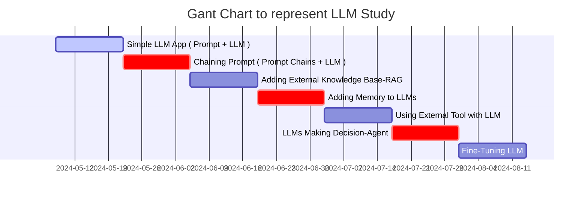

## Step-by-Step Guide to Building LLM Apps Basic to Advanced Components Created

- Step.1
  - Simple LLM App ( Prompt + LLM )
- Step.2
  - Chaining Prompt ( Prompt Chains + LLM )
- Step.3
  - Adding External Knowledge Base : RAG ( Retrieval Augmented Generation)
    - `답변에 필요한 정보를 먼저 찾아서 LLM에게 질문과 함께 넘겨주는 방식`
    - 이를 통해 특정 문서나 서비스의 데이터베이스에 있는 정보에 기반해서 답변을 생성할 수 있다.
{: .light .w-75 .shadow .rounded-10 w='1212' h='668' }
- Step.4
  - Adding Memory to LLMs
- Step.5
  - Using External Tool with LLM
- Step.6
  - LLMs Making Decision : Agent
- Step.7
  - Fine-Tuning LLM

* * *

> ## 전체적으로 구성된 프로젝트 구조 파악 해보기
- Verba :: <https://github.com/weaviate/Verba?tab=readme-ov-file>
{: .prompt-warning }

## Streamlit 으로 제작된 Simple LLM ( model : gpt-3.5-turbo )
- github : <https://github.com/streamlit/llm-examples>
  - ㄴ 요 위에꺼 이해 끝나면 이것도 해보자 
    - github : [pathwaycom/llm-app: LLM App templates for RAG, knowledge mining, and stream analytics. Ready to run with Docker,⚡in sync with your data sources.](https://github.com/pathwaycom/llm-app)
- Openapi api-key에 대해서, gpt-3.5 는 웹으로는 무료인데 api를 사용하려면 신용카드 등록 또는 새로운 계정을 만들어서 무료 이용까지 사용하는 식으로 사용하는 것이 방법이다. ( 애초에 Openaip api-key 정책이 그렇게 되어있다!! )
- API-key를 잘 받으면 위의 코드는 잘 동작할 듯 한데, 위의 Chatbot을 이용해 비정형데이터( 입력값 )를 활용하기 위한 데이터 형태로 출력해서 사용하는 방법이 당근에서 사용한 모임,추천,부동산 등등에 활용하는 방법임을 알 것 같다.
  - Billing : 5$ 결제 후 챗봇 동작하는 것 확인
{: .light .w-75 .shadow .rounded-10 w='1212' h='668' }

## 오류로 부터 출발~
VSCode를 이용해서, 디버깅시스템으로 진행해보니 아래와깉은 오류가 나온다? 엥? 뭐지 찾아보자. 찾아보니까 이것은 Streamlit 자체를 사용하는 방법이 잘못됐다.
오류해결 내용 : **[\[OpenAI\] Chatgpt 에러 해결 - openai.RateLimitError: Error code: 429 - {'error': {'message': 'You exceeded your current quota, please check your plan and billing details.](https://arc-viewpoint.tistory.com/entry/OpenAI-Chatgpt-%EC%97%90%EB%9F%AC-%ED%95%B4%EA%B2%B0-openaiRateLimitError-Error-code-429-error-message-You-exceeded-your-current-quota-please-check-your-plan-and-billing-details)**

## Streamlit 이 무엇인고?
- 개념과 사용방법 : [Python Streamlit 사용법 - 프로토타입 만들기](https://zzsza.github.io/mlops/2021/02/07/python-streamlit-dashboard/)
- 원어 도큐먼트 : [Working with Streamlit's execution model](https://docs.streamlit.io/develop/concepts/architecture)

## Code spaces는 무엇인고
- 개념보자 : [GitHub Codespaces 개요](https://docs.github.com/ko/codespaces/overview)

