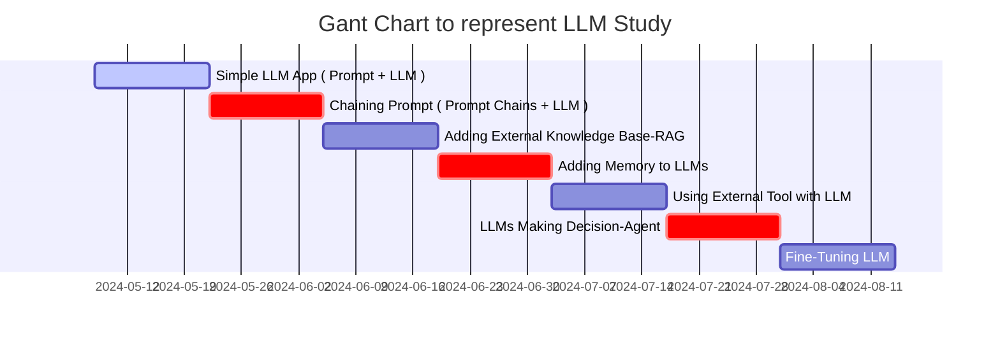

## Step-by-Step Guide to Building LLM Apps Basic to Advanced Components Created

* * * 

- Step.1
  - Simple LLM App ( Prompt + LLM )
- Step.2
  - Chaining Prompt ( Prompt Chains + LLM )
- Step.3
  - Adding External Knowledge Base : RAG ( Retrieval Augmented Generation)
    - `답변에 필요한 정보를 먼저 찾아서 LLM에게 질문과 함께 넘겨주는 방식`
    - 이를 통해 특정 문서나 서비스의 데이터베이스에 있는 정보에 기반해서 답변을 생성할 수 있다.
{: .light .w-75 .shadow .rounded-10 w='1212' h='668' }
- Step.4
  - Adding Memory to LLMs
- Step.5
  - Using External Tool with LLM
- Step.6
  - LLMs Making Decision : Agent
- Step.7
  - Fine-Tuning LLM

* * *

> ## 전체적으로 구성된 프로젝트 구조 파악 해보기
- Verba :: <https://github.com/weaviate/Verba?tab=readme-ov-file>
{: .prompt-warning }

## Streamlit 으로 제작된 Simple LLM ( model : gpt-3.5-turbo )

> 테스트완료
{: .prompt-info }

* * * 

- github : <https://github.com/streamlit/llm-examples>
  - ㄴ 요 위에꺼 이해 끝나면 이것도 해보자 
    - github : [pathwaycom/llm-app: LLM App templates for RAG, knowledge mining, and stream analytics. Ready to run with Docker,⚡in sync with your data sources.](https://github.com/pathwaycom/llm-app)
- Openapi api-key에 대해서, gpt-3.5 는 웹으로는 무료인데 api를 사용하려면 신용카드 등록 또는 새로운 계정을 만들어서 무료 이용까지 사용하는 식으로 사용하는 것이 방법이다. ( 애초에 Openaip api-key 정책이 그렇게 되어있다!! )
- API-key를 잘 받으면 위의 코드는 잘 동작할 듯 한데(삐- 정답입니다.), 위의 Chatbot을 이용해 비정형데이터( 입력값 )를 활용하기 위한 데이터 형태로 출력해서 사용하는 방법이 당근에서 사용한 모임,추천,부동산 등등에 활용하는 방법임을 알 것 같다.
  - Billing : 5$ 결제 후 챗봇 동작하는 것 확인
{: .light .w-75 .shadow .rounded-10 w='1212' h='668' }

## 오류로 부터 출발~ 

 Streamlit & Code spaces 

* * * 

VSCode를 이용해서, 디버깅시스템으로 진행해보니 아래와깉은 오류가 나온다? 엥? 뭐지 찾아보자. 찾아보니까 이것은 Streamlit 자체를 사용하는 방법이 잘못됐다.

오류해결 내용 : **[\[OpenAI\] Chatgpt 에러 해결 - openai.RateLimitError: Error code: 429 - {'error': {'message': 'You exceeded your current quota, please check your plan and billing details.](https://arc-viewpoint.tistory.com/entry/OpenAI-Chatgpt-%EC%97%90%EB%9F%AC-%ED%95%B4%EA%B2%B0-openaiRateLimitError-Error-code-429-error-message-You-exceeded-your-current-quota-please-check-your-plan-and-billing-details)**

## Streamlit 이 무엇인고?

* * * 

> Reference : [Python Streamlit 사용법 - 프로토타입 만들기](https://zzsza.github.io/mlops/2021/02/07/python-streamlit-dashboard/)

- 설명
  - Streamlit is an open-source Python framework to create custom web applications. It is specifically designed for machine learning and data science, but it is in no way limited to those use cases. The underlying Python code is executed server-side, and the resulting outputs rendered to the user. 
  - Streamlit은 사용자 정의 웹 애플리케이션을 만드는데 사용되는 오픈 소스 파이썬 프레임워크입니다. 머신 러닝과 데이터 과학을 위해 특별히 설계되었지만, 이러한 사용 사례에만 국한되지는 않습니다. 기본 Python 코드는 서버측에서 실행되고 결과 출력은 사용자에게 렌더링됩니다.
  - 기타
    - 가장 빠르게 데이터 어플리케이션을 만들 수 있는 방법
    - 앱을 만드는 미니멀한 프레임워크
    - 21년 2월 기준 Github Star 13K
- 이점
  - 간단하게 파이썬 코드로 앱을 빌드할 수 있음
  - 인터랙티브한 기능 제공(백엔드 개발이나 HTTP 요청 구현할 필요 없음)
  - 다양한 예시 제공
  - 커뮤니티에서 개발한 Component도 존재
  - Streamlit에서 배포할 수 있는 시스템 제공(단, 신청 필요)
  - 화면을 녹화할 수 있는 Record 기능도 제공
  - app을 빌드한 후, 오른쪽 ☰ 버튼을 클릭하면 Record a screencast를 확인할 수 있음

- 도큐먼트 : [Working with Streamlit's execution model](https://docs.streamlit.io/develop/concepts/architecture)

## Code spaces 란?

* * * 

> Reference : [GitHub Codespaces 개요](https://docs.github.com/ko/codespaces/overview)

{: .light .w-75 .shadow .rounded-10 w='1212' h='668' }
### 소개
  - codespace는 클라우드에서 호스트되는 개발 환경입니다. 프로젝트의 모든 사용자에 대해 반복 가능한 codespace 구성을 만드는 리포지토리(종종 Configuration-as-Code라고도 함)에 구성 파일을 커밋하여 GitHub Codespaces에 대한 프로젝트를 사용자 지정할 수 있습니다. 자세한 내용은 "개발 컨테이너 소개"을(를) 참조하세요.
  - 만드는 각 codespace는 가상 머신에서 실행되는 Docker 컨테이너의 GitHub에 의해 호스팅됩니다. 2개 코어, 8GB RAM 및 32GB 스토리지, 최대 32개 코어, 64GB RAM 및 128GB 스토리지의 가상 머신 유형 중에서 선택할 수 있습니다.
  - 기본적으로 codespace 개발 환경은 인기 언어 및 도구가 포함된 Ubuntu Linux 이미지에서 만들어지지만 선택한 Linux 배포판에 따라 이미지를 사용하고 특정 요구 사항에 맞게 구성할 수 있습니다. codespace는 로컬 운영 체제에 관계없이 Linux 환경에서 실행됩니다. Windows 및 macOS는 원격 개발 컨테이너에 대해 지원되지 않는 운영 체제입니다.
  - 브라우저, Visual Studio Code, JetBrains Gateway 애플리케이션에서 또는 GitHub CLI을(를) 사용하여 codespace에 연결할 수 있습니다. 연결할 경우 Docker 컨테이너 내에 배치됩니다. 외부 Linux 가상 머신 호스트에 대한 액세스가 제한되어 있습니다.

### GitHub Codespaces의 이점

codespace에서 작업하도록 선택하는 이유는 다음과 같습니다.

- 미리 구성된 개발 환경 사용 - 리포지토리용으로 특별히 구성된 개발 환경에서 작업할 수 있습니다. 여기에는 해당 프로젝트에서 작업하는 데 필요한 모든 도구, 언어 및 구성이 포함되어 있습니다. codespace에서 해당 리포지토리에 대해 작업하는 모든 사용자에게 동일한 환경이 제공됩니다. 따라서 디버그하기 어려운 환경 관련 문제가 발생할 가능성이 줄어듭니다. 각 리포지토리에는 기여자에게 즉시 사용할 수 있는 용도에 맞는 환경을 제공하는 설정이 있을 수 있으며 로컬 컴퓨터의 환경은 변경되지 않습니다.
- 필요한 리소스에 액세스 - 프로젝트 작업을 하기에 로컬 컴퓨터의 처리 능력이 부족하거나 스토리지 공간이 없을 수 있습니다. GitHub Codespaces을(를) 사용하면 적절한 리소스가 있는 컴퓨터에서 원격으로 작업할 수 있습니다.
- 어디서나 작업 - 웹 브라우저만 있으면 됩니다. 자신의 컴퓨터, 친구의 노트북 또는 태블릿의 codespace에서 작업할 수 있습니다. codespace를 열고 다른 디바이스에서 중단한 부분부터 작업을 재개합니다.
- 편집기 선택 - VS Code 웹 클라이언트의 브라우저에서 작업하거나 원하는 데스크톱 기반 애플리케이션을 선택합니다.
- 여러 프로젝트 작업 - 여러 codespace를 사용하여 별도의 프로젝트 또는 동일한 리포지토리의 다른 분기에 대해 작업을 수행할 수 있으며, 작업 중 다른 작업에 실수로 영향을 주지 않도록 작업을 구획화할 수 있습니다.
- 팀원과 페어 프로그래밍 수행 - VS Code의 codespace에서 작업하는 경우 Live Share를 사용하여 팀의 다른 사용자와 공동으로 작업할 수 있습니다. 자세한 내용은 "Codespace에서 공동 작업"을(를) 참조하세요.
- codespace에서 웹앱 게시 - codespace에서 포트를 전달한 다음 URL을 공유하여 끌어오기 요청에서 변경 내용을 제출하기 전에 팀원이 애플리케이션에 대한 변경을 시도할 수 있도록 합니다.
- 프레임워크 사용해 보기 - GitHub Codespaces은(는) 새 프레임워크를 알아보려는 경우 설치 시간을 줄여 줍니다. 빠른 시작 템플릿 중 하나에서 codespace를 만들기만 하면 됩니다.

