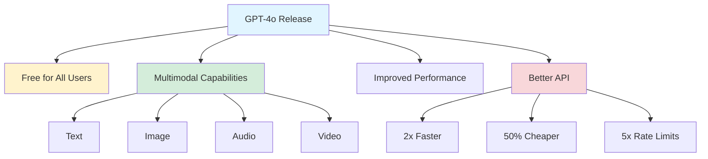
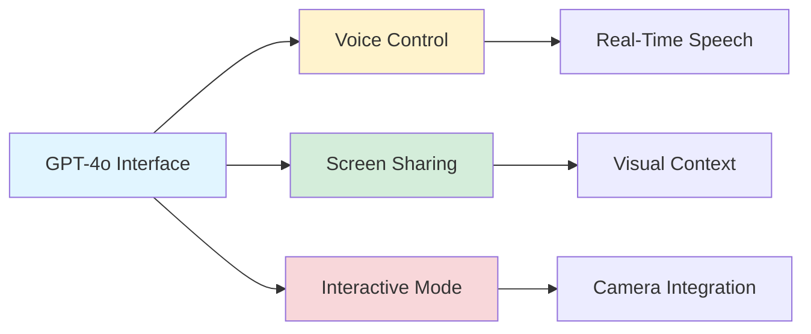

## GPT-4o: OpenAI's Revolutionary Multimodal LLM

*Curiosity:* What happens when a single model can seamlessly understand and generate across text, audio, and vision in real-time? How does this innovation reshape human-AI interaction?

**GPT-4o** represents a breakthrough in multimodal AI, combining text, image, and voice capabilities in a single, unified model. Most importantly, it's **free for all users**, making advanced AI accessible to everyone.

### Key Announcements

### Major Features

| Feature | Description | Impact |
|:--------|:------------|:-------|
| **Free Access** | Available to all users | ⬆️ Accessibility |
| **Native Multimodal** | Single model for all modalities | ⬆️ Efficiency |
| **Real-Time Voice** | 320ms average latency | ⬆️ Natural interaction |
| **Improved API** | 2x faster, 50% cheaper | ⬆️ Cost efficiency |
| **Better Performance** | Outperforms GPT-4 | ⬆️ Quality |

### Multimodal Capabilities

**Input Types**:
- 📥 Text
- 📥 Text + Image
- 📥 Text + Audio
- 📥 Text + Video
- 📥 Audio

**Output Types**:
- 📤 Image
- 📤 Image + Text
- 📤 Text
- 📤 Audio

### Performance Benchmarks

| Benchmark | Score | Comparison |
|:----------|:------|:-----------|
| **MMLU** | 88.7% | General knowledge |
| **HumanEval** | 90.2% | Code generation |
| **MMU** | 69.1% | Multimodal understanding |
| **DocVQA** | 92.8% | Document understanding |
| **WER (Western European)** | < 5% | Speech transcription |

### Technical Improvements

#### 1. New Tokenizer

*Retrieve:* Enhanced tokenization with 200k vocabulary (previously 100k).

**Benefits**:
- 🔡 1.1x - 4.4x fewer tokens across 20 languages
- ⚡ Faster processing
- 💰 Lower costs
- 🌐 Better multilingual support

#### 2. API Improvements

*Innovate:* Significant improvements for developers.

| Metric | Improvement | Impact |
|:-------|:------------|:-------|
| **Speed** | 2x faster | ⬆️ Throughput |
| **Cost** | 50% cheaper | ⬇️ Expenses |
| **Rate Limits** | 5x higher | ⬆️ Scalability |

#### 3. Real-Time Voice

*Retrieve:* Near-human conversation latency.

- 🎤 320ms average latency
- 🎶 Natural, interruptible speech
- 💬 Real-time interaction
- 🗣️ More human-like voice

### New Interface Features

**New Capabilities**:
- 🎤 Voice control and screen-sharing
- 💬 Interactive mode with camera
- 🖼️ Simultaneous image sharing and communication
- ⚡ Real-time multimodal interaction

### Use Cases

| Use Case | GPT-4o Advantage | Example |
|:---------|:-----------------|:--------|
| **Real-Time Assistance** | Low latency voice | Customer support |
| **Multimodal Analysis** | Unified model | Document understanding |
| **Cost-Effective API** | 50% cheaper | High-volume applications |
| **Interactive Apps** | Camera + voice | Educational tools |

### Comparison: GPT-4 vs. GPT-4o

| Aspect | GPT-4 | GPT-4o | Improvement |
|:-------|:------|:--------|:------------|
| **Modalities** | Text, Image | Text, Image, Audio, Video | ⬆️ More |
| **Voice Latency** | High | 320ms | ⬆️ Real-time |
| **API Speed** | Baseline | 2x faster | ⬆️ 2x |
| **API Cost** | Baseline | 50% cheaper | ⬇️ 50% |
| **Tokenizer** | 100k vocab | 200k vocab | ⬆️ Better |
| **Access** | Paid | Free | ⬆️ Accessible |

### Key Takeaways

*Retrieve:* GPT-4o represents a significant leap in multimodal AI, offering real-time voice, improved performance, and free access to advanced capabilities.

*Innovate:* The unified multimodal architecture and improved API enable new applications in real-time interaction, cost-effective deployment, and seamless human-AI collaboration.

*Curiosity → Retrieve → Innovation:* Start with curiosity about multimodal AI, retrieve insights from GPT-4o's capabilities, and innovate by building applications that leverage real-time, multimodal interaction.

**📖 Official Blog**: <https://openai.com/index/hello-gpt-4o/>

**Note**: While GPT-4o's multimodal achievements and latency are impressive, open-source AI remains strong and equally suitable for enterprise use cases that don't require 200ms voice latency. ✅

{: .light .w-75 .shadow .rounded-10 w='1212' h='668' }

 Translate to Korean 

* * * 

## 🤯 OpenAI 의 새로운 멀티모달 LLM은 텍스트, 오디오, 비전을 실시간으로 이해하고 생성할 수 있습니다. 

### 💬🗣️👀 지금까지 우리가 알고 있는 것은 다음과 같습니다.

#### 자세히 
- OpenAI는 GPT-4보다 성능이 뛰어난 새로운 GPT-4o 모델을 발표했지만 가장 중요한 것은 모든 사용자에게 무료로 제공된다는 것입니다! 🚀
⠀
- 음성 제어 및 화면 공유 기능이 있는 업데이트된 인터페이스 및 PC 응용 프로그램이 도입🎤되었습니다
⠀
- 기본적으로 멀티모달: 현재 텍스트, 이미지 및 음성 생성은 하나의 모델🗣️로 수행됩니다.
⠀
- GPT4💰에 비해 2배 더 빠르고, 50% 더 저렴하고, 5배 더 높은 속도 제한 API를 지원하기 때문에 개발자도 잊지 않습니다
⠀
- 음성 모드가 크게 개선되어 이제 모델 생성이 끝날 때까지 기다리지 않고 언제든지 모델 생성을 중단할 수 있습니다. OpenAI는 또한 음성 생성을 실시간 수준으로 끌어올렸으며 가장 중요한 것은 ChatGPT 음성을 실제로 생생하게 만드는 것입니다! 🎶
⠀
- 카메라의 이미지를 동시에 공유하고 ChatGPT와 소통할 수 있는 대화형 모드도 있습니다! 💬
⠀

> 요약
- 📥 입력: 텍스트, 텍스트 + 이미지, 텍스트 + 오디오, 텍스트 + 비디오, 오디오(예제 기반)
- 📤출력: 이미지, 이미지 + 텍스트, 텍스트, 오디오(예제 기반)
- 🌐 MMLU에서 88.7%; HumanEval에서 90.2%
- 🎧< 5% WER for Western European languages in transcription
- 🖼️ 69.1% on MMU; 92.8% on DocVQA
- ⚡ Up to 50% cheaper (probably due to tokenization improvements) and 2x faster than GPT-4 Turbo
- 🎤 Near real-time audio with 320ms on average, similar to human conversation
- 🔡 New tokenizer with a 200k token vocabulary (previously 100k vocabulary) leading to 1.1x - 4.4x fewer tokens needed across 20 languages
{: .prompt-info }

Blog: <https://openai.com/index/hello-gpt-4o/>

The multimodal achievement and latency are impressive. 🔥 But I'm not worried about open-source AI. Open Source is stronger than ever and equally good for enterprises and companies use cases where you don't need a 200ms latency with voice input. ✅

