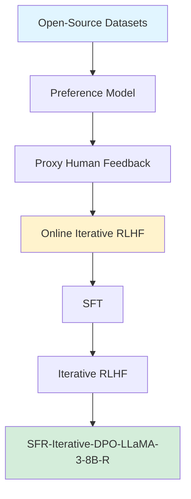

## Llama 3 8B Fine-Tune Case: Salesforce's Best-in-Class Model

*Curiosity:* How can we fine-tune Llama 3 8B to beat GPT-3.5? What makes Salesforce's approach with Online Iterative RLHF so effective?

**Salesforce's Llama 3 8B fine-tune** is currently the best available, achieving impressive results through Online Iterative RLHF and open-source datasets.

### Performance Highlights

*Retrieve:* Salesforce's Llama 3 8B achievements.

| Achievement | Details | Impact |
|:------------|:--------|:-------|
| **Benchmark Wins** | Beats GPT-3.5 & Mixtral 8x7B (it) | ⬆️ Superior performance |
| **Benchmarks** | MT bench, Chat Arena Hard, Alpaca Eval | ⬆️ Comprehensive evaluation |
| **RLHF Model** | Beats Llama3-8b-it model | ⬆️ Better than base |
| **Open Source** | No GPT-4/human annotations needed | ⬆️ Accessibility |

**Key Features**:
- ✅ Uses Online Iterative RLHF for efficient alignment
- ✅ Trained with open-source datasets
- ✅ Releases SFT, RLHF, and Reward model

* * * 

### RLHF Workflow: From Reward Modeling to Online RLHF

*Retrieve:* Understanding Online Iterative RLHF.

**Online Iterative RLHF** is widely reported to outperform offline RLHF by a large margin. However, existing open-source RLHF projects are largely confined to offline learning.

**This technical report** fills the gap by providing a detailed, reproducible recipe for online iterative RLHF.

### Online RLHF Architecture

*Innovate:* How online iterative RLHF works.

### Key Innovation

*Retrieve:* Proxy preference model approach.

**Challenge**: Online human feedback is infeasible for open-source communities with limited resources.

**Solution**: 
- Construct preference models using diverse open-source datasets
- Use proxy preference model to approximate human feedback
- Enable online iterative RLHF without human annotators

### Performance Results

*Innovate:* Impressive benchmark achievements.

**Model**: SFR-Iterative-DPO-LLaMA-3-8B-R

**Benchmarks**:
- ✅ AlpacaEval-2
- ✅ Arena-Hard
- ✅ MT-Bench
- ✅ HumanEval
- ✅ TruthfulQA

**Key Achievement**: SFT and iterative RLHF achieve SOTA performance with **fully open-source datasets**.

### Resources

*Retrieve:* Available materials.

> **Resources**:
> - **📄 Paper**: <https://arxiv.org/abs/2405.07863>
> - **📰 Blog**: <https://huggingface.co/blog/rlhf>
{: .prompt-tip}

**Available**:
- ✅ Models
- ✅ Curated datasets
- ✅ Step-by-step code guidebooks

### Key Takeaways

*Retrieve:* Salesforce's Llama 3 8B fine-tune demonstrates that Online Iterative RLHF with open-source datasets can achieve SOTA performance, beating GPT-3.5 and other models.

*Innovate:* By using proxy preference models from open-source datasets, you can implement online iterative RLHF without human annotators, achieving state-of-the-art results with fully open-source resources.

*Curiosity → Retrieve → Innovation:* Start with curiosity about RLHF workflows, retrieve insights from Salesforce's approach, and innovate by implementing online iterative RLHF in your fine-tuning pipelines.

**Next Steps**:
- Read the paper
- Explore the blog post
- Study the code guidebooks
- Implement online RLHF

> RLHF Workflow
- paper : <https://arxiv.org/abs/2405.07863>
- blog : <https://huggingface.co/blog/rlhf>
{: .prompt-tip }

 Translate to Korean 

* * * 

### Llama 3 8B는 이제까지 나온 것 중 최고입니다!

> Salesforce에서 미세 조정한 Llama 3 8B
- GPT-3.5 및 Mixtral 8x7B(it)를 MT 벤치, Chat Arena Hard 및 Alpaca Eval에서 능가합니다.
- 효율적인 정렬을 위해 온라인 반복 RLHF를 사용합니다.
- 오픈 소스 데이터셋으로 학습되었습니다 (GPT-4 또는 인간 주석 필요 없음).
- SFT, RLHF 및 보상 모델을 출시합니다.
- RLHF 모델은 또한 Llama3-8b-it 모델을 능가합니다.
{: .prompt-info }

RLHF 워크플로우

보상 모델링에서 온라인 RLHF까지

이 기술 보고서에서는 RLHF(Online Iterative Reinforcement Learning from Human Feedback)의 워크플로우를 제시하며, 이는 최근 대규모 언어 모델(LLM) 문헌에서 오프라인 모델보다 큰 차이로 우수한 것으로 널리 보고되었습니다. 그러나 기존 오픈 소스 RLHF 프로젝트는 여전히 오프라인 학습 환경에 국한되어 있습니다. 이 기술 보고서에서는 이러한 격차를 해소하고 온라인 반복 RLHF를 위해 쉽게 재현할 수 있는 자세한 레시피를 제공하는 것을 목표로 합니다. 특히, 온라인 인적 피드백은 일반적으로 제한된 리소스를 가진 오픈 소스 커뮤니티에서 실현 가능하지 않기 때문에 다양한 오픈 소스 데이터 세트를 사용하여 선호도 모델을 구성하고 구성된 프록시 선호도 모델을 사용하여 인간의 피드백을 근사화합니다. 그런 다음 온라인 반복 RLHF의 이론적 통찰력과 알고리즘 원리에 대해 논의한 후 자세한 실제 구현에 대해 논의합니다. 훈련된 LLM인 SFR-Iterative-DPO-LLaMA-3-8B-R은 AlpacaEval-2, Arena-Hard, MT-Bench를 포함한 LLM 챗봇 벤치마크와 HumanEval 및 TruthfulQA와 같은 기타 학술 벤치마크에서 인상적인 성능을 달성합니다. 우리는 지도 미세 조정(SFT) 및 반복 RLHF가 완전한 오픈 소스 데이터 세트를 통해 최첨단 성능을 얻을 수 있음을 보여주었습니다. 또한 모델, 선별된 데이터 세트 및 포괄적인 단계별 코드 가이드북을 공개적으로 사용할 수 있도록 했습니다.

> RLHF Workflow
- paper : <https://arxiv.org/abs/2405.07863>
- blog : <https://huggingface.co/blog/rlhf>
{: .prompt-tip }

