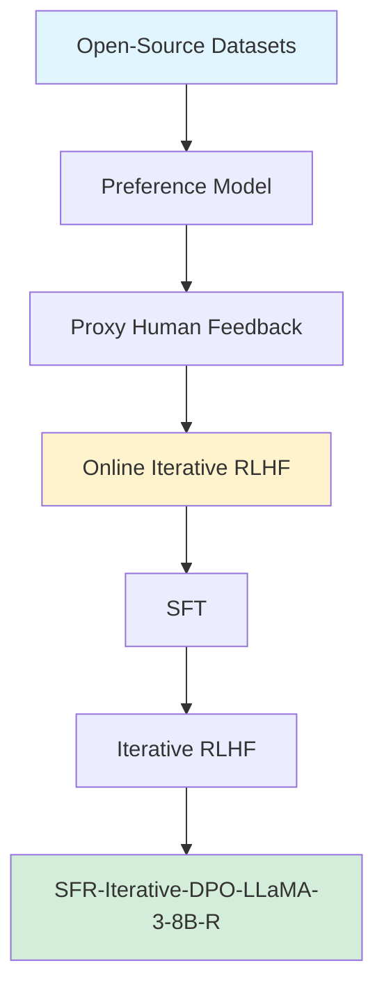

## Llama 3 8B Fine-Tune Case: Salesforce's Best-in-Class Model

*Curiosity:* How can we fine-tune Llama 3 8B to beat GPT-3.5? What makes Salesforce's approach with Online Iterative RLHF so effective?

**Salesforce's Llama 3 8B fine-tune** is currently the best available, achieving impressive results through Online Iterative RLHF and open-source datasets.

### Performance Highlights

*Retrieve:* Salesforce's Llama 3 8B achievements.

| Achievement | Details | Impact |
|:------------|:--------|:-------|
| **Benchmark Wins** | Beats GPT-3.5 & Mixtral 8x7B (it) | ⬆️ Superior performance |
| **Benchmarks** | MT bench, Chat Arena Hard, Alpaca Eval | ⬆️ Comprehensive evaluation |
| **RLHF Model** | Beats Llama3-8b-it model | ⬆️ Better than base |
| **Open Source** | No GPT-4/human annotations needed | ⬆️ Accessibility |

**Key Features**:
- ✅ Uses Online Iterative RLHF for efficient alignment
- ✅ Trained with open-source datasets
- ✅ Releases SFT, RLHF, and Reward model

* * * 

### RLHF Workflow: From Reward Modeling to Online RLHF

*Retrieve:* Understanding Online Iterative RLHF.

**Online Iterative RLHF** is widely reported to outperform offline RLHF by a large margin. However, existing open-source RLHF projects are largely confined to offline learning.

**This technical report** fills the gap by providing a detailed, reproducible recipe for online iterative RLHF.

### Online RLHF Architecture

*Innovate:* How online iterative RLHF works.

```mermaid
graph TB
    A[Open-Source Datasets] --> B[Preference Model]
    B --> C[Proxy Human Feedback]
    C --> D[Online Iterative RLHF]
    D --> E[SFT]
    E --> F[Iterative RLHF]
    F --> G[SFR-Iterative-DPO-LLaMA-3-8B-R]
    
    style A fill:#e1f5ff
    style D fill:#fff3cd
    style G fill:#d4edda
```

### Key Innovation

*Retrieve:* Proxy preference model approach.

**Challenge**: Online human feedback is infeasible for open-source communities with limited resources.

**Solution**: 
- Construct preference models using diverse open-source datasets
- Use proxy preference model to approximate human feedback
- Enable online iterative RLHF without human annotators

### Performance Results

*Innovate:* Impressive benchmark achievements.

**Model**: SFR-Iterative-DPO-LLaMA-3-8B-R

**Benchmarks**:
- ✅ AlpacaEval-2
- ✅ Arena-Hard
- ✅ MT-Bench
- ✅ HumanEval
- ✅ TruthfulQA

**Key Achievement**: SFT and iterative RLHF achieve SOTA performance with **fully open-source datasets**.

### Resources

*Retrieve:* Available materials.

> **Resources**:
> - **📄 Paper**: <https://arxiv.org/abs/2405.07863>
> - **📰 Blog**: <https://huggingface.co/blog/rlhf>
{: .prompt-tip}

**Available**:
- ✅ Models
- ✅ Curated datasets
- ✅ Step-by-step code guidebooks

### Key Takeaways

*Retrieve:* Salesforce's Llama 3 8B fine-tune demonstrates that Online Iterative RLHF with open-source datasets can achieve SOTA performance, beating GPT-3.5 and other models.

*Innovate:* By using proxy preference models from open-source datasets, you can implement online iterative RLHF without human annotators, achieving state-of-the-art results with fully open-source resources.

*Curiosity → Retrieve → Innovation:* Start with curiosity about RLHF workflows, retrieve insights from Salesforce's approach, and innovate by implementing online iterative RLHF in your fine-tuning pipelines.

**Next Steps**:
- Read the paper
- Explore the blog post
- Study the code guidebooks
- Implement online RLHF

> RLHF Workflow
- paper : <https://arxiv.org/abs/2405.07863>
- blog : <https://huggingface.co/blog/rlhf>
{: .prompt-tip }

 Translate to Korean 

* * * 

### Llama 3 8B Is the Best Yet!

> Llama 3 8B Fine-Tuned at Salesforce
- Outperforms GPT-3.5 and Mixtral 8x7B(it) on MT-Bench, Chat Arena Hard, and Alpaca Eval.
- Uses online iterative RLHF for efficient alignment.
- Trained on open-source datasets (no GPT-4 or human annotation required).
- Releases SFT, RLHF, and reward models.
- The RLHF model also outperforms the Llama3-8b-it model.
{: .prompt-info }

RLHF Workflow

From Reward Modeling to Online RLHF

This technical report presents the workflow for RLHF (Online Iterative Reinforcement Learning from Human Feedback), which has recently been widely reported to outperform offline approaches in the large language model (LLM) literature by a large margin. However, existing open-source RLHF projects are still largely confined to offline learning settings. This technical report aims to bridge that gap and provide a detailed, easily reproducible recipe for online iterative RLHF. In particular, since online human feedback is generally not feasible for open-source communities with limited resources, we construct preference models using diverse open-source datasets and use the constructed proxy preference model to approximate human feedback. We then discuss theoretical insights and algorithmic principles of online iterative RLHF, followed by detailed practical implementation. The trained LLM, SFR-Iterative-DPO-LLaMA-3-8B-R, achieves impressive performance on LLM chatbot benchmarks including AlpacaEval-2, Arena-Hard, MT-Bench, as well as other academic benchmarks such as HumanEval and TruthfulQA. We have demonstrated that supervised fine-tuning (SFT) and iterative RLHF can achieve state-of-the-art performance with fully open-source datasets. We have also made models, curated datasets, and comprehensive step-by-step code guidebooks publicly available.

> RLHF Workflow
- paper : <https://arxiv.org/abs/2405.07863>
- blog : <https://huggingface.co/blog/rlhf>
{: .prompt-tip }

