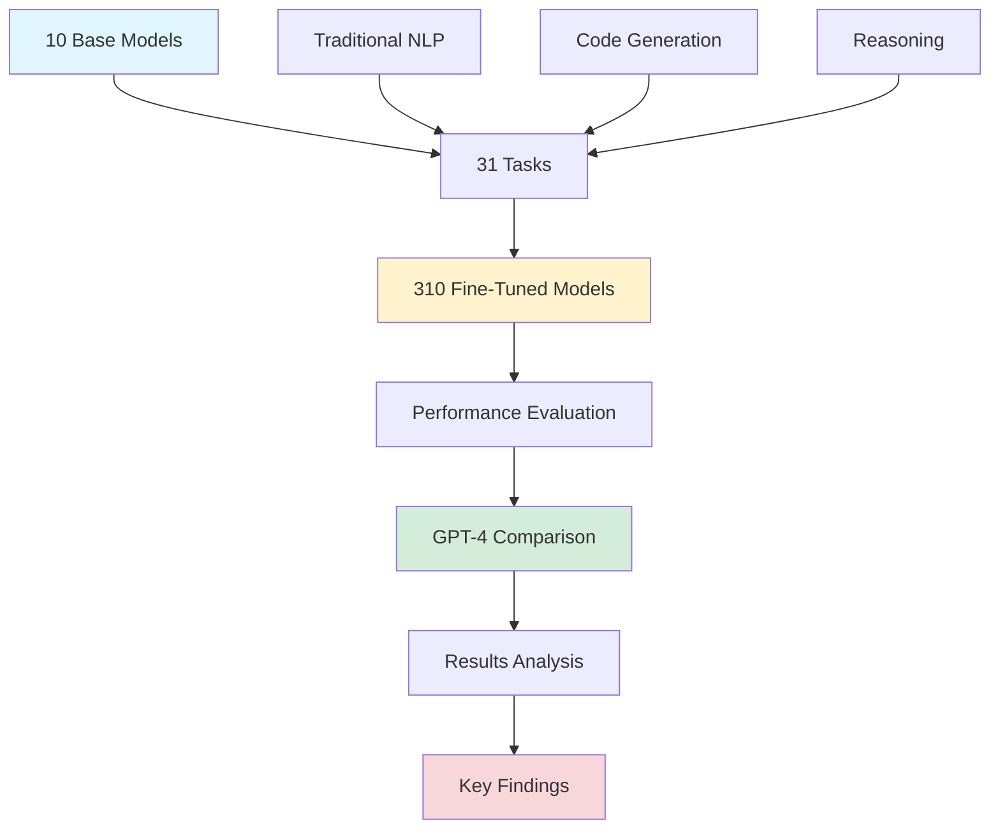
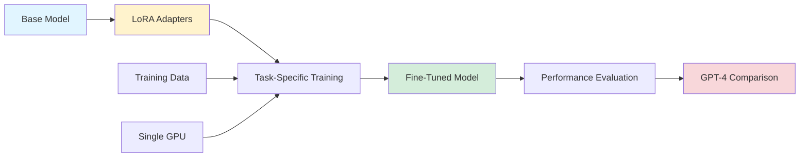
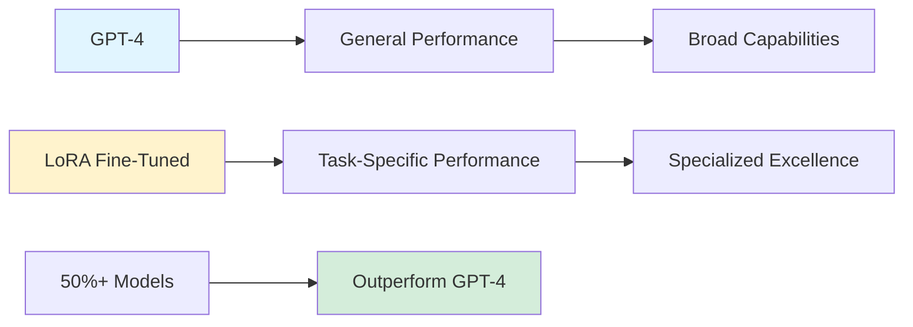

## LoRA-Fine-Tuned Models Outperform GPT-4: A Comprehensive Study

*Curiosity:* Can fine-tuned smaller models outperform large general-purpose models on specific tasks? What insights can we retrieve from systematic fine-tuning experiments?

**A groundbreaking technical report** from Predibase demonstrates that LoRA-fine-tuned models can outperform GPT-4 on specific tasks. This study evaluated 310 models (10 base models × 31 tasks) across diverse domains, revealing that **over half of the fine-tuned models showed performance advantages** compared to GPT-4.

### Study Overview



### Experimental Setup

| Component | Details | Impact |
|:----------|:--------|:-------|
| **Base Models** | 10 models (Gemma, Llama2, Mistral, etc.) | Diverse architectures |
| **Tasks** | 31 tasks across NLP, code, reasoning | Comprehensive evaluation |
| **Fine-tuning Method** | LoRA (Low-Rank Adaptation) | Efficient parameter updates |
| **Total Models** | 310 fine-tuned models | Extensive experimentation |
| **Hardware** | Single GPU, Nvidia A100 | Accessible deployment |

### Key Findings

*Retrieve:* The study reveals several critical insights:

1. **Performance Advantage**: Over 50% of fine-tuned models outperformed GPT-4 on specific tasks
2. **Top Performers**: Zephyr-7B and Mistral-7B showed superiority in 10 out of 31 tasks
3. **Task-Specific Optimization**: Fine-tuning enables models to excel in specialized domains

### Top Performing Models

| Model | Tasks Won | Key Strengths | Base Architecture |
|:------|:----------|:--------------|:------------------|
| **Zephyr-7B** | 10/31 | Strong across multiple domains | Mistral-based |
| **Mistral-7B** | 10/31 | Excellent reasoning capabilities | Mistral architecture |
| **Other Models** | Various | Task-specific advantages | Multiple architectures |

### LoRA Fine-Tuning Process



### LoRA Architecture

**LoRA (Low-Rank Adaptation)** enables efficient fine-tuning by adding trainable low-rank matrices to existing weights:

```python
import torch
import torch.nn as nn

class LoRALayer(nn.Module):
    """LoRA adapter layer"""
    def __init__(self, in_features, out_features, rank=8):
        super().__init__()
        self.rank = rank
        
        # Low-rank matrices
        self.lora_A = nn.Parameter(torch.randn(in_features, rank) * 0.02)
        self.lora_B = nn.Parameter(torch.zeros(rank, out_features))
        
        # Scaling factor
        self.scaling = 1.0 / rank
    
    def forward(self, x, base_weight):
        """Forward pass with LoRA adaptation"""
        # Base transformation
        base_output = x @ base_weight
        
        # LoRA adaptation
        lora_output = x @ self.lora_A @ self.lora_B * self.scaling
        
        return base_output + lora_output

# Example usage
base_model = load_pretrained_model()
lora_adapter = LoRALayer(768, 768, rank=8)

# Fine-tuning with LoRA
def forward_with_lora(x):
    base_output = base_model(x)
    adapted_output = lora_adapter(x, base_model.weight)
    return adapted_output
```

### Task Categories

| Category | Tasks | Fine-Tuning Impact |
|:---------|:------|:-------------------|
| **Traditional NLP** | Classification, NER, etc. | ⬆️ High |
| **Code Generation** | Programming tasks | ⬆️ Very High |
| **Reasoning** | Logical reasoning | ⬆️ High |
| **Domain-Specific** | Specialized tasks | ⬆️ Very High |

### Deployment Tools

**Predibase** developed comprehensive tools for deploying LoRA models:

| Tool | Purpose | Features |
|:-----|:---------|:---------|
| **LoRAX** | Open-source deployment | Single GPU, efficient serving |
| **LoRA Land** | Web application | 310 models, interactive testing |

**Benefits**:
- Easy deployment on single GPU
- Efficient model serving
- Interactive testing environment
- Community access to results

### Performance Comparison



### Why This Matters

*Retrieve:* This study demonstrates that:
- Task-specific fine-tuning can outperform general models
- Smaller models can excel with proper training
- LoRA enables efficient specialization

*Innovate:* These findings enable:
- Cost-effective model deployment
- Specialized AI solutions
- Accessible fine-tuning workflows

### Community Response

**Hugging Face**: Over 100+ positive reactions—an unusually high engagement rate, indicating strong community interest in these findings.

**Timing**: The report's release just hours before GPT-4o's announcement added to its significance, highlighting the competitive landscape.

### Resources

> **Technical Report**
> - **Paper**: [LoRA Fine-Tuning Study](https://arxiv.org/abs/2405.00732)
> - **Project Page**: [LoRA Land](https://predibase.com/lora-land)
{: .prompt-info }

### Key Takeaways

*Retrieve:* Systematic fine-tuning with LoRA can enable smaller models to outperform GPT-4 on specific tasks, demonstrating the power of task-specific optimization.

*Innovate:* By leveraging LoRA and task-specific fine-tuning, we can build cost-effective, specialized AI solutions that excel in their target domains.

*Curiosity → Retrieve → Innovation:* Start with curiosity about model specialization, retrieve insights from systematic experiments, and innovate by applying fine-tuning to your specific use cases.

**Next Steps**:
- Explore LoRA Land for model testing
- Experiment with LoRAX for deployment
- Fine-tune models for your specific tasks
- Compare performance with general models


### RLHF Workflow

From Reward Modeling to Online RLHF

We present the workflow of Online Iterative Reinforcement Learning from Human Feedback (RLHF) in this technical report, which is widely reported to outperform its offline counterpart by a large margin in the recent large language model (LLM) literature. However, existing open-source RLHF projects are still largely confined to the offline learning setting. In this technical report, we aim to fill in this gap and provide a detailed recipe that is easy to reproduce for online iterative RLHF. In particular, since online human feedback is usually infeasible for open-source communities with limited resources, we start by constructing preference models using a diverse set of open-source datasets and use the constructed proxy preference model to approximate human feedback. Then, we discuss the theoretical insights and algorithmic principles behind online iterative RLHF, followed by a detailed practical implementation. Our trained LLM, SFR-Iterative-DPO-LLaMA-3-8B-R, achieves impressive performance on LLM chatbot benchmarks, including AlpacaEval-2, Arena-Hard, and MT-Bench, as well as other academic benchmarks such as HumanEval and TruthfulQA. We have shown that supervised fine-tuning (SFT) and iterative RLHF can obtain state-of-the-art performance with fully open-source datasets. Further, we have made our models, curated datasets, and comprehensive step-by-step code guidebooks publicly available.

>
- paper : <https://arxiv.org/abs/2405.07863>
- blog : <https://huggingface.co/blog/rlhf>
{: .prompt-info }

<details markdown="1">
<summary style= "font-size:24px; line-height:24px; font-weight:bold; cursor:pointer;" > Translate to Korean </summary>

RLHF 워크플로우

보상 모델링에서 온라인 RLHF까지

이 기술 보고서에서는 RLHF(Online Iterative Reinforcement Learning from Human Feedback)의 워크플로우를 제시하며, 이는 최근 대규모 언어 모델(LLM) 문헌에서 오프라인 모델보다 큰 차이로 우수한 것으로 널리 보고되었습니다. 그러나 기존 오픈 소스 RLHF 프로젝트는 여전히 오프라인 학습 환경에 국한되어 있습니다. 이 기술 보고서에서는 이러한 격차를 해소하고 온라인 반복 RLHF를 위해 쉽게 재현할 수 있는 자세한 레시피를 제공하는 것을 목표로 합니다. 특히, 온라인 인적 피드백은 일반적으로 제한된 리소스를 가진 오픈 소스 커뮤니티에서 실현 가능하지 않기 때문에 다양한 오픈 소스 데이터 세트를 사용하여 선호도 모델을 구성하고 구성된 프록시 선호도 모델을 사용하여 인간의 피드백을 근사화합니다. 그런 다음 온라인 반복 RLHF의 이론적 통찰력과 알고리즘 원리에 대해 논의한 후 자세한 실제 구현에 대해 논의합니다. 훈련된 LLM인 SFR-Iterative-DPO-LLaMA-3-8B-R은 AlpacaEval-2, Arena-Hard, MT-Bench를 포함한 LLM 챗봇 벤치마크와 HumanEval 및 TruthfulQA와 같은 기타 학술 벤치마크에서 인상적인 성능을 달성합니다. 우리는 지도 미세 조정(SFT) 및 반복 RLHF가 완전한 오픈 소스 데이터 세트를 통해 최첨단 성능을 얻을 수 있음을 보여주었습니다. 또한 모델, 선별된 데이터 세트 및 포괄적인 단계별 코드 가이드북을 공개적으로 사용할 수 있도록 했습니다.

>
- paper : <https://arxiv.org/abs/2405.07863>
- blog : <https://huggingface.co/blog/rlhf>
{: .prompt-info }

</details>