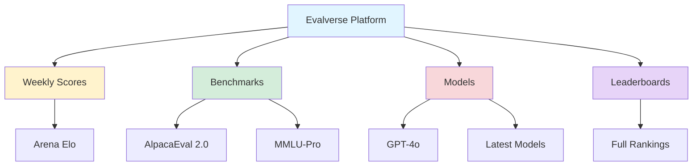
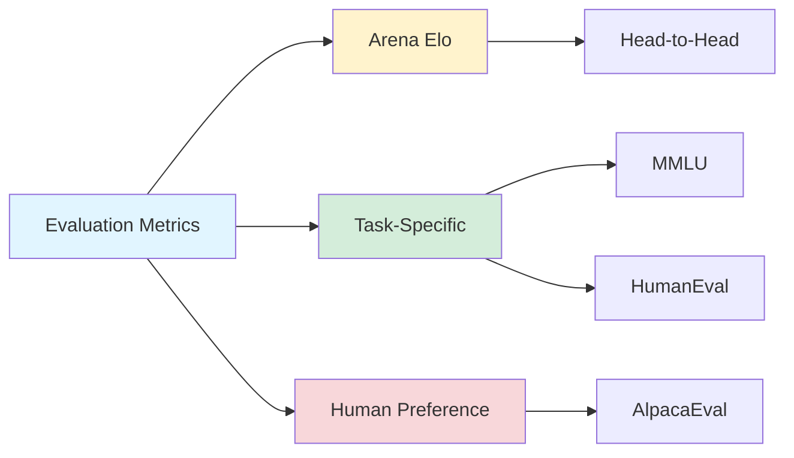

## Evalverse: The Universe of LLM Evaluation

*Curiosity:* How do we systematically evaluate LLM performance across diverse tasks? What benchmarks and metrics provide meaningful insights into model capabilities?

**Evalverse** is a comprehensive evaluation platform that aggregates LLM benchmarks, model comparisons, and performance metrics in one unified space. Updated regularly, it provides the most current view of the LLM landscape.

### Evalverse Overview

### Latest Updates (May 17, 2024)

| Category | Updates | Details |
|:---------|:--------|:--------|
| **Weekly Scores** | Arena Elo rankings | 240515, 240508, 240501 |
| **New Benchmarks** | AlpacaEval 2.0, MMLU-Pro | Human preference correlation |
| **New Models** | 6 models added | GPT-4o, Grok-1, OpenELM, etc. |
| **New Features** | Full leaderboard tab | Comprehensive rankings |

### New Benchmarks

*Retrieve:* Benchmarks highly correlated with human preferences provide more meaningful evaluation.

#### 1. LC-AlpacaEval 2.0

| Aspect | Details | Link |
|:-------|:--------|:-----|
| **Release Date** | April 6, 2024 | [arXiv](https://arxiv.org/abs/2404.04475) |
| **Focus** | Long-context evaluation | Extended capabilities |
| **Correlation** | High with human preferences | Reliable metrics |

#### 2. MMLU-Pro

| Aspect | Details | Link |
|:-------|:--------|:-----|
| **Release Date** | May 15, 2024 | [HuggingFace](https://huggingface.co/datasets/TIGER-Lab/MMLU-Pro) |
| **Focus** | Advanced reasoning | Challenging tasks |
| **Correlation** | High with Arena Elo | Human-aligned |

### New Models Added

| Model | Provider | Key Features |
|:------|:---------|:-------------|
| **GPT-4o-0513** | OpenAI | Multimodal, real-time |
| **Grok-1** | xAI | Large-scale reasoning |
| **OpenELM** | Apple | Efficient, open-source |
| **Qwen-Max-0428** | Alibaba | Multilingual, large-scale |
| **Snowflake-Arctic-Instruct** | Snowflake | Enterprise-focused |
| **Yi-Large** | 01.AI | High performance |

### Evaluation Metrics

### Why Evalverse Matters

*Retrieve:* Evalverse provides:
- Centralized evaluation hub
- Regular updates with latest models
- Multiple benchmark perspectives
- Human preference correlation

*Innovate:* By using Evalverse, you can:
- Compare models systematically
- Track performance trends
- Make informed model choices
- Understand evaluation landscape

### Access Evalverse

> **👉 HuggingFace Space**: <https://huggingface.co/spaces/upstage/evalverse-space>
{: .prompt-info }

**Features**:
- Interactive leaderboards
- Model comparisons
- Benchmark details
- Weekly score tracking

### Key Takeaways

*Retrieve:* Evalverse provides a comprehensive, regularly updated view of LLM evaluation, aggregating benchmarks, model scores, and human preference metrics.

*Innovate:* By leveraging Evalverse's centralized evaluation data, you can make informed decisions about model selection and understand the current state of LLM capabilities.

*Curiosity → Retrieve → Innovation:* Start with curiosity about model performance, retrieve insights from Evalverse's comprehensive data, and innovate by selecting the best models for your specific use cases.

{: .light .w-75 .shadow .rounded-10 w='1212' h='668' }

 Translate to Korean 

## 평가의 공간 ( Evalverse ) 

🔥 evalverse-space (업데이트: 2024년 5월 17일)

새로운 기능
- • 주간 점수: 아레나 엘로(240515), 아레나 엘로(240508), 아레나 엘로(240501)
- • 새로운 벤치마크: AlpacaEval 2.0, MMLU-Pro
- • 신규 모델: GPT-4o-0513, Grok-1, OpenELM, Qwen-Max-0428, Snowflake-Arctic-Instruct, Yi-Large
- • 새 탭: 🏆 전체 순위표

인간의 선호도와 높은 상관 관계가 있는 새로운 벤치마크(Arena Elo)
- • LC-AlpacaEval 2.0 (4월 6일) https://lnkd.in/gqmzrjyb
- • MMLU-Pro(5월 15일) https://lnkd.in/gNeh2RHP

> 이 모든 것을 Evalverse-space에서 함께 확인하세요.
- 👉 허깅페이스 스페이스: https://lnkd.in/gR75pHfC
{: .prompt-info }

