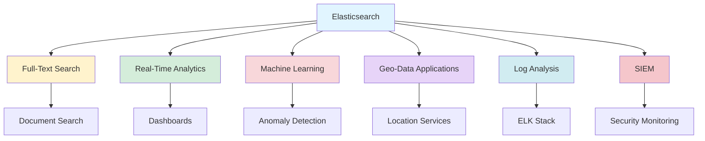
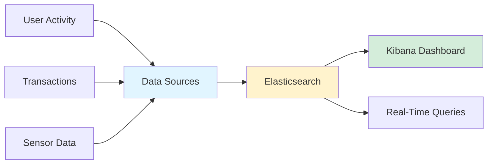
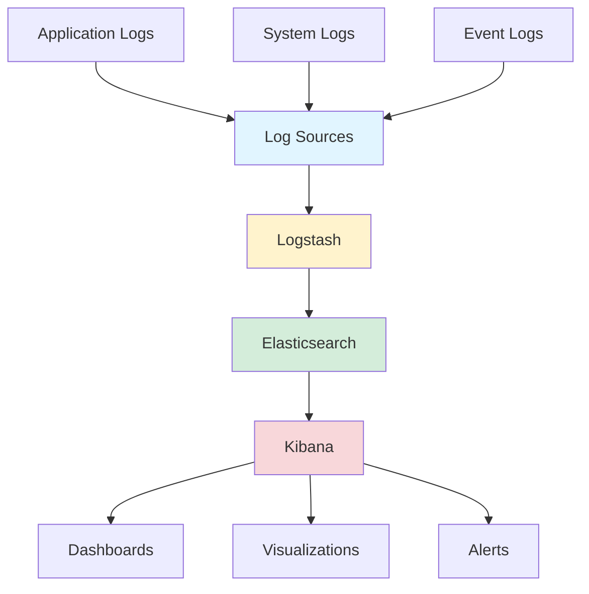

## Top 6 Elasticsearch Use Cases: Powering Modern Applications

*Curiosity:* What makes Elasticsearch so versatile? How do organizations leverage its powerful search and analytics capabilities across different domains?

**Elasticsearch** is widely used for its powerful and versatile search capabilities, enabling organizations to build scalable, real-time search and analytics solutions across diverse use cases.

### Use Cases Overview



### Use Case Comparison

| Use Case | Key Features | Industry Applications | Performance |
|:---------|:-------------|:----------------------|:------------|
| **Full-Text Search** | Complex queries, near real-time | E-commerce, content platforms | ⚡ Fast |
| **Real-Time Analytics** | Live dashboards, streaming data | Finance, IoT, monitoring | ⚡ Real-time |
| **Machine Learning** | Anomaly detection, pattern recognition | Security, operations | 🧠 Intelligent |
| **Geo-Data** | Geospatial indexing, location search | Maps, logistics, services | 📍 Precise |
| **Log Analysis** | Aggregation, monitoring, ELK stack | DevOps, IT operations | 📊 Comprehensive |
| **SIEM** | Security event analysis | Cybersecurity, compliance | 🔒 Secure |

### 1. Full-Text Search

*Retrieve:* Elasticsearch excels in full-text search scenarios due to its robust, scalable, and fast search capabilities.

**Key Features**:
- ⚡ Near real-time responses
- 🔍 Complex query support
- 📈 Scalable architecture
- 🎯 High relevance ranking

**Use Cases**:
- E-commerce product search
- Content management systems
- Documentation search
- Enterprise search

**Example**:

```python
from elasticsearch import Elasticsearch

es = Elasticsearch()

# Index a document
es.index(
    index="products",
    document={
        "title": "Elasticsearch Guide",
        "content": "Comprehensive guide to Elasticsearch",
        "category": "Technology"
    }
)

# Full-text search
result = es.search(
    index="products",
    body={
        "query": {
            "multi_match": {
                "query": "Elasticsearch guide",
                "fields": ["title^2", "content"]
            }
        }
    }
)
```

### 2. Real-Time Analytics

*Innovate:* Elasticsearch's real-time analytics capabilities enable live dashboards and streaming data analysis.

**Key Features**:
- 📊 Real-time aggregations
- 📈 Live data tracking
- 🔄 Streaming support
- 📉 Trend analysis

**Use Cases**:
- User activity dashboards
- Transaction monitoring
- Sensor data analysis
- Business intelligence

**Architecture**:



### 3. Machine Learning

*Retrieve:* With X-Pack machine learning, Elasticsearch automatically detects anomalies, patterns, and trends.

**Capabilities**:
- 🧠 Anomaly detection
- 📊 Pattern recognition
- 📈 Trend analysis
- 🔮 Predictive analytics

**Use Cases**:
- Fraud detection
- System monitoring
- Predictive maintenance
- Business intelligence

**Example**:

```python
# Machine learning job configuration
ml_job = {
    "description": "Detect anomalies in system metrics",
    "analysis_config": {
        "bucket_span": "1h",
        "detectors": [
            {
                "function": "mean",
                "field_name": "cpu_usage"
            }
        ]
    },
    "data_description": {
        "time_field": "timestamp"
    }
}
```

### 4. Geo-Data Applications

*Retrieve:* Elasticsearch supports geospatial indexing and searching for location-based applications.

**Features**:
- 📍 Geospatial indexing
- 🗺️ Location queries
- 📏 Distance calculations
- 🌍 Coordinate support

**Use Cases**:
- Mapping applications
- Location-based services
- Logistics and delivery
- Geographic information systems

**Example**:

```python
# Geo-point mapping
mapping = {
    "properties": {
        "location": {
            "type": "geo_point"
        }
    }
}

# Geo-distance query
query = {
    "query": {
        "geo_distance": {
            "distance": "10km",
            "location": {
                "lat": 37.5665,
                "lon": 126.9780
            }
        }
    }
}
```

### 5. Log and Event Data Analysis

*Innovate:* Elasticsearch is a key component of the ELK stack for comprehensive log management.

**ELK Stack Components**:
- **E**lasticsearch: Search and analytics
- **L**ogstash: Data collection and processing
- **K**ibana: Visualization and dashboards

**Use Cases**:
- System log aggregation
- Application monitoring
- Error tracking
- Performance analysis

**Architecture**:



### 6. Security Information and Event Management (SIEM)

*Retrieve:* Elasticsearch enables real-time security event analysis for SIEM applications.

**Capabilities**:
- 🔒 Security event correlation
- ⚠️ Threat detection
- 📊 Compliance monitoring
- 🚨 Real-time alerts

**Use Cases**:
- Security monitoring
- Threat intelligence
- Compliance reporting
- Incident response

**Features**:
- Real-time event analysis
- Pattern detection
- Alert generation
- Forensic investigation

### Implementation Considerations

| Aspect | Consideration | Impact |
|:-------|:--------------|:-------|
| **Scalability** | Horizontal scaling | ⬆️ Performance |
| **Performance** | Index optimization | ⬆️ Speed |
| **Data Retention** | Lifecycle management | ⬇️ Costs |
| **Security** | Access control | ⬆️ Safety |

### Key Takeaways

*Retrieve:* Elasticsearch provides powerful search and analytics capabilities across six major use cases: full-text search, real-time analytics, machine learning, geo-data, log analysis, and SIEM.

*Innovate:* By leveraging Elasticsearch's versatile features, organizations can build scalable, real-time solutions for search, analytics, monitoring, and security across diverse domains.

*Curiosity → Retrieve → Innovation:* Start with curiosity about Elasticsearch capabilities, retrieve insights from use case analysis, and innovate by applying these patterns to your specific domain needs.

**Next Steps**:
- Identify your primary use case
- Design your data model
- Configure indexing strategy
- Build dashboards and visualizations 
 
{: .light .w-75 .shadow .rounded-10 w='1212' h='668' }

<details markdown="1">
<summary style= "font-size:24px; line-height:24px; font-weight:bold; cursor:pointer;" > Translate to Korean </summary>

* * * 

## Elasticsearch는 강력하고 다재다능한 검색 기능으로 널리 사용됩니다. 

아래 다이어그램은 상위 6개 사용 사례를 보여줍니다. 
 
🔹 전체 텍스트 검색 
Elasticsearch는 강력하고 확장 가능하며 빠른 검색 기능으로 인해 전체 텍스트 검색 시나리오에서 탁월합니다. 이를 통해 사용자는 거의 실시간 응답으로 복잡한 쿼리를 수행할 수 있습니다. 
 
🔹 실시간 분석 
실시간으로 분석을 수행할 수 있는 Elasticsearch의 기능은 사용자 활동, 트랜잭션 또는 센서 출력과 같은 라이브 데이터를 추적하는 대시보드에 적합합니다. 
 
🔹 기계 학습 
X-Pack에 머신 러닝 기능이 추가됨에 따라 Elasticsearch는 데이터의 이상, 패턴 및 추세를 자동으로 감지할 수 있습니다. 
 
🔹 Geo-Data 응용 프로그램 
Elasticsearch는 지리 공간 인덱싱 및 검색 기능을 통해 지리 데이터를 지원합니다. 이는 매핑 및 위치 기반 서비스와 같은 지리적 정보를 관리하고 시각화해야 하는 응용 프로그램에 유용합니다. 
 
🔹 로그 및 이벤트 데이터 분석 
조직은 Elasticsearch를 사용하여 다양한 소스의 로그 및 이벤트 데이터를 집계, 모니터링 및 분석합니다. ELK 스택(Elasticsearch, Logstash, Kibana)의 핵심 구성 요소로, 시스템 및 애플리케이션 로그를 관리하여 문제를 식별하고 시스템 상태를 모니터링하는 데 널리 사용됩니다. 
 
🔹 SIEM(보안 정보 및 이벤트 관리) 
Elasticsearch는 SIEM을 위한 도구로 사용할 수 있으며, 조직이 보안 이벤트를 실시간으로 분석할 수 있도록 지원합니다. 

</details>