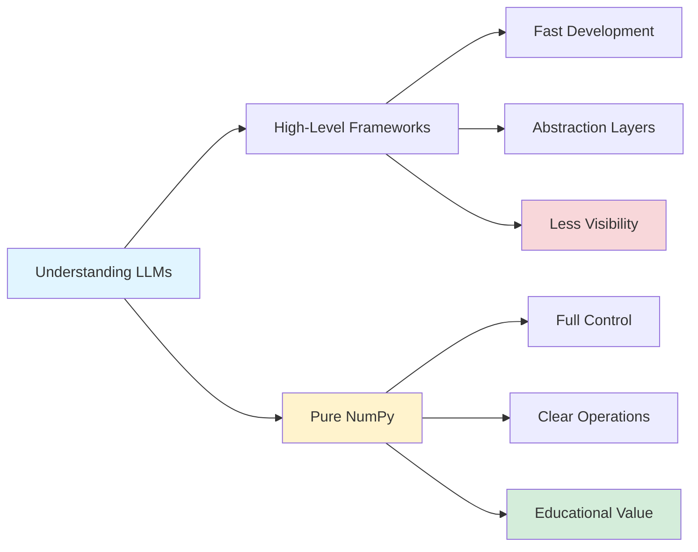
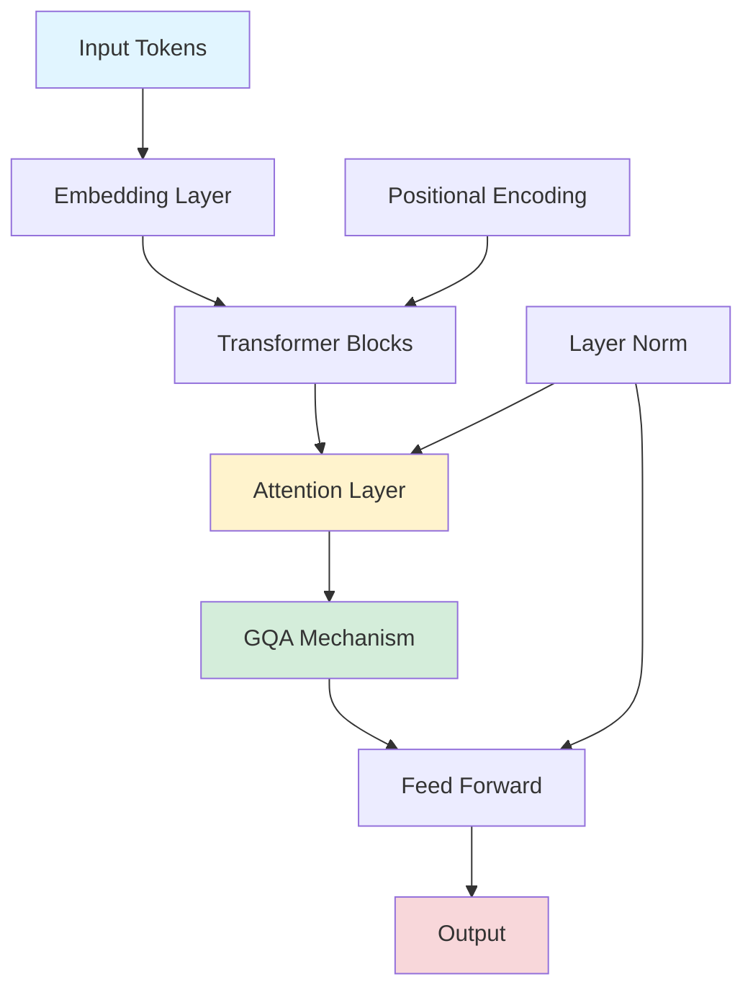

## 🦙 Llama 3 Implemented in Pure NumPy: Understanding LLMs from First Principles

*Curiosity:* How can we understand LLM architectures at the most fundamental level? What insights can we retrieve by implementing complex models using only basic NumPy operations?

**Implementing Llama 3 in pure NumPy** offers a unique opportunity to understand transformer architectures from first principles. This educational implementation, inspired by Andrej Karpathy's work, provides clarity and interpretability that high-level frameworks often obscure.

### Why Pure NumPy Implementation?



### Llama 3 Training Scale

*Retrieve:* The scale of Llama 3 training reveals the computational resources required for state-of-the-art models.

| Resource | Quantity | Impact |
|:---------|:---------|:-------|
| **GPUs** | 24,000 | Massive parallel processing |
| **Training Data** | 15T tokens | Comprehensive knowledge base |
| **Instruction Data** | 10M samples | Fine-tuning for alignment |
| **GPU Hours** | 1.3M hours | Extensive compute investment |

### Architecture Overview

**Key Insight**: Despite transitioning to GQA (Grouped Query Attention), the model structure remains unchanged from Llama 2, making it a familiar yet powerful framework.

```python
import numpy as np

class Llama3Attention:
    """Simplified Llama 3 attention mechanism in NumPy"""
    
    def __init__(self, dim, num_heads, head_dim):
        self.dim = dim
        self.num_heads = num_heads
        self.head_dim = head_dim
        
        # Weight matrices
        self.q_proj = np.random.randn(dim, num_heads * head_dim) * 0.02
        self.k_proj = np.random.randn(dim, num_heads * head_dim) * 0.02
        self.v_proj = np.random.randn(dim, num_heads * head_dim) * 0.02
        self.o_proj = np.random.randn(num_heads * head_dim, dim) * 0.02
    
    def forward(self, x, mask=None):
        """Forward pass of attention"""
        batch_size, seq_len, _ = x.shape
        
        # Project to Q, K, V
        Q = x @ self.q_proj  # [batch, seq, num_heads * head_dim]
        K = x @ self.k_proj
        V = x @ v_proj
        
        # Reshape for multi-head attention
        Q = Q.reshape(batch_size, seq_len, self.num_heads, self.head_dim)
        K = K.reshape(batch_size, seq_len, self.num_heads, self.head_dim)
        V = V.reshape(batch_size, seq_len, self.num_heads, self.head_dim)
        
        # Scaled dot-product attention
        scores = np.einsum('bshd,bthd->bsht', Q, K) / np.sqrt(self.head_dim)
        
        if mask is not None:
            scores = np.where(mask, scores, -np.inf)
        
        attn_weights = self.softmax(scores)
        output = np.einsum('bsht,bthd->bshd', attn_weights, V)
        
        # Reshape and project output
        output = output.reshape(batch_size, seq_len, -1)
        return output @ self.o_proj
    
    def softmax(self, x):
        """Numerically stable softmax"""
        exp_x = np.exp(x - np.max(x, axis=-1, keepdims=True))
        return exp_x / np.sum(exp_x, axis=-1, keepdims=True)
```

### GQA (Grouped Query Attention) Implementation

**Note**: While GQA is incorporated into the code structure, it's not applied to model behavior in this educational implementation, ensuring enhanced interpretability.



### Implementation Benefits

| Aspect | Benefit | Impact |
|:-------|:--------|:-------|
| **Educational** | Clear understanding of operations | ⬆️ Learning |
| **Interpretability** | See every computation step | ⬆️ Debugging |
| **Portability** | No framework dependencies | ⬆️ Accessibility |
| **Clarity** | Intuitive model structure | ⬆️ Understanding |

### Key Implementation Details

**1. Model Conversion**
- Leveraging stories15M model trained by Andrej Karpathy
- Converting to NumPy compressed format
- Maintaining clarity and precision

**2. Architecture Preservation**
- Llama 2 structure compatibility
- GQA integration (structural, not behavioral)
- Transformer block implementation

**3. Educational Focus**
- Step-by-step operations
- Clear mathematical formulations
- Practical examples

### Comparison: Framework vs. Pure NumPy

| Feature | PyTorch/TensorFlow | Pure NumPy |
|:--------|:-------------------|:-----------|
| **Speed** | ⚡⚡⚡ Very Fast | ⚡ Slower |
| **GPU Support** | ✅ Native | ❌ CPU only |
| **Abstraction** | High | Low |
| **Understanding** | ⚠️ Limited | ✅ Complete |
| **Educational Value** | ⚠️ Medium | ✅ High |

### Use Cases

*Retrieve:* Pure NumPy implementations are valuable for:
- Educational purposes
- Understanding model internals
- Debugging and verification
- Research and experimentation

*Innovate:* By understanding the fundamentals, you can:
- Optimize implementations
- Create custom architectures
- Debug complex issues
- Build domain-specific models

### Resources

**🧑‍💻 Code Repository**: <https://github.com/likejazz/llama3.np>

**Key Features**:
- Pure NumPy implementation
- Educational focus
- Clear documentation
- Karpathy-inspired approach

### Key Takeaways

*Retrieve:* Implementing Llama 3 in pure NumPy provides deep insights into transformer architectures, revealing the mathematical operations that power modern LLMs.

*Innovate:* By understanding these fundamentals, you can innovate on architectures, optimize implementations, and build custom solutions tailored to specific needs.

*Curiosity → Retrieve → Innovation:* Start with curiosity about how LLMs work, retrieve knowledge through hands-on implementation, and innovate by applying these insights to new problems.

**Next Steps**:
- Explore the GitHub repository
- Run the implementation
- Modify and experiment
- Build your own variations 


<object data="/assets/img/llm/Llama3_implemeted_in_pure_Numpy.pdf" width="100%" height="450" type='application/pdf'></object>


<details markdown="1">
<summary style= "font-size:24px; line-height:24px; font-weight:bold; cursor:pointer;" > Translate to Korean </summary>

* * * 

🦙 순수 NumPy👩 🔬로 구현된 라마 3

🚀 흥미 진진한 발견! @Andrej Karpathy에서 영감을 받아 NumPy에서 구현 된 Llama 3 모델에 대한 흥미로운 기사를 발견했습니다. AI at Meta 의 라마 3 모델은 인상적인 규모와 성능으로 파장을 일으키고 있습니다. 🌟

🧑 코드 : <https://github.com/likejazz/llama3.np>

🔍 24K GPU, 15T 훈련 데이터, 10M 명령 데이터 및 1.3M GPU 시간을 사용하면 그 수치는 정말 압도적입니다. GQA를 사용하기로 전환했음에도 불구하고 모델 구조는 Llama 2에서 변경되지 않아 친숙하면서도 강력한 프레임워크가 되었습니다.

🧠 이해를 돕기 위해 저자는 NumPy를 사용하여 정확하게 구현하는 데 중점을 두고 있습니다. Andrej Karpathy가 훈련한 stories15M 모델을 활용하여 보다 직관적인 모델 구조를 위해 NumPy 압축 형식으로 변환하고 있습니다. Karpathy가 훈련한 Llama 2 모델을 실행 가능한 코드로 변환하여 접근 방식의 명확성과 정밀도를 유지하는 동안 계속 지켜봐 주십시오.

📊 GQA를 코드에 통합하는 동안 작성자는 GQA를 모델 동작에 적용하지 않으므로 해석 가능성을 높이기 위해 NumPy를 원활하게 구현할 수 있습니다. 이 혁신적인 접근 방식에 대한 더 많은 통찰력을 계속 지켜봐 주십시오! 

</details>

