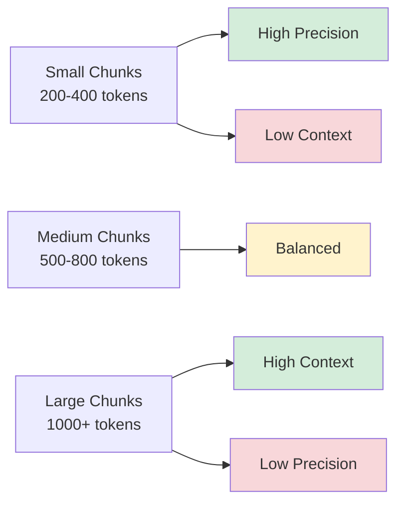

## RAG consists of three modules that you need to understand

**Retrieval module**, **Augmentation module**, and **Generation module**. 

First, the document which forms the source database is divided into chunks. These chunks, transformed into vectors using an embedding model like OpenAI or open source models available from Hugging Face community, are then embedded into a high-dimensional vector database (e.g., SingleStore Database, Chroma and LlamaIndex). 

When the user inputs a query, the query is embedded into a vector using the same embedding model. Then, chunks whose vectors are closest to the query vector, based on some similarity metrics (e.g., cosine similarity) are retrieved. This process is contained in the retrieval module shown in the figure. After that, the retrieved chunks are augmented to the user’s query and the system prompt in the augmentation module. 

This step is critical for making sure that the records from the retrieved documents are effectively incorporated with the query. Then, the output from the augmentation module is fed to the generation module which is responsible for generating an accurate answer to the query by utilizing the retrieved chunks and the prompt through an LLM (like chatGPT by OpenAI, hugging face, and Gemini by Google). 

*Curiosity:* But what makes RAG work *perfectly*? What are the hidden challenges that separate a working RAG system from an exceptional one?

After retrieving insights from multiple implementations and experimenting with various configurations, here are the key points to consider:

### Key Considerations for RAG Systems

*Innovate:* What makes RAG work perfectly.

| # | Consideration | Impact | Best Practice |
|:--|:--------------|:-------|:--------------|
| **1** | **Knowledge Source Quality** | Critical | Curated, domain-specific sources; validate accuracy |
| **2** | **Embedding Model** | High | Choose domain-similar models (e.g., `text-embedding-ada-002`, `sentence-transformers`) |
| **3** | **Chunk Size** | High | Experiment 200-1000 tokens; balance context vs. precision |
| **4** | **Retrieval Strategy** | High | Hybrid search (semantic + keyword); implement re-ranking |
| **5** | **Prompt Engineering** | Critical | Separate context from query; use few-shot examples |
| **6** | **Evaluation Metrics** | High | Track precision, recall, answer quality; use LLM-as-judge |
| **7** | **Error Handling** | Medium | Fallbacks for outdated/incorrect information |

### Sample RAG Implementation

*Innovate:* Practical Python example using LangChain.

```python
from langchain.embeddings import OpenAIEmbeddings
from langchain.vectorstores import Chroma
from langchain.text_splitter import RecursiveCharacterTextSplitter
from langchain.chains import RetrievalQA
from langchain.llms import OpenAI

# Step 1: Load and chunk documents
text_splitter = RecursiveCharacterTextSplitter(
    chunk_size=1000,
    chunk_overlap=200
)
documents = text_splitter.split_documents(your_documents)

# Step 2: Create embeddings and vector store
embeddings = OpenAIEmbeddings()
vectorstore = Chroma.from_documents(
    documents=documents,
    embedding=embeddings
)

# Step 3: Create retrieval chain
qa_chain = RetrievalQA.from_chain_type(
    llm=OpenAI(temperature=0),
    chain_type="stuff",
    retriever=vectorstore.as_retriever(
        search_kwargs={"k": 3}  # Retrieve top 3 chunks
    ),
    return_source_documents=True
)

# Step 4: Query
query = "What is the main topic of this document?"
result = qa_chain({"query": query})
print(result["result"])
```

### Chunk Size Trade-offs

*Retrieve:* Understanding chunk size impact.



**Recommendation**: Experiment with different chunk sizes (200-1000 tokens) to find optimal balance for your use case.

### Key Takeaways

*Retrieve:* RAG consists of three modules (Retrieval, Augmentation, Generation) that work together to enable LLMs to answer questions using external knowledge sources.

*Innovate:* By systematically addressing key considerations—knowledge source quality, embedding models, chunk sizes, retrieval strategies, prompt engineering, evaluation, and error handling—you can build exceptional RAG systems that work perfectly.

*Curiosity → Retrieve → Innovation:* Start with curiosity about RAG systems, retrieve insights from systematic workflow considerations, and innovate by building RAG applications that effectively combine retrieval, augmentation, and generation.

**Next Steps**:
- Understand the three modules
- Implement sample RAG system
- Optimize chunk sizes
- Evaluate and iterate


{: .light .w-75 .shadow .rounded-10 w='1212' h='668' }


<details markdown="1">
<summary style= "font-size:24px; line-height:24px; font-weight:bold; cursor:pointer;" > Translate to Korean </summary>

* * * 

## RAG는 이해해야 할 세 가지 모듈로 구성되어 있습니다!

**검색 모듈, 증강 모듈 및 생성 모듈.**

먼저 원본 데이터베이스를 형성하는 문서를 청크로 나눕니다. OpenAI와 같은 임베딩 모델 또는 Hugging Face 커뮤니티에서 사용할 수 있는 오픈 소스 모델을 사용하여 벡터로 변환된 이러한 청크는 고차원 벡터 데이터베이스(예: SingleStore Database, Chroma 및 LlamaIndex)에 포함됩니다. 

사용자가 쿼리를 입력하면 쿼리가 동일한 임베딩 모델을 사용하여 벡터에 포함됩니다. 그런 다음 일부 유사성 메트릭(예: 코사인 유사성)을 기반으로 벡터가 쿼리 벡터에 가장 가까운 청크가 검색됩니다. 이 프로세스는 그림에 표시된 검색 모듈에 포함되어 있습니다. 그 후, 검색된 청크는 augmentation 모듈의 사용자 쿼리 및 시스템 프롬프트로 보강됩니다. 

이 단계는 검색된 문서의 레코드가 쿼리에 효과적으로 통합되도록 하는 데 중요합니다. 그런 다음 증강 모듈의 출력은 검색된 청크와 LLM(예: OpenAI의 chatGPT, hugging face, Google의 Gemini)을 통한 프롬프트를 활용하여 쿼리에 대한 정확한 답변을 생성하는 생성 모듈에 공급됩니다. 

그러나 RAG가 완벽하게 작동하도록 하려면 다음과 같은 몇 가지 핵심 사항을 고려해야 합니다.
1. 외부 지식 소스의 품질: 검색에 사용되는 외부 지식 소스의 품질과 관련성은 매우 중요합니다.

2. 임베딩 모델: 지식 소스에서 관련 문서 또는 구절을 검색하는 데 사용되는 임베딩 모델의 선택이 중요합니다.

3. 청크 크기 및 검색 전략: 다양한 청크 크기를 실험하여 컨텍스트 검색을 위한 최적의 길이를 찾습니다. 청크가 클수록 더 많은 컨텍스트를 제공할 수 있지만 관련 없는 정보가 도입될 수도 있습니다. 더 작은 청크는 특정 세부 사항에 초점을 맞출 수 있지만 더 넓은 컨텍스트가 부족할 수 있습니다.

4. 언어 모델과의 통합: 검색된 정보가 언어 모델의 생성 프로세스와 통합되는 방식이 중요합니다. 크로스 어텐션 또는 메모리 증강 아키텍처와 같은 기술을 사용하여 검색된 정보를 모델의 출력에 효과적으로 통합할 수 있습니다.

5. 평가 및 미세 조정: 관련 데이터 세트 및 작업에 대한 RAG 모델의 성능을 평가하는 것은 개선이 필요한 영역을 식별하는 데 중요합니다. 도메인별 또는 작업별 데이터에서 RAG 모델을 미세 조정하면 성능이 더욱 향상될 수 있습니다.

6. 윤리적 고려 사항: 외부 지식 출처가 편향되지 않고 공격적이거나 오해의 소지가 있는 정보를 포함하지 않도록 합니다.

7. 오래되었거나 잘못된 정보 처리: 검색된 정보가 오래되었거나 잘못된 상황을 처리하기 위한 전략을 마련하는 것이 중요합니다.

</details>