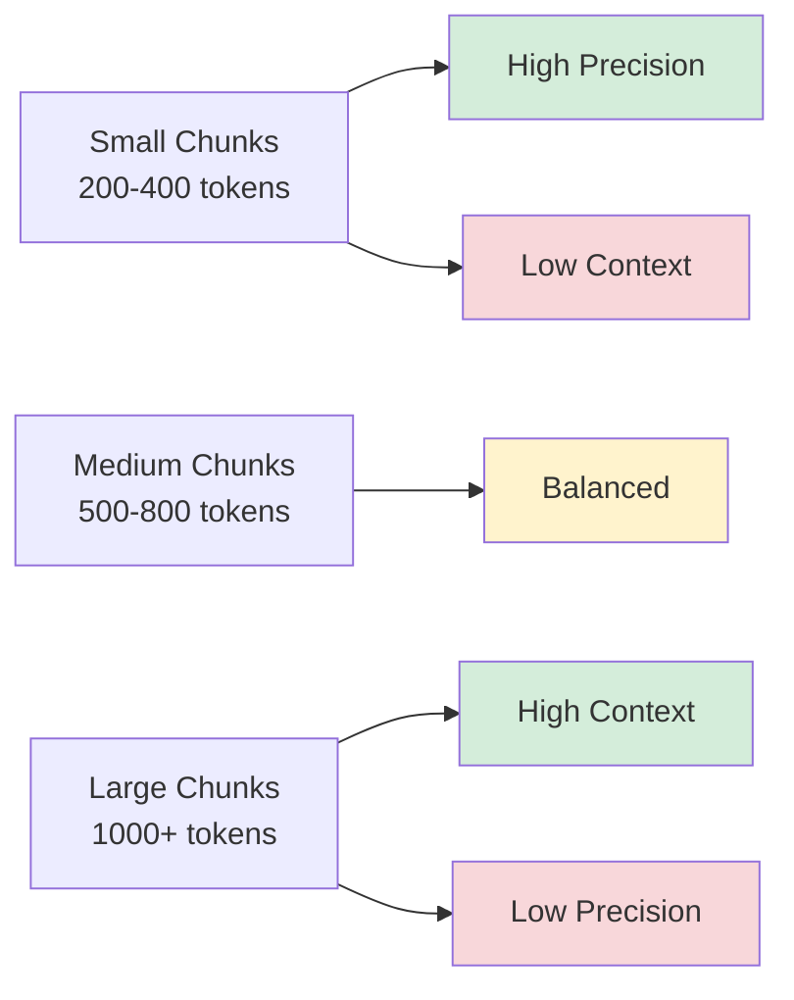

## RAG consists of three modules that you need to understand

**Retrieval module**, **Augmentation module**, and **Generation module**. 

First, the document which forms the source database is divided into chunks. These chunks, transformed into vectors using an embedding model like OpenAI or open source models available from Hugging Face community, are then embedded into a high-dimensional vector database (e.g., SingleStore Database, Chroma and LlamaIndex). 

When the user inputs a query, the query is embedded into a vector using the same embedding model. Then, chunks whose vectors are closest to the query vector, based on some similarity metrics (e.g., cosine similarity) are retrieved. This process is contained in the retrieval module shown in the figure. After that, the retrieved chunks are augmented to the user’s query and the system prompt in the augmentation module. 

This step is critical for making sure that the records from the retrieved documents are effectively incorporated with the query. Then, the output from the augmentation module is fed to the generation module which is responsible for generating an accurate answer to the query by utilizing the retrieved chunks and the prompt through an LLM (like chatGPT by OpenAI, hugging face, and Gemini by Google). 

*Curiosity:* But what makes RAG work *perfectly*? What are the hidden challenges that separate a working RAG system from an exceptional one?

After retrieving insights from multiple implementations and experimenting with various configurations, here are the key points to consider:

### Key Considerations for RAG Systems

*Innovate:* What makes RAG work perfectly.

| # | Consideration | Impact | Best Practice |
|:--|:--------------|:-------|:--------------|
| **1** | **Knowledge Source Quality** | Critical | Curated, domain-specific sources; validate accuracy |
| **2** | **Embedding Model** | High | Choose domain-similar models (e.g., `text-embedding-ada-002`, `sentence-transformers`) |
| **3** | **Chunk Size** | High | Experiment 200-1000 tokens; balance context vs. precision |
| **4** | **Retrieval Strategy** | High | Hybrid search (semantic + keyword); implement re-ranking |
| **5** | **Prompt Engineering** | Critical | Separate context from query; use few-shot examples |
| **6** | **Evaluation Metrics** | High | Track precision, recall, answer quality; use LLM-as-judge |
| **7** | **Error Handling** | Medium | Fallbacks for outdated/incorrect information |

### Sample RAG Implementation

*Innovate:* Practical Python example using LangChain.

```python
from langchain.embeddings import OpenAIEmbeddings
from langchain.vectorstores import Chroma
from langchain.text_splitter import RecursiveCharacterTextSplitter
from langchain.chains import RetrievalQA
from langchain.llms import OpenAI

# Step 1: Load and chunk documents
text_splitter = RecursiveCharacterTextSplitter(
    chunk_size=1000,
    chunk_overlap=200
)
documents = text_splitter.split_documents(your_documents)

# Step 2: Create embeddings and vector store
embeddings = OpenAIEmbeddings()
vectorstore = Chroma.from_documents(
    documents=documents,
    embedding=embeddings
)

# Step 3: Create retrieval chain
qa_chain = RetrievalQA.from_chain_type(
    llm=OpenAI(temperature=0),
    chain_type="stuff",
    retriever=vectorstore.as_retriever(
        search_kwargs={"k": 3}  # Retrieve top 3 chunks
    ),
    return_source_documents=True
)

# Step 4: Query
query = "What is the main topic of this document?"
result = qa_chain({"query": query})
print(result["result"])
```

### Chunk Size Trade-offs

*Retrieve:* Understanding chunk size impact.


```mermaid
graph LR
    A[Small Chunks<br/>200-400 tokens] --> B[High Precision]
    A --> C[Low Context]
    D[Medium Chunks<br/>500-800 tokens] --> E[Balanced]
    F[Large Chunks<br/>1000+ tokens] --> G[High Context]
    F --> H[Low Precision]
    
    style B fill:#d4edda
    style C fill:#f8d7da
    style E fill:#fff3cd
    style G fill:#d4edda
    style H fill:#f8d7da
```

**Recommendation**: Experiment with different chunk sizes (200-1000 tokens) to find optimal balance for your use case.

### Key Takeaways

*Retrieve:* RAG consists of three modules (Retrieval, Augmentation, Generation) that work together to enable LLMs to answer questions using external knowledge sources.

*Innovate:* By systematically addressing key considerations—knowledge source quality, embedding models, chunk sizes, retrieval strategies, prompt engineering, evaluation, and error handling—you can build exceptional RAG systems that work perfectly.

*Curiosity → Retrieve → Innovation:* Start with curiosity about RAG systems, retrieve insights from systematic workflow considerations, and innovate by building RAG applications that effectively combine retrieval, augmentation, and generation.

**Next Steps**:
- Understand the three modules
- Implement sample RAG system
- Optimize chunk sizes
- Evaluate and iterate


{: .light .w-75 .shadow .rounded-10 w='1212' h='668' }


<details markdown="1">
<summary style= "font-size:24px; line-height:24px; font-weight:bold; cursor:pointer;" > Translate to Korean </summary>

* * * 

## RAG Consists of Three Modules You Need to Understand!

**The Retrieval Module, Augmentation Module, and Generation Module.**

First, the document that forms the source database is divided into chunks. These chunks, transformed into vectors using an embedding model like OpenAI or open-source models available from the Hugging Face community, are then embedded into a high-dimensional vector database (e.g., SingleStore Database, Chroma, and LlamaIndex). 

When the user inputs a query, the query is embedded into a vector using the same embedding model. Then, chunks whose vectors are closest to the query vector, based on some similarity metrics (e.g., cosine similarity), are retrieved. This process is contained in the retrieval module shown in the figure. After that, the retrieved chunks are augmented to the user's query and the system prompt in the augmentation module. 

This step is critical for making sure that the records from the retrieved documents are effectively incorporated with the query. Then, the output from the augmentation module is fed to the generation module, which is responsible for generating an accurate answer to the query by utilizing the retrieved chunks and the prompt through an LLM (e.g., chatGPT by OpenAI, Hugging Face, and Gemini by Google). 

However, to make RAG work perfectly, there are several key points to consider:
1. Quality of External Knowledge Sources: The quality and relevance of external knowledge sources used for retrieval is critical.

2. Embedding Model: The choice of embedding model used to retrieve relevant documents or passages from knowledge sources is important.

3. Chunk Size and Retrieval Strategy: Experiment with various chunk sizes to find the optimal length for context retrieval. Larger chunks can provide more context but may also introduce irrelevant information. Smaller chunks can focus on specific details but may lack broader context.

4. Integration with Language Models: How the retrieved information is integrated with the language model's generation process is important. Techniques such as cross-attention or memory-augmented architectures can be used to effectively incorporate retrieved information into the model's output.

5. Evaluation and Fine-Tuning: Evaluating the performance of the RAG model on relevant datasets and tasks is important for identifying areas that need improvement. Fine-tuning the RAG model on domain-specific or task-specific data can further improve performance.

6. Ethical Considerations: Ensure that external knowledge sources are unbiased and do not contain offensive or misleading information.

7. Handling Outdated or Incorrect Information: It is important to have strategies in place for handling situations where retrieved information is outdated or incorrect.

</details>
