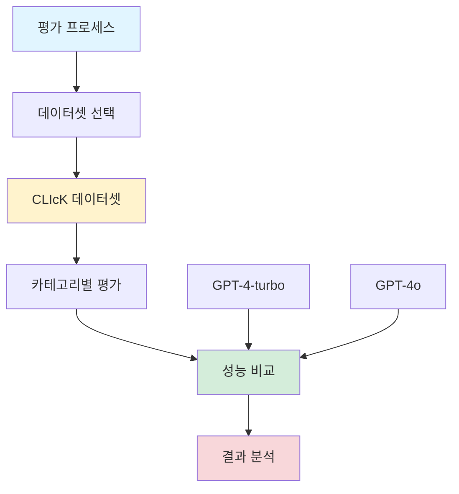

## LLM 성능 평가: 한국어 Use Case 분석

*Curiosity:* GPT-4o가 한국어에서 GPT-4-turbo보다 얼마나 더 나은 성능을 보일까? 정량적 평가를 통해 어떤 인사이트를 얻을 수 있을까?

**한줄 요약**: GPT-4o가 GPT-4-turbo보다 한국어에서 더 우수한 성능을 보입니다!

### 평가 배경

*Retrieve:* 팀에서 GPT-4o 도입을 검토했지만, 한국어 벤치마크 평가 결과가 부족하여 직접 정량적 평가를 수행했습니다.

**평가 목적**:
- GPT-4o vs GPT-4-turbo 한국어 성능 비교
- 정량적 메트릭 기반 객관적 평가
- 실무 적용 가능성 검증

### 평가 방법론

### 데이터셋: CLIcK

*Retrieve:* KAIST Alice Oh 교수님 랩실에서 제작한 한국어, 한국문화 데이터셋을 사용했습니다.

| 데이터셋 | 설명 | 특징 |
|:---------|:-----|:-----|
| **CLIcK** | 한국어/한국문화 데이터셋 | 문화적 맥락 포함 |
| **출처** | KAIST Alice Oh Lab | 학술적 신뢰성 |
| **용도** | 한국어 LLM 평가 | 실무 적합성 |

### 평가 결과

**결론**: GPT-4o가 GPT-4-turbo보다 **모든 카테고리에서 우수한 성능**을 보였습니다.

| 카테고리 | GPT-4-turbo | GPT-4o | 개선도 |
|:---------|:------------|:-------|:-------|
| **전체 평균** | Baseline | ⬆️ Better | 모든 카테고리 |
| **세부 카테고리** | - | ⬆️ 우수 | 일관된 향상 |

### 평가 프로세스

**1. 데이터 준비**
- CLIcK 데이터셋 로드
- 카테고리별 분류
- 평가 케이스 준비

**2. 모델 평가**
- GPT-4-turbo 실행
- GPT-4o 실행
- 결과 수집

**3. 성능 비교**
- 카테고리별 분석
- 정량적 메트릭 계산
- 시각화 (GPT-4o가 그래프 생성)

### 코드 및 리소스

**👉 GitHub Repository**: <https://github.com/corca-ai/evaluating-gpt-4o-on-CLIcK>

**포함 내용**:
- 평가 코드 (재현 가능)
- 결과 데이터
- 시각화 그래프
- 상세 메트릭

**코드 리뷰**: 평가 과정의 투명성을 위해 코드를 공개하여 검증 가능하도록 했습니다.

### 평가의 신뢰성

| 측면 | 보장 사항 | 이유 |
|:-----|:----------|:-----|
| **정량적 평가** | 객관적 메트릭 | 수치 기반 비교 |
| **코드 공개** | 재현 가능성 | 검증 가능 |
| **학술 데이터셋** | 신뢰성 | CLIcK 사용 |
| **카테고리별 분석** | 세부 인사이트 | 포괄적 평가 |

### 향후 계획

*Innovate:* 한국어 벤치마크에 대한 SOTA LLM 평가를 지속적으로 진행할 예정입니다.

**다음 단계**:
- 추가 모델 평가
- 다양한 벤치마크 적용
- 실무 Use Case 확장

**제안 요청**: 테스트해볼 모델이나 벤치마크가 있으면 댓글로 제안해주세요!

### Key Takeaways

*Retrieve:* 정량적 평가를 통해 GPT-4o가 한국어에서 GPT-4-turbo보다 모든 카테고리에서 우수한 성능을 보임을 확인했습니다.

*Innovate:* 공개된 평가 코드와 방법론을 활용하여 다른 모델들도 체계적으로 평가하고, 한국어 LLM 성능에 대한 인사이트를 확장할 수 있습니다.

*Curiosity → Retrieve → Innovation:* 한국어 성능에 대한 호기심으로 시작하여, 정량적 평가를 통해 지식을 습득하고, 이를 바탕으로 실무 적용을 혁신합니다.

**다음 단계**:
- GitHub에서 평가 코드 확인
- 다른 모델 평가 적용
- 한국어 벤치마크 확장