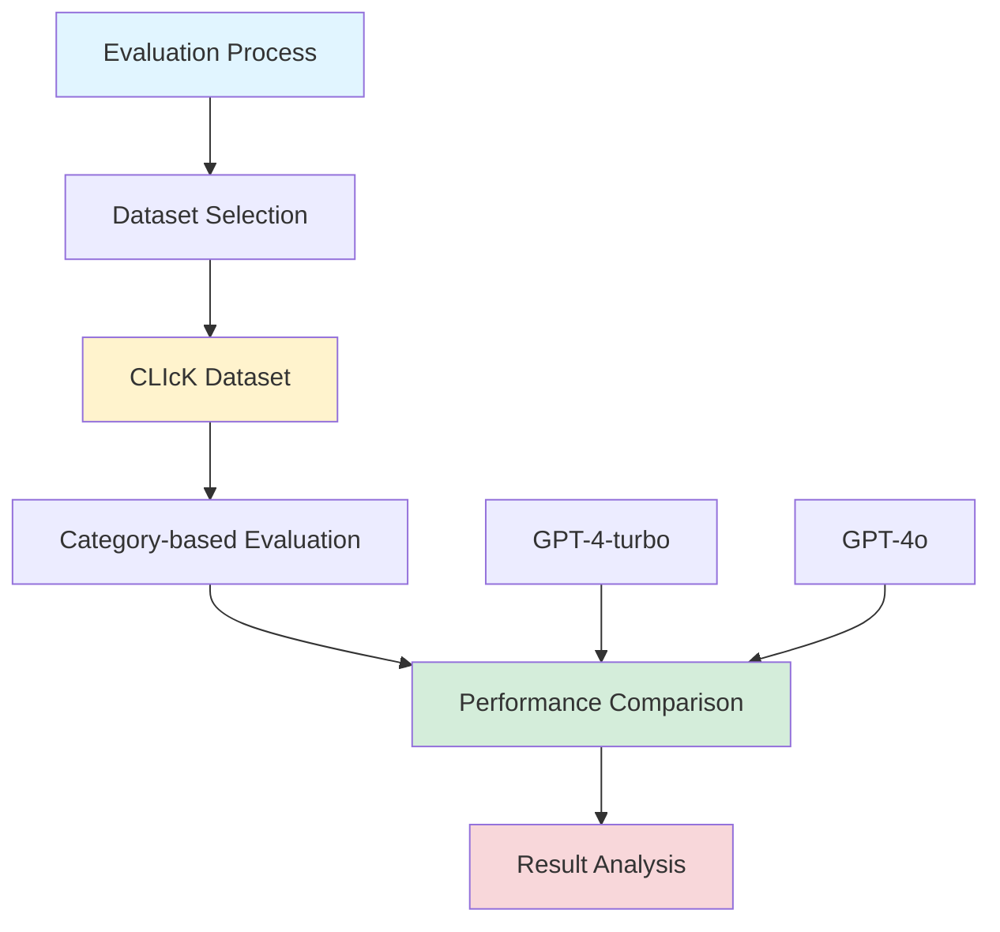

## LLM Performance Evaluation: Korean Use Case Analysis

*Curiosity:* How much better does GPT-4o perform than GPT-4-turbo in Korean? What insights can we gain through quantitative evaluation?

**One-line summary**: GPT-4o shows superior performance over GPT-4-turbo in Korean!

### Evaluation Background

*Retrieve:* The team considered adopting GPT-4o, but due to insufficient Korean benchmark evaluation results, we conducted our own quantitative evaluation.

**Evaluation Objectives**:
- GPT-4o vs GPT-4-turbo Korean performance comparison
- Objective evaluation based on quantitative metrics
- Verification of practical applicability

### Evaluation Methodology

```mermaid
graph TB
    A[Evaluation Process] --> B[Dataset Selection]
    B --> C[CLIcK Dataset]
    C --> D[Category-based Evaluation]
    D --> E[Performance Comparison]
    E --> F[Result Analysis]
    
    G[GPT-4-turbo] --> E
    H[GPT-4o] --> E
    
    style A fill:#e1f5ff
    style C fill:#fff3cd
    style E fill:#d4edda
    style F fill:#f8d7da
```

### Dataset: CLIcK

*Retrieve:* We used a Korean language and Korean culture dataset created by the KAIST Alice Oh Lab.

| Dataset | Description | Features |
|:---------|:-----|:-----|
| **CLIcK** | Korean language/culture dataset | Includes cultural context |
| **Source** | KAIST Alice Oh Lab | Academic reliability |
| **Purpose** | Korean LLM evaluation | Practical suitability |

### Evaluation Results

**Conclusion**: GPT-4o showed **superior performance in all categories** compared to GPT-4-turbo.

| Category | GPT-4-turbo | GPT-4o | Improvement |
|:---------|:------------|:-------|:-------|
| **Overall Average** | Baseline | ⬆️ Better | All categories |
| **Sub-categories** | - | ⬆️ Superior | Consistent improvement |

### Evaluation Process

**1. Data Preparation**
- Load CLIcK dataset
- Classification by category
- Prepare evaluation cases

**2. Model Evaluation**
- Run GPT-4-turbo
- Run GPT-4o
- Collect results

**3. Performance Comparison**
- Analysis by category
- Calculate quantitative metrics
- Visualization (GPT-4o generated graphs)

### Code and Resources

**👉 GitHub Repository**: <https://github.com/corca-ai/evaluating-gpt-4o-on-CLIcK>

**Included Content**:
- Evaluation code (reproducible)
- Result data
- Visualization graphs
- Detailed metrics

**Code Review**: We open-sourced the code for transparency in the evaluation process, enabling verification.

### Evaluation Reliability

| Aspect | Guarantee | Reason |
|:-----|:----------|:-----|
| **Quantitative Evaluation** | Objective metrics | Number-based comparison |
| **Open Source Code** | Reproducibility | Verifiable |
| **Academic Dataset** | Reliability | Uses CLIcK |
| **Category Analysis** | Detailed insights | Comprehensive evaluation |

### Future Plans

*Innovate:* We plan to continuously conduct SOTA LLM evaluations on Korean benchmarks.

**Next Steps**:
- Evaluate additional models
- Apply diverse benchmarks
- Expand practical use cases

**Suggestions Welcome**: If you have models or benchmarks to test, please suggest them in the comments!

### Key Takeaways

*Retrieve:* Through quantitative evaluation, we confirmed that GPT-4o shows superior performance over GPT-4-turbo in all categories for Korean.

*Innovate:* By leveraging the open-sourced evaluation code and methodology, other models can also be systematically evaluated, expanding insights on Korean LLM performance.

*Curiosity → Retrieve → Innovation:* Starting with curiosity about Korean performance, acquiring knowledge through quantitative evaluation, and innovating practical applications based on these findings.

**Next Steps**:
- Review evaluation code on GitHub
- Apply evaluation to other models
- Expand Korean benchmarks
