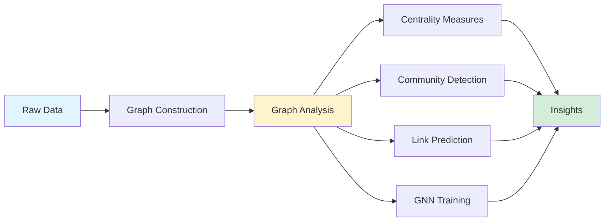

## Power of Graph Analytics: Algorithms, Types, Techniques and 25 Top Python Libraries

*Curiosity:* How can we extract valuable insights from complex, interconnected data? What makes graph analytics powerful for understanding relationships between entities?

**Graph Analytics** extracts valuable insights from complex, interconnected data by representing relationships between entities through nodes and edges.

————————————

### Graph Composition

*Retrieve:* Basic graph structure.

| Component | Description | Purpose |
|:----------|:------------|:--------|
| **Nodes** | Represent entities | ⬆️ Core elements |
| **Edges** | Link between entities | ⬆️ Relationships |

### Goals of Graph Analytics

*Retrieve:* Primary objectives.

**Goals**:
- ✅ Identify key entities and their relationships
- ✅ Discover patterns and anomalies in large-scale datasets
- ✅ Generate recommendations and predictions based on past behavior
- ✅ Uncover community structures within networks
- ✅ Predict missing links and uncover hidden connections

### Types of Graph Analytics

*Innovate:* Five main categories.

**1. Graph Neural Networks (GNN)**

*Retrieve:* Deep learning on graphs.

**Definition**: Class of deep learning models operating directly on graph structures.

**Examples**:
- Graph Convolutional Networks (GCN)
- Graph Attention Networks (GAT)
- GraphSAGE

**2. Feature Extraction with Centrality Measures**

*Retrieve:* Identifying important nodes.

**Purpose**: Identify the most important nodes in a graph.

**Examples**:
- Degree
- Betweenness
- Eigenvector
- PageRank
- Katz

**3. Clustering**

*Retrieve:* Grouping similar nodes.

**Purpose**: Group nodes into clusters based on structural similarity.

**Examples**:
- Girvan-Newman
- Markov Cluster (MCL)
- Hierarchical Agglomerative Clustering (HAC)

**4. Link Prediction**

*Retrieve:* Predicting missing connections.

**Purpose**: Predict missing links in a graph.

**Examples**:
- Louvain
- Infomap
- Walktrap

**5. Community Detection**

*Retrieve:* Finding dense groups.

**Purpose**: Identify groups of nodes densely connected within themselves but sparsely connected with the rest.

**Examples**:
- Girvan-Newman
- Clauset-Newman-Moore
- Label Propagation
- Walktrap
- Fastgreedy

————————————

### Graph Analytics Techniques

*Innovate:* Core analytical methods.

| Technique | Description | Use Case |
|:----------|:------------|:---------|
| **Graph Traversal** | Visit every node systematically | ⬆️ Exploration |
| **Shortest Path** | Find shortest path between nodes | ⬆️ Routing |
| **Connected Components** | Identify connected node groups | ⬆️ Clustering |
| **Minimum Spanning Tree** | Minimum edges to connect all nodes | ⬆️ Optimization |
| **Maximum Flow** | Maximum flow through graph | ⬆️ Network analysis |

### Top 25 Python Libraries

*Retrieve:* Comprehensive library list.

**Core Libraries**:

| Library | Category | Description |
|:--------|:---------|:------------|
| **NetworkX** | Core | General-purpose graph library |
| **igraph** | Core | Fast graph analysis |
| **PyTorch Geometric** | GNN | Deep learning on graphs |
| **Deep Graph Library (DGL)** | GNN | Graph neural networks |
| **Spektral** | GNN | Keras/TensorFlow GNNs |
| **karateclub** | Community | Community detection |
| **CDlib** | Community | Community detection algorithms |
| **leidenalg** | Community | Leiden algorithm |
| **graph-tool** | Analysis | Efficient graph analysis |
| **SNAP.py** | Analysis | Stanford Network Analysis |
| **scikit-network** | Analysis | Scikit-learn for graphs |
| **NetworKit** | Analysis | High-performance network analysis |
| **Gephi** | Visualization | Graph visualization |
| **nxviz** | Visualization | NetworkX visualization |
| **PyGraphistry** | Visualization | Interactive graph visualization |
| **Grakel** | Kernels | Graph kernels |
| **Graphein** | Biology | Protein graphs |
| **markov-clustering** | Clustering | MCL algorithm |
| **pyclustering** | Clustering | Clustering algorithms |
| **stellargraph** | GNN | StellarGraph library |
| **PyG** | GNN | PyTorch Geometric |
| **Python-I graph** | Core | Python interface to igraph |
| **Grakn** | Database | Knowledge graph database |
| **Tulip** | Visualization | Graph visualization |
| **PowerGraph** | Distributed | Distributed graph processing |

### Graph Analytics Workflow

*Innovate:* Typical analysis process.

### Key Takeaways

*Retrieve:* Graph analytics extracts insights from interconnected data using nodes and edges, with five main types (GNNs, centrality, clustering, link prediction, community detection) and 25+ Python libraries available.

*Innovate:* By leveraging graph analytics techniques and libraries, you can identify key entities, discover patterns, generate recommendations, uncover communities, and predict connections in complex networks.

*Curiosity → Retrieve → Innovation:* Start with curiosity about graph analytics, retrieve insights from available techniques and libraries, and innovate by applying graph analysis to your interconnected data problems.

**Next Steps**:
- Choose appropriate library
- Construct graph from data
- Apply analysis techniques
- Extract insights 

{: .light .w-75 .shadow .rounded-10 w='1212' h='668' }

 Translate to Korean 

* * * 

## 그래프 분석의 힘: 알고리즘, 유형, 기법 및 25개의 상위 Python 라이브러리 📚

Graph Analytics는 엔터티 간의 관계를 나타내는 기능을 통해 복잡하고 상호 연결된 데이터에서 귀중한 인사이트를 추출합니다.

————————————

#### 그래프 구성:

- 노드: 엔터티를 나타냅니다.
- Edge: 개체 간 링크

————————————

#### 그래프 분석의 목표:

* 주요 엔터티 및 해당 관계 식별
* 대규모 데이터 세트에서 패턴과 변칙 발견
* 과거 행동을 기반으로 권장 사항 및 예측 생성
* 네트워크 내 커뮤니티 구조 파악
* 누락 된 링크를 예측하고 숨겨진 연결을 발견하십시오.

————————————

#### 그래프 분석 유형 :

1. 그래프 신경망 (GNN) :

그래프 구조에서 직접 작동하는 딥러닝 모델의 한 클래스입니다.

GNN의 예는 다음과 같습니다.
- (O) 그래프 합성곱 네트워크(GCN)
- (O) 그래프 어텐션 네트워크(GAT)
- (O) 그래프세이지

—-

2. 중심성 측정을 통한 특징 추출:

중심성 측정은 그래프에서 가장 중요한 노드를 식별하는 것을 목표로 합니다. 

몇 가지 예는 다음과 같습니다.
- (O) 정도
- (O) 중간성
- (O) 고유벡터
- (O) 페이지랭크
- (O) 카츠

——
3. 클러스터링:

노드를 구조적 유사성에 따라 클러스터로 그룹화하는 것을 목표로 합니다. 

몇 가지 예는 다음과 같습니다.
- (O) 거번-뉴먼 
- (O) 마르코프 성단(MCL)
- (O) 계층적 응집 클러스터링(HAC)

——
4. 링크 예측:

그래프에서 누락된 링크를 예측하는 것을 목표로 합니다. 

몇 가지 예는 다음과 같습니다.
- (O) 루뱅
- (O) 인포맵
- (O) 보행용

——
5. 커뮤니티 감지: 

자체 내부에는 조밀하게 연결되어 있지만 네트워크의 나머지 부분과는 드물게 연결된 노드 그룹을 식별하는 것을 목표로 합니다. 

몇 가지 예는 다음과 같습니다.
- (O) 거번-뉴먼
- (O) 클라우제트-뉴먼-무어
- (O) 라벨 전파
- (O) 보행용
- (O) 빠른 욕심

————————————

#### 그래프 분석 기법:

- ➊ 그래프 순회: 일반적으로 체계적인 순서로 그래프의 모든 노드를 방문합니다.

- ➋ 최단 경로: 그래프에서 두 노드 사이의 최단 경로를 찾는 것을 목표로 합니다.

- ➌ 연결된 구성 요소: 모두 서로 연결된 노드 그룹을 식별합니다.

- ➍ 최소 스패닝 트리: 그래프의 모든 노드를 연결하는 데 필요한 최소 에지 세트를 찾습니다.

- ➎ 최대 흐름: 가장자리에 대한 제약 조건이 주어지면 그래프를 통과할 수 있는 최대 흐름량을 찾습니다.

————————————

#### 나는 foll 25 파이썬 라이브러리를 발견했다 :

- 📚 네트워크X
- 📚 아이그래프
- 📚 가라테 클럽
- 📚 그래프 도구
- 📚 SNAP.py
- 📚 딥 그래프 라이브러리(DGL)
- 📚 PyTorch 기하학
- 📚 스펙트랄
- 📚 스텔라그래프
- 📚 scikit-네트워크
- 📚 CDlib (영문)
- 📚 라이데날그(Leidenalg)
- 📚 markov 클러스터링
- 📚 파이클러스터링
- 📚 그래핀
- 📚 NXVIZ (영문)
- 📚 그라크
- 📚 튤립
- 📚 파워그래프(PowerGraph)
- 📚 게피
- 📚 파이지
- 📚 Python-I 그래프
- 📚 넷웍킷
- 📚 그라켈 
- 📚 PyGraphistry(파이그래피스트리) 

