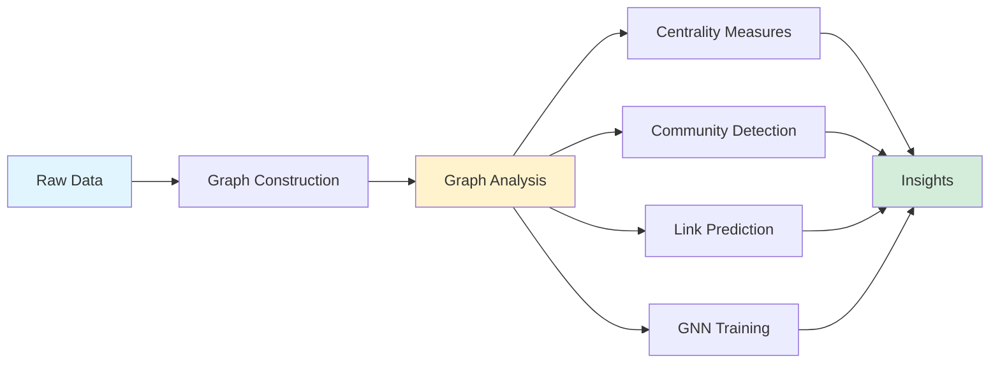

## Power of Graph Analytics: Algorithms, Types, Techniques and 25 Top Python Libraries

*Curiosity:* How can we extract valuable insights from complex, interconnected data? What makes graph analytics powerful for understanding relationships between entities?

**Graph Analytics** extracts valuable insights from complex, interconnected data by representing relationships between entities through nodes and edges.

————————————

### Graph Composition

*Retrieve:* Basic graph structure.

| Component | Description | Purpose |
|:----------|:------------|:--------|
| **Nodes** | Represent entities | ⬆️ Core elements |
| **Edges** | Link between entities | ⬆️ Relationships |

### Goals of Graph Analytics

*Retrieve:* Primary objectives.

**Goals**:
- ✅ Identify key entities and their relationships
- ✅ Discover patterns and anomalies in large-scale datasets
- ✅ Generate recommendations and predictions based on past behavior
- ✅ Uncover community structures within networks
- ✅ Predict missing links and uncover hidden connections

### Types of Graph Analytics

*Innovate:* Five main categories.

**1. Graph Neural Networks (GNN)**

*Retrieve:* Deep learning on graphs.

**Definition**: Class of deep learning models operating directly on graph structures.

**Examples**:
- Graph Convolutional Networks (GCN)
- Graph Attention Networks (GAT)
- GraphSAGE

**2. Feature Extraction with Centrality Measures**

*Retrieve:* Identifying important nodes.

**Purpose**: Identify the most important nodes in a graph.

**Examples**:
- Degree
- Betweenness
- Eigenvector
- PageRank
- Katz

**3. Clustering**

*Retrieve:* Grouping similar nodes.

**Purpose**: Group nodes into clusters based on structural similarity.

**Examples**:
- Girvan-Newman
- Markov Cluster (MCL)
- Hierarchical Agglomerative Clustering (HAC)

**4. Link Prediction**

*Retrieve:* Predicting missing connections.

**Purpose**: Predict missing links in a graph.

**Examples**:
- Louvain
- Infomap
- Walktrap

**5. Community Detection**

*Retrieve:* Finding dense groups.

**Purpose**: Identify groups of nodes densely connected within themselves but sparsely connected with the rest.

**Examples**:
- Girvan-Newman
- Clauset-Newman-Moore
- Label Propagation
- Walktrap
- Fastgreedy

————————————

### Graph Analytics Techniques

*Innovate:* Core analytical methods.

| Technique | Description | Use Case |
|:----------|:------------|:---------|
| **Graph Traversal** | Visit every node systematically | ⬆️ Exploration |
| **Shortest Path** | Find shortest path between nodes | ⬆️ Routing |
| **Connected Components** | Identify connected node groups | ⬆️ Clustering |
| **Minimum Spanning Tree** | Minimum edges to connect all nodes | ⬆️ Optimization |
| **Maximum Flow** | Maximum flow through graph | ⬆️ Network analysis |

### Top 25 Python Libraries

*Retrieve:* Comprehensive library list.

**Core Libraries**:

| Library | Category | Description |
|:--------|:---------|:------------|
| **NetworkX** | Core | General-purpose graph library |
| **igraph** | Core | Fast graph analysis |
| **PyTorch Geometric** | GNN | Deep learning on graphs |
| **Deep Graph Library (DGL)** | GNN | Graph neural networks |
| **Spektral** | GNN | Keras/TensorFlow GNNs |
| **karateclub** | Community | Community detection |
| **CDlib** | Community | Community detection algorithms |
| **leidenalg** | Community | Leiden algorithm |
| **graph-tool** | Analysis | Efficient graph analysis |
| **SNAP.py** | Analysis | Stanford Network Analysis |
| **scikit-network** | Analysis | Scikit-learn for graphs |
| **NetworKit** | Analysis | High-performance network analysis |
| **Gephi** | Visualization | Graph visualization |
| **nxviz** | Visualization | NetworkX visualization |
| **PyGraphistry** | Visualization | Interactive graph visualization |
| **Grakel** | Kernels | Graph kernels |
| **Graphein** | Biology | Protein graphs |
| **markov-clustering** | Clustering | MCL algorithm |
| **pyclustering** | Clustering | Clustering algorithms |
| **stellargraph** | GNN | StellarGraph library |
| **PyG** | GNN | PyTorch Geometric |
| **Python-I graph** | Core | Python interface to igraph |
| **Grakn** | Database | Knowledge graph database |
| **Tulip** | Visualization | Graph visualization |
| **PowerGraph** | Distributed | Distributed graph processing |

### Graph Analytics Workflow

*Innovate:* Typical analysis process.

```mermaid
graph LR
    A[Raw Data] --> B[Graph Construction]
    B --> C[Graph Analysis]
    C --> D[Centrality Measures]
    C --> E[Community Detection]
    C --> F[Link Prediction]
    C --> G[GNN Training]
    D --> H[Insights]
    E --> H
    F --> H
    G --> H
    
    style A fill:#e1f5ff
    style C fill:#fff3cd
    style H fill:#d4edda
```

### Key Takeaways

*Retrieve:* Graph analytics extracts insights from interconnected data using nodes and edges, with five main types (GNNs, centrality, clustering, link prediction, community detection) and 25+ Python libraries available.

*Innovate:* By leveraging graph analytics techniques and libraries, you can identify key entities, discover patterns, generate recommendations, uncover communities, and predict connections in complex networks.

*Curiosity → Retrieve → Innovation:* Start with curiosity about graph analytics, retrieve insights from available techniques and libraries, and innovate by applying graph analysis to your interconnected data problems.

**Next Steps**:
- Choose appropriate library
- Construct graph from data
- Apply analysis techniques
- Extract insights 

{: .light .w-75 .shadow .rounded-10 w='1212' h='668' }

 Translate to Korean 

* * * 

## The Power of Graph Analytics: Algorithms, Types, Techniques, and Top 25 Python Libraries 📚

Graph Analytics extracts valuable insights from complex, interconnected data through the ability to represent relationships between entities.

————————————

#### Graph Composition:

- Nodes: Represent entities.
- Edges: Links between entities

————————————

#### Goals of Graph Analytics:

* Identify key entities and their relationships
* Discover patterns and anomalies in large-scale datasets
* Generate recommendations and predictions based on past behavior
* Uncover community structures within networks
* Predict missing links and uncover hidden connections.

————————————

#### Types of Graph Analytics:

1. Graph Neural Networks (GNN):

A class of deep learning models that operate directly on graph structures.

Examples of GNNs include:
- (O) Graph Convolutional Networks (GCN)
- (O) Graph Attention Networks (GAT)
- (O) GraphSAGE

—-

2. Feature Extraction with Centrality Measures:

Centrality measures aim to identify the most important nodes in a graph. 

Some examples include:
- (O) Degree
- (O) Betweenness
- (O) Eigenvector
- (O) PageRank
- (O) Katz

——
3. Clustering:

Aims to group nodes into clusters based on structural similarity. 

Some examples include:
- (O) Girvan-Newman 
- (O) Markov Cluster (MCL)
- (O) Hierarchical Agglomerative Clustering (HAC)

——
4. Link Prediction:

Aims to predict missing links in a graph. 

Some examples include:
- (O) Louvain
- (O) Infomap
- (O) Walktrap

——
5. Community Detection: 

Aims to identify groups of nodes that are densely connected within themselves but sparsely connected with the rest of the network. 

Some examples include:
- (O) Girvan-Newman
- (O) Clauset-Newman-Moore
- (O) Label Propagation
- (O) Walktrap
- (O) Fastgreedy

————————————

#### Graph Analytics Techniques:

- ➊ Graph Traversal: Visits all nodes in a graph, typically in a systematic order.

- ➋ Shortest Path: Aims to find the shortest path between two nodes in a graph.

- ➌ Connected Components: Identifies groups of nodes that are all connected to each other.

- ➍ Minimum Spanning Tree: Finds the minimum set of edges needed to connect all nodes in a graph.

- ➎ Maximum Flow: Finds the maximum amount of flow that can pass through a graph given constraints on edges.

————————————

#### I discovered the following 25 Python libraries:

- 📚 NetworkX
- 📚 igraph
- 📚 karateclub
- 📚 graph-tool
- 📚 SNAP.py
- 📚 Deep Graph Library (DGL)
- 📚 PyTorch Geometric
- 📚 Spektral
- 📚 StellarGraph
- 📚 scikit-network
- 📚 CDlib
- 📚 leidenalg
- 📚 markov-clustering
- 📚 pyclustering
- 📚 Graphein
- 📚 nxviz
- 📚 Grakel
- 📚 Tulip
- 📚 PowerGraph
- 📚 Gephi
- 📚 PyG
- 📚 Python-igraph
- 📚 NetworKit
- 📚 Grakel 
- 📚 PyGraphistry 

