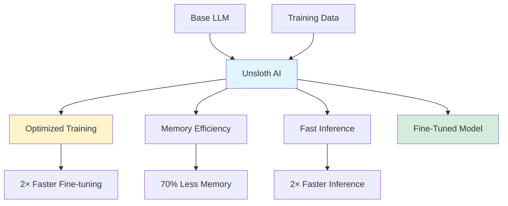

## Unsloth AI: 1 Million Monthly Downloads Milestone 🎉

*Curiosity:* How can we make LLM fine-tuning faster and more memory-efficient? What makes Unsloth achieve 2× speedup with 70% less memory?

**Unsloth AI🦥** just hit **1 million monthly downloads** on Hugging Face! 🥳 This achievement reflects the community's need for faster, more efficient LLM fine-tuning.

### Unsloth Performance

*Retrieve:* Unsloth's impressive efficiency improvements.

| Metric | Improvement | Impact |
|:-------|:------------|:-------|
| **Fine-tuning Speed** | 2× faster | ⬆️ Productivity |
| **Memory Usage** | 70% less | ⬇️ Resource requirements |
| **Accuracy** | No degradation | ✅ Quality maintained |
| **Inference Speed** | 2× faster | ⬆️ Performance |

**Key Achievement**: Faster fine-tuning and inference with significantly less memory, **without accuracy degradation**.

### Unsloth Architecture

### Supported Models

*Retrieve:* Free fine-tuning notebooks available.

**Available Models**:
- **Llama-3**: Latest Meta model
- **Mistral**: Efficient open-source model
- **Gemma**: Google's open models

**Free Resources**:
- Fine-tuning notebooks on GitHub
- Colab notebooks for easy access
- Comprehensive documentation

### Quick Start

**Free Notebook to Fine-tune Llama-3**: 
<https://colab.research.google.com/drive/1XamvWYinY6FOSX9GLvnqSjjsNflxdhNc?usp=sharing>

**Resources**:
- **Hugging Face**: <https://huggingface.co/unsloth>
- **GitHub**: <https://github.com/unslothai/unsloth>
- **Discord**: <https://discord.com/invite/u54VK8m8tk>

### Key Features

| Feature | Description | Benefit |
|:--------|:------------|:--------|
| **Speed Optimization** | 2× faster training | ⬆️ Time savings |
| **Memory Efficiency** | 70% less memory | ⬇️ Hardware requirements |
| **Accuracy Preservation** | No degradation | ✅ Quality maintained |
| **Easy Integration** | Hugging Face compatible | ⬆️ Accessibility |
| **Free Resources** | Notebooks and guides | ⬆️ Learning |

### Use Cases

*Innovate:* Unsloth enables efficient fine-tuning for various applications.

**Ideal For**:
- Resource-constrained environments
- Fast iteration cycles
- Cost-effective fine-tuning
- Educational purposes

### Key Takeaways

*Retrieve:* Unsloth AI achieves 2× faster fine-tuning and 70% less memory usage without accuracy degradation, making LLM fine-tuning more accessible.

*Innovate:* By using Unsloth, you can fine-tune models like Llama-3, Mistral, and Gemma efficiently, enabling faster development cycles and lower resource requirements.

*Curiosity → Retrieve → Innovation:* Start with curiosity about efficient fine-tuning, retrieve knowledge from Unsloth's resources, and innovate by fine-tuning models for your specific use cases.

**Next Steps**:
- Try the free Colab notebook
- Explore GitHub repository
- Join Discord community
- Star the project on GitHub

{: .light .w-75 .shadow .rounded-10 w='1212' h='668' }

 Translate to Korean 

* * * 
🦥 Unsloth AI 오늘 Hugging Face 에서 월간 다운로드 100만 건을 돌파했습니다! 🥳 LLM 미세 조정 속도를 2배 높이고 정확도 저하 없이 메모리를 70% 적게 사용합니다!

Github 페이지에서 Llama-3, Mistral, Gemma에 대한 무료 미세 조정 노트북을 확인할 수 있습니다! 추론도 2배 더 빨라졌습니다!

Llama-3 미세 조정을위한 무료 노트북 : <https://colab.research.google.com/drive/1XamvWYinY6FOSX9GLvnqSjjsNflxdhNc?usp=sharing>

허깅 페이스 페이지: <[huggingface.co/unsloth](https://huggingface.co/unsloth)>

AI 농담, Q&A를 위한 Discord에 참여하세요: <https://discord.com/invite/u54VK8m8tk>

그리고 Github에서 별을 보내주세요! <https://github.com/unslothai/unsloth>

