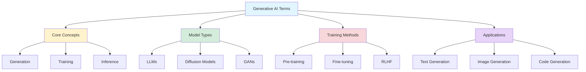

## Generative AI Terms You Should Know: Essential Cheat Sheet

*Curiosity:* What are the key terms in Generative AI? How can we understand the essential concepts that power modern AI systems?

**Confused by GenAI terms?** This generative AI cheat sheet features the most frequently used terms with easy-to-understand summaries. Even if you're not very familiar with machine learning, these terms should be easy to grasp.

### Why This Cheat Sheet Matters

*Retrieve:* Understanding GenAI terminology is essential for:
- Following industry discussions
- Reading research papers
- Building AI applications
- Participating in the GenAI community

**After the LLM lingo series**, many requested simplification of broader Generative AI concepts. This cheat sheet provides that foundation.

### Generative AI Terms Overview

### Key Takeaways

*Retrieve:* This cheat sheet distills the most popular GenAI terms into easy-to-understand one-liners, making Generative AI accessible to everyone.

*Innovate:* By mastering these terms, you can join the GenAI trend, understand cutting-edge research, and build your own generative AI applications.

*Curiosity → Retrieve → Innovation:* Start with curiosity about GenAI terminology, retrieve knowledge from this cheat sheet, and innovate by applying these concepts to your projects.

**Happy Learning!** 📚

{: .light .w-75 .shadow .rounded-10 w='1212' h='668' }

 Translate to Korean 

* * * 

## 당신이 알아야 할 생성형 AI 용어 📚

🎉 GenAI 용어가 헷갈리시나요? 해독할 시간입니다! 가장 자주 사용되는 용어와 이해하기 쉬운 요약이 포함된 생성형 AI 치트 시트를 확인하세요.

😎 가장 인기 있는 해시태그#genai 용어를 이해하기 쉬운 한 줄짜리 글로 정리했습니다. 기계 학습에 익숙하지 않더라도 이러한 용어는 쉽게 이해할 수 있습니다. 이 치트 시트는 해시태그#genai 트렌드에 동참할 수 있는 티켓입니다!

🔊 LLM 용어 시리즈를 마친 후, 많은 사람들이 생성형 AI의 광범위한 개념을 단순화해 달라고 요청했습니다. 여기 내가 생각해 낸 것이 있습니다!

행복한 학습!

