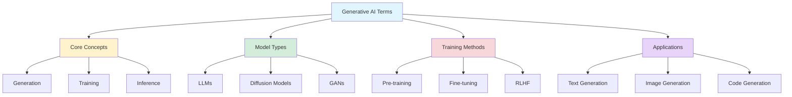

## Generative AI Terms You Should Know: Essential Cheat Sheet

*Curiosity:* What are the key terms in Generative AI? How can we understand the essential concepts that power modern AI systems?

**Confused by GenAI terms?** This generative AI cheat sheet features the most frequently used terms with easy-to-understand summaries. Even if you're not very familiar with machine learning, these terms should be easy to grasp.

### Why This Cheat Sheet Matters

*Retrieve:* Understanding GenAI terminology is essential for:
- Following industry discussions
- Reading research papers
- Building AI applications
- Participating in the GenAI community

**After the LLM lingo series**, many requested simplification of broader Generative AI concepts. This cheat sheet provides that foundation.

### Generative AI Terms Overview

```mermaid
graph TB
    A[Generative AI Terms] --> B[Core Concepts]
    A --> C[Model Types]
    A --> D[Training Methods]
    A --> E[Applications]
    
    B --> B1[Generation]
    B --> B2[Training]
    B --> B3[Inference]
    
    C --> C1[LLMs]
    C --> C2[Diffusion Models]
    C --> C3[GANs]
    
    D --> D1[Pre-training]
    D --> D2[Fine-tuning]
    D --> D3[RLHF]
    
    E --> E1[Text Generation]
    E --> E2[Image Generation]
    E --> E3[Code Generation]
    
    style A fill:#e1f5ff
    style B fill:#fff3cd
    style C fill:#d4edda
    style D fill:#f8d7da
    style E fill:#e7d4f8
```

### Key Takeaways

*Retrieve:* This cheat sheet distills the most popular GenAI terms into easy-to-understand one-liners, making Generative AI accessible to everyone.

*Innovate:* By mastering these terms, you can join the GenAI trend, understand cutting-edge research, and build your own generative AI applications.

*Curiosity → Retrieve → Innovation:* Start with curiosity about GenAI terminology, retrieve knowledge from this cheat sheet, and innovate by applying these concepts to your projects.

**Happy Learning!** 📚

{: .light .w-75 .shadow .rounded-10 w='1212' h='668' }

 Translate to Korean 

* * * 

## Generative AI Terms You Need to Know 📚

🎉 Confused by GenAI terminology? Time to decode it! Check out this Generative AI cheat sheet with the most frequently used terms and easy-to-understand summaries.

😎 I've compiled the most popular #genai terms into easy-to-understand one-liners. Even if you're not familiar with machine learning, these terms are easy to grasp. This cheat sheet is your ticket to joining the #genai trend!

🔊 After finishing the LLM terminology series, many people asked me to simplify broader Generative AI concepts. Here's what I came up with!

Happy learning!

