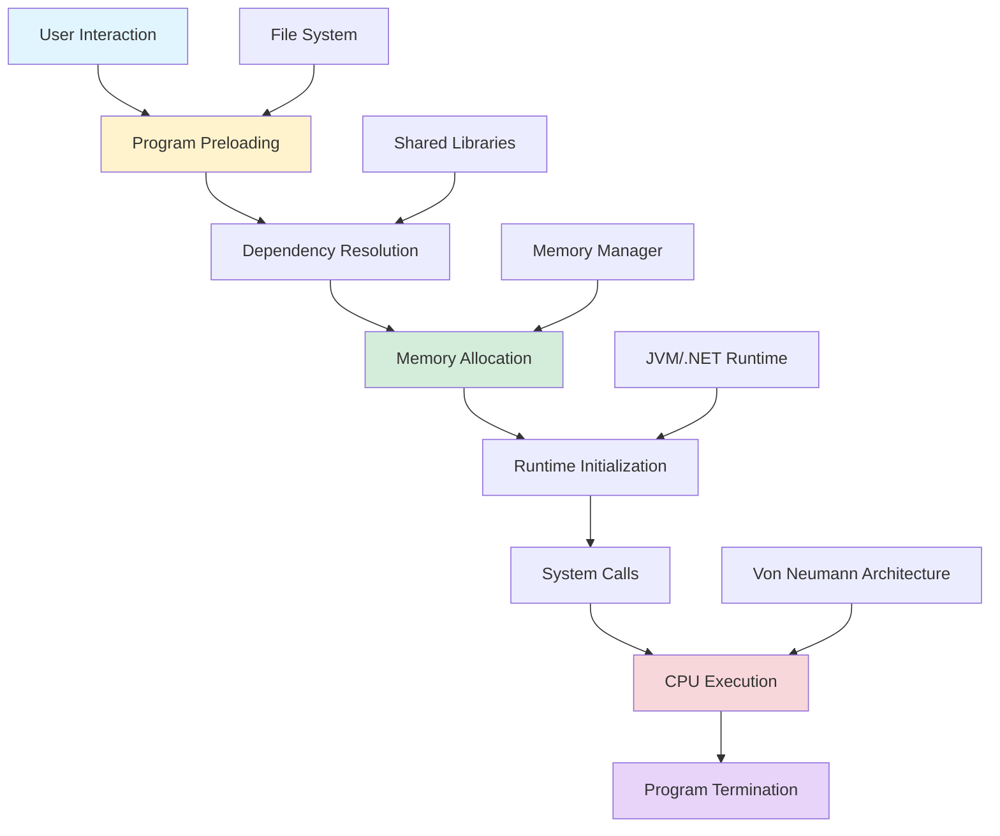
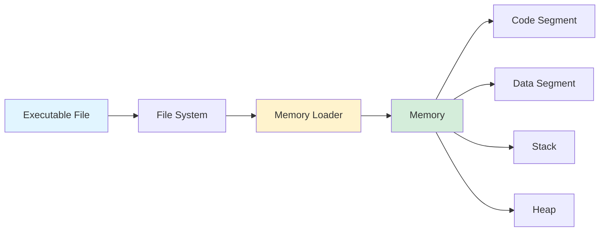
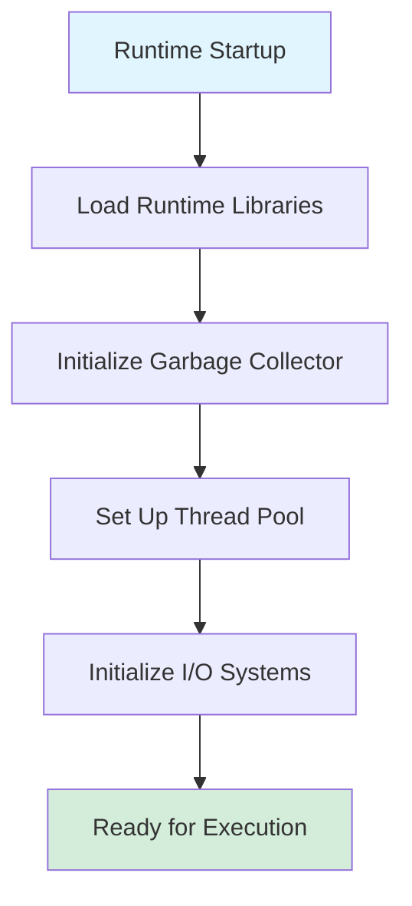
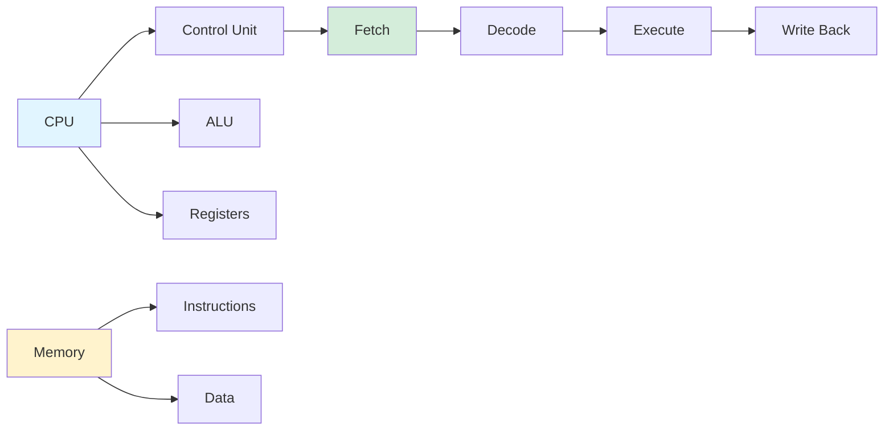

## How Do Computer Programs Run? Understanding Program Execution

*Curiosity:* What happens when we click "Run" on a program? How does the operating system transform code into executing instructions?

**Program execution** is a complex process involving multiple layers of the operating system, from user interaction to CPU execution. Understanding this process reveals how modern computing systems work.

### Program Execution Flow



### Execution Stages

| Stage | Description | Key Components | Duration |
|:------|:------------|:---------------|:---------|
| **1. User Interaction** | User initiates program | GUI, CLI | Instant |
| **2. Program Preloading** | OS loads executable | File system, loader | Milliseconds |
| **3. Dependency Resolution** | Load shared libraries | DLL, shared objects | Milliseconds |
| **4. Memory Allocation** | Allocate memory space | Memory manager | Microseconds |
| **5. Runtime Initialization** | Initialize runtime | JVM, .NET, interpreters | Milliseconds |
| **6. System Calls** | Call main() function | System calls, API | Variable |
| **7. CPU Execution** | Execute instructions | CPU, registers | Variable |
| **8. Program Termination** | Cleanup and exit | Resource manager | Milliseconds |

### 1. User Interaction and Command Initiation

*Retrieve:* User interaction triggers the execution request through the operating system.

**Methods**:
- 🖱️ Double-clicking (GUI)
- ⌨️ Command line execution
- 🔗 Programmatic invocation

**Example**:

```python
# User double-clicks program.py
# Operating system receives execution request
# OS identifies Python interpreter
# Process begins
```

### 2. Program Preloading

*Retrieve:* The operating system locates and loads the executable file into memory.

**Process**:
1. Locate executable file in file system
2. Verify file permissions
3. Load file into memory
4. Prepare for execution

**Memory Layout**:



### 3. Dependency Resolution and Loading

*Innovate:* Modern applications require shared libraries loaded dynamically.

**Dependencies**:
- **DLLs** (Windows): Dynamic Link Libraries
- **Shared Objects** (Linux): `.so` files
- **Frameworks** (macOS): `.framework` bundles

**Example**:

```python
# Python example - dependency loading
import sys
import os

# System loads required libraries
# - Python interpreter
# - Standard library modules
# - Third-party packages
# - System libraries (libc, etc.)

print(f"Python version: {sys.version}")
print(f"Platform: {sys.platform}")
```

### 4. Allocating Memory Space

*Retrieve:* The operating system allocates memory regions for program execution.

**Memory Regions**:

| Region | Purpose | Characteristics |
|:-------|:--------|:----------------|
| **Code Segment** | Executable instructions | Read-only, shared |
| **Data Segment** | Global/static variables | Read-write |
| **Stack** | Function calls, local variables | LIFO, fast |
| **Heap** | Dynamic memory allocation | Flexible, slower |

**Memory Allocation**:

```python
# Example: Memory allocation in Python
import sys

# Stack allocation (automatic)
def function():
    local_var = 42  # Stack
    return local_var

# Heap allocation (dynamic)
dynamic_list = [1, 2, 3]  # Heap
print(f"Memory size: {sys.getsizeof(dynamic_list)} bytes")
```

### 5. Initializing the Runtime Environment

*Retrieve:* Runtime environments initialize resources needed for program execution.

**Runtime Examples**:
- **JVM** (Java): Java Virtual Machine
- **.NET Runtime**: Common Language Runtime
- **Python Interpreter**: CPython, PyPy
- **Node.js**: V8 engine

**Initialization Steps**:



### 6. System Calls and Resource Management

*Innovate:* The program entry point (`main`) begins execution, making system calls as needed.

**System Calls**:
- File operations
- Network communication
- Process management
- Memory management

**Example**:

```python
# Program entry point
def main():
    # System calls happen here
    file = open("data.txt", "r")  # System call: open()
    data = file.read()            # System call: read()
    file.close()                  # System call: close()
    print(data)                   # System call: write()

if __name__ == "__main__":
    main()  # Entry point called
```

### 7. Von Neumann Architecture

*Retrieve:* The CPU executes instructions stored in memory following the Von Neumann architecture.

**Architecture Components**:



**Execution Cycle**:
1. **Fetch**: Get instruction from memory
2. **Decode**: Understand instruction
3. **Execute**: Perform operation
4. **Write Back**: Store results

### 8. Program Termination

*Retrieve:* Cleanup phase releases resources and returns control to the operating system.

**Cleanup Tasks**:
- Close file descriptors
- Free network resources
- Release memory
- Clean up temporary files
- Return exit code

**Example**:

```python
import atexit

def cleanup():
    print("Cleaning up resources...")
    # Close files, connections, etc.

atexit.register(cleanup)

# Program execution
print("Program running...")

# When program ends, cleanup() is called automatically
```

### Complete Execution Timeline

```mermaid
gantt
    title Program Execution Timeline
    dateFormat X
    axisFormat %L ms
    
    section User
    Click/Command           :0, 1
    section OS
    Load Executable        :1, 5
    Resolve Dependencies   :6, 10
    Allocate Memory        :11, 2
    section Runtime
    Initialize Runtime     :13, 5
    section Program
    Execute Main           :18, 100
    section Cleanup
    Terminate              :118, 2
```



### Key Takeaways

*Retrieve:* Program execution involves eight key stages: user interaction, preloading, dependency resolution, memory allocation, runtime initialization, system calls, CPU execution, and termination.

*Innovate:* Understanding program execution helps optimize performance, debug issues, and design efficient applications by knowing how the operating system manages resources.

*Curiosity → Retrieve → Innovation:* Start with curiosity about how programs run, retrieve knowledge about execution stages, and innovate by optimizing each stage for better performance.

**Next Steps**:
- Study operating system internals
- Learn about memory management
- Understand system calls
- Optimize program startup time 


{: .light .w-75 .shadow .rounded-10 w='1212' h='668' }

<details markdown="1">
<summary style= "font-size:24px; line-height:24px; font-weight:bold; cursor:pointer;" > Translate to Korean </summary>

* * * 

## 컴퓨터 프로그램은 어떻게 실행될까요?

다이어그램은 단계를 보여줍니다. 
 
### 🔹 사용자 상호 작용 및 명령 시작 
프로그램을 두 번 클릭하면 사용자가 그래픽 사용자 인터페이스를 통해 응용 프로그램을 시작하도록 운영 체제에 지시할 수 있습니다. 
 
### 🔹 프로그램 사전 로딩 
실행 요청이 시작되면 운영 체제는 먼저 프로그램의 실행 파일을 검색합니다. 
 
운영 체제는 파일 시스템을 통해 이 파일을 찾아 실행을 준비하기 위해 메모리에 로드합니다. 
 
### 🔹 종속성 해결 및 로드Dependency resolution and loading 
대부분의 최신 응용 프로그램은 DLL(동적 연결 라이브러리)과 같은 여러 공유 라이브러리에 의존합니다. 
 
### 🔹 메모리 공간 할당 
운영 체제는 메모리 공간 할당을 담당합니다. 
 
### 🔹 런타임 환경 초기화 
메모리를 할당한 후 운영 체제 및 실행 환경(예: Java의 JVM 또는 .NET Framework)은 프로그램을 실행하는 데 필요한 다양한 리소스를 초기화합니다. 
 
### 🔹 시스템 호출 및 리소스 관리 
프로그램의 진입점(일반적으로 'main'이라는 함수)은 프로그래머가 작성한 코드의 실행을 시작하기 위해 호출됩니다. 
 
### 🔹 폰 노이만 아키텍처 
Von Neumann 아키텍처에서 CPU는 메모리에 저장된 명령을 실행합니다. 
 
### 🔹 프로그램 종료 
결국 프로그램이 작업을 완료하거나 사용자가 응용 프로그램을 적극적으로 종료하면 프로그램은 정리 단계를 시작합니다. 여기에는 열려 있는 파일 디스크립터를 닫고, 네트워크 리소스를 확보하고, 메모리를 시스템에 반환하는 것이 포함됩니다. 

</details>