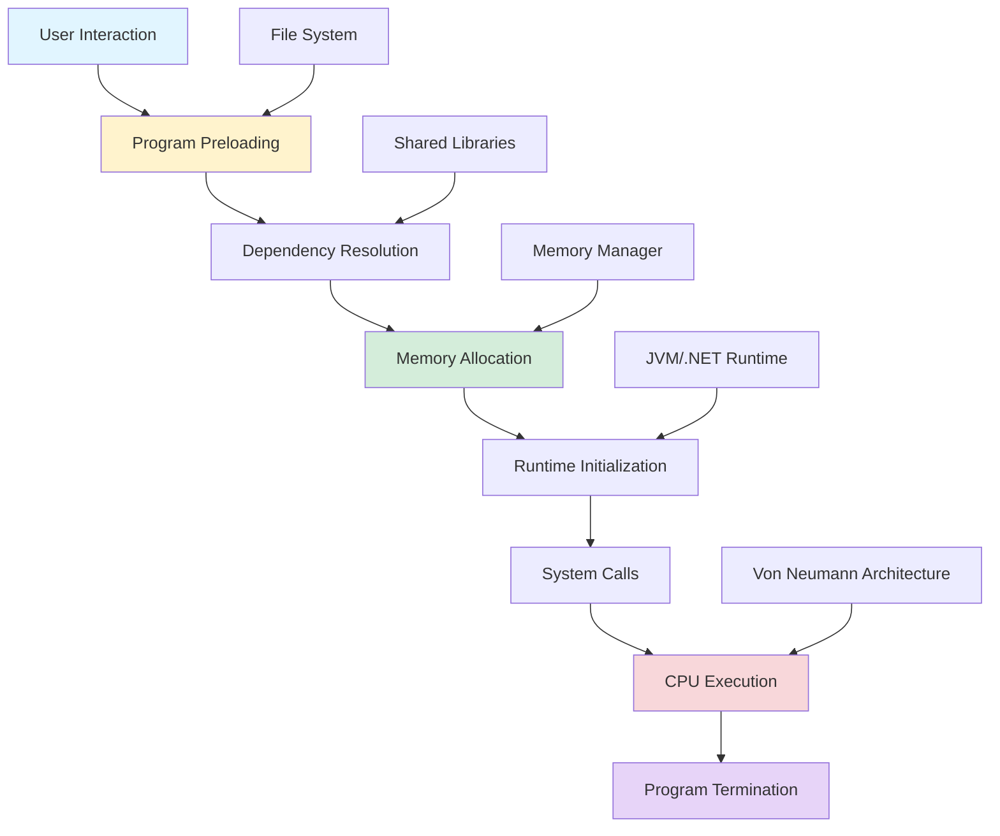
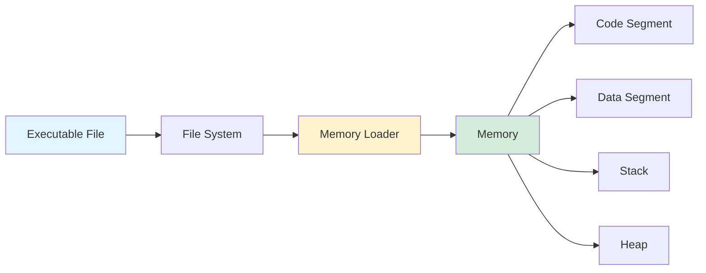
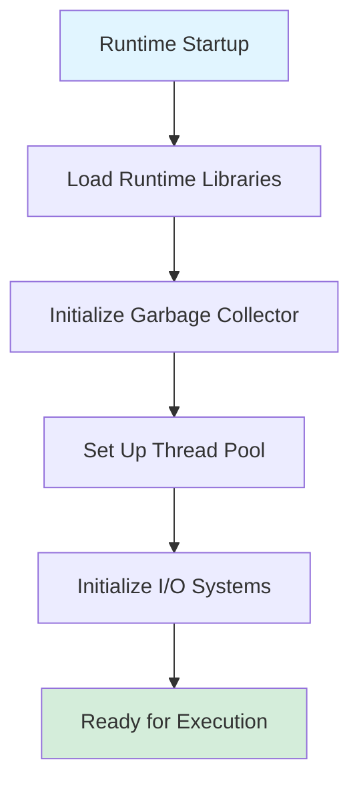
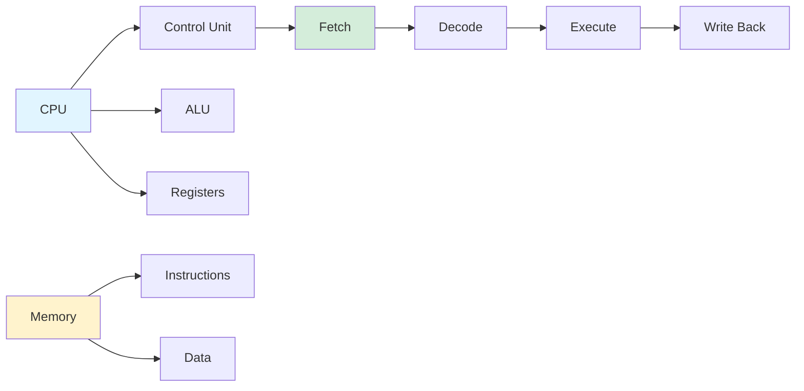

## How Do Computer Programs Run? Understanding Program Execution

*Curiosity:* What happens when we click "Run" on a program? How does the operating system transform code into executing instructions?

**Program execution** is a complex process involving multiple layers of the operating system, from user interaction to CPU execution. Understanding this process reveals how modern computing systems work.

### Program Execution Flow


```mermaid
graph TB
    A[User Interaction] --> B[Program Preloading]
    B --> C[Dependency Resolution]
    C --> D[Memory Allocation]
    D --> E[Runtime Initialization]
    E --> F[System Calls]
    F --> G[CPU Execution]
    G --> H[Program Termination]
    
    I[File System] --> B
    J[Shared Libraries] --> C
    K[Memory Manager] --> D
    L[JVM/.NET Runtime] --> E
    M[Von Neumann Architecture] --> G
    
    style A fill:#e1f5ff
    style B fill:#fff3cd
    style D fill:#d4edda
    style G fill:#f8d7da
    style H fill:#e7d4f8
```

### Execution Stages

| Stage | Description | Key Components | Duration |
|:------|:------------|:---------------|:---------|
| **1. User Interaction** | User initiates program | GUI, CLI | Instant |
| **2. Program Preloading** | OS loads executable | File system, loader | Milliseconds |
| **3. Dependency Resolution** | Load shared libraries | DLL, shared objects | Milliseconds |
| **4. Memory Allocation** | Allocate memory space | Memory manager | Microseconds |
| **5. Runtime Initialization** | Initialize runtime | JVM, .NET, interpreters | Milliseconds |
| **6. System Calls** | Call main() function | System calls, API | Variable |
| **7. CPU Execution** | Execute instructions | CPU, registers | Variable |
| **8. Program Termination** | Cleanup and exit | Resource manager | Milliseconds |

### 1. User Interaction and Command Initiation

*Retrieve:* User interaction triggers the execution request through the operating system.

**Methods**:
- 🖱️ Double-clicking (GUI)
- ⌨️ Command line execution
- 🔗 Programmatic invocation

**Example**:

```python
# User double-clicks program.py
# Operating system receives execution request
# OS identifies Python interpreter
# Process begins
```

### 2. Program Preloading

*Retrieve:* The operating system locates and loads the executable file into memory.

**Process**:
1. Locate executable file in file system
2. Verify file permissions
3. Load file into memory
4. Prepare for execution

**Memory Layout**:


```mermaid
graph LR
    A[Executable File] --> B[File System]
    B --> C[Memory Loader]
    C --> D[Memory]
    
    D --> D1[Code Segment]
    D --> D2[Data Segment]
    D --> D3[Stack]
    D --> D4[Heap]
    
    style A fill:#e1f5ff
    style C fill:#fff3cd
    style D fill:#d4edda
```

### 3. Dependency Resolution and Loading

*Innovate:* Modern applications require shared libraries loaded dynamically.

**Dependencies**:
- **DLLs** (Windows): Dynamic Link Libraries
- **Shared Objects** (Linux): `.so` files
- **Frameworks** (macOS): `.framework` bundles

**Example**:

```python
# Python example - dependency loading
import sys
import os

# System loads required libraries
# - Python interpreter
# - Standard library modules
# - Third-party packages
# - System libraries (libc, etc.)

print(f"Python version: {sys.version}")
print(f"Platform: {sys.platform}")
```

### 4. Allocating Memory Space

*Retrieve:* The operating system allocates memory regions for program execution.

**Memory Regions**:

| Region | Purpose | Characteristics |
|:-------|:--------|:----------------|
| **Code Segment** | Executable instructions | Read-only, shared |
| **Data Segment** | Global/static variables | Read-write |
| **Stack** | Function calls, local variables | LIFO, fast |
| **Heap** | Dynamic memory allocation | Flexible, slower |

**Memory Allocation**:

```python
# Example: Memory allocation in Python
import sys

# Stack allocation (automatic)
def function():
    local_var = 42  # Stack
    return local_var

# Heap allocation (dynamic)
dynamic_list = [1, 2, 3]  # Heap
print(f"Memory size: {sys.getsizeof(dynamic_list)} bytes")
```

### 5. Initializing the Runtime Environment

*Retrieve:* Runtime environments initialize resources needed for program execution.

**Runtime Examples**:
- **JVM** (Java): Java Virtual Machine
- **.NET Runtime**: Common Language Runtime
- **Python Interpreter**: CPython, PyPy
- **Node.js**: V8 engine

**Initialization Steps**:


```mermaid
graph TB
    A[Runtime Startup] --> B[Load Runtime Libraries]
    B --> C[Initialize Garbage Collector]
    C --> D[Set Up Thread Pool]
    D --> E[Initialize I/O Systems]
    E --> F[Ready for Execution]
    
    style A fill:#e1f5ff
    style F fill:#d4edda
```

### 6. System Calls and Resource Management

*Innovate:* The program entry point (`main`) begins execution, making system calls as needed.

**System Calls**:
- File operations
- Network communication
- Process management
- Memory management

**Example**:

```python
# Program entry point
def main():
    # System calls happen here
    file = open("data.txt", "r")  # System call: open()
    data = file.read()            # System call: read()
    file.close()                  # System call: close()
    print(data)                   # System call: write()

if __name__ == "__main__":
    main()  # Entry point called
```

### 7. Von Neumann Architecture

*Retrieve:* The CPU executes instructions stored in memory following the Von Neumann architecture.

**Architecture Components**:


```mermaid
graph LR
    A[CPU] --> B[Control Unit]
    A --> C[ALU]
    A --> D[Registers]
    
    E[Memory] --> F[Instructions]
    E --> G[Data]
    
    B --> H[Fetch]
    H --> I[Decode]
    I --> J[Execute]
    J --> K[Write Back]
    
    style A fill:#e1f5ff
    style E fill:#fff3cd
    style H fill:#d4edda
```

**Execution Cycle**:
1. **Fetch**: Get instruction from memory
2. **Decode**: Understand instruction
3. **Execute**: Perform operation
4. **Write Back**: Store results

### 8. Program Termination

*Retrieve:* Cleanup phase releases resources and returns control to the operating system.

**Cleanup Tasks**:
- Close file descriptors
- Free network resources
- Release memory
- Clean up temporary files
- Return exit code

**Example**:

```python
import atexit

def cleanup():
    print("Cleaning up resources...")
    # Close files, connections, etc.

atexit.register(cleanup)

# Program execution
print("Program running...")

# When program ends, cleanup() is called automatically
```

### Complete Execution Timeline


```mermaid
gantt
    title Program Execution Timeline
    dateFormat X
    axisFormat %L ms
    
    section User
    Click/Command           :0, 1
    section OS
    Load Executable        :1, 5
    Resolve Dependencies   :6, 10
    Allocate Memory        :11, 2
    section Runtime
    Initialize Runtime     :13, 5
    section Program
    Execute Main           :18, 100
    section Cleanup
    Terminate              :118, 2
```

### Key Takeaways

*Retrieve:* Program execution involves eight key stages: user interaction, preloading, dependency resolution, memory allocation, runtime initialization, system calls, CPU execution, and termination.

*Innovate:* Understanding program execution helps optimize performance, debug issues, and design efficient applications by knowing how the operating system manages resources.

*Curiosity → Retrieve → Innovation:* Start with curiosity about how programs run, retrieve knowledge about execution stages, and innovate by optimizing each stage for better performance.

**Next Steps**:
- Study operating system internals
- Learn about memory management
- Understand system calls
- Optimize program startup time 


{: .light .w-75 .shadow .rounded-10 w='1212' h='668' }

<details markdown="1">
<summary style= "font-size:24px; line-height:24px; font-weight:bold; cursor:pointer;" > Translate to Korean </summary>

* * * 

## How Do Computer Programs Run?

The diagram shows the steps.
 
### 🔹 User Interaction and Command Initiation
Double-clicking a program signals the operating system to start the application through the graphical user interface.
 
### 🔹 Program Pre-Loading
When an execution request is initiated, the operating system first searches for the program's executable file.
 
The operating system locates this file through the file system and loads it into memory to prepare for execution.
 
### 🔹 Dependency Resolution and Loading
Most modern applications depend on multiple shared libraries such as DLLs (Dynamic Link Libraries).
 
### 🔹 Memory Space Allocation
The operating system is responsible for memory space allocation.
 
### 🔹 Runtime Environment Initialization
After allocating memory, the operating system and runtime environment (e.g., JVM for Java or .NET Framework) initialize various resources needed to run the program.
 
### 🔹 System Calls and Resource Management
The program's entry point (usually a function called 'main') is called to begin execution of the code written by the programmer.
 
### 🔹 Von Neumann Architecture
In the Von Neumann architecture, the CPU executes instructions stored in memory.
 
### 🔹 Program Termination
Eventually, when the program completes its tasks or the user actively closes the application, the program initiates a cleanup phase. This includes closing open file descriptors, releasing network resources, and returning memory to the system.

</details>
