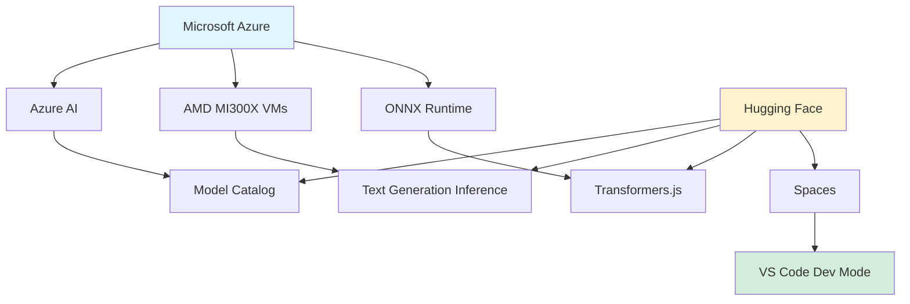

## Hugging Face × Microsoft: Deepening Collaboration

*Curiosity:* How can partnerships between major AI platforms accelerate open-source AI adoption? What does the expanded Microsoft-Hugging Face collaboration mean for developers?

**At MS BUILD**, Satya Nadella announced the expansion of the partnership between Microsoft and Hugging Face to make open models and open-source AI more accessible across hardware.

### Partnership Expansion

*Retrieve:* Key collaboration areas.

**Focus Areas**:
- 🆕 New AMD GPU support
- ☁️ Cloud through Azure AI
- 💻 Local inference with ONNX Runtime

### Key Announcements

*Innovate:* Five major updates.

| Announcement | Details | Impact |
|:-------------|:--------|:-------|
| **💻 Azure Model Catalog** | Expanded Hugging Face collection with Llama 3, Mistral 7B, fine-tuned models | ⬆️ Easy access |
| **⚡ AMD MI300X** | Optimized containers using Hugging Face TGI | ⬆️ Performance |
| **🤗 Phi-3 Family** | Open release on Hugging Face | ⬆️ Availability |
| **🌐 WebGPU** | Local inference with Transformers.js and ONNX Runtime Web | ⬆️ Browser AI |
| **💻 Dev Mode** | Seamless integration between Spaces and VS Code | ⬆️ Developer experience |

### Collaboration Benefits

*Retrieve:* Why this matters.

**For Developers**:
- ✅ Access to popular models in Azure
- ✅ Optimized hardware support
- ✅ Local inference capabilities
- ✅ Better development tools

**For Ecosystem**:
- ✅ More accessible open-source AI
- ✅ Cross-platform support
- ✅ Hardware optimization
- ✅ Unified developer experience

### Architecture Overview

*Innovate:* Partnership ecosystem.

### Key Takeaways

*Retrieve:* Microsoft and Hugging Face expanded their partnership to make open-source AI more accessible across hardware, with support for AMD GPUs, Azure AI, ONNX Runtime, and improved developer tools.

*Innovate:* By leveraging this collaboration, you can access popular models in Azure, use optimized AMD hardware, run local inference with WebGPU, and develop seamlessly with VS Code integration.

*Curiosity → Retrieve → Innovation:* Start with curiosity about AI platform partnerships, retrieve insights from Microsoft-Hugging Face collaboration, and innovate by building applications that leverage both platforms' strengths.

**Next Steps**:
- Explore Azure Model Catalog
- Try AMD MI300X optimization
- Test WebGPU inference
- Use VS Code Dev Mode

> **Learn More**: <https://huggingface.co/blog/microsoft-collaboration>
{: .prompt-info}

{: .light .w-75 .shadow .rounded-10 w='1212' h='668' }

 Translate to Korean 

* * * 

## 허깅 페이스와 마이크로 소프트의 협력 강화

어제 MS BUILD에서 Satya Nadella는 새로운 AMD GPU, Azure AI를 통한 클라우드, ONNX Runtime 를 통한 로컬 추론을 시작으로 하드웨어 전반에 걸쳐 개방형 모델과 오픈 소스 AI에 더 쉽게 액세스할 수 있도록 Microsoft 와 Hugging Face 간의 파트너십 확장을 발표했습니다. 🚀

- 💻 Azure Model Catalog에서 Llama 3, Mistral 7B와 같은 인기 있는 개방형 모델 및 최고 성능의 미세 조정 모델을 사용하여 포옹 얼굴 컬렉션을 확장했습니다.
- ⚡ Hugging Face Text Generation Inference를 사용하여 Azure의 새로운 AMD MI300X VM에 최적화된 컨테이너
- 🤗 Hugging Face의 오픈 릴리스 Microsoft Phi-3 제품군
- 🌐 Transformers.js 및 ONNX 런타임 웹을 사용한 WebGPU를 통한 로컬 추론
- 💻 Hugging Face Spaces와 VS Code 간의 원활한 통합을 위한 새로운 개발 모드

자세히 알아보기: <https://huggingface.co/blog/microsoft-collaboration>

