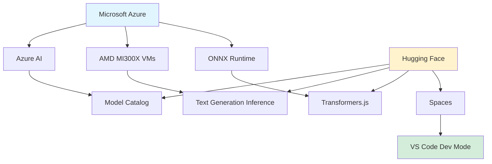

## Hugging Face × Microsoft: Deepening Collaboration

*Curiosity:* How can partnerships between major AI platforms accelerate open-source AI adoption? What does the expanded Microsoft-Hugging Face collaboration mean for developers?

**At MS BUILD**, Satya Nadella announced the expansion of the partnership between Microsoft and Hugging Face to make open models and open-source AI more accessible across hardware.

### Partnership Expansion

*Retrieve:* Key collaboration areas.

**Focus Areas**:
- 🆕 New AMD GPU support
- ☁️ Cloud through Azure AI
- 💻 Local inference with ONNX Runtime

### Key Announcements

*Innovate:* Five major updates.

| Announcement | Details | Impact |
|:-------------|:--------|:-------|
| **💻 Azure Model Catalog** | Expanded Hugging Face collection with Llama 3, Mistral 7B, fine-tuned models | ⬆️ Easy access |
| **⚡ AMD MI300X** | Optimized containers using Hugging Face TGI | ⬆️ Performance |
| **🤗 Phi-3 Family** | Open release on Hugging Face | ⬆️ Availability |
| **🌐 WebGPU** | Local inference with Transformers.js and ONNX Runtime Web | ⬆️ Browser AI |
| **💻 Dev Mode** | Seamless integration between Spaces and VS Code | ⬆️ Developer experience |

### Collaboration Benefits

*Retrieve:* Why this matters.

**For Developers**:
- ✅ Access to popular models in Azure
- ✅ Optimized hardware support
- ✅ Local inference capabilities
- ✅ Better development tools

**For Ecosystem**:
- ✅ More accessible open-source AI
- ✅ Cross-platform support
- ✅ Hardware optimization
- ✅ Unified developer experience

### Architecture Overview

*Innovate:* Partnership ecosystem.

```mermaid
graph TB
    A[Microsoft Azure] --> B[Azure AI]
    A --> C[AMD MI300X VMs]
    A --> D[ONNX Runtime]
    
    E[Hugging Face] --> F[Model Catalog]
    E --> G[Text Generation Inference]
    E --> H[Transformers.js]
    E --> I[Spaces]
    
    B --> F
    C --> G
    D --> H
    I --> J[VS Code Dev Mode]
    
    style A fill:#e1f5ff
    style E fill:#fff3cd
    style J fill:#d4edda
```

### Key Takeaways

*Retrieve:* Microsoft and Hugging Face expanded their partnership to make open-source AI more accessible across hardware, with support for AMD GPUs, Azure AI, ONNX Runtime, and improved developer tools.

*Innovate:* By leveraging this collaboration, you can access popular models in Azure, use optimized AMD hardware, run local inference with WebGPU, and develop seamlessly with VS Code integration.

*Curiosity → Retrieve → Innovation:* Start with curiosity about AI platform partnerships, retrieve insights from Microsoft-Hugging Face collaboration, and innovate by building applications that leverage both platforms' strengths.

**Next Steps**:
- Explore Azure Model Catalog
- Try AMD MI300X optimization
- Test WebGPU inference
- Use VS Code Dev Mode

> **Learn More**: <https://huggingface.co/blog/microsoft-collaboration>
{: .prompt-info}

{: .light .w-75 .shadow .rounded-10 w='1212' h='668' }

 Translate to Korean 

* * * 

## Strengthened Partnership Between Hugging Face and Microsoft

At MS BUILD yesterday, Satya Nadella announced an expanded partnership between Microsoft and Hugging Face to make open models and open-source AI more accessible across hardware — starting with new AMD GPUs, cloud via Azure AI, and local inference via ONNX Runtime. 🚀

- 💻 Expanded the Hugging Face collection in Azure Model Catalog with popular open models like Llama 3 and Mistral 7B, as well as top-performing fine-tuned models.
- ⚡ Optimized containers for Azure's new AMD MI300X VMs using Hugging Face Text Generation Inference
- 🤗 Open release of the Microsoft Phi-3 family on Hugging Face
- 🌐 Local inference via WebGPU using Transformers.js and ONNX Runtime Web
- 💻 New dev mode for seamless integration between Hugging Face Spaces and VS Code

Learn more: <https://huggingface.co/blog/microsoft-collaboration>

