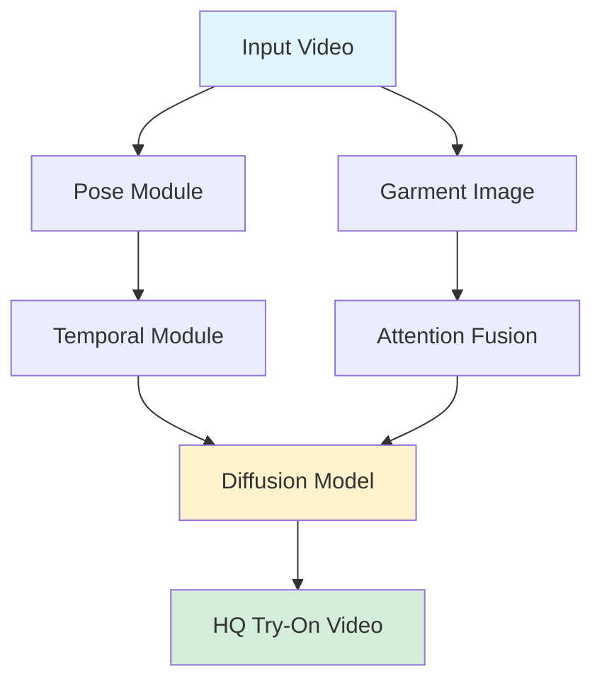



## ViViD Diffusion: Virtual Try-On with Diffusion Models

*Curiosity:* How can we create realistic virtual try-on videos? What makes ViViD's approach to video virtual try-on (VTON) innovative?

**Alibaba** announces **ViViD**, a novel framework employing powerful diffusion models to tackle the virtual try-on task.

> ⚠️ **Note**: Code announced, not released yet 😢
{: .prompt-warning}

### Highlights

*Retrieve:* ViViD's key features.

| Feature | Description | Impact |
|:--------|:------------|:-------|
| **Novel Architecture** | Addresses video VTON | ⬆️ Innovation |
| **Diffusion Models** | Synthesizes HQ try-on videos | ⬆️ Quality |
| **Pose + Temporal** | Modules for temporal consistency | ⬆️ Realism |
| **Attention Fusion** | New mechanism for garments | ⬆️ Accuracy |
| **Dataset** | 9,700 pairs of HQ garment-clips | ⬆️ Training data |

### ViViD Architecture

*Innovate:* Framework overview.

### Key Innovations

*Retrieve:* Technical breakthroughs.

**1. Video VTON Architecture**:
- Novel approach to video virtual try-on
- Handles temporal consistency

**2. Diffusion Models**:
- Synthesizes high-quality try-on videos
- Better than previous methods

**3. Pose + Temporal Modules**:
- Ensures temporal consistency
- Maintains realistic motion

**4. Attention Fusion**:
- New mechanism for garment integration
- Better garment-person alignment

**5. Multi-Category Dataset**:
- 9,700 pairs of high-quality garment-clips
- Comprehensive training data

### Resources

*Retrieve:* Available materials.

> **Resources**:
> - **📄 Paper**: <https://arxiv.org/pdf/2405.11794>
> - **🌐 Project Page**: <https://becauseimbatman0.github.io/ViViD>
> - **💻 Code**: Coming soon (<https://github.com/alibaba-yuanjing-aigclab/ViViD>)
> - **💬 Discussion**: <https://t.me/s/AI_DeepLearning>
{: .prompt-info}

**Paper Authors**: Zixun Fang, Wei Zhai, Aimin Su, Hongliang Song, Kai Zhu, Mao Wang, Yu Chen, Zhiheng Liu, Yang Cao, Zheng-Jun Zha (University of Science and Technology of China, Alibaba Group)

### Key Takeaways

*Retrieve:* ViViD is a novel framework using diffusion models for video virtual try-on, with innovations in architecture, temporal consistency, and garment fusion.

*Innovate:* By combining diffusion models with pose and temporal modules, you can create high-quality virtual try-on videos with realistic temporal consistency and accurate garment integration.

*Curiosity → Retrieve → Innovation:* Start with curiosity about virtual try-on, retrieve insights from ViViD's diffusion-based approach, and innovate by applying similar techniques to your video generation projects.

**Next Steps**:
- Read the full paper
- Check project page
- Wait for code release
- Experiment with diffusion VTON

 Translate to Korean 

## 👉 Alibaba 는 가상 체험 작업을 처리하기 위해 강력한 확산 모델을 사용하는 새로운 프레임워크인 ViViD를 발표했습니다. 

코드 발표, 아직😢 공개되지 않음

하이라이트:
- ✅비디오 VTON을 다루는 새로운 아키텍처
- ✅HQ 시착 비디오를 합성하기 위한 확산 모델
- ✅시간적 일관성을 위한 포즈 + 시간적 모듈
- ✅새로운 주목 위업. 의복을 위한 융합 기계장치
- ✅다중 범주 데이터 세트: 9,700켤레의 HQ 의류 클립

