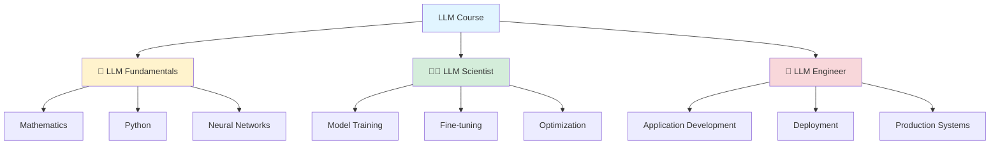
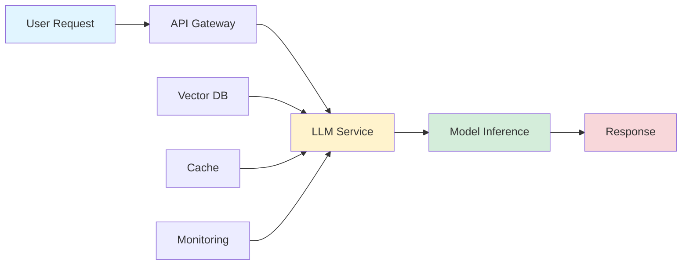
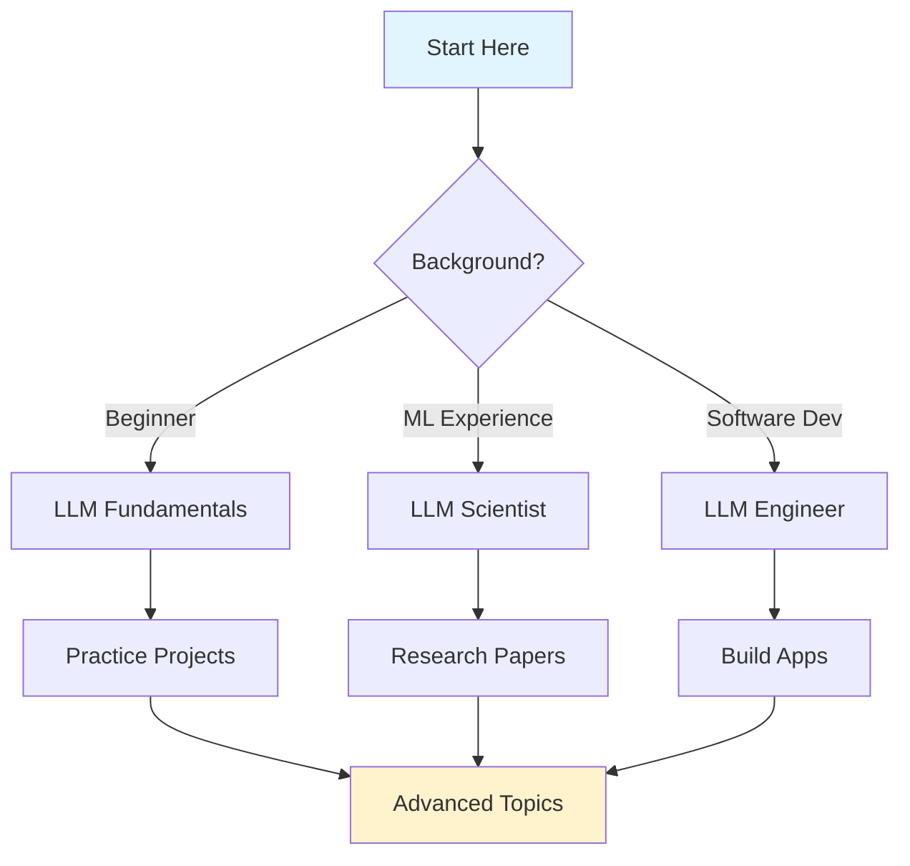

## 🗣️ Large Language Model Course: A Comprehensive Learning Path

*Curiosity:* How can we systematically learn to build and deploy LLM applications? What knowledge should we retrieve to become proficient in this rapidly evolving field?

⭐ **The LLM Course reached 30k stars on GitHub!** This milestone reflects the growing demand for structured learning in the LLM space.

The popularity of this course demonstrates the community's hunger for comprehensive, practical LLM education. To put things into perspective, it has more stars than major projects like vLLM (20k) or Jax (28k). While we're not at llama.cpp (58k) or PyTorch (78k) level yet, this achievement shows the impact of well-structured educational content.

### Course Structure Overview



### Three-Part Learning Path

| Part | Focus | Key Topics | Target Audience |
|:-----|:------|:------------|:----------------|
| **🧩 LLM Fundamentals** | Foundation | Mathematics, Python, Neural Networks | Beginners |
| **🧑‍🔬 LLM Scientist** | Model Development | Training, Fine-tuning, Latest Techniques | Researchers, ML Engineers |
| **👷 LLM Engineer** | Application Building | LLM-based Apps, Deployment, Production | Software Engineers, Developers |

### Part 1: LLM Fundamentals

**Essential Knowledge Areas:**

- **Mathematics**: Linear algebra, calculus, probability, statistics
- **Python**: Programming fundamentals, data structures, libraries
- **Neural Networks**: Architecture, training, optimization

**Learning Resources:**

```python
# Example: Understanding neural network basics
import torch
import torch.nn as nn

class SimpleLLM(nn.Module):
    """Simple LLM architecture for learning"""
    def __init__(self, vocab_size, embed_dim, num_heads):
        super().__init__()
        self.embedding = nn.Embedding(vocab_size, embed_dim)
        self.transformer = nn.TransformerEncoder(
            nn.TransformerEncoderLayer(embed_dim, num_heads),
            num_layers=6
        )
        self.output = nn.Linear(embed_dim, vocab_size)
    
    def forward(self, x):
        x = self.embedding(x)
        x = self.transformer(x)
        return self.output(x)

# Initialize model
model = SimpleLLM(vocab_size=10000, embed_dim=512, num_heads=8)
print(f"Model parameters: {sum(p.numel() for p in model.parameters()):,}")
```

### Part 2: LLM Scientist

**Focus Areas:**

- Building the best possible LLMs
- Latest techniques and research
- Model optimization and fine-tuning

**Key Techniques:**

| Technique | Purpose | Application |
|:----------|:--------|:------------|
| **Fine-tuning** | Adapt models to specific tasks | Domain-specific applications |
| **LoRA** | Efficient parameter updates | Resource-constrained environments |
| **Quantization** | Reduce model size | Edge deployment |
| **Distillation** | Transfer knowledge | Smaller, faster models |

### Part 3: LLM Engineer

**Application Development:**

- Creating LLM-based applications
- Deployment strategies
- Production system design

**Deployment Architecture:**



### Interactive Learning Assistants

The course includes interactive LLM assistants for personalized learning:

| Assistant | Model | Access | Features |
|:----------|:------|:-------|:---------|
| **🤗 HuggingChat Assistant** | Mixtral-8x7B | Free | Question answering, knowledge testing |
| **🤖 ChatGPT Assistant** | GPT-4 | Premium | Advanced explanations, code review |
| **⭐ LangChain Tutorial** | - | Free | AWS integration, open-source apps |

**Links:**
- HuggingChat: <https://huggingface.co/chat/>
- ChatGPT Assistant: <https://chatgpt.com/g/g-yviLuLqvI-llm-course?oai-dm=1>
- LangChain Tutorial: <https://www.singlestore.com/blog/how-to-create-open-source-ai-apps-with-langchain/>

### Course Statistics & Impact

| Metric | Value | Comparison |
|:-------|:------|:-----------|
| **GitHub Stars** | 30k+ | More than vLLM (20k), Jax (28k) |
| **Course Parts** | 3 | Fundamentals, Scientist, Engineer |
| **Update Frequency** | Regular | Keeping pace with LLM evolution |

### Learning Path Recommendations



### Key Takeaways

*Retrieve:* This comprehensive course provides structured learning across three critical areas: fundamentals, model development, and application engineering.

*Innovate:* By following this path, you can build expertise in LLMs from theory to production, enabling you to create innovative AI applications.

*Curiosity → Retrieve → Innovation:* Start with curiosity about LLMs, retrieve knowledge through this structured course, and innovate by building real-world applications.

**📝 Course Link**: <https://github.com/mlabonne/llm-course>

**Next Steps**: 
- Evaluate your current level
- Choose the appropriate starting point
- Engage with the interactive assistants
- Build projects to reinforce learning

{: .light .w-75 .shadow .rounded-10 w='1212' h='668' }

<details markdown="1">
<summary style= "font-size:24px; line-height:24px; font-weight:bold; cursor:pointer;" > Translate to Korean </summary>

* * * 

## 🗣️ 허깅 페이스와 마이크로 소프트의 협력 강화

⭐ LLM 코스는 GitHub에서 별 30개를 받았습니다!

이 코스의 인기는 저에게 꽤 놀랍습니다. 원근법으로 말하자면, vLLM(20k) 또는 Jax(28k)와 같은 대형 프로젝트보다 더 많은 별이 있습니다. 아직 llama.cpp(58k)나 PyTorch(78k) 수준은 아니지만, 제가 상상했던 것보다 훨씬 큽니다.

여러분의 성원에 감사드립니다. 저는 때때로 이 강좌를 조용히 편집하고 있으며, LLM 엔지니어 로드맵에 새로운 섹션을 추가할 계획을 가지고 있습니다. 또한 이제 6개월이 된 과정의 일부 오래된 부분을 업데이트하고 싶습니다(LLM 세계에서는 정말 오랜 시간입니다!).

코스에서 보고 싶은 것과 개선할 수 있는 방법을 댓글로 알려주세요.

📝 LLM 과정: <https://github.com/mlabonne/llm-course>

### LLM 코스는 세 부분으로 나뉩니다:

- 🧩 LLM 기초는 수학, 파이썬, 신경망에 관한 필수 지식을 다룹니다.
- 🧑‍🔬 LLM 과학자는 최신 기술을 사용하여 최고의 LLM을 구축하는 데 중점을 둡니다.
- 👷 LLM 엔지니어는 LLM 기반 응용 프로그램을 만들고 배포하는 데 중점을 둡니다.

이 코스의 인터랙티브 버전을 위해, 질문에 답하고 개인 맞춤형으로 지식을 테스트할 두 명의 LLM 어시스턴트를 만들었습니다:

- 🤗 [HuggingChat Assistant](https://huggingface.co/chat/): Mixtral-8x7B를 사용하는 무료 버전.
- 🤖 [ChatGPT Assistant](https://chatgpt.com/g/g-yviLuLqvI-llm-course?oai-dm=1): 프리미엄 계정이 필요합니다.
- ⭐[LangChain Tutorial with AWS](https://www.singlestore.com/blog/how-to-create-open-source-ai-apps-with-langchain/?utm_medium=referral&utm_source=pavan&utm_term=lnkdn&utm_content=openlang)

</details>