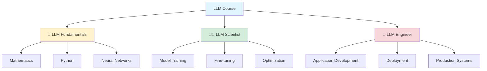
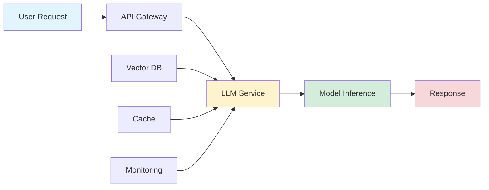
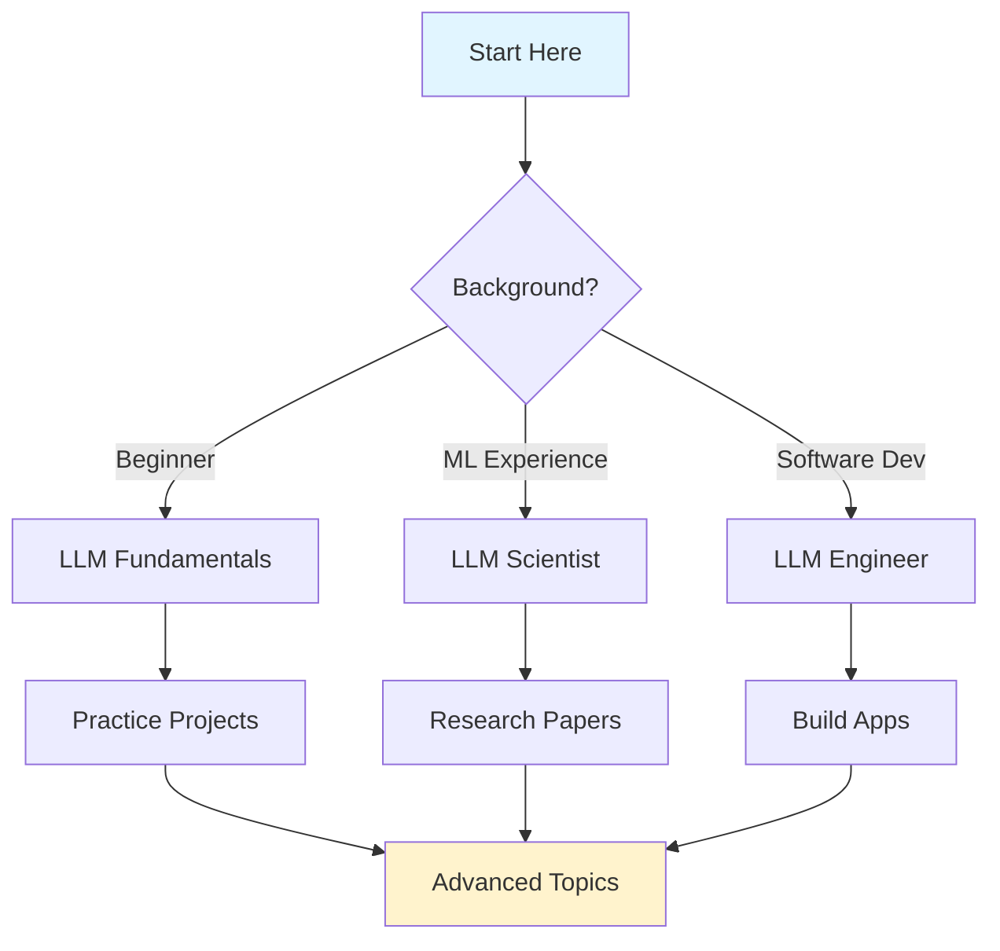

## 🗣️ Large Language Model Course: A Comprehensive Learning Path

*Curiosity:* How can we systematically learn to build and deploy LLM applications? What knowledge should we retrieve to become proficient in this rapidly evolving field?

⭐ **The LLM Course reached 30k stars on GitHub!** This milestone reflects the growing demand for structured learning in the LLM space.

The popularity of this course demonstrates the community's hunger for comprehensive, practical LLM education. To put things into perspective, it has more stars than major projects like vLLM (20k) or Jax (28k). While we're not at llama.cpp (58k) or PyTorch (78k) level yet, this achievement shows the impact of well-structured educational content.

### Course Structure Overview


```mermaid
graph TB
    A[LLM Course] --> B[🧩 LLM Fundamentals]
    A --> C[🧑‍🔬 LLM Scientist]
    A --> D[👷 LLM Engineer]
    
    B --> B1[Mathematics]
    B --> B2[Python]
    B --> B3[Neural Networks]
    
    C --> C1[Model Training]
    C --> C2[Fine-tuning]
    C --> C3[Optimization]
    
    D --> D1[Application Development]
    D --> D2[Deployment]
    D --> D3[Production Systems]
    
    style A fill:#e1f5ff
    style B fill:#fff3cd
    style C fill:#d4edda
    style D fill:#f8d7da
```

### Three-Part Learning Path

| Part | Focus | Key Topics | Target Audience |
|:-----|:------|:------------|:----------------|
| **🧩 LLM Fundamentals** | Foundation | Mathematics, Python, Neural Networks | Beginners |
| **🧑‍🔬 LLM Scientist** | Model Development | Training, Fine-tuning, Latest Techniques | Researchers, ML Engineers |
| **👷 LLM Engineer** | Application Building | LLM-based Apps, Deployment, Production | Software Engineers, Developers |

### Part 1: LLM Fundamentals

**Essential Knowledge Areas:**

- **Mathematics**: Linear algebra, calculus, probability, statistics
- **Python**: Programming fundamentals, data structures, libraries
- **Neural Networks**: Architecture, training, optimization

**Learning Resources:**

```python
# Example: Understanding neural network basics
import torch
import torch.nn as nn

class SimpleLLM(nn.Module):
    """Simple LLM architecture for learning"""
    def __init__(self, vocab_size, embed_dim, num_heads):
        super().__init__()
        self.embedding = nn.Embedding(vocab_size, embed_dim)
        self.transformer = nn.TransformerEncoder(
            nn.TransformerEncoderLayer(embed_dim, num_heads),
            num_layers=6
        )
        self.output = nn.Linear(embed_dim, vocab_size)
    
    def forward(self, x):
        x = self.embedding(x)
        x = self.transformer(x)
        return self.output(x)

# Initialize model
model = SimpleLLM(vocab_size=10000, embed_dim=512, num_heads=8)
print(f"Model parameters: {sum(p.numel() for p in model.parameters()):,}")
```

### Part 2: LLM Scientist

**Focus Areas:**

- Building the best possible LLMs
- Latest techniques and research
- Model optimization and fine-tuning

**Key Techniques:**

| Technique | Purpose | Application |
|:----------|:--------|:------------|
| **Fine-tuning** | Adapt models to specific tasks | Domain-specific applications |
| **LoRA** | Efficient parameter updates | Resource-constrained environments |
| **Quantization** | Reduce model size | Edge deployment |
| **Distillation** | Transfer knowledge | Smaller, faster models |

### Part 3: LLM Engineer

**Application Development:**

- Creating LLM-based applications
- Deployment strategies
- Production system design

**Deployment Architecture:**


```mermaid
graph LR
    A[User Request] --> B[API Gateway]
    B --> C[LLM Service]
    C --> D[Model Inference]
    D --> E[Response]
    
    F[Vector DB] --> C
    G[Cache] --> C
    H[Monitoring] --> C
    
    style A fill:#e1f5ff
    style C fill:#fff3cd
    style D fill:#d4edda
    style E fill:#f8d7da
```

### Interactive Learning Assistants

The course includes interactive LLM assistants for personalized learning:

| Assistant | Model | Access | Features |
|:----------|:------|:-------|:---------|
| **🤗 HuggingChat Assistant** | Mixtral-8x7B | Free | Question answering, knowledge testing |
| **🤖 ChatGPT Assistant** | GPT-4 | Premium | Advanced explanations, code review |
| **⭐ LangChain Tutorial** | - | Free | AWS integration, open-source apps |

**Links:**
- HuggingChat: <https://huggingface.co/chat/>
- ChatGPT Assistant: <https://chatgpt.com/g/g-yviLuLqvI-llm-course?oai-dm=1>
- LangChain Tutorial: <https://www.singlestore.com/blog/how-to-create-open-source-ai-apps-with-langchain/>

### Course Statistics & Impact

| Metric | Value | Comparison |
|:-------|:------|:-----------|
| **GitHub Stars** | 30k+ | More than vLLM (20k), Jax (28k) |
| **Course Parts** | 3 | Fundamentals, Scientist, Engineer |
| **Update Frequency** | Regular | Keeping pace with LLM evolution |

### Learning Path Recommendations


```mermaid
graph TD
    A[Start Here] --> B{Background?}
    B -->|Beginner| C[LLM Fundamentals]
    B -->|ML Experience| D[LLM Scientist]
    B -->|Software Dev| E[LLM Engineer]
    
    C --> F[Practice Projects]
    D --> G[Research Papers]
    E --> H[Build Apps]
    
    F --> I[Advanced Topics]
    G --> I
    H --> I
    
    style A fill:#e1f5ff
    style I fill:#fff3cd
```

### Key Takeaways

*Retrieve:* This comprehensive course provides structured learning across three critical areas: fundamentals, model development, and application engineering.

*Innovate:* By following this path, you can build expertise in LLMs from theory to production, enabling you to create innovative AI applications.

*Curiosity → Retrieve → Innovation:* Start with curiosity about LLMs, retrieve knowledge through this structured course, and innovate by building real-world applications.

**📝 Course Link**: <https://github.com/mlabonne/llm-course>

**Next Steps**: 
- Evaluate your current level
- Choose the appropriate starting point
- Engage with the interactive assistants
- Build projects to reinforce learning

{: .light .w-75 .shadow .rounded-10 w='1212' h='668' }

<details markdown="1">
<summary style= "font-size:24px; line-height:24px; font-weight:bold; cursor:pointer;" > Translate to Korean </summary>

* * * 

## 🗣️ LLM Course Reaches 30k Stars on GitHub

⭐ The LLM Course has received 30k stars on GitHub!

The popularity of this course is quite surprising to me. To put it in perspective, it has more stars than major projects like vLLM (20k) or Jax (28k). Not yet at the level of llama.cpp (58k) or PyTorch (78k), but still remarkable.

Thank you for your support. I quietly edit this course from time to time, and I have plans to add new sections to the LLM Engineer Roadmap. I also want to update some older parts of the course, which is now 6 months old (the LLM world moves fast!).

Let me know in the comments what you would like to see in the course and how it can be improved.

📝 LLM Course: <https://github.com/mlabonne/llm-course>

### The LLM Course Is Divided Into Three Parts:

- 🧩 LLM Fundamentals covers essential knowledge about math, Python, and neural networks.
- 🧑‍🔬 LLM Scientist focuses on building the best LLMs using the latest techniques.
- 👷 LLM Engineer focuses on creating and deploying LLM-based applications.

For the interactive version of this course, I created two LLM assistants to answer questions and test your knowledge in a personalized way:

- 🤗 [HuggingChat Assistant](https://huggingface.co/chat/): Free version using Mixtral-8x7B.
- 🤖 [ChatGPT Assistant](https://chatgpt.com/g/g-yviLuLqvI-llm-course?oai-dm=1): Requires a premium account.
- ⭐[LangChain Tutorial with AWS](https://www.singlestore.com/blog/how-to-create-open-source-ai-apps-with-langchain/?utm_medium=referral&utm_source=pavan&utm_term=lnkdn&utm_content=openlang)

</details>
