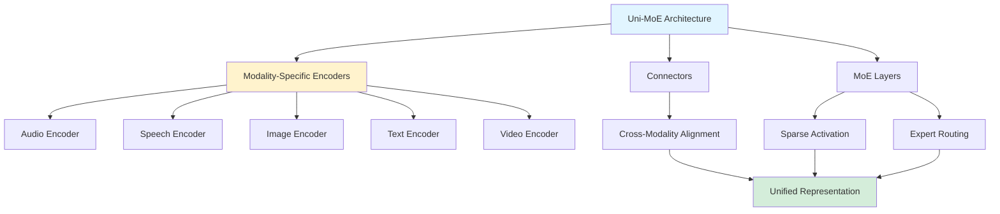
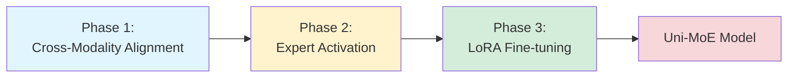

## Uni-MoE: Unified Multimodal LLM Architecture (GPT-4o-like)

*Curiosity:* How can we build a unified model that handles audio, speech, image, text, and video? What architecture enables efficient multimodal learning?

**Uni-MoE** proposes an MoE-based unified Multimodal Large Language Model (MLLM) that can handle audio, speech, image, text, and video. 👂👄👀💬🎥 This architecture may be similar to GPT-4o's approach.

### Uni-MoE Overview

*Retrieve:* Understanding the unified multimodal architecture.

**Uni-MoE** is a native multimodal Mixture of Experts (MoE) architecture with a three-phase training strategy:
1. Cross-modality alignment
2. Expert activation
3. Fine-tuning with Low-Rank Adaptation (LoRA)

### Architecture Highlights

### Key Features

| Feature | Description | Benefit |
|:--------|:------------|:--------|
| **Unified Multimodal** | Handles 5 modalities | ⬆️ Versatility |
| **MoE Architecture** | Sparse expert activation | ⬆️ Efficiency |
| **Modality-Specific Encoders** | Specialized processing | ⬆️ Quality |
| **Connectors** | Cross-modality alignment | ⬆️ Integration |
| **LoRA Fine-tuning** | Efficient adaptation | ⬇️ Training cost |

### Three-Phase Training Strategy

*Retrieve:* Systematic training approach.

**Phase 1: Cross-Modality Alignment**
- Train connectors for different modalities
- Align representations across modalities
- Establish unified space

**Phase 2: Expert Activation**
- Modality-specific expert training
- Cross-modality instruction data
- Expert specialization

**Phase 3: LoRA Fine-tuning**
- Fine-tuning with LoRA
- Mixed multimodal data
- Efficient adaptation

**Training Pipeline**:

### Performance Results

*Innovate:* Uni-MoE's impressive achievements.

**Results**:
- ✅ Matches or outperforms other MLLMs on 10 tested vision and audio tasks
- ✅ Outperforms existing unified multimodal models on comprehensive benchmarks
- ✅ Efficient training and inference through sparse MoE
- ✅ Unified representation across modalities

### Architecture Comparison

| Aspect | Traditional MLLMs | Uni-MoE | Advantage |
|:-------|:------------------|:--------|:----------|
| **Modalities** | Limited | 5 modalities | ⬆️ More |
| **Architecture** | Dense | Sparse MoE | ⬆️ Efficiency |
| **Training** | Single-phase | Three-phase | ⬆️ Better |
| **Efficiency** | Standard | Optimized | ⬆️ Faster |

### Why This Matters

*Retrieve:* Uni-MoE demonstrates the potential architecture for GPT-4o-like unified multimodal models.

**Implications**:
- Unified models can handle multiple modalities
- MoE enables efficient scaling
- Three-phase training optimizes learning
- LoRA enables efficient fine-tuning

### Resources

> **Resources**:
> - **📄 Paper**: <https://huggingface.co/papers/2405.11273>
> - **💻 GitHub**: <https://github.com/HITsz-TMG/UMOE-Scaling-Unified-Multimodal-LLMs/tree/master/Uni_MoE_v2>
{: .prompt-info}

### Key Takeaways

*Retrieve:* Uni-MoE proposes a unified multimodal LLM architecture using MoE that handles audio, speech, image, text, and video through a three-phase training strategy.

*Innovate:* By using modality-specific encoders, connectors, and sparse MoE architecture, Uni-MoE achieves efficient training and inference while matching or outperforming other MLLMs, potentially revealing insights into GPT-4o's architecture.

*Curiosity → Retrieve → Innovation:* Start with curiosity about unified multimodal architectures, retrieve insights from Uni-MoE's approach, and innovate by applying similar techniques to your multimodal applications.

>
- Paper: <https://huggingface.co/papers/2405.11273>
- Github: <https://github.com/HITsz-TMG/UMOE-Scaling-Unified-Multimodal-LLMs/tree/master/Uni_MoE_v2>
{: .prompt-info }

{: .light .w-75 .shadow .rounded-10 w='1212' h='668' }

 Translate to Korean 

* * * 

Uni-MoE는 오디오, 음성, 이미지, 텍스트 및 비디오를 처리할 수 있는 MoE 기반 통합 MLLM(Multimodal Large Language Model)을 제안합니다. 👂👄👀💬🎥

Uni-MoE는 기본 멀티모달 MoE(Mixture of Experts) 아키텍처로, 교차 모달리티 정렬, 전문가 활성화 및 LoRA(Low-Rank Adaptation)를 통한 미세 조정을 포함하는 3단계 교육 전략을 갖추고 있습니다. 🤔

TL입니다. 박사:
- 🚀 Uni-MoE는 통합 멀티모달 표현을 위해 커넥터가 있는 모달리티별 엔코더를 사용합니다.
- 💡 효율적인 학습 및 추론을 위해 희소 MoE 아키텍처 활용
- 🧑 🏫 3단계 교육: 1) 다양한 양식에 대한 커넥터 학습 2) 교차 양식 지침 데이터를 사용한 양식별 전문가 교육. 3) 혼합 다중 모드 데이터에서 LoRA로 미세 조정.
- 📊 Uni-MoE는 10개의 테스트된 비전 및 오디오 작업에서 다른 MLLM과 일치하거나 더 나은 성능을 발휘합니다.
- 🏆 포괄적인 벤치마크에서 기존 통합 멀티모달 모델을 능가합니다.

>
- Paper: <https://huggingface.co/papers/2405.11273>
- Github: <https://github.com/HITsz-TMG/UMOE-Scaling-Unified-Multimodal-LLMs/tree/master/Uni_MoE_v2>
{: .prompt-info }

