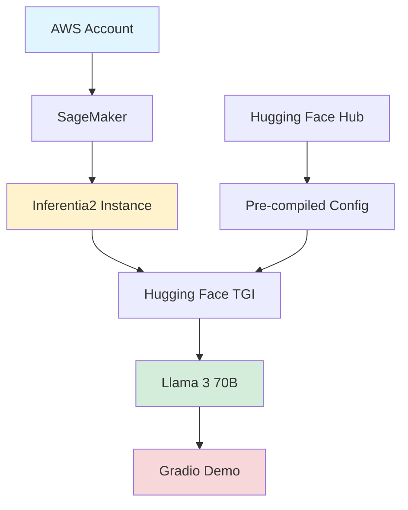

## Deploy Llama 3 70B on AWS Inferentia2 with Hugging Face Optimum

*Curiosity:* How can we deploy large LLMs without GPU access? What makes AWS Inferentia2 a viable alternative for running Llama 3 70B?

**Struggling with GPU access?** Deploy Meta's Llama 3 70B on AWS Inferentia2 using Hugging Face Optimum!

### TL;DR

*Retrieve:* Quick summary.

| Feature | Details | Benefit |
|:--------|:--------|:--------|
| **Setup** | Hugging Face Optimum + SageMaker SDK | ⬆️ Easy deployment |
| **Instance** | inf2.48xlarge with Hugging Face TGI | ⬆️ Optimized |
| **Demo** | Interactive Gradio with streaming | ⬆️ User experience |
| **Config** | Pre-compiled from Hugging Face Hub | ⬆️ Fast startup |
| **Performance** | ~132.8 tokens/s, 23.46 ms/token | ⬆️ Efficient |

### Deployment Architecture

*Innovate:* System overview.

### Key Features

*Retrieve:* Deployment highlights.

**1. Easy Setup**:
- ✅ Hugging Face Optimum
- ✅ SageMaker SDK
- ✅ Simple configuration

**2. Optimized Deployment**:
- ✅ inf2.48xlarge instance
- ✅ Hugging Face TGI
- ✅ Pre-compiled configurations

**3. Interactive Demo**:
- ✅ Gradio interface
- ✅ Streaming responses
- ✅ User-friendly

**4. Performance**:
- ✅ ~132.8 tokens/second
- ✅ 23.46 ms/token latency
- ✅ Efficient inference

### AWS Inferentia2 Benefits

*Retrieve:* Why Inferentia2.

**Advantages**:
- ✅ Cost-effective alternative to GPUs
- ✅ Optimized for inference
- ✅ High throughput
- ✅ Low latency

### Resources

*Retrieve:* Available guides.

> **Resources**:
> - **📰 Blog**: <https://www.philschmid.de/inferentia2-llama3-70b>
> - **💻 Code**: <https://github.com/philschmid/huggingface-inferentia2-samples/blob/main/llama3-70b/deploy-llama-3-70b-inferentia2.ipynb>
{: .prompt-info}

**Note**: This is just the beginning! Performance improvements and more supported modes are coming. 🤗

### Key Takeaways

*Retrieve:* Deploy Llama 3 70B on AWS Inferentia2 using Hugging Face Optimum provides an easy, cost-effective alternative to GPUs, with impressive performance (~132.8 tokens/s) and pre-compiled configurations.

*Innovate:* By leveraging AWS Inferentia2 and Hugging Face Optimum, you can deploy large LLMs without GPU access, achieving efficient inference with optimized instances and pre-compiled configurations.

*Curiosity → Retrieve → Innovation:* Start with curiosity about GPU alternatives, retrieve insights from AWS Inferentia2 deployment, and innovate by deploying large models efficiently on cost-effective hardware.

**Next Steps**:
- Read the blog post
- Follow the code notebook
- Deploy your model
- Benchmark performance

 Translate to Korean 

* * * 

## Hugging Face Optimum을 사용하여 AWS Inferentia2에 Llama 3 70B 배포

GPU 액세스 또는 가용성에 어려움을 겪고 있으며 Amazon Web Services (AWS) 환경에서 Meta Llama 3 70B를 사용하고 싶습니까? 🤔 Hugging Face Optimum을 사용하여 AWS Inferentia2에서 Meta의 Llama 3 70B를 공유하게 되어 기쁩니다!

TL입니다. 박사: 📌
- 🤗 Hugging Face Optimum 및 SageMaker SDK를 사용한 간편한 설정
- 🔥 Hugging Face TGI를 사용하여 inf2.48xlarge에 Llama 3 70B를 배포합니다.
- ⚡스트리밍 응답이 포함된 대화형 Gradio 데모 만들기
- 🔓 Hugging Face Hub에서 Llama 3 70B에 대해 사전 컴파일된 구성 활용
- ⏰ ~132.8 토큰/초 및 23.46ms/토큰의 대기 시간으로 llmperf를 사용한 벤치마크

>
- **블로그**: <https://www.philschmid.de/inferentia2-llama3-70b>
- **코드**: <https://github.com/philschmid/huggingface-inferentia2-samples/blob/main/llama3-70b/deploy-llama-3-70b-inferentia2.ipynb>
{: .prompt-info }

그게 한계가 아닙니다! 이제 막 시작했으며 이미 성능을 개선하고 더 많은 지원 모드를 작업하고 있습니다. 🤗

* * *

## Lillys AI 요약 : <https://lilys.ai/digest/681590>

Deploy Llama 3 70B on AWS Inferentia2 with Hugging Face Optimum

### 1.메타의 최신 오픈 LLM 모델, Llama 3에 대한 내용
   - 2024년 4월 발표된 Meta의 최신 오픈 LLM인 Llama 3은 15조 토큰에 대해 훈련되었으며 8천 개 토큰까지 지원하는 컨텍스트 길이 창을 가진 우수한 오픈 LLM 중 하나이다.
   - Meta는 인간 피드백에 대한 강화 학습으로 대화형 모델을 미세 조정했으며 1천만 개 이상의 인간 주석에 대해 적용했다.
   - 해당 블로그에서는 AWS Inferentia2에 Hugging Face Optimum을 통해 Meta-Llama-3-70B-Instruct 모델을 배포하는 방법을 소개한다.
   - Hugging Face LLM Inf2 Container를 사용하여 AWS Inferentia2에 LLM을 쉽게 배포하는 방법, Text Generation Inference 및 Optimum Neuron에 의해 구동되는 새로운 목적지원 추론 컨테이너를 사용한다.
   - 블로그에서는 개발 환경 설정, 새로운 Hugging Face LLM Inf2 DLC 검색, Inferentia2에 Llama 3 70B 배포, 모델로 추론 및 채팅, llmperf를 통한 Inferentia2에서 llama 3 70B 벤치마킹, 청소까지 다룬다. 🚀

### 2.️AWS Inferentia 2 소개
   - AWS Inferentia (Inf2)은 딥러닝 추론 작업을 위한 목적으로 설계된 EC2입니다.
   - Inferentia 2는 AWS Inferentia의 후속 제품으로, 최대 4배 더 높은 처리량 및 최대 10배 낮은 지연 시간을 제공합니다.
   - | 인스턴스 사이즈 | 가속기 | Neuron 코어 | 가속기 메모리 | vCPU | CPU 메모리 | 온디맨드 가격 ($/시간) |
| --- | --- | --- | --- | --- | --- | --- |
| inf2.xlarge | 1 | 2 | 32 | 4 | 16 | 0.76 |
| inf2.8xlarge | 1 | 2 | 32 | 32 | 128 | 1.97 |
| inf2.24xlarge | 6 | 12 | 192 | 96 | 384 | 6.49 |
| inf2.48xlarge | 12 | 24 | 384 | 192 | 768 | 12.98 |
추가로, Inferentia 2는 C++에서 사용자 지정 연산자 및 `FP8`(cFP8)과 같은 새로운 데이터 유형을 지원할 것입니다.

### 3.개발 환경 설정 및 SageMaker 세팅
   - Amazon SageMaker에 Mixtral을 배포하기 위해 `sagemaker` Python SDK를 사용할 것이다.
   - AWS 계정을 구성하고 `sagemaker` Python SDK가 설치되어 있어야 한다.
   - 로컬 환경에서 SageMaker를 사용할 경우 필요한 권한이 부여된 IAM Role에 액세스해야 한다.
   - 권한에 관한 자세한 내용은 [여기](https://docs.aws.amazon.com/sagemaker/latest/dg/sagemaker-roles.html)를 확인할 수 있다.

### 4.️새로운 허깅페이스 LLM Inf2 DLC 검색
   - 새로운 허깅페이스 TGI Neuronx DLC를 사용하여 AWS Inferentia2에서 추론을 실행할 수 있습니다.
   - `sagemaker` SDK의 `get_huggingface_llm_image_uri` 메서드를 사용하여 원하는 `backend`, `session`, `region`, `version`에 기반하여 적절한 허깅페이스 TGI Neuronx DLC URI를 검색할 수 있습니다.
   - 모든 사용 가능한 버전은 [여기](https://github.com/aws/deep-learning-containers/releases?q=tgi+AND+neuronx&expanded=true)에서 확인할 수 있습니다.

~~~python 
# TODO: 발매 시 활성화
from sagemaker.huggingface import get_huggingface_llm_image_uri
 
# llm 이미지 uri 검색
llm_image = get_huggingface_llm_image_uri(
  "huggingface-neuronx",
  version="0.0.22"
)
 
print(f"llm 이미지 uri: {llm_image}")
~~~

### 5.Llama 3 70B를 Inferentia2에 배포
   - 추론 시, AWS Inferentia2는 동적 *모양*을 지원하지 않기 때문에 시퀀스 길이와 배치 사이즈를 사전에 지정해야 함.
   - Inferentia2의 전원을 최대한 활용하기 위해, Llama 3 70B를 포함한 인기 있는 모델에 대한 미리 컴파일된 설정을 담은 neuron 모델 캐시를 만들었다.
   - 이렇게 하면 모델을 직접 컴파일할 필요가 없고 캐시로부터 미리 컴파일된 모델을 사용할 수 있다.
   - Llama 3 70B에 적합한 구성을 찾으려면 Hugging Face Hub에서 확인할 수 있으며, 없는 경우 Optimum CLI를 사용해 직접 컴파일하거나 캐시 저장소에 요청할 수 있다.
   - Llama 3 70B를 Inferentia2에 배포하기 전에 필요한 TGI Neuronx Endpoint 구성을 정의해야 하며, `inf2.48xlarge` 인스턴스 유형을 사용할 것을 권장한다.

### 6.️모델 추론 및 채팅 실행
   - 배포된 엔드포인트에서 *추론을 실행하는 방법*은 세밀하다.
   - 메시지 API를 사용하면 *모델과 대화식으로 상호 작용할 수 있다*.
   - `system`,`assistant`,`user`가 메시지 역할로 정의된다.
   - 모델에서 받은 응답을 그라디오 애플리케이션에 스트리밍하여 *사용자 경험을 향상*시킬 수 있다.
   - 그라디오 앱 `share=True`를 통해 72시간 동안 *모델을 테스트*하고 공유할 수 있다.

### 7.AWS Inferentia2로 Llama 3 70B의 성능 평가 및 벤치마킹
   - Amazon SageMaker에 Llama 3 70B를 성공적으로 배포하고 테스트했다.
   - 이제 모델을 벤치마킹하여 성능을 확인하려고 한다.
   - `sagemaker`를 지원하는 [llmperf](https://github.com/philschmid/llmperf) 포크를 사용할 것이다.
   - `llmperf` 패키지를 설치하고 벤치마크 실행할 예정이다. `5`개의 동시 사용자와 최대 `50`개 요청으로 벤치마크를 진행할 것이다.

### 8.중요: `first-time-to-token` 값의 정확한 측정을 위해서는 벤치마킹을 동일 호스트나 프로덕션 지역에서 실행해야 함.
   - `first-time-to-token`, `latency (ms/token)`, `throughput (tokens/s)`을 측정하는 벤치마크가 진행될 것임.
   - `results` 폴더에서 상세 내용 확인 가능.
   - 이 벤치마크는 유럽에서 시작됐지만 엔드포인트는 us-east-1에서 실행되고 있어 `first-time-to-token` 값에 상당한 영향을 미침.
   - 네트워크 통신을 포함하기 때문에 `first-time-to-token` 값이 영향을 받음.

### 9.Python LLM 성능 테스트 실행 설정
   - 메시지 API를 사용하는 설정을 하고, 'llmperf'에게 메시지 API를 사용 중이라고 알린다.
   - 'token_benchmark_ray.py' 스크립트를 실행할 때 설정은 모델 이름, 'sagemaker' LLM API, 최대 완료 요청 수 50번, 제한 시간 600초, 동시 요청 수 5개, 결과 저장 디렉토리 'results'로 지정한다.

### 10.결과값 파싱 후 깔끔하게 표시
   - 결과값을 *구문 분석*하고 *잘 표시*합니다.
   - summary.json 파일을 읽어 *결과를 출력*합니다.
   - Concurrent requests가 5일 때의 *평균 입력 토큰 길이*, *평균 출력 토큰 길이*, *첫 번째 토큰 완성까지 소요 시간 평균*, *평균 처리량*, *평균 대기 시간*을 출력합니다.

### 11. AWS Inferentia2에서 Llama 370B 벤치마킹 결과
   - 5개의 동시 요청으로 150 토큰 생성 결과
   - AWS Inferentia2에서 Llama 370B를 테스트하고 벤치마킹 성공
   - 벤치마크는 모델 성능의 전체 표현이 아니지만 첫 번째 좋은 지표를 제공
   - 운영중인 모델 사용 시 더 긴 벤치마크를 권장하며, 생산 벤치마크에 더 맞게 수정, 복제본 수를 변경하여 모델을 테스트할 것을 권장

