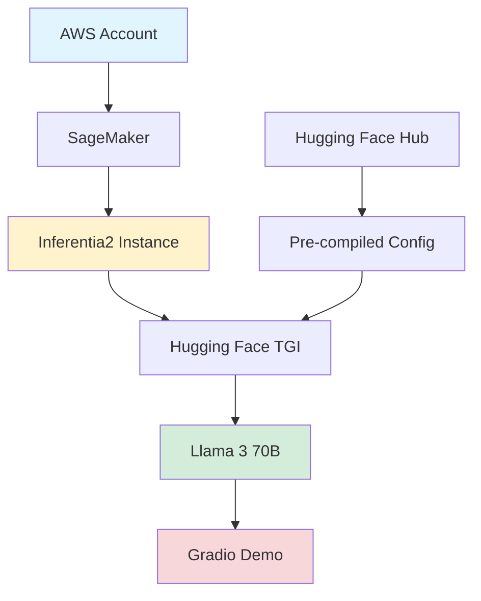

## Deploy Llama 3 70B on AWS Inferentia2 with Hugging Face Optimum

*Curiosity:* How can we deploy large LLMs without GPU access? What makes AWS Inferentia2 a viable alternative for running Llama 3 70B?

**Struggling with GPU access?** Deploy Meta's Llama 3 70B on AWS Inferentia2 using Hugging Face Optimum!

### TL;DR

*Retrieve:* Quick summary.

| Feature | Details | Benefit |
|:--------|:--------|:--------|
| **Setup** | Hugging Face Optimum + SageMaker SDK | ⬆️ Easy deployment |
| **Instance** | inf2.48xlarge with Hugging Face TGI | ⬆️ Optimized |
| **Demo** | Interactive Gradio with streaming | ⬆️ User experience |
| **Config** | Pre-compiled from Hugging Face Hub | ⬆️ Fast startup |
| **Performance** | ~132.8 tokens/s, 23.46 ms/token | ⬆️ Efficient |

### Deployment Architecture

*Innovate:* System overview.

```mermaid
graph TB
    A[AWS Account] --> B[SageMaker]
    B --> C[Inferentia2 Instance]
    C --> D[Hugging Face TGI]
    D --> E[Llama 3 70B]
    E --> F[Gradio Demo]
    
    G[Hugging Face Hub] --> H[Pre-compiled Config]
    H --> D
    
    style A fill:#e1f5ff
    style C fill:#fff3cd
    style E fill:#d4edda
    style F fill:#f8d7da
```

### Key Features

*Retrieve:* Deployment highlights.

**1. Easy Setup**:
- ✅ Hugging Face Optimum
- ✅ SageMaker SDK
- ✅ Simple configuration

**2. Optimized Deployment**:
- ✅ inf2.48xlarge instance
- ✅ Hugging Face TGI
- ✅ Pre-compiled configurations

**3. Interactive Demo**:
- ✅ Gradio interface
- ✅ Streaming responses
- ✅ User-friendly

**4. Performance**:
- ✅ ~132.8 tokens/second
- ✅ 23.46 ms/token latency
- ✅ Efficient inference

### AWS Inferentia2 Benefits

*Retrieve:* Why Inferentia2.

**Advantages**:
- ✅ Cost-effective alternative to GPUs
- ✅ Optimized for inference
- ✅ High throughput
- ✅ Low latency

### Resources

*Retrieve:* Available guides.

> **Resources**:
> - **📰 Blog**: <https://www.philschmid.de/inferentia2-llama3-70b>
> - **💻 Code**: <https://github.com/philschmid/huggingface-inferentia2-samples/blob/main/llama3-70b/deploy-llama-3-70b-inferentia2.ipynb>
{: .prompt-info}

**Note**: This is just the beginning! Performance improvements and more supported modes are coming. 🤗

### Key Takeaways

*Retrieve:* Deploy Llama 3 70B on AWS Inferentia2 using Hugging Face Optimum provides an easy, cost-effective alternative to GPUs, with impressive performance (~132.8 tokens/s) and pre-compiled configurations.

*Innovate:* By leveraging AWS Inferentia2 and Hugging Face Optimum, you can deploy large LLMs without GPU access, achieving efficient inference with optimized instances and pre-compiled configurations.

*Curiosity → Retrieve → Innovation:* Start with curiosity about GPU alternatives, retrieve insights from AWS Inferentia2 deployment, and innovate by deploying large models efficiently on cost-effective hardware.

**Next Steps**:
- Read the blog post
- Follow the code notebook
- Deploy your model
- Benchmark performance

 Translate to Korean 

* * * 

## Deploy Llama 3 70B on AWS Inferentia2 Using Hugging Face Optimum

Are you struggling with GPU access or availability and want to use Meta Llama 3 70B in an Amazon Web Services (AWS) environment? 🤔 We are excited to share deploying Meta's Llama 3 70B on AWS Inferentia2 using Hugging Face Optimum!

TL;DR: 📌
- 🤗 Easy setup using Hugging Face Optimum and SageMaker SDK
- 🔥 Deploy Llama 3 70B on inf2.48xlarge using Hugging Face TGI.
- ⚡ Create an interactive Gradio demo with streaming responses
- 🔓 Leverage pre-compiled configurations for Llama 3 70B from Hugging Face Hub
- ⏰ Benchmark using llmperf with ~132.8 tokens/sec and 23.46ms/token latency

>
- **Blog**: <https://www.philschmid.de/inferentia2-llama3-70b>
- **Code**: <https://github.com/philschmid/huggingface-inferentia2-samples/blob/main/llama3-70b/deploy-llama-3-70b-inferentia2.ipynb>
{: .prompt-info }

That's not the limit! We're just getting started and are already working on improving performance and supporting more modes. 🤗

* * *

## Lillys AI Summary: <https://lilys.ai/digest/681590>

Deploy Llama 3 70B on AWS Inferentia2 with Hugging Face Optimum

### 1. About Meta's Latest Open LLM Model, Llama 3
   - Announced in April 2024, Meta's latest open LLM, Llama 3, was trained on 15 trillion tokens and is one of the best open LLMs with a context length window supporting up to 8,000 tokens.
   - Meta fine-tuned the conversational model with reinforcement learning from human feedback, applied to over 10 million human annotations.
   - This blog post introduces how to deploy the Meta-Llama-3-70B-Instruct model on AWS Inferentia2 using Hugging Face Optimum.
   - It uses the Hugging Face LLM Inf2 Container to easily deploy LLMs on AWS Inferentia2, utilizing a new purpose-built inference container powered by Text Generation Inference and Optimum Neuron.
   - The blog covers setting up the development environment, retrieving the new Hugging Face LLM Inf2 DLC, deploying Llama 3 70B on Inferentia2, running inference and chat with the model, benchmarking Llama 3 70B on Inferentia2 with llmperf, and cleanup. 🚀

### 2.️Introduction to AWS Inferentia 2
   - AWS Inferentia (Inf2) is an EC2 instance designed specifically for deep learning inference workloads.
   - Inferentia 2 is the successor to AWS Inferentia, offering up to 4x higher throughput and up to 10x lower latency.
   - | Instance Size | Accelerators | Neuron Cores | Accelerator Memory | vCPU | CPU Memory | On-Demand Price ($/hr) |
| --- | --- | --- | --- | --- | --- | --- |
| inf2.xlarge | 1 | 2 | 32 | 4 | 16 | 0.76 |
| inf2.8xlarge | 1 | 2 | 32 | 32 | 128 | 1.97 |
| inf2.24xlarge | 6 | 12 | 192 | 96 | 384 | 6.49 |
| inf2.48xlarge | 12 | 24 | 384 | 192 | 768 | 12.98 |
Additionally, Inferentia 2 will support custom operators in C++ and new data types such as `FP8` (cFP8).

### 3. Development Environment Setup and SageMaker Configuration
   - We will use the `sagemaker` Python SDK to deploy Mixtral on Amazon SageMaker.
   - You need to configure your AWS account and have the `sagemaker` Python SDK installed.
   - When using SageMaker in a local environment, you need access to an IAM Role with the required permissions.
   - For more details on permissions, see [here](https://docs.aws.amazon.com/sagemaker/latest/dg/sagemaker-roles.html).

### 4.️Retrieving the New Hugging Face LLM Inf2 DLC
   - You can run inference on AWS Inferentia2 using the new Hugging Face TGI Neuronx DLC.
   - You can use the `get_huggingface_llm_image_uri` method from the `sagemaker` SDK to retrieve the appropriate Hugging Face TGI Neuronx DLC URI based on your desired `backend`, `session`, `region`, and `version`.
   - All available versions can be found [here](https://github.com/aws/deep-learning-containers/releases?q=tgi+AND+neuronx&expanded=true).

~~~python 
# TODO: Enable upon release
from sagemaker.huggingface import get_huggingface_llm_image_uri
 
# Retrieve llm image uri
llm_image = get_huggingface_llm_image_uri(
  "huggingface-neuronx",
  version="0.0.22"
)
 
print(f"llm image uri: {llm_image}")
~~~

### 5. Deploying Llama 3 70B on Inferentia2
   - During inference, since AWS Inferentia2 does not support dynamic *shapes*, the sequence length and batch size must be specified in advance.
   - To maximize the power of Inferentia2, a neuron model cache was created containing pre-compiled configurations for popular models including Llama 3 70B.
   - This eliminates the need to compile the model yourself and allows you to use pre-compiled models from the cache.
   - To find a suitable configuration for Llama 3 70B, you can check the Hugging Face Hub, or if unavailable, compile it yourself using the Optimum CLI or request it from the cache repository.
   - Before deploying Llama 3 70B on Inferentia2, you need to define the required TGI Neuronx Endpoint configuration, and it is recommended to use the `inf2.48xlarge` instance type.

### 6.️Running Model Inference and Chat
   - The method for *running inference* on the deployed endpoint is straightforward.
   - Using the Messages API, you can *interact with the model conversationally*.
   - `system`, `assistant`, and `user` are defined as message roles.
   - You can stream responses from the model to a Gradio application to *enhance the user experience*.
   - Through the Gradio app with `share=True`, you can *test and share the model* for 72 hours.

### 7. Performance Evaluation and Benchmarking of Llama 3 70B on AWS Inferentia2
   - We successfully deployed and tested Llama 3 70B on Amazon SageMaker.
   - Now we want to benchmark the model to verify its performance.
   - We will use a fork of [llmperf](https://github.com/philschmid/llmperf) that supports `sagemaker`.
   - We will install the `llmperf` package and run the benchmark. The benchmark will be conducted with `5` concurrent users and a maximum of `50` requests.

### 8. Important: For accurate measurement of `first-time-to-token` values, benchmarking should be run on the same host or in the production region.
   - A benchmark measuring `first-time-to-token`, `latency (ms/token)`, and `throughput (tokens/s)` will be conducted.
   - Detailed results can be found in the `results` folder.
   - This benchmark was initiated from Europe but the endpoint is running in us-east-1, which significantly affects the `first-time-to-token` values.
   - The `first-time-to-token` values are affected because they include network communication.

### 9. Python LLM Performance Test Execution Setup
   - Configure the settings to use the Messages API and inform 'llmperf' that the Messages API is being used.
   - When running the 'token_benchmark_ray.py' script, the settings specify the model name, 'sagemaker' LLM API, maximum 50 completion requests, 600-second timeout, 5 concurrent requests, and 'results' as the output directory.

### 10. Parsing and Displaying Results Cleanly
   - *Parse* and *display* the results.
   - Read the summary.json file and *output the results*.
   - Output the *average input token length*, *average output token length*, *average time to first token*, *average throughput*, and *average latency* for 5 concurrent requests.

### 11. Benchmarking Results for Llama 3 70B on AWS Inferentia2
   - Results of generating 150 tokens with 5 concurrent requests
   - Successfully tested and benchmarked Llama 3 70B on AWS Inferentia2
   - The benchmark is not a complete representation of model performance but provides a good initial indicator
   - For production model usage, longer benchmarks are recommended, and it is advised to modify settings to better match production benchmarks and test the model by changing the number of replicas

