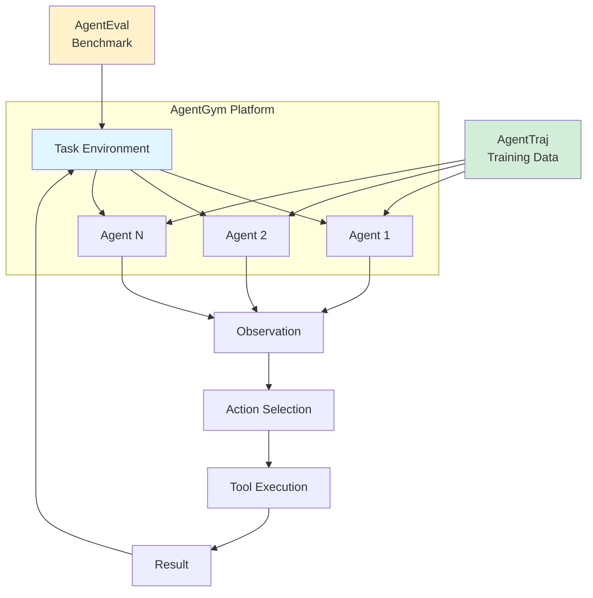

## Building Multi-Agent Systems: AgentGym and CrewAI

*Curiosity:* What if we could create a unified playground where AI agents can explore, learn, and evolve across diverse environments? How do we build systems that enable agents to retrieve knowledge from one domain and innovate in another?

**AgentGym** answers these questions by offering a wide range of environments and tasks for broad, real-time, uniform, and concurrent agent exploration! Following popular releases like CrewAI and Autogen, here's another new multi-agent framework that pushes the boundaries of what's possible.

### AgentGym Components

| Component | Description | Purpose |
|:----------|:------------|:--------|
| **AgentGym Platform** | Unified environment for agent training | Provides APIs, task specs, observation/action spaces |
| **AgentEval** | Benchmark dataset | Challenging test set for evaluating agent capabilities |
| **AgentTraj** | Training trajectory set | Base dataset for training agents |
| **AgentTraj-L** | Extended trajectory set | Enhanced dataset with behavioral cloning |
| **AgentEvol** | Self-evolution method | Enables agents to adapt beyond training data |

### Multi-Agent System Architecture



### Key Features Comparison

| Feature | AgentGym | CrewAI | Autogen |
|:--------|:---------|:-------|:--------|
| **Environment Diversity** | ✅ High | ⚠️ Medium | ⚠️ Medium |
| **Self-Evolution** | ✅ AgentEvol | ❌ No | ❌ No |
| **Benchmark Dataset** | ✅ AgentEval | ❌ No | ❌ No |
| **Trajectory Training** | ✅ AgentTraj | ❌ No | ❌ No |
| **Ease of Use** | ⚠️ Medium | ✅ High | ✅ High |

The AgentGym suite, including the platform, dataset, benchmark, checkpoints, and algorithm implementations is available for the community to build and evaluate generally-capable LLM-based agents. 

- github : <https://github.com/WooooDyy/AgentGym>

{: .light .shadow .rounded-10 w='1212' h='668' }

## Building a Crew of AI Agents

*Retrieve:* A multi-agent system that scrapes the web and automatically writes blog posts.

**Project Goal**: Build a system where agents work together like a real editorial team, automating the entire content creation pipeline from research to writing.

**Key Innovation**: Multiple AI agents collaborate to retrieve information, synthesize insights, and innovate on content structure.

### Multi-Agent Content Creation Workflow

```mermaid
graph LR
    A[User Request] --> B[Researcher Agent]
    B --> C[Web Scraping]
    C --> D[Content Analysis]
    D --> E[Writer Agent]
    E --> F[Content Generation]
    F --> G[Editor Agent]
    G --> H[Review & Refine]
    H --> I[Final Blog Post]
    
    style B fill:#e1f5ff
    style E fill:#fff3cd
    style G fill:#d4edda
    style I fill:#f8d7da
```



### Technology Stack

| Component | Technology | Purpose | Why It Matters |
|:----------|:-----------|:--------|:---------------|
| **Agent Framework** | [crewAI](https://www.linkedin.com/company/crewai-inc/) | Multi-agent orchestration | *Retrieve:* Role-based collaboration patterns |
| **LLM Runtime** | [Ollama](https://www.linkedin.com/company/ollama/) | Local LLM serving (Llama-3) | *Innovate:* Fast iteration without API costs |
| **Hosting** | [Lightning AI](https://www.linkedin.com/company/pytorch-lightning/) | Development & deployment | *Retrieve:* Seamless cloud infrastructure |

### Sample CrewAI Implementation

```python
from crewai import Agent, Task, Crew, Process

# Define agents with specific roles
researcher = Agent(
    role='Research Analyst',
    goal='Gather comprehensive information on the topic',
    backstory='You are an expert researcher...',
    verbose=True
)

writer = Agent(
    role='Content Writer',
    goal='Create engaging blog posts',
    backstory='You are a skilled technical writer...',
    verbose=True
)

editor = Agent(
    role='Editor',
    goal='Review and refine content',
    backstory='You are a meticulous editor...',
    verbose=True
)

# Define tasks
research_task = Task(
    description='Research the topic: {topic}',
    agent=researcher
)

write_task = Task(
    description='Write a blog post based on research',
    agent=writer,
    context=[research_task]
)

edit_task = Task(
    description='Edit and refine the blog post',
    agent=editor,
    context=[write_task]
)

# Create crew and execute
crew = Crew(
    agents=[researcher, writer, editor],
    tasks=[research_task, write_task, edit_task],
    process=Process.sequential
)

result = crew.kickoff(inputs={'topic': 'Multi-agent systems'})
print(result)
```

**Lightning AI Studio**: Published as a Lightning AI⚡️Studio, reads like a blog encapsulating all code and environment!

> **Try it now**: <https://lightning.ai/lightning-ai/studios/let-s-build-a-crew-of-ai-agents?utm_source=akshay>
{: .prompt-info}

### Key Takeaways

*Retrieve:* AgentGym provides a unified platform for agent training and evaluation, while CrewAI enables practical multi-agent applications like automated content creation.

*Innovate:* By combining frameworks like AgentGym for training and CrewAI for deployment, you can build sophisticated multi-agent systems that automate complex workflows, from research to content generation.

*Curiosity → Retrieve → Innovation:* Start with curiosity about multi-agent systems, retrieve insights from AgentGym and CrewAI, and innovate by building collaborative agent teams that automate real-world tasks.

**Next Steps**:
- Explore AgentGym for agent training
- Build CrewAI applications
- Experiment with agent collaboration
- Deploy multi-agent systems


<details markdown="1">
<summary style= "font-size:24px; line-height:24px; font-weight:bold; cursor:pointer;" > Translate to Korean </summary>

* * * 

## 🎉 또 다른 다중 에이전트 프레임워크가 도착했습니다! 

AgentGym은 광범위하고 실시간이며 균일하고 동시 에이전트 탐색을 위한 광범위한 환경과 작업을 제공합니다! 

CrewAI 및 Autogen과 같은 인기 있는 릴리스에 이어 또 다른 새로운 다중 에이전트 프레임워크가 있습니다. 다음은 몇 가지 인사이트입니다.

- ⛳ AgentGym은 LLM 기반 에이전트를 위한 다양한 환경, 작업, 목표를 편리한 API, 표준화된 작업 사양, 환경 설정, 관찰/행동 공간 등으로 제공합니다. 이 플랫폼은 온라인 평가, 궤적 샘플링 및 대화형 교육을 지원합니다.
- ⛳ 다양한 환경 및 작업의 확장된 지침이 포함된 데이터베이스를 제공하여 AgentEval이라는 벤치마킹을 위한 도전적인 테스트 세트를 형성합니다.
- ⛳ 여기에는 기본 에이전트 훈련을 위한 균일한 형식의 궤적 세트인 AgentTraj와 동작 복제를 통한 최대 성능을 위한 확장 버전인 AgentTraj-L이 포함됩니다.
- ⛳저자는 또한 작업 및 환경 전반에 걸쳐 이전에 본 데이터를 넘어 에이전트 자체 진화를 탐색하는 방법인 AgentEvol을 소개합니다. AgentEvol을 사용하면 에이전트가 특정 작업을 기반으로 컨텍스트에 적응적으로 액세스하고 활용하여 발전할 수 있으므로 더 적은 리소스를 사용하면서 최신 모델에 필적하는 결과를 얻을 수 있습니다.

플랫폼, 데이터 세트, 벤치마크, 체크포인트 및 알고리즘 구현을 포함한 AgentGym 제품군은 커뮤니티에서 일반적으로 사용할 수 있는 LLM 기반 에이전트를 빌드하고 평가하는 데 사용할 수 있습니다. 

- github : <https://github.com/WooooDyy/AgentGym>

## AI 요원 크루를 구성해 봅시다

웹을 긁어모으고 자동으로 블로그 게시물을 작성하는 다중 에이전트 시스템!

내가 사용한 것은 다음과 같습니다.

- 다중 에이전트 시스템 구축을 위한 [crewAI](https://www.linkedin.com/company/crewai-inc/) 
- 현지에서 LLM을 제공하는 [Ollama](https://www.linkedin.com/company/ollama/) (Llama-3)
- 개발 및 호스팅을 위한 [Lightning AI](https://www.linkedin.com/company/pytorch-lightning/)

나는이 작품을 Lightning AI ⚡️Studio로 출판했는데, 내 모든 코드 및 환경을 캡슐화하는 블로그처럼 읽힌다!

지금 바로 사용해 보세요: <https://lightning.ai/lightning-ai/studios/let-s-build-a-crew-of-ai-agents?utm_source=akshay>

</details>