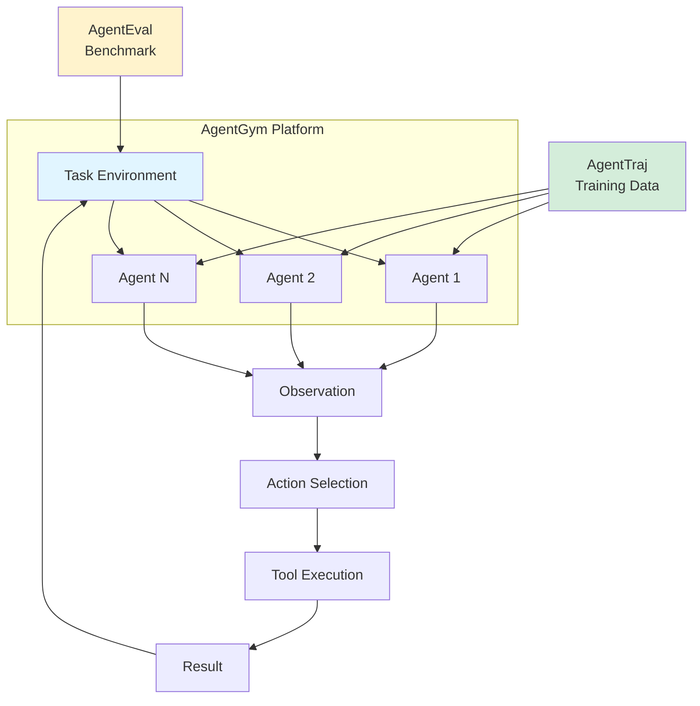

## Building Multi-Agent Systems: AgentGym and CrewAI

*Curiosity:* What if we could create a unified playground where AI agents can explore, learn, and evolve across diverse environments? How do we build systems that enable agents to retrieve knowledge from one domain and innovate in another?

**AgentGym** answers these questions by offering a wide range of environments and tasks for broad, real-time, uniform, and concurrent agent exploration! Following popular releases like CrewAI and Autogen, here's another new multi-agent framework that pushes the boundaries of what's possible.

### AgentGym Components

| Component | Description | Purpose |
|:----------|:------------|:--------|
| **AgentGym Platform** | Unified environment for agent training | Provides APIs, task specs, observation/action spaces |
| **AgentEval** | Benchmark dataset | Challenging test set for evaluating agent capabilities |
| **AgentTraj** | Training trajectory set | Base dataset for training agents |
| **AgentTraj-L** | Extended trajectory set | Enhanced dataset with behavioral cloning |
| **AgentEvol** | Self-evolution method | Enables agents to adapt beyond training data |

### Multi-Agent System Architecture


```mermaid
graph TB
    subgraph "AgentGym Platform"
        A[Task Environment] --> B[Agent 1]
        A --> C[Agent 2]
        A --> D[Agent N]
    end
    
    B --> E[Observation]
    C --> E
    D --> E
    
    E --> F[Action Selection]
    F --> G[Tool Execution]
    G --> H[Result]
    H --> A
    
    I[AgentEval<br/>Benchmark] --> A
    J[AgentTraj<br/>Training Data] --> B
    J --> C
    J --> D
    
    style A fill:#e1f5ff
    style I fill:#fff3cd
    style J fill:#d4edda
```

### Key Features Comparison

| Feature | AgentGym | CrewAI | Autogen |
|:--------|:---------|:-------|:--------|
| **Environment Diversity** | ✅ High | ⚠️ Medium | ⚠️ Medium |
| **Self-Evolution** | ✅ AgentEvol | ❌ No | ❌ No |
| **Benchmark Dataset** | ✅ AgentEval | ❌ No | ❌ No |
| **Trajectory Training** | ✅ AgentTraj | ❌ No | ❌ No |
| **Ease of Use** | ⚠️ Medium | ✅ High | ✅ High |

The AgentGym suite, including the platform, dataset, benchmark, checkpoints, and algorithm implementations is available for the community to build and evaluate generally-capable LLM-based agents. 

- github : <https://github.com/WooooDyy/AgentGym>

{: .light .shadow .rounded-10 w='1212' h='668' }

## Building a Crew of AI Agents

*Retrieve:* A multi-agent system that scrapes the web and automatically writes blog posts.

**Project Goal**: Build a system where agents work together like a real editorial team, automating the entire content creation pipeline from research to writing.

**Key Innovation**: Multiple AI agents collaborate to retrieve information, synthesize insights, and innovate on content structure.

### Multi-Agent Content Creation Workflow


```mermaid
graph LR
    A[User Request] --> B[Researcher Agent]
    B --> C[Web Scraping]
    C --> D[Content Analysis]
    D --> E[Writer Agent]
    E --> F[Content Generation]
    F --> G[Editor Agent]
    G --> H[Review & Refine]
    H --> I[Final Blog Post]
    
    style B fill:#e1f5ff
    style E fill:#fff3cd
    style G fill:#d4edda
    style I fill:#f8d7da
```

### Technology Stack

| Component | Technology | Purpose | Why It Matters |
|:----------|:-----------|:--------|:---------------|
| **Agent Framework** | [crewAI](https://www.linkedin.com/company/crewai-inc/) | Multi-agent orchestration | *Retrieve:* Role-based collaboration patterns |
| **LLM Runtime** | [Ollama](https://www.linkedin.com/company/ollama/) | Local LLM serving (Llama-3) | *Innovate:* Fast iteration without API costs |
| **Hosting** | [Lightning AI](https://www.linkedin.com/company/pytorch-lightning/) | Development & deployment | *Retrieve:* Seamless cloud infrastructure |

### Sample CrewAI Implementation

```python
from crewai import Agent, Task, Crew, Process

# Define agents with specific roles
researcher = Agent(
    role='Research Analyst',
    goal='Gather comprehensive information on the topic',
    backstory='You are an expert researcher...',
    verbose=True
)

writer = Agent(
    role='Content Writer',
    goal='Create engaging blog posts',
    backstory='You are a skilled technical writer...',
    verbose=True
)

editor = Agent(
    role='Editor',
    goal='Review and refine content',
    backstory='You are a meticulous editor...',
    verbose=True
)

# Define tasks
research_task = Task(
    description='Research the topic: {topic}',
    agent=researcher
)

write_task = Task(
    description='Write a blog post based on research',
    agent=writer,
    context=[research_task]
)

edit_task = Task(
    description='Edit and refine the blog post',
    agent=editor,
    context=[write_task]
)

# Create crew and execute
crew = Crew(
    agents=[researcher, writer, editor],
    tasks=[research_task, write_task, edit_task],
    process=Process.sequential
)

result = crew.kickoff(inputs={'topic': 'Multi-agent systems'})
print(result)
```

**Lightning AI Studio**: Published as a Lightning AI⚡️Studio, reads like a blog encapsulating all code and environment!

> **Try it now**: <https://lightning.ai/lightning-ai/studios/let-s-build-a-crew-of-ai-agents?utm_source=akshay>
{: .prompt-info}

### Key Takeaways

*Retrieve:* AgentGym provides a unified platform for agent training and evaluation, while CrewAI enables practical multi-agent applications like automated content creation.

*Innovate:* By combining frameworks like AgentGym for training and CrewAI for deployment, you can build sophisticated multi-agent systems that automate complex workflows, from research to content generation.

*Curiosity → Retrieve → Innovation:* Start with curiosity about multi-agent systems, retrieve insights from AgentGym and CrewAI, and innovate by building collaborative agent teams that automate real-world tasks.

**Next Steps**:
- Explore AgentGym for agent training
- Build CrewAI applications
- Experiment with agent collaboration
- Deploy multi-agent systems


<details markdown="1">
<summary style= "font-size:24px; line-height:24px; font-weight:bold; cursor:pointer;" > Translate to Korean </summary>

* * * 

## 🎉 Yet Another Multi-Agent Framework Has Arrived!

AgentGym provides a broad range of environments and tasks for extensive, real-time, uniform, and concurrent agent exploration!

Following popular releases like CrewAI and Autogen, here is yet another new multi-agent framework. Here are some insights.

- ⛳ AgentGym provides diverse environments, tasks, and goals for LLM-based agents with a convenient API, standardized task specifications, environment settings, observation/action spaces, and more. The platform supports online evaluation, trajectory sampling, and interactive training.
- ⛳ Provides a database with expanded instructions for diverse environments and tasks, forming a challenging test set for benchmarking called AgentEval.
- ⛳ This includes AgentTraj, a uniformly formatted trajectory set for basic agent training, and AgentTraj-L, an extended version for maximum performance through behavior cloning.
- ⛳ The authors also introduce AgentEvol, a method for exploring agent self-evolution beyond previously seen data across tasks and environments. With AgentEvol, agents can adaptively access context based on specific tasks.

The AgentGym suite, including platform, datasets, benchmarks, checkpoints, and algorithm implementations, is available for the community to build and evaluate LLM-based agents.

- github : <https://github.com/WooooDyy/AgentGym>

## Let's Build a Crew of AI Agents

A multi-agent system that scrapes the web and automatically writes blog posts!

Here is what I used:

- For building multi-agent systems: [crewAI](https://www.linkedin.com/company/crewai-inc/) 
- For serving LLMs locally: [Ollama](https://www.linkedin.com/company/ollama/) (Llama-3)
- For development and hosting: [Lightning AI](https://www.linkedin.com/company/pytorch-lightning/)

I published this work as a Lightning AI ⚡️Studio, which reads like a blog post encapsulating all my code and environment!

Try it out now: <https://lightning.ai/lightning-ai/studios/let-s-build-a-crew-of-ai-agents?utm_source=akshay>

</details>
