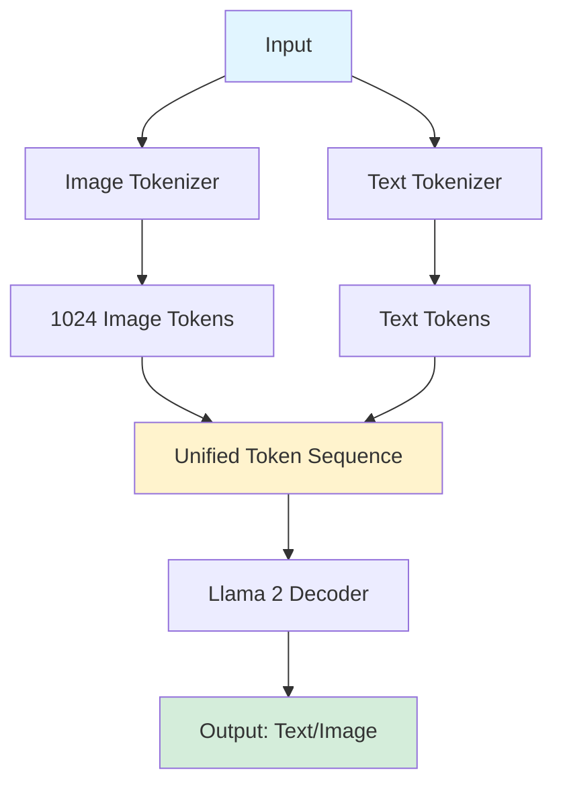
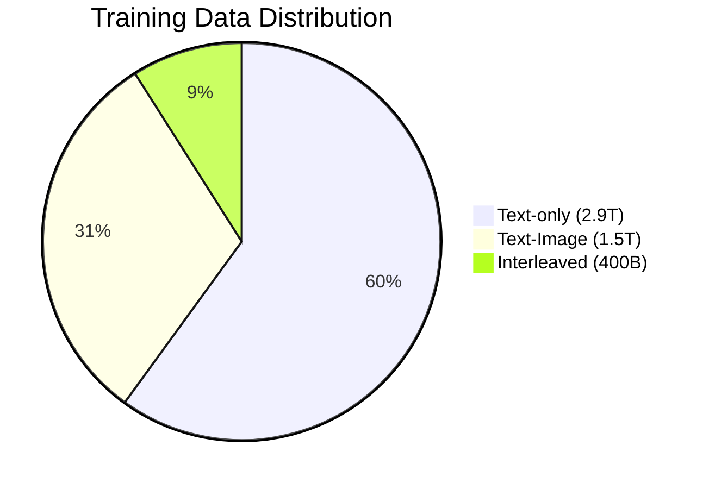

## Chameleon: Mixed-Modal Early-Fusion Foundation Models

*Curiosity:* Will Chameleon be [Meta](https://www.linkedin.com/company/meta/) Llama 4? 🦎 🦙 Meta proposes “Chameleon: Mixed-Modal Early-Fusion Foundation Models” with a unified approach for fully token-based representations of both image and text. No Encoders or connectors. 👀

### Architecture Overview

*Retrieve:* Chameleon uses a unified token-based approach for multimodal understanding and generation.

### Implementation Details

| Step | Component | Details |
|:-----|:----------|:--------|
| **1. Tokenizers** | Image + Text | Image: 512×512 → 1024 tokens (codebook 8192) Text: BPE vocab 65,536 (includes image tokens) |
| **2. Architecture** | Llama 2 Decoder | Query-key normalization Layer norm reordering Stabilized mixed-modal training |
| **3. Pretraining Stage 1** | 80% of training | Text-only: 2.9T tokens Text-image: 1.4B pairs/1.5T tokens Interleaved: 400B tokens |
| **4. Pretraining Stage 2** | 20% of training | Higher quality data Instruction data Half dataset size |
| **5. Fine-tuning** | Final stage | ~1.8M samples ~100k vision samples |

### Training Data Breakdown

### Key Insights

*Retrieve:* Chameleon's unified token-based approach enables native multimodal understanding and generation.

| Insight | Description | Impact |
|:--------|:------------|:-------|
| **Unified Tokens** | No encoders/connectors | ⬆️ Native multimodal generation |
| **Training Scale** | 9.2T tokens, 2.1 epochs | ⬆️ Strong performance |
| **Code Data** | Improved reasoning | ⬆️ Text-only tasks |
| **Scaling Challenge** | Difficult above 8B/1T | ⚠️ Training stability |
| **High-Quality Data** | Last 20% crucial | ⬆️ Significant boost |
| **Performance** | Outperforms competitors | ⬆️ Strong results |

### Performance Comparison

*Innovate:* Chameleon-34B achieves competitive performance across benchmarks.

**Text Tasks**:
- Outperforms Llama2-70B
- Approaches Mixtral 8x7B/Gemini-Pro
- Strong on GSM8K, MATH, MMLU

**Vision Tasks**:
- Outperforms Flamingo-80B and IDEFICS-80B on MS-COCO
- Matches performance on Flickr30k

**Multimodal Evaluation**:
- 60.4% win rate vs. Gemini-Pro
- 51.6% win rate vs. GPT-4V

### Comparison with Previous MLLMs

| Model | Architecture | Multimodal Generation |
|:------|:-------------|:----------------------|
| **Idefics, GPT-4v, Flamingo** | Encoders + Connectors | ❌ Limited |
| **Chameleon** | Unified Tokens | ✅ Native support |

**Key Advantage**: Chameleon can generate both text and images using discrete tokens, enabling true multimodal document generation.

### Key Takeaways

*Retrieve:* Chameleon demonstrates that unified token-based representations can achieve strong multimodal performance without separate encoders or connectors.

*Innovate:* By using discrete tokens for both images and text, Chameleon enables native multimodal understanding and generation, approaching GPT-4o's capabilities with a simpler architecture.

*Curiosity → Retrieve → Innovation:* Start with curiosity about unified multimodal models, retrieve insights from Chameleon's token-based approach, and innovate by building applications that leverage native multimodal generation.

**Next Steps**:
- Read the full paper
- Explore Chameleon architecture
- Compare with GPT-4o
- Build multimodal applications

> Paper: <https://huggingface.co/papers/2405.09818>
{: .prompt-info }

Note: Chameleon looks to be closer to [OpenAI](https://www.linkedin.com/company/openai/) GPT-4o than Uni-MoE (shared yesterday) with its native multi-modal tokens. 💡

 Translate to Korean 

* * * 

## Chameleon: Mixed-Modal Early-Fusion Foundation Models

카멜레온은 라마 4Meta 될까요? 🦎 🦙 [Meta](https://www.linkedin.com/company/meta/)는 이미지와 텍스트 모두를 완전히 토큰 기반으로 표현하기 위한 통합 접근 방식을 통해 "Chameleon: Mixed-Modal Early-Fusion Foundation Models"를 제안합니다. 인코더 또는 커넥터가 없습니다. 👀

### Implementation:
- 1️⃣ 훈련된 2개의 토크나이저, 512 × 512 이미지를 코드북(8192)에서 1024개의 토큰으로 인코딩하는 이미지 토크나이저와 8192 이미지 코드북 토큰을 포함하는 65,536의 어휘를 가진 BPE.
- 2️⃣는 Llama 2를 기반으로 하는 디코더 아키텍처를 사용하지만 쿼리 키 정규화 및 레이어 규범의 재정렬을 통합하여 혼합 모달 설정에서 훈련을 안정화합니다.
- 3️⃣ 텍스트 전용(Llama 2, CodeLlama ⇒ 2.9T 토큰), 텍스트 이미지(1.4B 쌍/1.5T 토큰), 텍스트/이미지 인터리브(400B 토큰)에 대한 사전 학습 1단계(80%);
- 4️⃣ 사전 학습 2단계 (20%) 첫 번째 단계의 데이터 세트를 절반으로 줄이고 더 높은 품질의 데이터와 지침 데이터를 포함합니다.
- 5️⃣ ~100k 비전 샘플로 ~180만 개의 샘플에 미세 조정.

### Insights:
- 🔗 이전 MLLM(Idefics, GPT-4v, Flamingo)은 멀티모달리티를 위해 인코더와 커넥터를 사용했기 때문에 멀티모달 문서(이미지 + 텍스트 출력)를 생성하는 기능이 제한되었습니다.
- 🦎 카멜레온은 개별 토큰을 사용하여 텍스트와 이미지를 모두 이해하고 생성할 수 있습니다
- 📚 Chameleon-34B는 총 9.2T 토큰에 대해 전체 훈련 데이터 세트에서 2.1 epoch 동안 훈련했습니다.
- 🔧 코드 데이터는 텍스트 전용 추론 작업 성능을 개선했습니다.
- ⚖️ 카멜레온 모델을 8B 매개변수 및 1T 토큰 이상으로 확장할 때 안정적인 훈련을 유지하는 데 어려움이 있습니다.
- 🚀 고품질 데이터를 사용한 사전 학습의 마지막 20%는 성능을 크게 향상시켰습니다.
- 🏆 Chameleon-34B는 Llama2-70B를 능가하며 Mixtral 8x7B/Gemini-Pro, GSM8K, MATH 및 MMLU에 근접합니다.
- 📊 Chameleon-34B는 MS-COCO에서 Flamingo-80B 및 IDEFICS-80B를 능가하며 Flickr30k에서도 일치합니다.
- 🎯 Chameleon-34B는 Gemini-Pro를 상대로 60.4%, GPT-4V를 상대로 51.6%의 승률을 달성했습니다.
- ⚖️ 균형 잡힌 모달리티 데이터 세트는 미세 조정 및 정렬에 중요합니다.

> Paper: <https://huggingface.co/papers/2405.09818>
{: .prompt-info }

참고: 카멜레온은 기본 멀티모달 토큰이 있는 Uni-MoE(어제 공유)보다 [OpenAI](https://www.linkedin.com/company/openai/) GPT-4o에 더 가까워 보입니다. 💡

