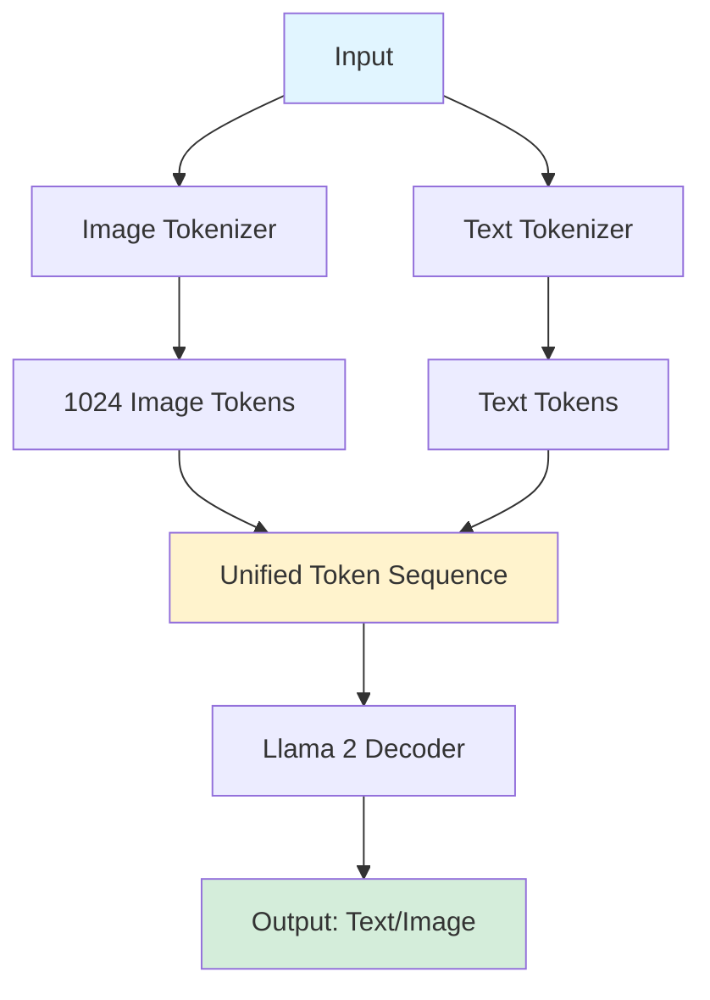
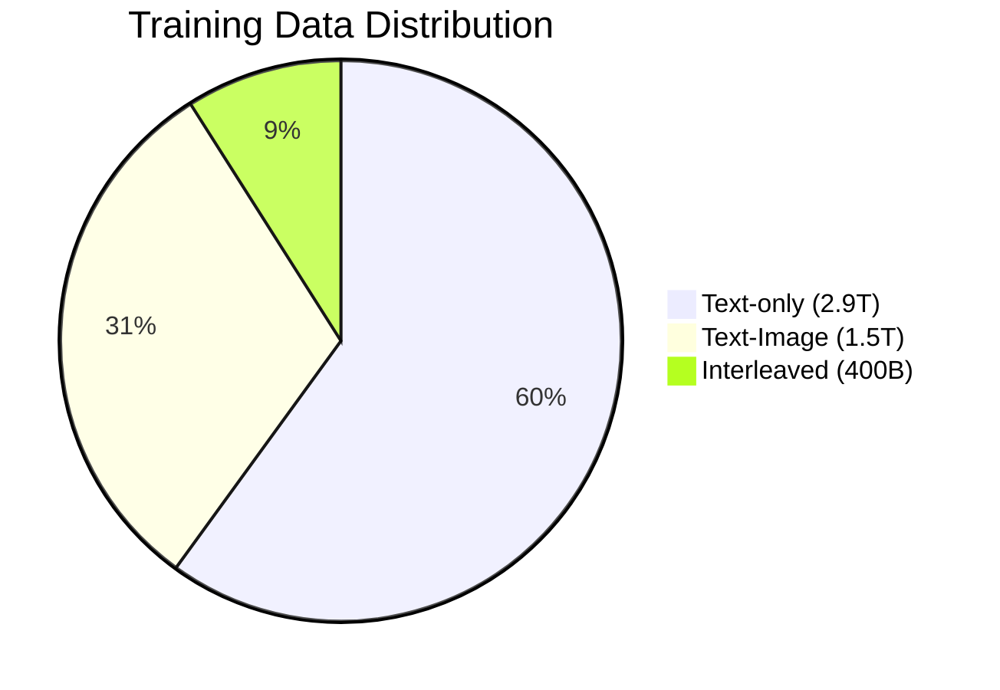

## Chameleon: Mixed-Modal Early-Fusion Foundation Models

*Curiosity:* Will Chameleon be [Meta](https://www.linkedin.com/company/meta/) Llama 4? 🦎 🦙 Meta proposes “Chameleon: Mixed-Modal Early-Fusion Foundation Models” with a unified approach for fully token-based representations of both image and text. No Encoders or connectors. 👀

### Architecture Overview

*Retrieve:* Chameleon uses a unified token-based approach for multimodal understanding and generation.

```mermaid
graph TB
    A[Input] --> B[Image Tokenizer]
    A --> C[Text Tokenizer]
    B --> D[1024 Image Tokens]
    C --> E[Text Tokens]
    D --> F[Unified Token Sequence]
    E --> F
    F --> G[Llama 2 Decoder]
    G --> H[Output: Text/Image]
    
    style A fill:#e1f5ff
    style F fill:#fff3cd
    style H fill:#d4edda
```

### Implementation Details

| Step | Component | Details |
|:-----|:----------|:--------|
| **1. Tokenizers** | Image + Text | Image: 512×512 → 1024 tokens (codebook 8192) Text: BPE vocab 65,536 (includes image tokens) |
| **2. Architecture** | Llama 2 Decoder | Query-key normalization Layer norm reordering Stabilized mixed-modal training |
| **3. Pretraining Stage 1** | 80% of training | Text-only: 2.9T tokens Text-image: 1.4B pairs/1.5T tokens Interleaved: 400B tokens |
| **4. Pretraining Stage 2** | 20% of training | Higher quality data Instruction data Half dataset size |
| **5. Fine-tuning** | Final stage | ~1.8M samples ~100k vision samples |

### Training Data Breakdown

```mermaid
pie title Training Data Distribution
    "Text-only (2.9T)" : 60
    "Text-Image (1.5T)" : 31
    "Interleaved (400B)" : 9
```

### Key Insights

*Retrieve:* Chameleon's unified token-based approach enables native multimodal understanding and generation.

| Insight | Description | Impact |
|:--------|:------------|:-------|
| **Unified Tokens** | No encoders/connectors | ⬆️ Native multimodal generation |
| **Training Scale** | 9.2T tokens, 2.1 epochs | ⬆️ Strong performance |
| **Code Data** | Improved reasoning | ⬆️ Text-only tasks |
| **Scaling Challenge** | Difficult above 8B/1T | ⚠️ Training stability |
| **High-Quality Data** | Last 20% crucial | ⬆️ Significant boost |
| **Performance** | Outperforms competitors | ⬆️ Strong results |

### Performance Comparison

*Innovate:* Chameleon-34B achieves competitive performance across benchmarks.

**Text Tasks**:
- Outperforms Llama2-70B
- Approaches Mixtral 8x7B/Gemini-Pro
- Strong on GSM8K, MATH, MMLU

**Vision Tasks**:
- Outperforms Flamingo-80B and IDEFICS-80B on MS-COCO
- Matches performance on Flickr30k

**Multimodal Evaluation**:
- 60.4% win rate vs. Gemini-Pro
- 51.6% win rate vs. GPT-4V

### Comparison with Previous MLLMs

| Model | Architecture | Multimodal Generation |
|:------|:-------------|:----------------------|
| **Idefics, GPT-4v, Flamingo** | Encoders + Connectors | ❌ Limited |
| **Chameleon** | Unified Tokens | ✅ Native support |

**Key Advantage**: Chameleon can generate both text and images using discrete tokens, enabling true multimodal document generation.

### Key Takeaways

*Retrieve:* Chameleon demonstrates that unified token-based representations can achieve strong multimodal performance without separate encoders or connectors.

*Innovate:* By using discrete tokens for both images and text, Chameleon enables native multimodal understanding and generation, approaching GPT-4o's capabilities with a simpler architecture.

*Curiosity → Retrieve → Innovation:* Start with curiosity about unified multimodal models, retrieve insights from Chameleon's token-based approach, and innovate by building applications that leverage native multimodal generation.

**Next Steps**:
- Read the full paper
- Explore Chameleon architecture
- Compare with GPT-4o
- Build multimodal applications

> Paper: <https://huggingface.co/papers/2405.09818>
{: .prompt-info }

Note: Chameleon looks to be closer to [OpenAI](https://www.linkedin.com/company/openai/) GPT-4o than Uni-MoE (shared yesterday) with its native multi-modal tokens. 💡

 Translate to Korean 

* * * 

## Chameleon: Mixed-Modal Early-Fusion Foundation Models

Will Chameleon become the Llama 4 of Meta? 🦎 🦙 [Meta](https://www.linkedin.com/company/meta/) released "Chameleon: Mixed-Modal Early-Fusion Foundation Models" with a unified approach for fully token-based representation of both images and text. No Encoders or connectors. 👀

### Implementation:
- 1️⃣ Two trained tokenizers: an image tokenizer encoding 512×512 images into 1024 tokens from a codebook (8192), and a BPE tokenizer with vocabulary of 65,536 including 8192 image codebook tokens.
- 2️⃣ Uses a decoder architecture based on Llama 2 but incorporates query-key normalization and reordering of layer norms to stabilize training in mixed-modal settings.
- 3️⃣ Pre-training stage 1 (80%): text-only (Llama 2, CodeLlama ⇒ 2.9T tokens), text-image (1.4B pairs/1.5T tokens), text/image interleaved (400B tokens);
- 4️⃣ Pre-training stage 2 (20%): reduces stage 1 dataset by half and includes higher quality data and instruction data.
- 5️⃣ Fine-tuned on ~1.8M samples with ~100k vision samples.

### Insights:
- 🔗 Previous MLLMs (Idefics, GPT-4v, Flamingo) used encoders and connectors for multimodality, limiting their ability to generate multimodal documents (image + text output).
- 🦎 Chameleon can understand and generate both text and images using individual tokens.
- 📚 Chameleon-34B trained for 2.1 epochs on the full training dataset for a total of 9.2T tokens.
- 🔧 Code data improved performance on text-only reasoning tasks.
- ⚖️ Maintaining stable training when scaling Chameleon models beyond 8B parameters and 1T tokens presents challenges.
- 🚀 The final 20% of pre-training with high-quality data significantly improved performance.
- 🏆 Chameleon-34B outperforms Llama2-70B and approaches Mixtral 8x7B/Gemini-Pro on GSM8K, MATH, and MMLU.
- 📊 Chameleon-34B outperforms Flamingo-80B and IDEFICS-80B on MS-COCO and matches them on Flickr30k.
- 🎯 Chameleon-34B achieves a win rate of 60.4% against Gemini-Pro and 51.6% against GPT-4V.
- ⚖️ A balanced modality dataset is crucial for fine-tuning and alignment.

> Paper: <https://huggingface.co/papers/2405.09818>
{: .prompt-info }

Note: Chameleon appears closer to [OpenAI](https://www.linkedin.com/company/openai/) GPT-4o than Uni-MoE with its native multimodal tokens (shared yesterday). 💡

