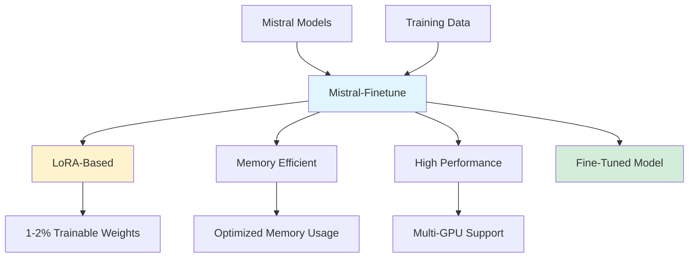
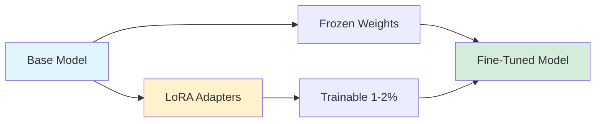
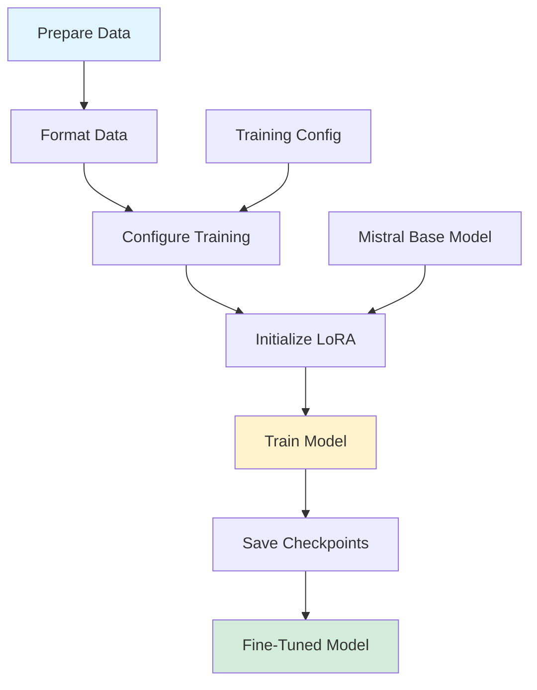

## Mistral-Finetune: Official Fine-Tuning Framework for Mistral Models

*Curiosity:* How can we efficiently fine-tune Mistral's open-source models? What makes this official framework different from other fine-tuning tools?

**Mistral-finetune** is the official repository and guide for fine-tuning Mistral's open-source models. This lightweight codebase enables memory-efficient and performant fine-tuning using LoRA (Low-Rank Adaptation).

> **Official Repository**: <https://github.com/mistralai/mistral-finetune>
{: .prompt-info }

### Framework Overview



### Key Features

| Feature | Description | Benefit |
|:--------|:------------|:--------|
| **LoRA-Based** | Low-rank matrix perturbations | ⬇️ Memory efficient |
| **Memory Efficient** | Only 1-2% trainable weights | ⬇️ Resource usage |
| **High Performance** | Optimized training | ⬆️ Speed |
| **Multi-GPU Support** | Single-node multi-GPU | ⬆️ Scalability |
| **Simple Interface** | Guided entrypoint | ⬆️ Ease of use |

### LoRA Architecture

*Retrieve:* LoRA enables efficient fine-tuning by training only a small fraction of model weights.

**How LoRA Works**:
- Most weights are frozen
- Only 1-2% additional weights trained
- Low-rank matrix perturbations
- Maintains model performance

**Architecture**:



### Hardware Requirements

| Model Size | GPU Recommendation | Setup |
|:-----------|:-------------------|:------|
| **7B Models** | Single GPU (A100/H100) | ✅ Sufficient |
| **Larger Models** | Multi-GPU (A100/H100) | ✅ Optimized |
| **Maximum Efficiency** | A100 or H100 | ⚡ Recommended |

**Optimization**:
- Multi-GPU-single-node training
- Memory-efficient implementation
- Optimized for A100/H100 GPUs

### Codebase Philosophy

> **Goal**: Provide a simple, guided entrypoint to fine-tune Mistral models.
{: .prompt-tip }

**Design Principles**:
- ✅ Simple and guided
- ✅ Opinionated (especially data formatting)
- ✅ Focused on Mistral models
- ⚠️ Not exhaustive across architectures

**For Generic Approaches**: Check out projects like [torchtune](https://github.com/pytorch/torchtune) for more generic fine-tuning solutions.

### Fine-Tuning Process



### Example Usage

```python
# Mistral-finetune example workflow
from mistral_finetune import MistralFinetune

# Initialize fine-tuner
finetuner = MistralFinetune(
    model_name="mistral-7b",
    lora_rank=8,
    lora_alpha=16
)

# Prepare data (opinionated format)
training_data = prepare_mistral_data("data.jsonl")

# Fine-tune
finetuner.train(
    data=training_data,
    num_epochs=3,
    batch_size=4,
    learning_rate=2e-4
)

# Save model
finetuner.save("fine-tuned-mistral-7b")
```

### Advantages

*Retrieve:* Mistral-finetune offers several advantages for fine-tuning Mistral models.

| Advantage | Description | Impact |
|:----------|:------------|:-------|
| **Official Support** | Maintained by Mistral AI | ⬆️ Reliability |
| **Optimized** | Specifically for Mistral | ⬆️ Performance |
| **Simple** | Guided entrypoint | ⬆️ Accessibility |
| **Efficient** | LoRA-based approach | ⬇️ Resource usage |

### Use Cases

*Innovate:* Fine-tune Mistral models for specific applications.

**Common Use Cases**:
- Domain-specific adaptation
- Task-specific fine-tuning
- Instruction following
- Custom applications

### Key Takeaways

*Retrieve:* Mistral-finetune is the official, lightweight framework for efficiently fine-tuning Mistral models using LoRA, requiring only 1-2% trainable weights.

*Innovate:* By leveraging Mistral-finetune's optimized approach, you can fine-tune Mistral models efficiently on single or multi-GPU setups, making it accessible for various use cases.

*Curiosity → Retrieve → Innovation:* Start with curiosity about fine-tuning Mistral models, retrieve knowledge from the official framework, and innovate by applying fine-tuned models to your specific applications.

**Next Steps**:
- Explore the GitHub repository
- Prepare your training data
- Configure fine-tuning parameters
- Train and deploy your model


<details markdown="1">
<summary style= "font-size:24px; line-height:24px; font-weight:bold; cursor:pointer;" > Translate to Korean </summary>

* * * 

## Mistral-finetune의 발표

Mistral 오픈 소스 모델을 미세 조정하는 방법에 대한 공식 저장소 및 가이드.
> Mistral open-source models : <https://github.com/mistralai/mistral-finetune>
{: .prompt-info }

mistral-finetune은 Mistral의 모델을 메모리 효율적이고 성능 좋게 미세 조정할 수 있게 해주는 경량 코드베이스입니다. 이 코드베이스는 대부분의 가중치는 고정하고 저랭크 행렬 변형의 형태로 추가 가중치의 1-2%만 훈련하는 LoRA라는 훈련 패러다임을 기반으로 합니다.

최대 효율성을 위해 A100 또는 H100 GPU를 사용하는 것이 권장됩니다. 이 코드베이스는 멀티 GPU-싱글 노드 훈련 설정에 최적화되어 있지만, 7B와 같은 더 작은 모델의 경우 단일 GPU로 충분합니다.

> 참고
이 저장소의 목표는 Mistral 모델을 미세 조정하기 위한 간단하고 가이드된 진입점을 제공하는 것입니다. 따라서 데이터 형식화와 관련하여 상당히 주관적이며 여러 모델 아키텍처나 하드웨어 유형에 대해 포괄적이기를 목표로 하지 않습니다. 보다 일반적인 접근 방식을 원한다면 torchtune과 같은 다른 훌륭한 프로젝트를 확인할 수 있습니다.
{: .prompt-tip }

</details>